# 数据科学基础统计学

> 原文：<https://medium.com/mlearning-ai/important-statistical-concepts-for-data-scientists-54e09106b75e?source=collection_archive---------0----------------------->

统计分析使我们能够从手头的数据中获得有价值的见解。充分掌握重要的统计概念和技术对于使用各种工具分析数据是绝对必要的。本文讨论了每个数据科学爱好者都必须知道的一些基本统计概念。为了更好地理解，python 中的代码片段也包括在内。

在讨论细节之前，让我们先来看一下本文涉及的主题:

*   *描述性统计与推断性统计*
*   *数据类型*
*   *概率&贝叶斯定理*
*   *集中趋势的度量*
*   *偏斜度*
*   *峰度*
*   *离散度的度量*
*   *协方差*
*   *相关性*
*   *概率分布*
*   *假设检验*
*   *回归*

## **描述性统计与推断性统计**

统计学作为一个整体处理数据的收集、组织、分析、解释和表达。在统计学中，有两个主要分支:

1.  **描述性统计:** 这涉及到描述数据的特征，通过图表/图形直观地组织和呈现数据，或者通过使用集中趋势、可变性和分布的测量进行数值计算。值得注意的一点是，结论是根据已知数据得出的。
2.  推论统计学:这涉及到使用从中提取的样本对更大的群体进行推论和归纳。因此，需要更复杂的计算。使用假设检验、相关性和回归分析等技术得出最终结果。预测的未来结果和得出的结论超出了现有数据的水平。

## **数据类型**

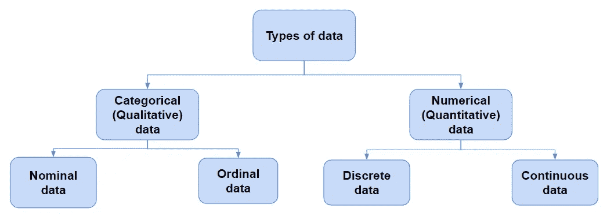

为了应用最合适的统计技术进行适当的探索性数据分析(EDA ),我们需要了解我们正在处理什么类型的数据。

1.  **分类数据**

分类数据代表定性变量，如个体的性别、血型、母语等。分类数据也可以是没有任何数学意义的数值形式。例如，如果性别是变量，女性可以用 1 表示，男性用 0 表示。

*   **名义数据**:数值标记变量，类别之间没有定义的层次，即没有顺序或方向。例如，宗教、性别等。只有两个类别的名义音阶被称为“二分法”。
*   **顺序数据**:类别之间存在顺序或层次。例如，质量评级、教育水平、学生信等级等。

2.**数值数据**

数字数据代表仅用数字表示的定量变量。例如，个人的身高、体重等。

*   **离散数据**:值是可数的，并且是整数(最常见的是整数)。例如，停车场中的汽车数量、国家数量等。
*   **连续数据**:观测值可测量但不可计数。数据假定一个范围内的任何值。例如，体重、身高等。连续数据可以进一步分为区间数据(有序值之间具有相同的差异，但没有真零)和比率数据(有序值之间具有相同的差异，但存在真零)。

## **概率&贝叶斯定理**

概率是对事件发生的可能性的度量。

*   P(A) + P(A') = 1
*   P(A∪B)= P(A)+P(B)-P(A∪B)
*   独立事件:如果一个事件的发生不影响另一个事件发生的概率，则两个事件是独立的。P(A∩B)=P(A)P(B)其中 P(A)！= 0 和 P(B)！= 0.
*   互斥事件:如果两个事件不能同时发生，则它们是互斥的或不相交的。P(A∪B)= 0，P(A∪B)=P(A)+P(B)。
*   **条件概率**:假设另一个事件 B 已经发生，一个事件 A 发生的概率。这用 P(A|B)来表示。P(A|B)=P(A∩B)/P(B)，当 P(B) > 0。
*   **贝叶斯定理**

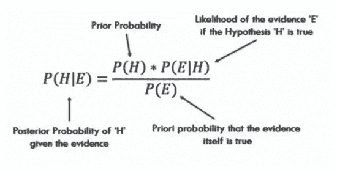

## **集中趋势的度量**

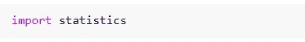

Import statistics module

*   **Mean** :数据集的平均值。

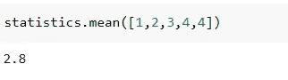

numpy.mean( ) can also be used

*   **中位数**:数据集的中间值。

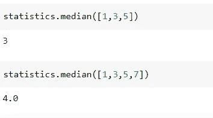

numpy.median( ) can also be used

*   **模式**:数据集中出现频率最高的值。

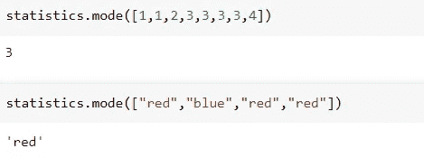

**什么时候用均值、中位数、众数？**

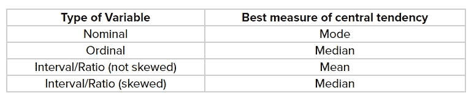

**均值、中值和众数的关系:** *众数= 3 中值— 2 均值*

## **偏斜度**

衡量对称，或者更准确地说，缺乏对称(不对称)。

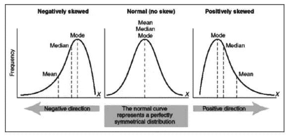

*   正态/对称分布:众数=中位数=平均值
*   正(右)偏态分布:众数< median < mean
*   Negatively (left) skewed distribution: mean < median < mode

## **峰度**

一种衡量数据相对于正态分布是重尾还是轻尾的方法，即测量分布的“尾部性”或“峰值性”。

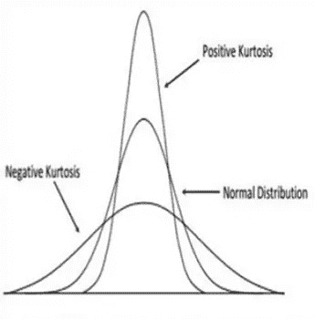

*   细峰正峰度
*   中纬度正态分布
*   平峰度-负峰度

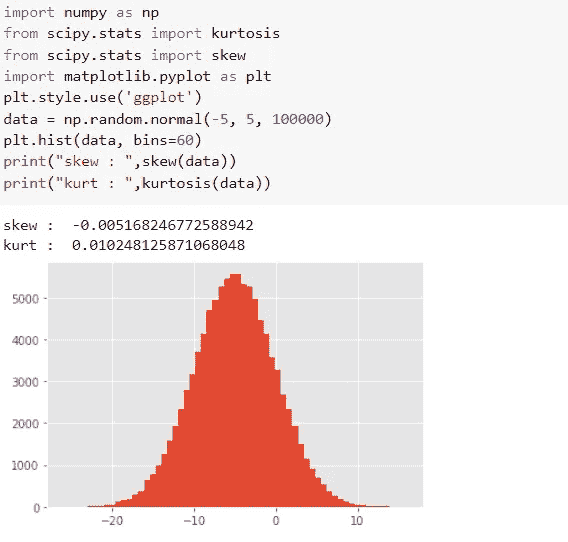

Skewness and kurtosis using Python

## **分散度的度量**

描述数据围绕一个中心值的分布情况。

**范围:**数据集中最大值和最小值之差。

**四分位数偏差**:一个数据集的四分位数将数据分成四等份——第一个四分位数，(Q1)是最小数和数据中位数之间的中间数。第二个四分位数(Q2)是数据集的中位数。第三个四分位数(Q3)是中位数和最大数之间的中间数。四分位数离差为 **Q = × (Q3 — Q1)**

**四分位距:IQR = Q3 — Q1**

**方差:**每个数据点与均值的平均平方差。测量数据集相对于平均值的分布程度。

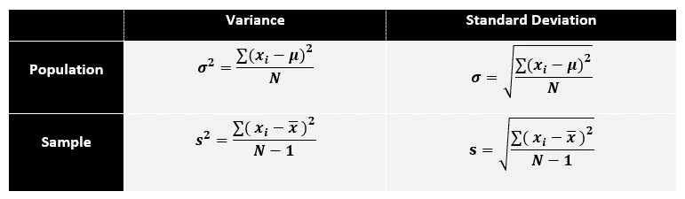

**标准差:**方差的平方根。

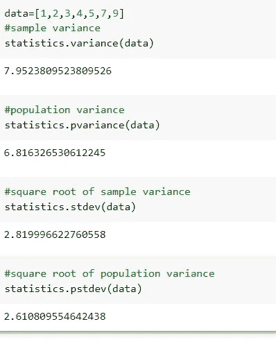

Variance and standard deviation using python

## **协方差**

它是一对随机变量之间的关系，其中一个变量的变化引起另一个变量的变化。

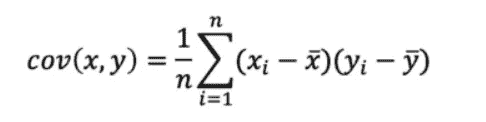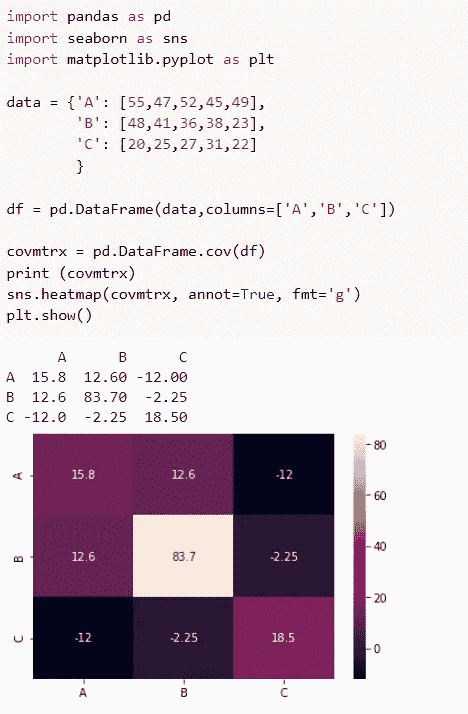

Covariance matrix and its heatmap representation using python

## **相关性**

它显示了一对变量之间是否相关以及相关程度如何。

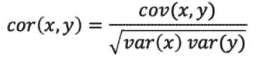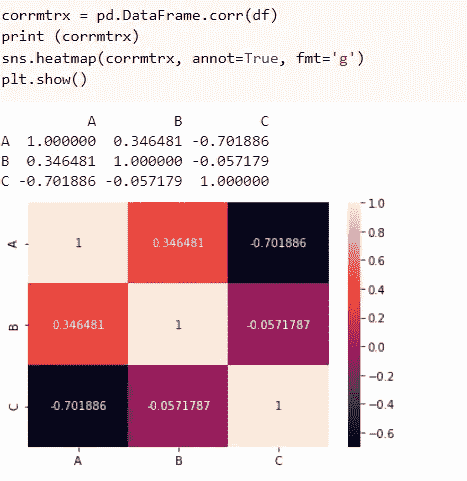

Correlation matrix of the same data used for computing covariance

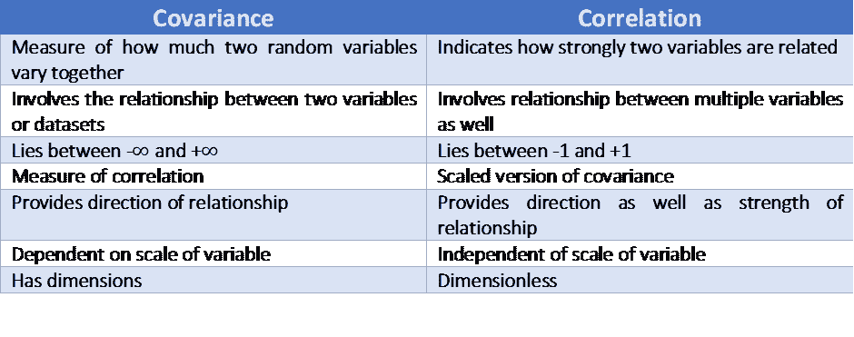

Covariance vs. Correlation

## **概率分布**

有两大类概率分布——离散和连续概率分布。

**离散概率分布:**

*   **伯努利分布**

随机变量采用只有两种可能结果的单次试验:1(成功)概率为 p，0(失败)概率为 1-p。

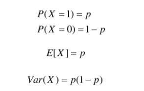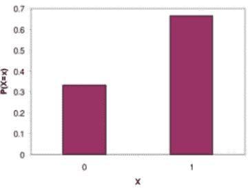

*   **二项分布**

每次审判都是独立的。一次试验只有两种可能的结果——要么成功，要么失败。总共进行 n 次相同的试验。所有试验成功和失败的概率是相同的。(试验是相同的。)

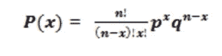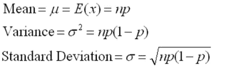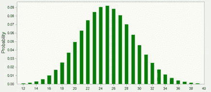

*   **泊松分布**

衡量特定时间段内发生给定数量事件的概率。

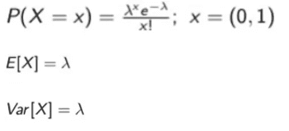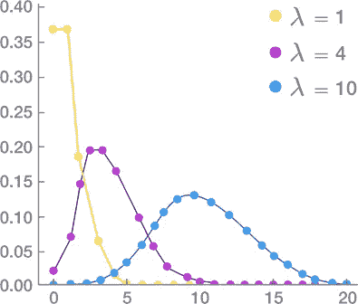

**连续概率分布:**

*   **均匀分布**

也称为矩形分布。所有结果的可能性都是一样的。

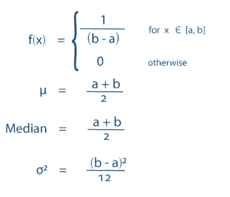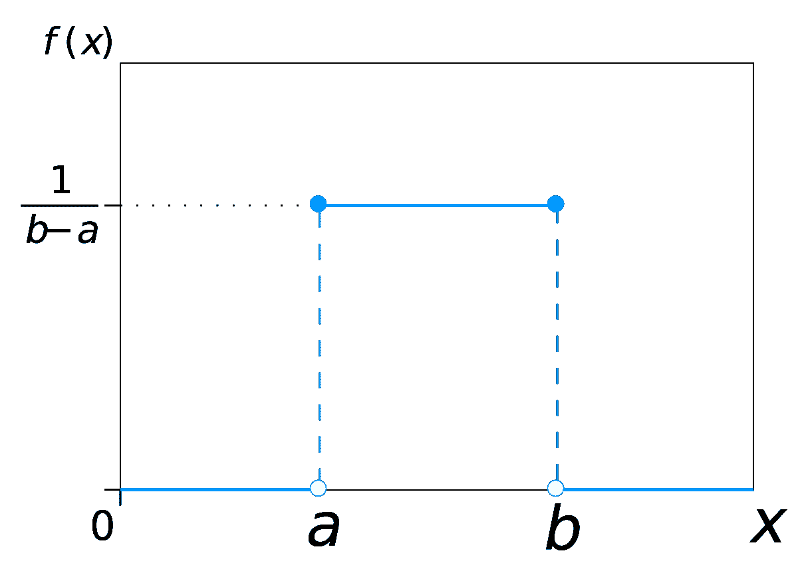

*   **正态/高斯分布**

分布的平均值、中值和众数是一致的。分布曲线呈钟形，关于 x=μ线对称。曲线下的总面积为 1。正好一半的值在中心的左边，另一半在右边。

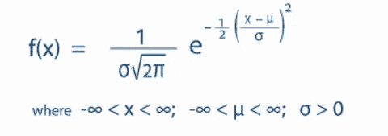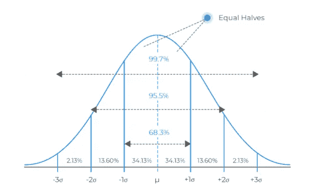

正态分布与二项式分布有很大不同。然而，如果尝试的次数接近无穷大，那么形状将非常相似。

*   **指数分布**

泊松点过程中事件之间时间的概率分布，即事件以恒定的平均速率连续独立发生的过程。

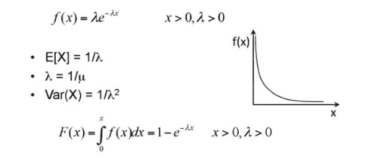

## **假设检验**

首先，我们来看看零假设和备择假设的区别。

**零假设:**关于总体参数的陈述，该陈述被认为是正确的，或者用于提出一个论点，除非通过假设检验证明它是不正确的。

**替代假设:**与原假设相矛盾的关于总体的主张，以及如果我们拒绝原假设会得出什么结论。

**I 型错误:**拒绝真零假设

**第二类错误:**不拒绝错误的零假设

**显著性水平(α)** :当零假设为真时，拒绝零假设的概率。

**p 值** **:** 假设零假设为真，检验统计量至少与观察到的统计量一样极端的概率。

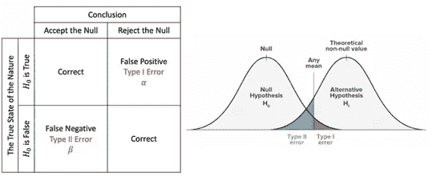

*   当 p 值>α时，我们不能拒绝零假设。
*   当 p 值≤ α时，我们拒绝零假设，我们可以得出结论，我们有一个重要的结果。

在统计假设检验中，当给定零假设的情况下一个结果不太可能发生时，该结果具有统计意义。

**临界值:**检验统计尺度上的一个点，超过这个点我们就拒绝零假设。它取决于特定于测试类型的测试统计和定义测试灵敏度的显著性水平α。

我将在另一篇文章中详细讨论假设检验。

## **线性回归**

线性回归通常是我们遇到的第一个最大似然算法。它简单易懂，为其他高级 ML 算法奠定了基础。

**简单线性回归**

建模因变量和自变量之间关系的线性方法。

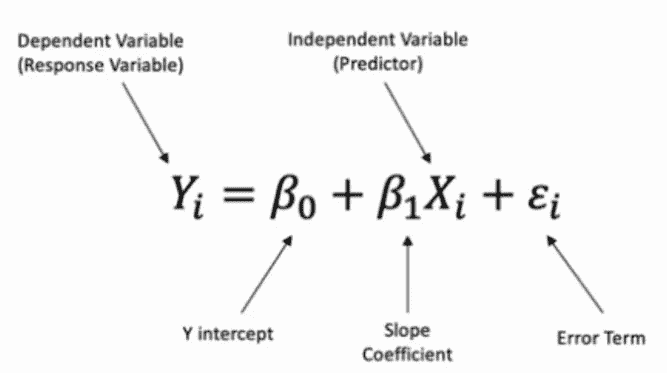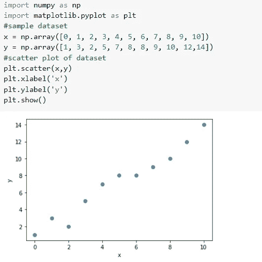

我们必须找到参数，使模型最符合数据。回归线(最佳拟合线)是预测值和观测值之间的误差最小的线。

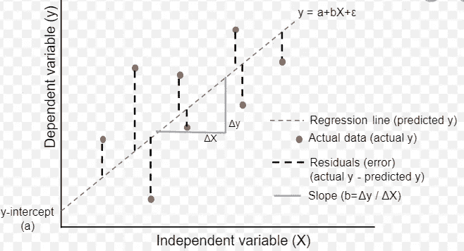

Regression line

现在，让我们试着实现它。

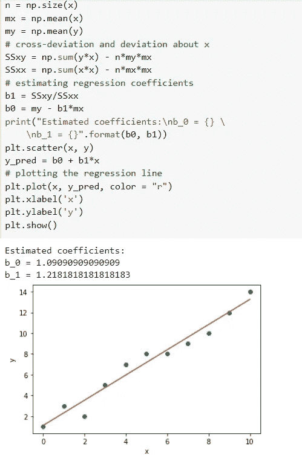

**多元线性回归**

对因变量和两个或多个自变量之间的关系进行建模的线性方法。

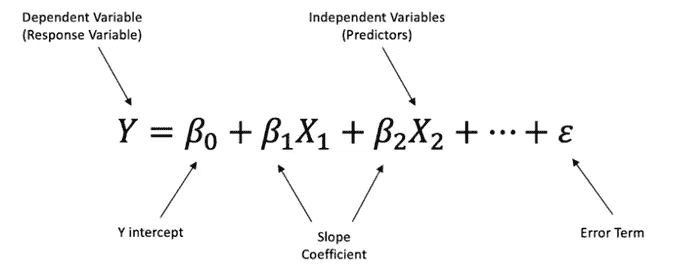

希望这有所帮助！