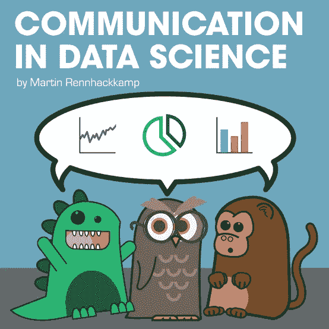

# 在日常工作活动和工作研讨会中用于数据通信的重要策略

> 原文：<https://medium.com/mlearning-ai/important-strategies-to-use-for-data-communication-in-day-to-day-work-activities-and-work-seminars-70c92cfd388a?source=collection_archive---------6----------------------->

资料来源:https://venngage.com/blog/communicating-data/

> 你如何向同事和老板介绍自己？

当你下班到达时，不要只是和同事打招呼说“嗨”或“早上好”。问问你的同事今天过得怎么样，今天你是否能在任何任务的指导方面帮助他们。

> 你如何将另一个人的疑问传达给你的老板？

来源:https://learn.g2.com/what-is-communication?hs_amp=true

使用贵组织内所有员工使用的标准沟通术语，例如，当外部人员要求您提交贵组织员工的数据表时，但在贵组织中，每个人都认识到“信息表”一词，那么这正是您应该如何沟通，因为当您使用他们在日常工作中不认识的不同术语时，他们会感到疏远。

> **在**介绍**时要注意用词、肢体语言和语气？**

来源:

[https://www . allindata . org/communicating-data-spark-action-ten-lessons-learned/](https://www.allindata.org/communicating-data-spark-action-ten-lessons-learned/)

无论何时你向任何听众做演讲，尤其是涉及到数据趋势的演讲。你需要小心，不要伤害任何个人的个人价值，比如展示任何公司中男性多于女性的数据可视化会伤害女性观众的感情，观众对你的分析越不感兴趣，分析的价值就越小。

> 因此，在解释数据趋势时，你需要非常小心地措辞，因为数据是每个人个人和公共生活的敏感部分

# 明智的做法是什么？

> 明智的做法是将“女员工比男员工少”换成:
> 
> “女性正在取得进步，我们可能很快就会实现性别比例平衡”

> **为什么沟通很重要，需要精心组织？**

来源:[https://www.martinsights.com/?p=1256](https://www.martinsights.com/?p=1256)

当人们重视时间的同时，他们也重视 T2 的话语。特别是当你坐在特定性别群体和种族群体的利益相关者面前时，你需要小心不要使用任何可能引发他们的词语，例如声明我们有不同的群体，包括**黑人工人**，这种声明会让黑人员工感觉被排除在一般员工名单之外，受到不同的看待，因此会给这些利益相关者留下不好的印象。如果你向他们展示一个商业想法，他们可能会在你向他们展示任何有价值的投资见解之前离开。

注意:所使用的图片来自公共资源，不归我所有。

> 结论

这是我与来自不同背景和行业背景的各种客户打交道的经验总结，包括在我工作过和合作过的组织中的沟通实践。在那里我看到了错误和灵感。

作者指出

我希望你能理解我的文章，并期待你在下面的评论中给出你的想法。
我目前正在学习伦敦大学的数据科学和人工智能理学硕士学位，我一直是 Upwork 的自由数据科学专家，并与个人客户和组织合作开发商业智能系统和机器学习模型。我也曾在巴基斯坦联合利华人力资源部担任数据专家。

如果你有兴趣分享专业知识或一起做项目，请订阅我的中型个人资料以获取更多文章，并在 LinkedIn 上联系我。

 [## Muhammad Ammar Jamshed -巴基斯坦信德省 Karāchi 工商管理学院| LinkedIn

### 我善于分析和解释任何形式的数据，并进一步对如何处理这些数据做出结论…

www.linkedin.com](https://www.linkedin.com/in/goto-resumemuhammad-ammar-jamshed-029280145)  [## Mlearning.ai 提交建议

### 如何成为 Mlearning.ai 上的作家

medium.com](/mlearning-ai/mlearning-ai-submission-suggestions-b51e2b130bfb)