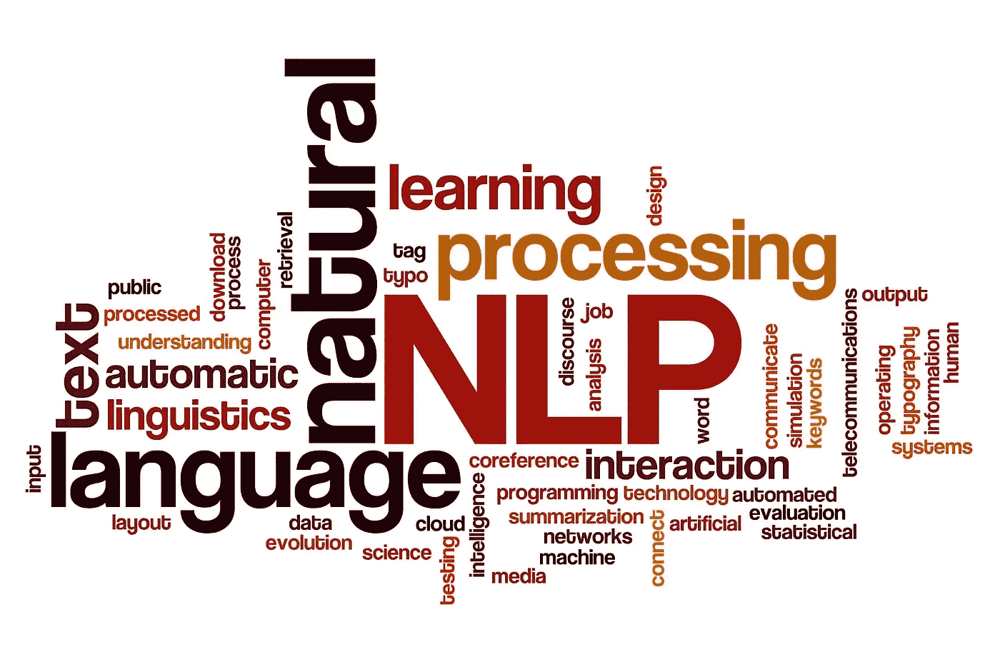

# 自然语言处理中重要的文本预处理技术

> 原文：<https://medium.com/mlearning-ai/important-text-pre-processing-techniques-for-nlp-ea7d707e0e15?source=collection_archive---------9----------------------->

自然语言处理(NLP)帮助我们与计算机交流或交谈，就像我们与人交谈一样。NLP 也可以定义为*人工智能(AI)、语言学*和*计算机科学、*的交集，帮助机器或计算机理解、解释和操纵人类语言。

NLP 有两个主要部分:
**1 .数据预处理
2。算法开发**

在这篇博客中，我们将只关注第一个也是最重要的过程，“数据预处理”。

# 自然语言处理文本预处理

数据预处理是任何*机器学习*模型最基本的步骤。它在决定车型的*性能*方面起着主要作用。因为模型的性能取决于*原始数据*的清理和预处理程度。让我们看看所涉及的各种预处理步骤:

# a)下壳体

顾名思义，在这个方法中，我们将把我们的*文本数据*转换成*小写。*对于文本输入，如段落，将会有小写和大写的单词。然而，计算机将不同大小写的单词视为不同的实体。

例如，虽然“hello”和“Hello”是同一个单词，但它们被计算机认为是两个不同的单词。为了避免这种类型的争议，我们必须将所有的单词转换成小写。

# b)标记化

标记化是将输入文本或段落分解成更小的单元(如句子或单词)的过程。每个最小单元被视为单独的*令牌。*记号化的原理是通过分析记号来理解段落/文本的上下文。

## **句子标记化**

输入段落的相应输出列表由作为标记的句子组成。例句:“这篇博客是关于预处理的。预处理是必不可少的”，句子 tokenize 的输出是['这个博客是关于预处理的'，'预处理是必不可少的']。

## 单词标记化

输入文本的相应输出列表由单词作为标记组成。
例如:“这篇博客是关于预处理的”，this in 语句 tokenize 的输出是['This '，' blog '，' is '，' about '，'预处理']。

# c)删除标点符号

从文本中去除标点符号是最常见的文本处理技术。删除标点符号有助于平等对待所有文本。比如 *Wow* 和 *Wow！*一视同仁。我们在删除标点符号时也应该小心。因为如果我们不小心的话，像“不要”这样的词会变成“不要”。

# d)停止单词删除

如果你注意到了，你会发现无论你在写什么，一些单词都会在任何语言中频繁出现？这些词被称为*。*

*停用词是出现频率很高但对句子没有太大意义的词的集合。这些词是任何语言语法的一部分。例如，在英语中，我们有像“the”、“are”、“he”、“him”等停用词。我们可以很容易地从我们的文本数据中删除这些停用词，因为它们不会给句子的整体含义增加多少价值。*

# *e)词干*

*词干化是将一个单词缩减为其*词根*或*词干的过程。*词根形式*通过去掉词缀而保留下来。比如*“plays”、“playing”、“played”*这几个词，都被简化成了它的词根*“play”*。**

# *f)词汇化*

*我们已经看到了如何通过词干化将单词还原为它们的词根。但是，词干并不总是产生语言词汇的一部分。它经常产生没有意义的单词。因此，**术语化**的概念开始发挥作用。*

> *词汇化是将文本中的单词转换成有意义的母词的过程。*

*变元化和词干化的关键区别在于，在变元化中，我们可以传递一个*词性(POS)* 参数。这是用来提供我们希望通过提及词类来使我们的词词汇化的上下文。*

*到目前为止，我们已经讨论了自然语言处理的基本和重要的预处理技术。这些对于通过有效地清理和处理数据来提高模型的性能非常有用。*

**快乐学习！！**

* [## Mlearning.ai 提交建议

### 如何成为 Mlearning.ai 上的作家

medium.com](/mlearning-ai/mlearning-ai-submission-suggestions-b51e2b130bfb)*