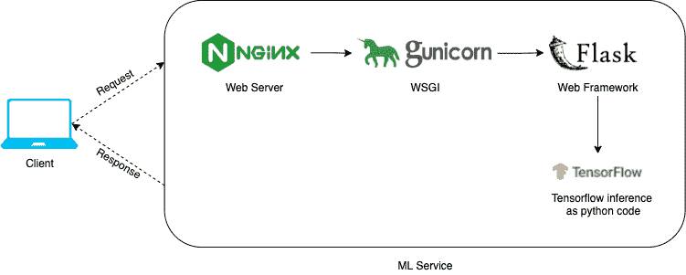
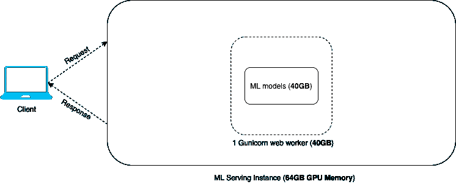
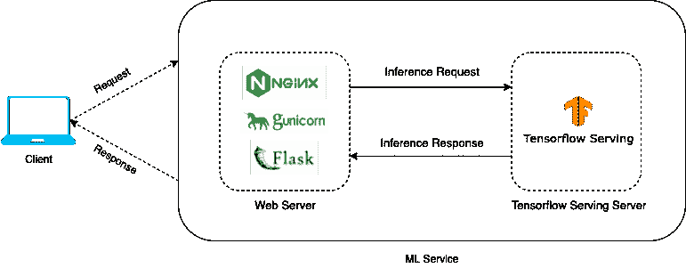
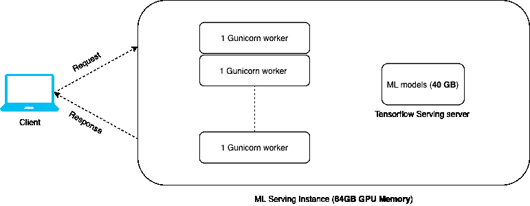

# 使用 Tensorflow 服务提高 ML 服务吞吐量

> 原文：<https://medium.com/mlearning-ai/improve-ml-service-throughput-using-tensorflow-serving-b211508d72ea?source=collection_archive---------2----------------------->

将机器学习引入现实世界应用/产品的关键因素之一是能够有效地将机器学习(ML)模型作为生产服务。越来越频繁地成为标准的大尺寸 ML 模型使得这项任务更加困难。在本文中，我们将了解如何通过使用高性能服务系统 Tensorflow Serving 来提高大型 ML 模型的 ML 服务性能和吞吐量。

# 规模 MaaS 成本高昂

ML 模型即服务(MaaS)支持将 ML 预测作为后端服务插入到典型的 web 应用服务链中，从而由另一个 web 服务使用，甚至由前端应用程序通过 API 调用直接使用。然而，仅仅将 ML 模型包装到 web 服务器中并输出令人兴奋的推理结果是不够的。为了满足真实世界的流量，ML 服务必须能够扩展，支持每秒数百甚至数千个请求(RPS)。如果单个 ML 服务实例支持非常低的 RPS，则需要大量的 ML 服务实例来满足生产流量。这将显著增加 MaaS 在生产中的成本，有时(如果不是经常)会成为企业采用机器学习技术开发创新产品的巨大障碍。

让我们处理一些数字。假设我们的 ML 模型总共有 10GB，我们希望在一个 GPU 实例中为这些模型提供服务，以实现更快的计算速度和更好的延迟。AWS 为 ML 推理提供的一个常见 EC2 实例是 [p3.2xlarge](https://aws.amazon.com/ec2/instance-types/p3/) ，它的成本为**$ 3.06/小时点播**，并为我们提供了 1 个 16GB 内存的 GPU。它还具有 8 个 CPU 和 61GB CPU 内存，用于 web 服务器工作人员的任何非 GPU 计算相关任务或数据传输。由于我们的 ML 模型适合 16GB 的 GPU 内存，我们可以将 ML 模型预加载到内存中，以改善实时推理延迟。考虑到所有这些因素，假设一个客户端对我们的 ML 服务的请求从开始到结束需要 500 毫秒。这使得我们的吞吐量为 2 RPS(每个实例的请求数)。

现在，假设在现实世界中，我们需要支持 100 RPS 的客户流量，那么我们的月成本将是 **100/2(实例)* 3.06 美元(每小时)* 24(小时)* 30(天)= 110，160 美元**。也就是每个月 100K 多！您当然可以通过使用 CPU 实例来获得更低的成本，但许多数据和计算密集型 ML 服务需要 GPU 来实现更好的或可接受的生产客户延迟。仅仅生产实例的每月 10 万美元的成本当然可以被资金充足的企业所吸收，但这对于小企业或初创公司的预算来说是一个巨大的缺口。

# ML 服务缩放存在内存问题

信不信由你，这就是我们最初构建 ML 服务时必须处理的问题。此外，我们的真实用例甚至更糟糕，因为我们必须使用更昂贵的 EC2 实例，因为我们必须服务更大的 ML 模型(**总共将近 40GB**)。因此，我们踏上了寻找解决方案的征程，以提高我们 ML 服务的性能和吞吐量。在下面的小节中，我们将了解如何使用 Tensorflow 作为 ML 服务的服务系统，并将我们的服务吞吐量**从 2 RPS 提高到 12 RPS(每秒请求数)**。

在我们开始之前，这里有一个关于我们需求的快速描述。我们总的 ML 型号尺寸是 **40GB** 。我们使用 AWS GPU 实例来实现更低的推理延迟。我们使用的实例类型是 **g4dn.12xlarge** ，这是一个多 gpu 实例，具有 **64GB GPU 内存**，可以包含我们所有的 ML 模型。

## 典型的 ML 服务架构

当我们第一次开始时，我们使用一个典型的 ML 服务架构来服务我们的模型，如下图所示。我们有 **Nginx** 作为代理 web 服务器， **Gunicorn** 作为 WSGI (Web 服务器网关接口)，Flask 作为 Web 框架， **Tensorflow** 作为 ML 推理框架。在运行时，用户请求到达 Flask 服务器，服务器调用 python 代码/函数在 Tensorflow 模型上运行推理以产生预测。

*图 1:使用 Tensorflow 的典型 ML 服务架构*

## 内存限制阻止了扩展

你可能会问，这是什么问题？嗯，这种架构对小型 ML 模型很适用。为了扩展，我们只需要增加 Gunicorn web workers 的数量，它应该能够处理更多的并发请求，从而实现更好的吞吐量。在这个架构中，添加一个额外的 Gunicorn web worker 意味着将 ML 模型的另一个副本加载到内存中。如果我们的 ML 型号足够小，比如 1GB，这就不是问题。

然而，对于更大的 ML 模型来说，这不会是真的。一个服务实例具有有限的 CPU/GPU 内存，因此 ML 模型越大，我们可以使用的 web workers 就越少。使用 GPU 实例的需要使情况变得更糟。CPU 内存比 GPU 内存便宜，您可以轻松找到一个具有足够大的 CPU 内存的实例，而无需倾家荡产。但是 GPU 实例的价格和您可以获得的有限 GPU 内存对大 ML 模型构成了昂贵的限制。例如，AWS 提供服务的典型 GPU 实例如***【g4dn . 12x large】***总共有 64GB GPU 内存，成本为 3.912 美元/小时。仅用 1GB 的 ML 模型就可以启动 10 到 20 个 web workers，这足以实现所需的扩展。然而，对于一个 40 GB 的 ML 模型，我们只能勉强启动 2 个 web workers，吞吐量受到严重限制。

为了进一步说明，下面的图表从内存使用的角度来看典型的 ML 服务架构。如你所见，由于内存限制，1 个 Gunicorn web worker 是我们能做的最好的。添加另一个 web worker 将意味着加载 40GB ML 模型的另一个副本，这将使实例内存溢出。对于典型的 ML 服务架构，服务大型 ML 模型限制了我们可以使用的 web 工作器的数量，因此限制了我们可以实现的服务吞吐量。

*图 2:典型 ML 服务架构中的内存使用情况*

# 使用 Tensorflow 服务扩展 ML 服务

上述 ML 服务架构的问题是 web workers 和 ML 模型的耦合。从好的方面来说，它使得运行 ML 预测就像在 Flask server 中调用 python 函数来运行 Tensorflow 会话一样简单。不利的一面是，如果不将更多的 ML 模型拷贝加载到内存中，就不可能扩展 web workers。

## 具有张量流服务的 ML 服务架构

[Tensorflow 服务](https://www.tensorflow.org/tfx/guide/serving)，由 Tensorflow 团队开发，是一个服务于机器学习模型的高性能服务系统。以下是 Tensorflow Serving 提供的一些重要功能:

*   在一个 REST API 或 gRPC API 中服务多个 ML 模型
*   现成的模型版本管理(ML 模型的 A/B 测试)
*   请求批处理以进行更精细的模型推理性能调整
*   由于高效、低开销的实施，推理时间的延迟最小

在上面提供的所有特性中，最好的一个也许是它在一个单独的 Tensorflow 服务服务器中服务 ML 模型，并公开一个单独的 REST/gRPC API，因此成功地将 ML 模型从 web 服务器上解耦。如下图所示，用户请求首先到达 web 服务器，而不是直接在 web 服务器中运行 ML 推理，它将 API 推理请求发送到 Tensorflow 服务服务器，在那里运行 ML 推理，然后将 ML 预测返回到 web 服务器。

*图 3:使用 Tensorflow 服务的 ML 服务架构*

## Tensorflow 服务消除了内存限制

Tensorflow 服务通过将 ML 模型与 web 服务器解耦，消除了典型 ML 服务架构所遭受的内存限制，并有效地允许 web 工作者进行扩展。在这种服务架构中，增加 web 服务器中 web worker 的数量不需要在每个 web worker 中加载 ML 模型的额外副本。相反，我们只需将 ML 模型的一个副本加载到内存中，Tensorflow 服务服务器将 ML 模型作为单个 API 端点提供服务。由于能够使用多个 web workers 来接收来自客户端的请求，我们有效地提高了 ML 服务的吞吐量。

以我们的用例为例，如下图所示。通过采用 Tensorflow 服务于我们的 ML 模型，我们能够将我们的 web 工作者从 1 个扩展到 12 个，在彻底的负载测试之后，这将我们的实例 RPS 从 2 个提高到 12 个。我们使用的服务实例当然会有比我们的 ML 模型的总大小更大的 GPU 内存，允许我们加载 ML 模型的一个副本，并且还使用多个 Gunicorn workers。

你可能会问，为什么不使用 12 个以上的 Gunicorn 工人来提高产量呢？与典型的 web 服务器相似，这种 ML 服务架构也需要针对特定用例进行微调和调整，以实现最佳性能并满足潜在的约束。在下一节中，我们将了解一些微调方法和约束。

*图 4:使用 Tensorflow 服务的 ML 服务架构中的内存使用情况*

## 性能微调

**首先，为你的 ML 服务微调网络工人的数量。**我们可以使用的 web workers 的数量仍然有限，主要是因为您可能在 ML 推断之前/之后运行的预处理和后处理步骤需要内存。在常见的 ML 服务中，您可能需要对从客户端请求接收的数据运行预处理步骤，以便为推断做准备，并且您可能需要对推断结果运行后处理步骤，以便在将响应发送回客户端之前对其进行优化或重新格式化。预处理或后处理步骤需要在 web worker 中处理，而不是 Tensorflow 服务服务器。如果预处理或后处理步骤需要在服务器启动以获得运行时性能时将任何张量、参数或小模型加载到内存中，那么每个 web worker 都会消耗一定量的 GPU 内存。由于实例内存的限制，这将限制我们可以扩展的 web workers 的数量。需要对 ML 服务进行微调，以找出在不溢出实例内存的情况下可以使用的 web workers 的最佳数量。除此之外，还要为运行时操作留出内存空间。

**其次，通过请求批处理**微调 Tensorflow 服务服务器。您可能已经注意到，即使我们有多个 web workers 来处理客户端请求，我们的 Tensorflow 服务服务器仍然是单 worker 服务器。如果 ML 推理占用了您 ML 服务延迟的大部分，它可能会成为一个瓶颈，因为从 web works 到 Tensorflow 服务服务器的推理请求将在高流量负载时开始堆积。为了改善这一限制，Tensorflow Serving 提供了开箱即用的服务器端请求批处理功能，在其官方文档[中有更详细的描述。](https://github.com/tensorflow/serving/tree/master/tensorflow_serving/batching)请求批处理使 Tensorflow 服务服务器能够等待一定的超时时间，直到它累积了特定数量的请求，然后对所有请求批量运行推理。这一特性可以显著提高 Tensorflow 服务服务器的吞吐量，并在一定程度上降低推理延迟。需要进行微调，以找到最适合您的 ML 服务的最佳超时和批量大小。

**第三，为您的 ML 服务微调 web worker 类型。**WSGI 服务器工作者的类型，在我们的例子中是 Gunicorn 工作者，也会影响 ML 服务的性能。典型的 Gunicorn 工作器类型，如同步工作器、异步工作器(Gevent)或异步工作器(gthread)的工作方式互不相同。根据服务的特性，选择正确的 web worker 类型会显著影响 ML 服务的性能。例如，如果您的 ML 服务是计算绑定的，这通常是由于昂贵的运行时计算，那么 sync worker 是一种更好的工作类型。相反，如果您的 ML 服务是 I/O 绑定的，这通常是由于进行大量的文件系统读/写或网络请求，那么 async worker 或 asyncIO worker 会工作得更好。为了找出最好的工作方式，调整您使用的 web worker 类型并对您的服务进行负载测试是很重要的。

# 最后的话

在本文中，通过我们的用例演示，我们了解了内存限制如何成为使用大型 ML 模型扩展 ML 服务的瓶颈，以及 Tensorflow 服务如何改变 ML 服务架构以消除内存限制并允许 ML 服务扩展。随着深度学习培训的采用，大尺寸 ML 模型将会继续存在，甚至变得更大。因此，在大尺寸 ML 模型的生产中扩展 ML 服务是一项成本高昂的业务，尤其是在业务/应用必须满足越来越苛刻的流量的情况下。如果你也在类似的情况下扩展你的 ML 服务，考虑尝试 Tensorflow 服务。

*最初发布于*[*https://stephenweixu . com/blog/improve-ml-service-throughput-using-tensor flow-serving*](https://stephenweixu.com/blog/improve-ml-service-throughput-using-tensorflow-serving)*。*

 [## Mlearning.ai 提交建议

### 如何成为 Mlearning.ai 上的作家

medium.com](/mlearning-ai/mlearning-ai-submission-suggestions-b51e2b130bfb)