# 用机器学习提高群体智慧—第 1 部分

> 原文：<https://medium.com/mlearning-ai/improving-crowd-wisdom-with-machine-learning-classification-721b5e0d7c9d?source=collection_archive---------1----------------------->

大家好！我是 Ivan，在这个系列中，我将介绍机器学习在预测数据集上的一些实际应用。我们的目标是展示几个简单的 ML 模型如何极大地提高我们对群体智慧的理解和效率，并将其与受访者的个性相关联。

让我们看看，知道群体中每个人有多神经质是否能告诉我们他们对某些事情的普遍共识的预测有多准确。

# 对群体智慧的快速介绍

你可能听说过[故事](https://en.wikipedia.org/wiki/The_Wisdom_of_Crowds) …一个人去集市，一个人藏起一头死牛，人们猜测它的重量，误差在 1%以内。自从这个经典的概念引入以来，即一群人可以提供比任何个人更精确的估计，“群体智慧”(WoC)现象已经遇到了无数次试图解释潜在机制的尝试，从纯科学到相当深奥。

如今大多数研究人员都同意的一个解释是，群体智慧本质上是一个聚集信息的过程，它将个人判断建模为概率分布，并将中间结果视为最接近事实的结果。此外，有一个共识，即并非所有的群体生来平等，判断的多样性、信息偏见和领域专长都可以在决定群体智慧的成功方面发挥关键作用。然而，除此之外，研究人员试图解释是什么让一个群体比另一个群体更成功。

不要在特定的理论上做太多的细节，对于这个将 WoC 与 ML“结合”的实际尝试，我借用下面的假设:

1.  **WoC 是一个集合模型，其中所有的估计量都会产生误差，在最优人群中，这些误差完全相互抵消。**

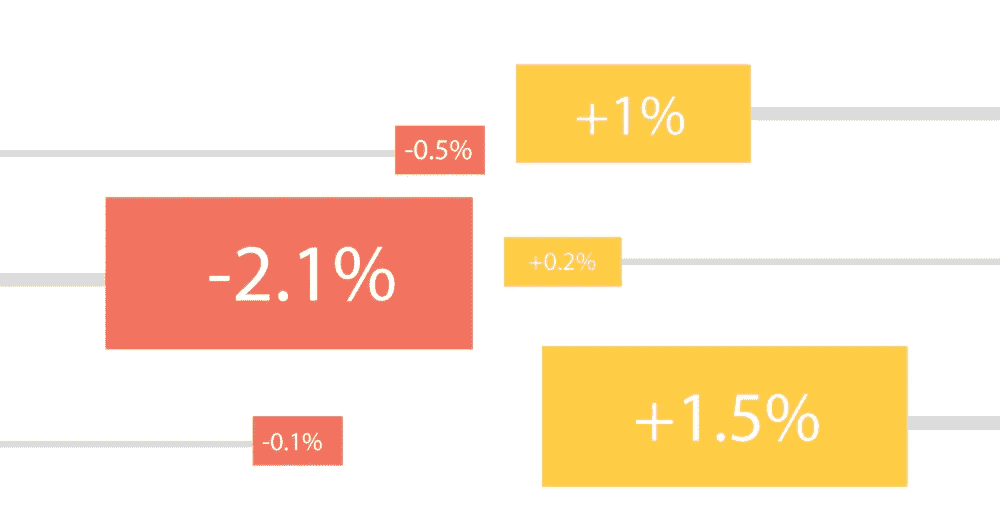

Image 1: Wisdom of Crowds viewed as an aggregation of estimator errors with a total sum of zero in perfectly balanced crowds

将我们的机器学习基于这一原则的一个直接结果是，我们不必寻找具有最佳估计量的人群，而是寻找估计其误差大小和方向的方法。正如信息偏差(或独立性)原理所述，如果所有评估者的观点都基于同一组来源，那么群体的质量就会下降。

从整体来说，

*来源多样化=信息增益*

额外的估计量的价值取决于它们对熵的影响。类似的推理适用于判断的多样性原则，只是它不衡量信息的来源，而是衡量个体评估者处理这些信息的多样性。是的，我们仍然在这里谈论人，所以个人估计者是一个人或(希望)某一类型的人，他们总是相似地高估/低估基本事实。所以在这种情况下，

*判断类型的多样性=信息增益*

这一方面将是这篇文章/研究的重点，因为我们将研究评估者的偏好作为多样性的关键。

**2。WoC 中的最佳结果可以通过多种方式实现。**

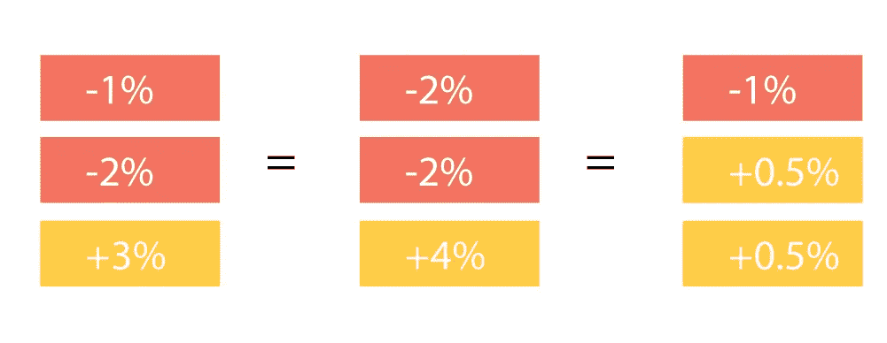

Image 2: Hypothetically, any combination of positive and negative errors can achieve a zero-error equilibrium

由于我们将 WoC 视为误差的集合，任何误差的组合都可以假设达到平衡。例如，如果我们有 100 个误差呈正态分布的估计量，并以 10 个为一组创建随机组合，通过足够数量的模拟，我们将获得正态分布数量的最佳或接近最佳的组合。当然，真正的问题是，哪些组合比纯粹靠运气更有可能实现这一目标。

或者用另一种方式来定义潜在的解决方案，*我们是否可以估计误差的大小和方向，以至于每个组合都可以重新计算为接近最优的组合？*

**3。(可能)有一个最小人群规模要求**

我说有可能，但是所有的研究都表明存在一定的最小值。从我们的错误汇总角度来看，这可能是因为存在 *n* 种不同的类型，它们的存在对于实现有效的多样性是必要的，或者不同风格之间的界限不清楚，需要足够大的数量来确保清晰。

**4。领域专业知识可能会扭曲数据**

虽然我们可能专注于概括人格类型来估计错误，但领域专业知识已被证明会影响个人的错误率。我们将把这个问题作为 WOC 的特例来处理，因为我们使用的是主观数据。现在，我们只能说，在专业领域，我们将依赖于“惊人地普遍”原则的见解，这是一个概率原则，它将帮助我们覆盖地面真理和自信估计之间的许多地面。

**5。受访者是弱估计量，人群是总体估计量**

我再怎么强调这一点也不为过(主要是对我自己，但是如果你正在阅读，那就更好了！).在这个过程中，小规模人群(理想情况下是 20-30 人)是实际的估计者。考虑这是一个公平的警告，因为我们将做一些奇怪的事情，如人类维度的减少和目标变量的特征工程。

# 研究细节

除了在 WoC 的几种竞争性解释中接受这些假设之外，请记住，这项研究是在考虑一些具体情况的情况下设计的。

**我们正在谈论主观的事情**

WoC 有不同的可能应用。它在[金融市场非常流行，例如](/guess-market/crowd-intelligence-in-financial-markets-6aab50078b4a)，这主要是一个客观领域。然而，在这项研究中，我们研究的是主观领域的估计，即个人偏好。这些类型的预测是特定的，因为地面真相总是只能被设定为共识(在与当前人群相比相对较大的规模上)。这一特点有趣的一面是，它允许我们将基本事实缩小到特定的人群。正因为如此，成为主观预测的“专家”实际上意味着成为某一范围人群的味觉专家。

**重点解读**

尽管最终目标是找到“完美”人群的公式，但在整个研究中，我们将主要关注解释。这意味着我们不会追求尽可能高的分数，而是留待以后实现。

**TIVI/TIPI 校准**

为了深入了解受访者的性格，我们使用了五大(海洋)性格测试和价值观测试的简化版。虽然问题数量大幅减少(从 100 多个减少到 30 个)，但这两份问卷在过去都取得了良好的效果。高斯林实验室的网页建议我们将数据集中在受访者的平均水平上，以更好地解释受访者内在特征的差异。在这一点上，我觉得有必要指出，在我们进入系列的项目反应理论部分之前，我将数据保留为原始形式，因为这一部分对 Gosling 说明中提到的基本原则给予了很多关注。

# 关于数据集

这篇文章中使用的数据最初是我的公司在 2018 年与萨格勒布经济学院在信息聚合领域进行的一项研究的一部分。这意味着我不能自由地向公众完全公开数据集，但会尽可能多地发布。

957 名受访者观看了 6 个视频，并回答是否会用“喜欢”来评价。他们还被要求估计百分之多少的回答者会给它一个“喜欢”的评价，并回答来自 [TIPI](https://gosling.psy.utexas.edu/scales-weve-developed/ten-item-personality-measure-tipi/#:~:text=The%20TIPI%20is%20a%2010,Five%2DFactor%20Model)%20dimensions.&text=A%20Very%20Brief%20Measure%20of,%2C%2037%2C%20504%2D528.) 和 [TIVI](http://gosling.psy.utexas.edu/two-short-measures-of-values-tivi-and-twivi/) 简短人格问卷的 20 个问题。

在研究中，我们使用总体喜欢/不喜欢比率作为基本事实，95%置信水平下的置信区间如下:

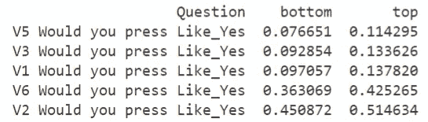

# 数据探索

我们注意到的第一件事是，对于分数较低(在 0 到 0.1 之间)和接近 0.5 时较低的视频，有高估更多的趋势。

```
colors=["red","blue","green","orange","purple","pink"]f,axes=plt.subplots(6,1) for i in range(0,predictions.columns.size): x=predictions.iloc[:,i] sns.kdeplot(x,bw_adjust=3,fill=True,alpha=0.2, ax=axes[i], color=colors[i], clip=(0,1)) axes[i].axvline(x=x.mode()[0],color=colors[i], linestyle="dashed") real=likes.iloc[:,i].mean() axes[i].axvline(x=real,color="black", linestyle="dashed") axes[i].text(real,0, s=str(round(real,2))) axes[i].legend(["Predictions","Predictions mode","Actual mean"])plt.show()
```

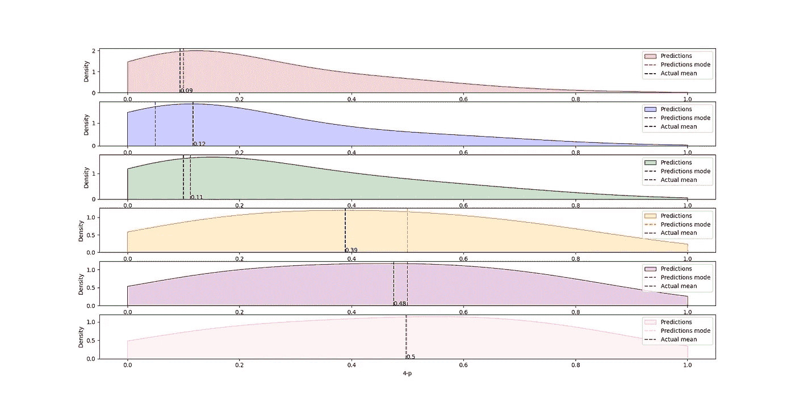

Image 3: Distribution skew shows correlation to ground truth.

这是有道理的，因为在左侧有一面“墙”，即在问卷中没有负面评价，所以受访者更有可能高估。

为了更好地了解正在发生的事情，我们可以比较高估/低估的数量。如下面的意大利霓虹旗所示，低估的数量基本上与高估的数量持平，为 0.5 分:

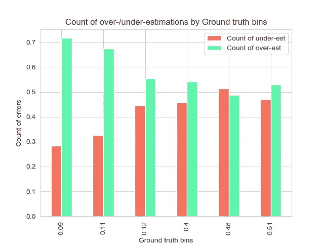

Chart 3

对于我们的群体智慧场景，有趣的是，如果我们看中值结果，当我们达到 0.5 点时，这个群体实际上在估计地面真相方面变得更好。

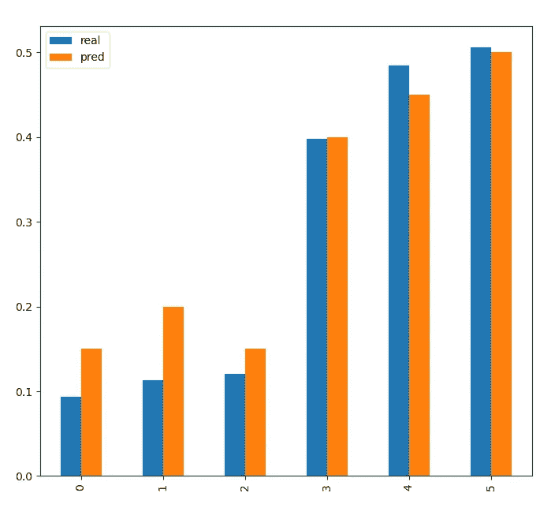

Chart 4: Overall prediction Median vs Ground truth

这是因为我们的分布越正态，误差就越能相互抵消。如图 5 所示，如果我们从绝对意义上来看误差，正态分布的误差将是偏斜概率的 4 倍。

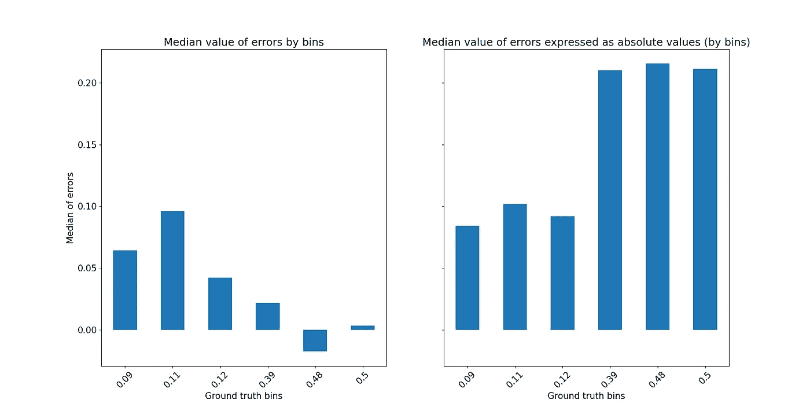

Chart 5\. Median errors in original form (left) drop to less than 1/4 value of their absolute counterparts (right).

因此，如果我们的群体智慧测试的基本目标是能够聚集来自个体小组(n>30)的预测以获得高度可信的结果，那么我们越接近屏幕的边缘，挑战就越大，因为误差不太可能被平衡。

我们手头的任务是找到这种偏斜的函数，所以我们也许能够有效地抵消积极和消极的因素，不管事实真相在哪里。

# 预处理数据

我们先来谈谈误差的底层分布。有一点是显而易见的，即偏斜至少部分与距离标尺中心的距离(0.5)和方向有关。换句话说，如果实际情况是 5%,那么低估不能超过 5%。虽然最初的分布曲线可能并不能告诉我们太多:

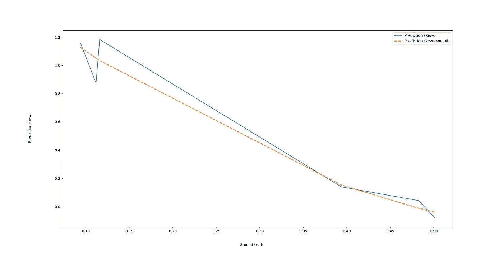

Chart 6: Skew of predictions ordered by Ground Truth values

承认这一点是可行的，即使我们只有高达 50%的评级，如果事实真相是 95%，也不可能有人高估超过 5%(咄！).

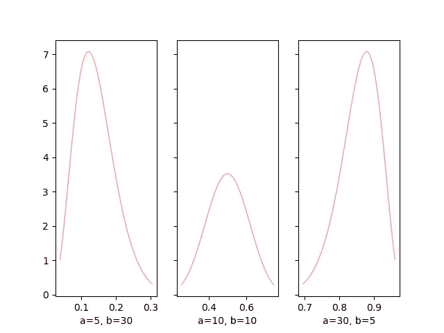

Chart 7\. Even though our respondents only rated items up to a maximum of 0.5, the fact that our error distribution is controlled by the limits of the scale itself, indicates that the total distribution probably looks like this.

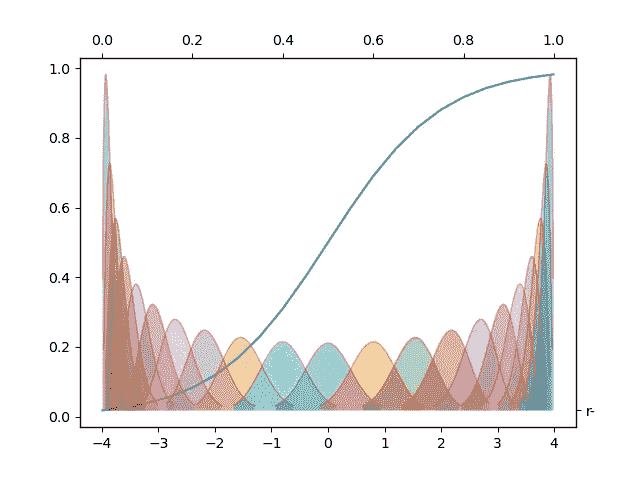

Image8: Not only a wonderful decoration for your festival tent, this 2-parameter graph is also how I assume the general distribution looks like, at least as far as it is parameterized by the scale of 0–1.

因此，为了获得底层函数的公式，我们可以创建额外的模拟数据来增加数据集的密度。我们将通过在所有可能的组合中组合单独的视频分数，并提取它们的基本事实和偏差来做到这一点。我使用 Itertools 组合，取 2-s、3-s、4-s、5-s 和所有 6 个分数的平均值。我还创建了一个对称数据集，从 1 中减去地面实况得分，从 0 中减去偏斜，以模拟 0.5 以上的数据。

```
from itertools import combinationslistExtraLikes,listExtraSkews=[],[]#we create combinations for 2-s, 3-s, etc.for num in np.arange(2,7):targetPairs=combinations(np.arange(0,6),num)# then for each combination we take the mean of like scores  
      # and skew of the errors
      for pair in list(targetPairs):curMiss=np.array(missCols)[list(pair)]curMiss=df[curMiss].mean(axis=1)curLike=np.array(likeCols)[list(pair)]curLike=df[curLike].mean(axis=1)listExtraLikes=listExtraLikes+[curLike.mean()]listExtraSkews=listExtraSkews+[curMiss.skew()]#finally, we combine it into a single dataframe 
extras=pdc([pdf(listExtraLikes),pdf(listExtraSkews)],axis=1)extras.columns=["like","skew"]
```

我们可以平滑它，并使用核岭回归得到潜在的系数。

```
from sklearn.model_selection import train_test_split
from sklearn.model_selection import train_test_split
from sklearn.kernel_ridge import KernelRidge#first we test our alpha and gamma parameters to ensure we're finding the best balance between bias and varianceX_train,X_test,y_train,y_test=train_test_split(X,y)alphas=[1,0.5,0.1,0.05,0.001]gammas=[0.5,1,2,3,4,5,10]scores=pd.DataFrame()for alpha in alphas:for gamma in gammas:clf = KernelRidge(alpha=alpha, kernel="polynomial", gamma=gamma)clf.fit(X_train,y_train)res=cross_val_score(clf, X_test,y_test)resDF=pd.DataFrame([np.mean(res),alpha,gamma]).TresDF.columns=["score","alpha","gamma"]scores=scores.append(resDF)>>>  score     alpha   gamma
>>>  ...
>>>  0.796663  0.001   1.0
>>>  0.817670  0.001   2.0
>>>  0.821492  0.001   3.0
>>>  0.820842  0.001   4.0
>>>  0.819608  0.001   5.0
>>>  0.815899  0.001  10.0
```

结果——光滑如丝。

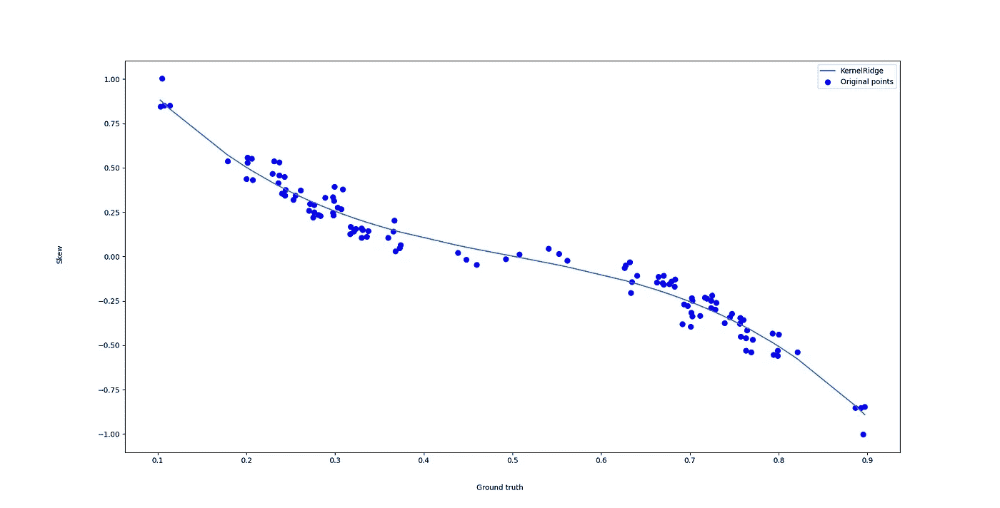

Chart 9: Kernel Ridge regression helps us find the balance between bias and variance and provides us with coefficients for our function.

TLDR；一部只有 10%的人喜欢的电影出现-5%的误差

现在，我可能错了，但这就是模拟的目的。现在，让我们假设这是准确的。如果是这样的话，我们可以使用该模型来消除位置效应，也就是说，无论地面实况可能在哪里，都将其归一化。

例如，如果我们随机选取 30 名受访者，并使用他们的预测中值作为基本事实的估计值，标准偏差作为目标值:

```
#use our function to estimate the standard deviationx_=df[predCols[1]].iloc[45:70]x_=x_.reset_index(drop=True)y = extrasSymmetrical["std"]Krr=clf.fit(X, y)std_=Krr.predict([[x_.median()]])
```

然后，该估计可以与诸如分位数变换器之类的变换器一起使用，以就地归一化数据:

```
#use quantile transformer to normalizeqt = QuantileTransformer(n_quantiles=len(x_), output_distribution='normal')X_trans_qt = qt.fit(x_.values.reshape(-1, 1))refQ=X_trans_qt.references_x_norm=X_trans_qt.transform(x_.values.reshape(-1, 1))x_norm = pdf(x_norm)#Use minMax scaler to get the transformed data into the 0-1 rangex_norm=mm.fit_transform(x_norm)#And finally, use our std_ and mean_ to position inside the real range, for practicalityq_min=x_.mean()-3*std_q_max=x_.mean()+3*std_x_norm=(q_max-q_min)*x_normx_norm=x_.mean()+(x_norm-x_norm.mean())fig, ax = plt.subplots(nrows=1, ncols=1, figsize=(15, 10))sns.kdeplot(x=x_,ax=ax, label="Original distribution")sns.kdeplot(x=x_norm.reshape(25),ax=ax, label="Transformed distribution")ax.set(xlabel="Estimated ground truth",ylabel="Distribution")ax.legend()plt.hist(X_trans_qt)
```

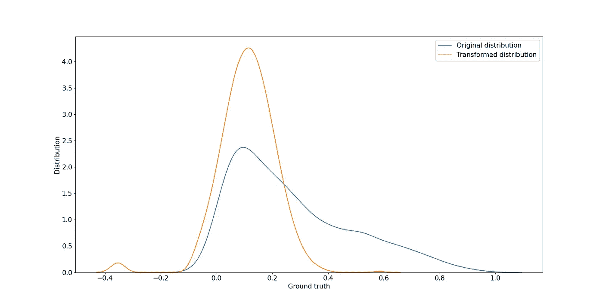

Chart 9: Video 3 distribution before and after normalization

为了提醒我们自己我们在这里取得了什么，我们拍摄了视频 3，并通过应用从概率分布中得出的函数，将其归一化以获得更好的消除效果。

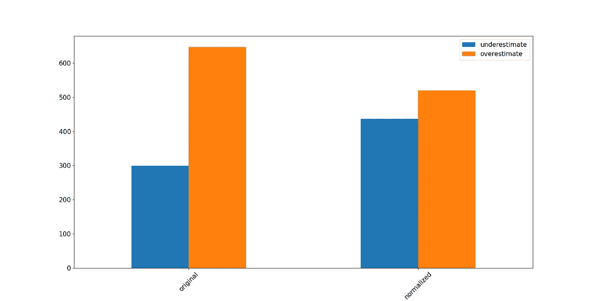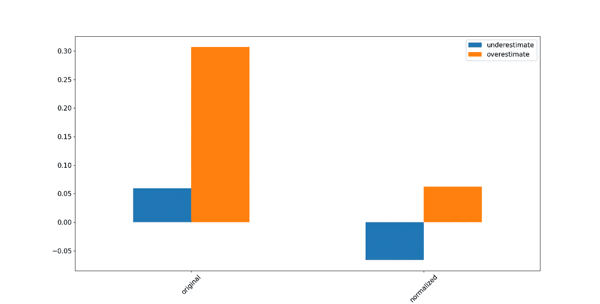

Chart 10: A) count of under- vs over-estimates in the original dataset vs normalized, B) median of under- vs over-estimates in the original dataset vs normalized

Oila！或者是奥立？从来不擅长德语…

无论如何，我们以此结束第一部分，预处理和数据探索。在下一部分，我将解决房间里的机器学习大象:事实上，我们不会有新数据中的地面真相。

收听节目，了解群体智慧方法如何帮助克服这个问题，以及什么样的性格特征与此有关！