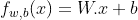
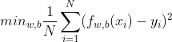
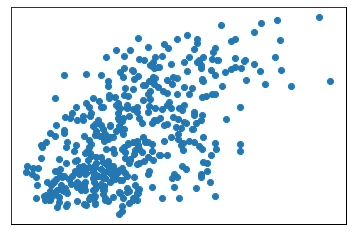
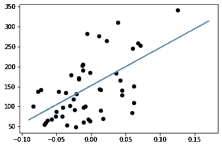
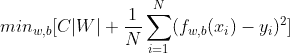
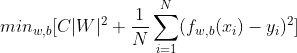
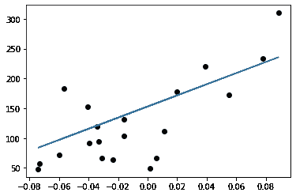

# 改进线性回归——原因和方法

> 原文：<https://medium.com/mlearning-ai/improving-linear-regression-the-why-and-the-how-c4c9ea189384?source=collection_archive---------6----------------------->

线性回归是用于回归问题的线性模型。在精度上早就被其他车型超越了。然而，这是非常有用的基线，给你快速的结果，并且在做的时候是可以解释的。此外，它是一个完美的“第一个模型”,让人们成功地向门外汉描述机器学习的要点。因此，本文从使用 python 中的 scikit-learn API 实现简单的线性回归模型开始，并进一步介绍使我们的实现更加精彩的技术。这些技术可以应用于广泛的模型，它们背后的思想是机器学习的核心。

## 但是什么是线性模型呢？

简单地说，线性模型试图在你的数据中找到*线性关系*。如果目标值是这些特征的线性组合，这是最理想的。


# 从 sklearn 导入线性模型

## 线性 _ 模型。线性回归

当我们的数据的目标值是连续的，即实值时，使用回归。对于线性回归，我们想要建立模型 f(w，b，x ),作为示例 x 的特征的线性组合，如下:



Linear Regression

我们的目标是找到 W 和 b，以最小化目标函数，在这种情况下，是均方误差。因此，该算法的目标是最小化:



The objective function for Linear Regression

其中 N 是数据样本的数量。

## 数据集

我们使用糖尿病数据，这是 sklearn API 本身的一部分。就我们的意图而言，将它视为玩具或模拟数据，我们使用它只是因为这样做简单方便。

```
import matplotlib.pyplot as plt
import numpy as np
from sklearn import datasets

#importing the datasetfor our use

diabetes_X, diabetes_y = datasets.load_diabetes(return_X_y=True)
plt.scatter(diabetes_X[:, np.newaxis, 2], diabetes_y)
plt.xticks(())
plt.yticks(())

plt.show()
```



Image of the diabetes data-points

现在让我们看看如何对这些数据进行线性回归。使用 sklearn，我们可以用三行简单的代码来完成。

```
from sklearn import linear_model

regr = linear_model.LinearRegression() #Create a Linear Regression model
diabetes_X = diabetes_X[:, np.newaxis, 2] #Reformat the data for the model

regr.fit(diabetes_X, diabetes_y) #train the model on the data
```

我们现在可以使用我们的模型对新数据进行预测，并看看它能做得有多好。我们也可以挖一点来找到系数(W)和截距(b)

```
W = regr.coef_ #Returns the weight W
b = regr.intercept_ #Return the intercept b
X = diabetes_X
print('Weight Value: ',W)
print('Intercept Value: ',b)
plt.scatter(X[:50], diabetes_y[:50], color="black")
plt.plot(X, W * X + b)
```



The plot of our model against a sample of the data we used

这就是线性回归。存在许多基于谦逊回归模型的变体。我们会看看其中的一些，但首先，

## 正规化

正则化方法是迫使学习算法创建不太复杂的模型的方法，换句话说，它们防止过拟合。许多模型只是将正则化添加到 LinearRegression()模型的*目标函数*中，因此理解这个概念是有用的。

有三种模型将正则化添加到线性回归的目标函数中。

```
 +------------------+----------------------------------+-----------------------+
| Regularization   |              Command             | Type of regularization|
+------------------+----------------------------------+-----------------------+
| Ridge Regression | sklearn.linear_model.Ridge()     | l2                    |
| Lasso Regression | sklearn.linear_model.Lasso()     | l1                    |
| ElasticNet       | sklearn.linear_model.ElasticNet()| l1+l2                 |
+------------------+----------------------------------+-----------------------+
```

正规化有两种类型。回想一下，线性回归的目标函数是:


让我们取一个超参数‘C’，将其乘以权重矩阵 W，并将其添加到目标函数中，以将等式转换为:



Objective function of l1 Linear Regression

这被称为 l1 正则化。另一方面，如果我们将权重矩阵的平方乘以“C ”,则为:



Objective function of l2 Linear Regression

这就是 l2 正则化。它们之间的主要区别是 l2 正则化的目标函数仅*趋向于*0，而使用 l1 正则化我们实际上可以达到 0。在实践中，如果您怀疑模型过度拟合，可以从使用岭 l2 正则化开始。

## 交叉验证和超参数调整

我们在上一节中将“C”称为超参数。这意味着，它是一个数值，我们作为程序员输入到模型中。(不像算法为我们学习的 W 和 b)。每个模型都有自己的超参数集。程序员**实验性地调整**超参数。通常，这意味着大量的反复试验。幸运的是，sklearn 给了我们一些功能来自动完成这个过程。请注意，手动调整超参数一段时间可能有助于数据科学家更好地理解数据，这通常被认为是最佳实践。

假设您希望使用以下 C 值来尝试岭回归:[0.001，0.01，0.1，1，10，100]，并希望以最高精度保存模型。您可以通过使用以下方法来实现:

```
regr = linear_model.RidgeCV(alphas = [0.001,0.01,0.1,1,10,100],cv = 3)
regr.fit(diabetes_X, diabetes_y)
```

Scikit-learn 使用变量 alpha 代替我们一直使用的 C。但是“cv = 3”是什么意思呢？这意味着数据集分为三部分。两部分用于训练(称为训练集)，一部分用于测试超参数的效率(称为验证集)

更常见的情况是，您不会只有一个超参数需要优化。这就是网格搜索的用武之地。例如，elasticNet 回归函数采用两个超参数，l1_score 和 alpha。如果我们想要测试 l1 分数的[0.1，0.2，0.3]和 l2 分数的[1，2，3]，也就是我们的 alpha 值，我们可以使用 linear_model。ElasticNetCV()，它将为您创建超参数的组合。总共 9 个模型(3*3)将以这种方式训练、评估，最好的返回。

让我们在实践中展示这一点，使用与之前相同的数据集:

```
diabetes_X, diabetes_y = datasets.load_diabetes(return_X_y=True)
diabetes_X = diabetes_X[:, np.newaxis, 2]
#We import the dataset as usual

diabetes_X_test = diabetes_X[-20:] #We will test how good our model is
diabetes_y_test = diabetes_y[-20:]

diabetes_X = diabetes_X[:-20]
diabetes_y = diabetes_y[:-20]

regr = linear_model.ElasticNetCV(
    l1_ratio = [0.1, 0.5, 0.7, 0.9, 0.95, 0.99, 1], 
    #range of values for l1
    fit_intercept=[True,False], 
    #do we want the intercept or not?
    alphas=[ 0.0125, 0.025, 0.05, 0.125, 0.25, 0.5, 1.0, 2.0, 4.0],
    #range of values for l2
    cv = 3
                  )
regr.fit(diabetes_X,diabetes_y)
```

现在让我们编写一个简单的助手函数来测试我们的模型，并根据数据绘制它。

```
from sklearn.metrics import mean_squared_error, r2_score

def plot_regr(model,X,Y):
  W = model.coef_
  b = model.intercept_
  Y_pred = model.predict(diabetes_X_test)
  print(f"Mean squared error: {mean_squared_error(Y, Y_pred)}")
  print(f"R2 error: {r2_score(Y, Y_pred)}")
  plt.scatter(X, Y, color="black")
  plt.plot(X, W * X + b)

plot_regr(regr,diabetes_X_test,diabetes_y_test)
```

```
Mean squared error: 2554.4111933368745
R2 error: 0.47126338325849815
```



ElasticNet implimentation

自然，这种模式是…可怕的。请记住，正则化有助于降低模型的复杂性，而线性回归(ElasticNet 的数学基础)已经非常简单了。话说回来，线性回归本身并没有那么好。然而，到目前为止，我们知道它是快速的，并且作为基线模型是完美的。

***希望你觉得这有用。一定要关注我，跟上我的内容！感谢反馈！***

[](/mlearning-ai/mlearning-ai-submission-suggestions-b51e2b130bfb) [## Mlearning.ai 提交建议

### 如何成为 Mlearning.ai 上的作家

medium.com](/mlearning-ai/mlearning-ai-submission-suggestions-b51e2b130bfb)