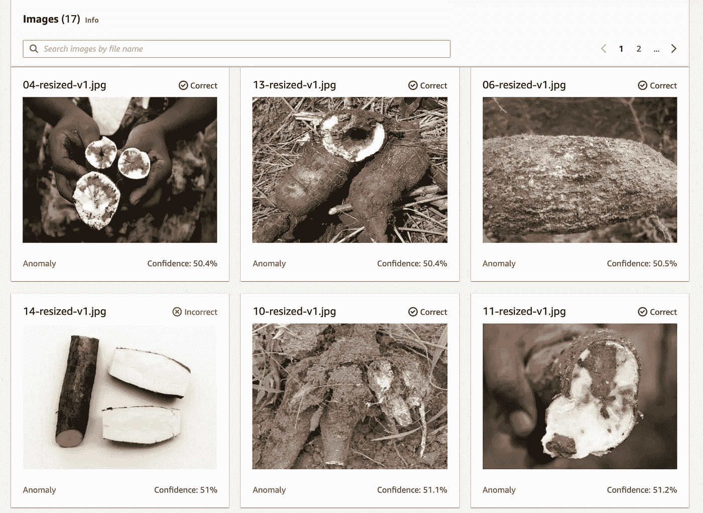
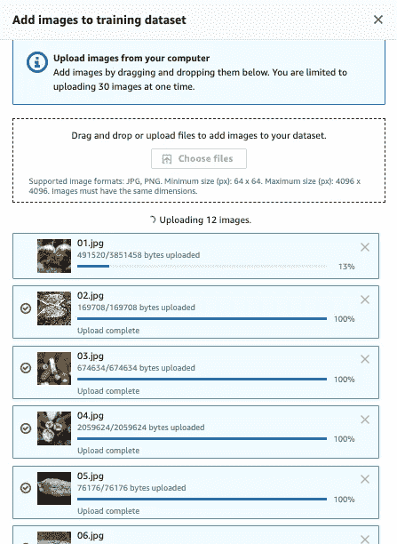
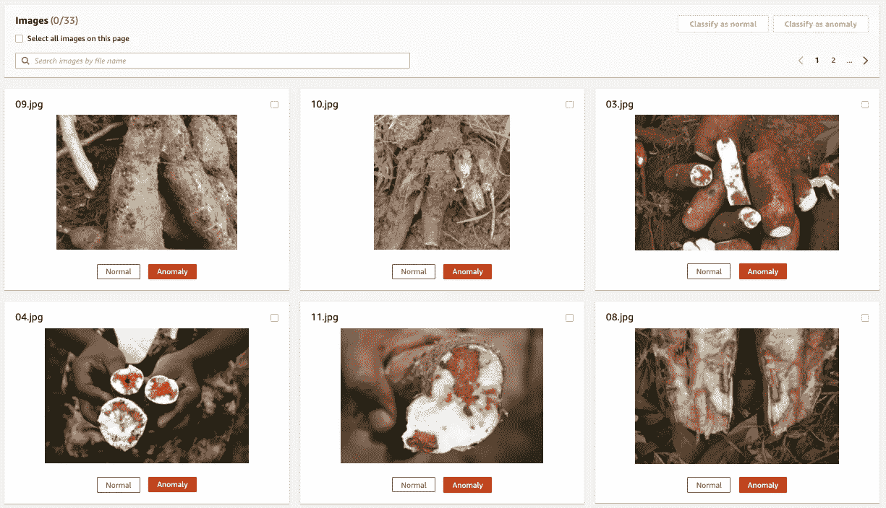
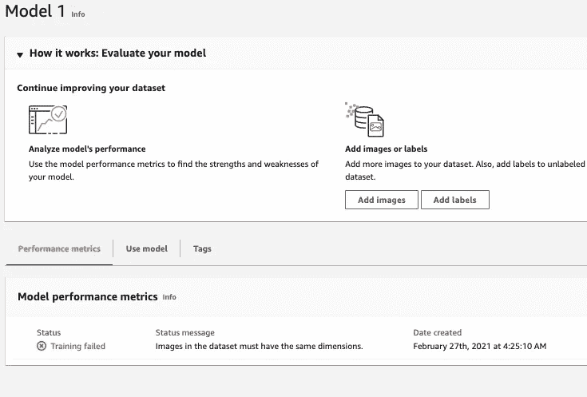
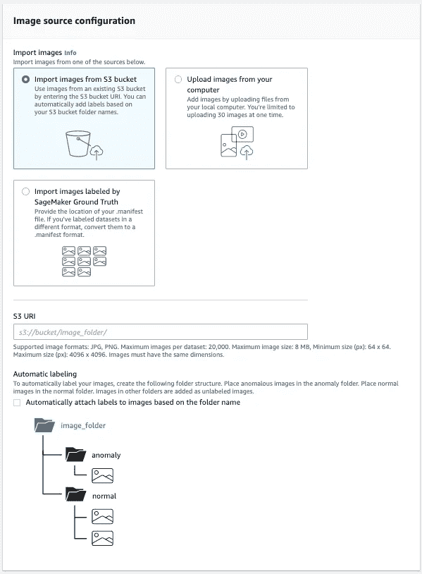
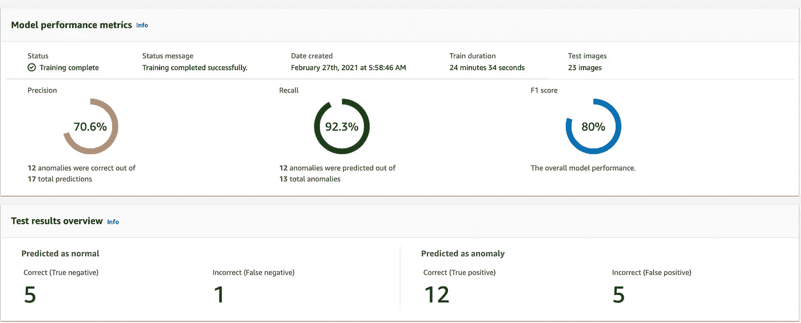
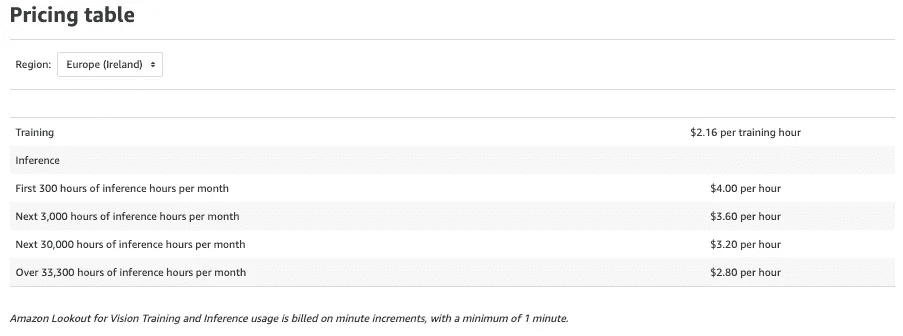

# 利用亚马逊瞭望视野改善当地食品加工

> 原文：<https://medium.com/mlearning-ai/improving-local-food-processing-with-amazon-lookout-for-vision-b831aa9e6b88?source=collection_archive---------4----------------------->

亚马逊在 AWS Re:Invent 2020 上发布的 Lookout for Vision 引起了我的好奇心，我想知道如何应用它。应用程序，而不是从现实生活中的问题，我可以在成长过程中联系起来，而不仅仅是从博客的角度。过去，我写过关于亚马逊网络服务计算机视觉人工智能服务的文章:

1.  [亚马逊重新确认的无服务器产品推荐](https://www.slideshare.net/AWSAktuell/serverless-product-recommendations-using-aws-rekognition)
2.  [用亚马逊 Rekognition 定制标签增强肺炎胸部 x 光诊断](https://towardsdatascience.com/augment-pneumonia-diagnosis-with-amazon-rekognition-custom-labels-6f2fb79a986d)

这些帖子虽然可以理解，但并没有谈到我在尼日利亚奥贡州的成长经历。

节日期间，我们去奥贡州的 Ago Iwoye 看望了我的祖母。伊杰布省奥贡州的这一部分因其被称为 Garri 的可食用木薯片而广受欢迎。这是尼日利亚不太富裕的人的主食。那时候，我经常看着工人们在当地加工、碾磨和烘烤木薯片。然而，至今仍然存在的主要挑战之一是木薯块茎的感染。这影响了木薯片的总产量，从而减少了这种“基本商品”的供应。

当 Amazon Lookout for Vision 宣布时，我问自己这项服务是否能帮助当地人(和工业规模的加工商)提高木薯片的质量。

> 假设:如果当地木薯片生产商可以利用人工智能以低廉的价格提高木薯片的质量，而对人工智能的工作原理一无所知，会怎么样？

# 这项工作

在我们继续之前，有人可能会问:“亚马逊期待的愿景是什么”？

> Amazon Lookout for Vision 是一项机器学习(ML)服务，它使用计算机视觉(CV)来发现视觉表示中的缺陷和异常。借助 Amazon Lookout for Vision，制造公司可以通过快速识别大规模物体图像的差异来提高质量和降低运营成本。

将这一定义与我们的假设联系起来，亚马逊视觉观察似乎是发现缺陷以廉价提高质量的完美匹配。

## 数据准备

为了训练一个亚马逊视觉模型，一个人至少需要 30 张图片:20 张正常的图片和 10 张异常的图片。为此，我主要从 [PlantVillage 网站](https://plantvillage.psu.edu/topics/cassava-manioc/infos)和其他一些网站收集木薯图片。为了这篇文章的目的，我收集了一手高质量的图片。然而，对于实际生产部署，我建议对图像数据集进行一些数据扩充，将可用于训练的图像数量至少增加 5 倍。

Amazon Lookout for Vision Training Image Upload — Cassava Root Images

Add data labels to images from Amazon Lookout for Vision console — Cassava Root Images

## 模特培训

一旦数据集准备就绪，下一步就是通过模型训练让 Amazon Lookout for Vision 旋转起来。然而，我的第一次模特训练失败了——我指的是第一次有效的训练。失败是由于图像没有相同的尺寸，这是我在使用 Amazon Rekognition 自定义标签时从未观察到的。

Amazon Lookout for Vision fails when images in dataset are not of the same dimensions

我立刻启动了本地 Jupyter 环境来调整图像大小，并将调整后的图像上传到我的 S3 桶中。这一次，我使用 S3 路径选项向 Amazon Lookout for Vision 提供训练数据集:

Import images from S3 bucket to Amazon Lookout for Vision — Cassava Root Images

## 结果

Amazon Lookout for Vision model metrics for Cassava Root Images

在包括 20 个正常木薯根图像和 11 个异常木薯根图像的 31 个训练图像上实现 80%的 [**F1 分数**](https://en.wikipedia.org/wiki/F-score) 对于第一次运行来说是不错的。在生产规模上，我们将考虑数以千计的原始图像，我们稍后将增加这些图像，以建立一个真正多样化的数据集。

## 部署

像亚马逊 Rekognition 定制标签一样，[亚马逊 Lookout for Vision 定价](https://aws.amazon.com/lookout-for-vision/pricing/)起价 4 美元，但随着时间的推移会根据推理小时数而降低。

Amazon Lookout for Vision Pricing

因此，在我的用例中，假设我的木薯质量检测服务每天 8 小时，每月 20 个工作日，那么每月的总成本是 640 美元。据《福布斯》报道，考虑到全球第五大作物[的潜在使用规模，这个解决方案物有所值。](https://www.forbes.com/sites/daphneewingchow/2019/08/31/food-feed-and-fuel-cassava-is-the-caribbeans-diamond-in-the-rough/?sh=42b7a8ded401)

> 在 171，593 公顷的收获面积上，木薯的年产量为 487，117 公吨，是世界上第五大作物。

 [## 食物、饲料和燃料:木薯是加勒比海的“毛坯钻石”

### 木薯的收获面积为 171，593 公顷，年产量为 487，117 公吨，是世界第五大木薯产区

www.forbes.com](https://www.forbes.com/sites/daphneewingchow/2019/08/31/food-feed-and-fuel-cassava-is-the-caribbeans-diamond-in-the-rough/?sh=42b7a8ded401) 

## 近期工作

Amazon Lookout for Vision 还不支持边缘设备上的模型部署，因此我们必须寻找创造性的方法来使木薯食品加工者能够访问这项服务。一种选择是通过廉价的 Android 手机进行推理，这可能无法扩展。另一个，我即将开始工作，是 RaspberryPi Zero，带有摄像头和 WiFi/3G 模块。

迫不及待地想知道你会用 [Amazon Lookout for Vision](https://aws.amazon.com/lookout-for-vision/) 构建什么。你可以通过[电子邮件](mailto:elesin.olalekan@gmail.com)联系我，在[推特](https://twitter.com/elesinOlalekan)关注我，或者在 [LinkedIn](https://www.linkedin.com/in/elesinolalekan/) 联系我。