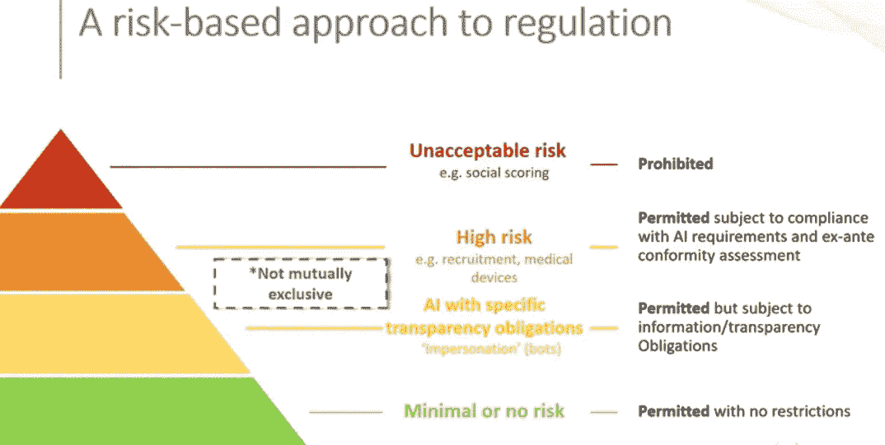
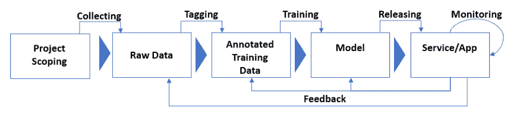

# 在我们信任的数据中

> 原文：<https://medium.com/mlearning-ai/in-data-we-trust-11177575fe5d?source=collection_archive---------2----------------------->

为什么以数据为中心的方法是构建值得信赖的人工智能的方法

Photo by [Dave Lowe](https://unsplash.com/@thelowedown?utm_source=unsplash&utm_medium=referral&utm_content=creditCopyText) on [Unsplash](https://unsplash.com/s/photos/trust?utm_source=unsplash&utm_medium=referral&utm_content=creditCopyText)

[欧盟基于风险的可信人工智能方法](#e5ea)
[局限性](#0649)
[模型、数据和代码](#e4b4)
[以数据为中心的可信人工智能方法](#89a9)
[质量数据分阶段](#192a)
[结论](#93af)

人工智能的技术进步正在影响我们生活的许多领域，如医疗保健、制造、娱乐和农业。然而，人工智能的发展也带来了新的问题。近年来，偏见、准确性、隐私和安全问题使公众担心人工智能的道德和法律后果。

为了解决这些问题，许多政府机构开始围绕可信人工智能起草法律框架，以便在不阻碍其发展的情况下监管人工智能。正如他们在 2016 年对 GDPR 的数据保护([通用数据保护条例](https://en.wikipedia.org/wiki/General_Data_Protection_Regulation))所做的那样，欧盟通过发布[可信人工智能道德准则](https://digital-strategy.ec.europa.eu/en/library/ethics-guidelines-trustworthy-ai) (2019)、[人工智能白皮书——欧洲实现卓越和信任的方法](https://ec.europa.eu/info/sites/default/files/commission-white-paper-artificial-intelligence-feb2020_en.pdf) (2020)和[欧洲数据战略](https://digital-strategy.ec.europa.eu/en/policies/strategy-data) (2020)，在可信人工智能方面引领了世界。在美国，存在类似的措施，即[算法问责法案](https://www.congress.gov/bill/116th-congress/senate-bill/1108/text) (2019)。

在这些监管努力的推动下，研究人员开始研究可信人工智能的各个方面。在这篇文章中，我将介绍一些关于可信人工智能的现有文献，并提出一个构建可信人工智能的框架。我的论点的要点是，可信的人工智能需要以三种不同的方式解决，对应于人工智能的三个组成部分:模型、数据和代码，并且数据质量是构建可信人工智能的基石。

# 欧盟基于风险的可信人工智能方法

欧盟[可信人工智能](https://digital-strategy.ec.europa.eu/en/library/ethics-guidelines-trustworthy-ai) (2019)的道德准则将可信人工智能定义为:

1.  **合法:**尊重所有适用的法律法规。
2.  **伦理的:**尊重伦理原则和价值观。
3.  **健壮:**既从技术角度考虑又考虑到其社会环境。

根据这一宽泛的定义，可归纳出四项伦理原则:

1.  尊重人类自主
2.  预防伤害
3.  公平
4.  可解释性

为了应用这些原则，随后的[白皮书(2020)](https://ec.europa.eu/info/sites/default/files/commission-white-paper-artificial-intelligence-feb2020_en.pdf) 概述了一种基于风险的方法，将人工智能分为四类:

Screen capture from “[Trustworthy AI: The EU’s New Regulation on a European Approach to Artificial Intelligence](https://youtu.be/3AVt-jIekks)”

其中，重点是高风险人工智能，包括医疗设备、招聘、教育、生物识别、执法等。这些领域的人工智能系统必须评估风险并满足这些[要求](https://digital-strategy.ec.europa.eu/en/policies/regulatory-framework-ai)。

1.  **高质量数据:**使用**高质量的**培训、验证和测试数据(相关的、有代表性的等)。)
2.  **文档&记录:**建立**文档**并设计**记录**特征(可追溯性&可审核性)
3.  **透明度:**确保适当程度的**透明度**并提供如何使用系统的信息
4.  确保**人为监督**
5.  确保**健壮性**、**准确性**和**网络安全**

欧盟对可信人工智能方法的贡献在于，它使模糊的可信人工智能概念具体化，并可用于评估真实的人工智能应用。像健壮性、透明性和可解释性这样的需求也可以在其他研究论文和可信人工智能的需求中找到。例如，在[可信人工智能:计算视角(2021)](https://arxiv.org/pdf/2107.06641.pdf) 中，我们发现这些要求与欧盟的要求有很大重叠:

1.  安全性和坚固性
2.  不歧视和公平
3.  可解释性
4.  隐私
5.  问责制和可审计性
6.  环境福祉

欧盟要求强调以人为中心的人工智能和数据质量。

## 限制

虽然欧盟法规为 AI 的 Trustwor 提供了一个很好的框架，但也有一些限制。首先，这些规定没有考虑到人工智能发展的高度实验性质。传统的软件是在以技术规范和设计规范的形式收集需求后开发的。另一方面，人工智能系统涉及许多轮的试验和错误，有时会导致完全放弃一个模型而支持更好的架构。对超参数或训练数据分布的轻微扰动可能导致完全不同的行为。当预测行为不断发展时，很难规定需求。

第二，该法规提出了一些要求，但没有提供足够的指导方针，说明如何为不同的人工智能系统区分优先级并做出权衡。例如，对于医疗设备来说，准确性可能比网络安全更重要，但对于人脸识别系统来说，公平性可能更重要。

第三，法规提出了要求，但没有具体说明要达到的方法和指标。例如，人脸识别系统的准确性可能与教育人工智能不同。我们被告知每种系统的可接受精度水平。

该法规试图控制一个正在积极发展的领域，因此我们希望在几年内制定出细节和改进措施。与此同时，我们需要一个可以用来开发可信人工智能的工作框架。以下是我的建议。

# 模型、数据和代码

人工智能不是一个单一的整体实体。最终用户看到的只是软件，但它可以分为三个部分:

1.  **模型:**模型包括算法、架构、超参数和权重。它们以软件的形式存在，但与传统的软件产品不同，人工智能系统的行为因模型而异，因此最好将模型与代码(软件)分开。
2.  **数据:**一旦模型确定下来，人工智能的表现很大程度上取决于数据。正如著名的格言“垃圾进，垃圾出”所示，数据的重要性怎么强调都不为过。最近，以数据为中心的方法专注于数据，以提高人工智能的性能。我想说的是，可信的人工智能也需要以数据为中心的方法。
3.  **代码:**代码是模型发货的软件容器。在大多数人工智能文献中，模型也包括软件，最好将软件从模型中分离出来。原因是我们已经为传统软件建立了完善的方法和标准:例如，可信计算。另一方面，人工智能模型的行为完全不同。简而言之，传统软件无论有多复杂都是基于规则的。另一方面，人工智能模型不容易理解，因此要求它们是透明的和可解释的。

通过将人工智能分为三个部分，它允许使用适当的方法来构建可信的人工智能。如上所述，通过关注人工智能的软件方面，我们已经知道如何通过可信的计算标准和方法来最好地测试和建立质量。可信计算的四个支柱是可靠性、安全性、隐私性和商业完整性，它们也很容易应用于可信人工智能。商业诚信意味着负责和透明，因此它们符合值得信赖的人工智能要求。

对于这个模型，主要的需求是透明性，也就是可解释和可说明的。对于传统的机器学习模型，通过显示所使用的算法和数学函数，可以很容易地实现透明性要求。

然而，对于深度学习模型来说，由于网络架构和训练过程的复杂性，这并不容易。通常，模型被视为一个“黑匣子”,除了输入和输出，你什么也看不见。对于这些“不透明”的模型，建立信任不能依靠可解释性或可解释性。相反，你必须依赖其他需求，如健壮性和多样性，以确保人工智能可以在所有预期的情况下工作。

# 以数据为中心的可信人工智能方法

上面的讨论导致了一种说法，即数据是构建可信人工智能的最重要的组成部分。结论有三个原因。

首先，正如我们在上面看到的，许多人工智能模型的复杂性违背了透明性的要求。

第二，以数据为中心的人工智能表明了数据质量如何影响人工智能的性能，因此要满足许多值得信赖的要求，如准确性、公平性和责任性，最好的方法似乎是关注数据质量。

第三，验证人工智能的可信度需要针对所有可能的预期场景进行测试。测试 AI 需要测试数据。事实上，除非测试数据反映了真实世界数据和训练数据的分布，否则没有办法也没有意义对其进行测试。

推论是，高质量的数据是值得信赖的人工智能的基石。

# 分阶段的质量数据

在数据质量方面定义了可信的人工智能数据之后，下一个问题是如何验证质量。欧盟基于风险的方法要求在发布前对高风险 AI 进行可信的评估。这种方法的一个潜在问题是倾向于将质量视为一次性清单。

在传统的软件开发瀑布模型中，测试被认为是“事后的”:软件开发完成后的最后一步。当软件变得更加面向服务，用户需求和设计一直在变化时，开发的顺序性和整个过程的刚性使得瀑布模型不再受欢迎。

正如我们所看到的，虽然人工智能是作为软件发布的，但它的行为不能用预先确定的规则来描述。它就像一个不断进化和学习的有机体，特别是最近 MLOps 管道的普遍使用。

在软件开发中，敏捷运动在很大程度上取代了瀑布模型，并在开发 DevOps 管道时达到高潮。在人工智能开发中，虽然它仍在发展中，但类似的努力正在进行中。与敏捷 DevOps 流水线相对应，AI 是在迭代 MLOps 流水线中开发的。典型的 MLOps 管道如下所示:

A typical MLOps pipeline

鉴于人工智能开发的迭代性质，从阶段的角度考虑可信的人工智能是有意义的，因此数据质量也需要分阶段进行。

结果是数据质量按如下阶段定义

1.  **范围界定:**在项目规划阶段，将定义和规划目标数据集的数量和分布(如何分布类数据)以及质量度量。
2.  **收集:**根据目标数量和分布，收集原始数据，即**可靠**、**有代表性**、**均衡**、**多样**、**一般**。

*   **可靠:**数据来源合法，可以追溯。
*   **代表:**类定义及其分布反映了目标域。
*   **平衡:**代表目标域可能无法实现稀有对象的目标精度。可能需要对较小的类对象进行过采样，对较大的类对象进行欠采样，或者进行扩充，以获得目标精度的平衡数据集。
*   **多样化:**为了让人工智能在多样化的案例中发挥作用，数据需要尽可能多样化，不要重复。
*   **公平:**应该检查数据的隐性和显性偏差。对于一个高风险的人工智能来说，你必须准备测试数据来检测模型中的偏差。

**3。标注:**标注是指人工完成的标注和评论。这个过程是劳动密集型的，容易出现人为错误和不一致，所以目标是建立一个**准确**和**一致**的数据集。

*   **准确:**根据指定的准则准确地完成标注。
*   **一致:**不同标注者的标注结果在可接受的精度范围内。

**4。培训:**培训主要是在模型可信任的范围内，因此定义标准是透明性和可解释性。

*   **透明:**可以理解模型的架构和输入输出之间的因果关系。文献中使用的类似术语是可解释性，但是我使用透明性来强调数据的**可追溯性**(数据来自哪里以及它们是如何被修改和移动的)以及训练过程本身(超参数、验证和测试集等)。)
*   **可解释性:**可解释性是指能够解释 AI 在做决策时的内部工作方式。如前所述，对于复杂和不透明的模型来说，这个需求并不总是容易实现的，可能需要在其他需求(如准确性)之间进行权衡。

5.**测试和发布:**完成训练并验证模型行为后，需要将 AI 系统作为软件进行测试。应使用**可靠性、安全性、隐私性、**和**业务完整性**的可信计算要求，以及对**准确性**、**公平性**和**健壮性的测试。**

6.**监控和反馈:**人工智能开发是一个迭代过程，因此在发布产品后，应该有一个机制来监控其行为，并相应地重新评估和训练模型。主要要求是**可追溯性**和**责任性**。

*   **可追溯性:**鉴于在测试过程中不可能测试所有可能的场景，目标是追踪和调查数据如何流动并影响 AI 在生产中的决策过程。
*   **责任:**对于每一个决策，都应该有可能找到负责的数据、组件或设计。

人工智能开发的迭代本质意味着构建可信的人工智能是一个过程，而不是一个清单。通过持续的监控、反馈和再训练，新的数据被添加到数据集中，这反过来使人工智能更加健壮、准确和公平。

# 结论

这是一篇关于可信 AI 话题的调查文章。欧盟的道德和数据策略指南为构建可信的人工智能奠定了良好的基础，但我们也研究了它的一些局限性。以数据为中心的可信人工智能方法试图将其分解为不同的组件，并为每个组件应用经过充分测试的方法。模型、数据和代码是三个组成部分，数据在人工智能开发的所有阶段都起着举足轻重的作用。人工智能对我们来说仍然是新的，我们刚刚开始理解它的能力、法律和伦理含义的过程。即使在两个人之间建立信任也需要时间，所以我们继续改进建立可信赖的人工智能的过程和方法是很重要的。