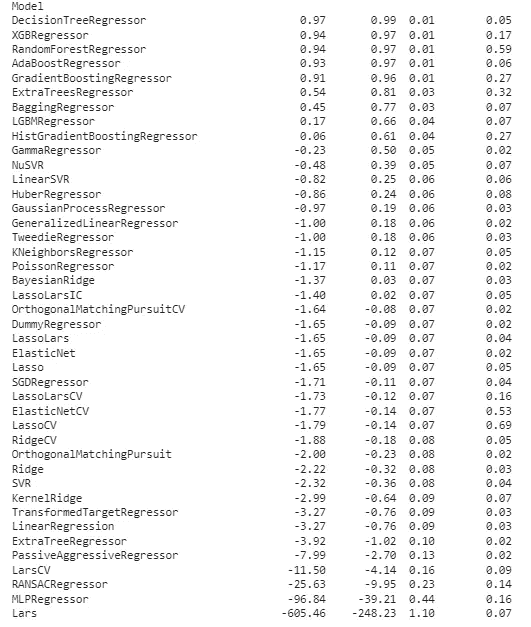

# 只需 4 个步骤即可创建 40 ML 模型

> 原文：<https://medium.com/mlearning-ai/in-just-4-steps-you-can-create-more-than-40-model-and-get-its-results-1acc8e7b13ce?source=collection_archive---------2----------------------->

## 不要浪费时间写很多代码行

Image by Author

要解决回归问题，你需要尝试许多模型以获得最高分，每个模型你都需要编写代码行来创建模型，然后获得每个模型的分数，最后你需要在不同模型之间进行比较。