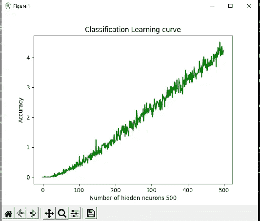
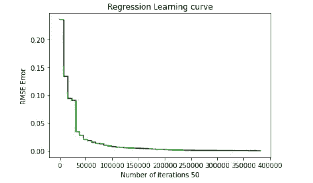

# python 中从头开始的增量极限机器学习(I-ELM)

> 原文：<https://medium.com/mlearning-ai/incremental-extreme-machine-learning-i-elm-11d5f26b220a?source=collection_archive---------2----------------------->

极端机器学习只由 1 个隐藏层和几个神经元组成。它被称为**单隐层前馈神经网络(SLFN)。**与 ELM 相比，I-ELM 具有输出误差随着隐层神经元数目的增加而逐渐减小并趋于零的特性(黄，陈等，2006)。对于机器学习中的**回归和分类**问题是合理的。

在 Github 上关注我:【https://github.com/durveshshah 

分类回归的 Github 链接:[https://github.com/durveshshah/Machine-Learning](https://github.com/durveshshah/Machine-Learning)

# 分类数据集:

该分类数据集属于 CIFAR-10。

数据集可以在这里找到:[https://www.cs.toronto.edu/~kriz/cifar-10-python.tar.gz](https://www.cs.toronto.edu/~kriz/cifar-10-python.tar.gz)

有 50000 幅训练图像和 10000 幅测试图像。它有五个训练批次和一个测试批次。

*   数据集由 10 个类组成，我在代码中将它们计算为 x，比如 x0，x1……x9。

I-ELM Classification

准确性和成本

➔训练精度:500 次迭代后为 43.14 %

训练的➔时间成本:900 秒

➔测试精度:500 次迭代后为 38 %

测试的➔时间成本:7.79 秒

回归数据集:

UCI 数据集链接:[https://archive . ics . UCI . edu/ml/datasets/combined+cycle+power+plant](https://archive.ics.uci.edu/ml/datasets/combined+cycle+power+plant)

该数据集包含来自联合循环电厂的 9568 行，该电厂的项目跨度为 6 年(2006 年至 2011 年)。该数据集将根据要素数量预测电能输出。

该数据集包括 4 个要素和 1 个输出，共有 4 个输入。

特性包括温度(T)、环境压力(AP)、相对湿度(RH)、排气真空(V)。

*   输出为每小时净电能输出(PE)

准确性和成本

训练的➔ RMSE 误差:50 次迭代后为 0.00047

训练的➔时间成本:3763 秒

测试的➔ RMSE 误差:50 次迭代后为 0.502

测试的➔时间成本:8.44 秒

 [## Mlearning.ai 提交建议

### 如何成为 Mlearning.ai 上的作家

medium.com](/mlearning-ai/mlearning-ai-submission-suggestions-b51e2b130bfb)