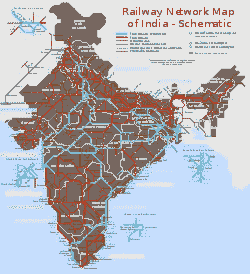
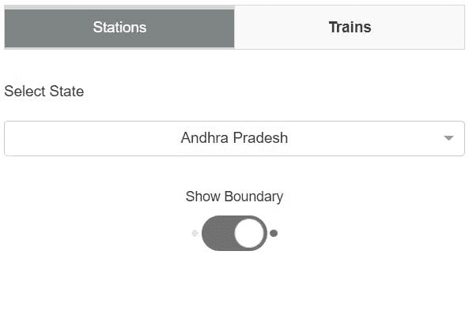
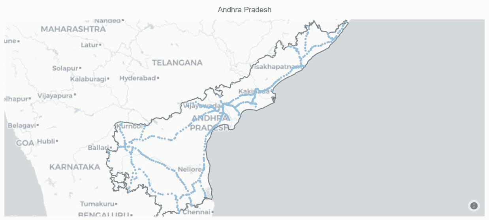
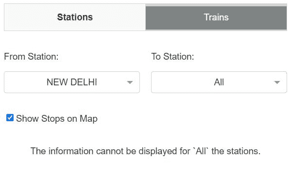
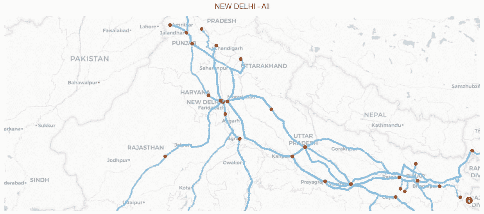
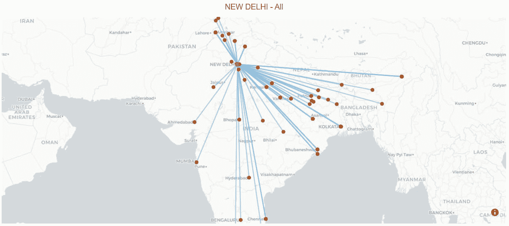
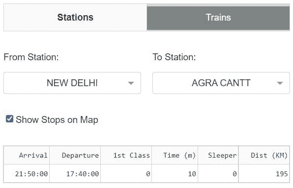
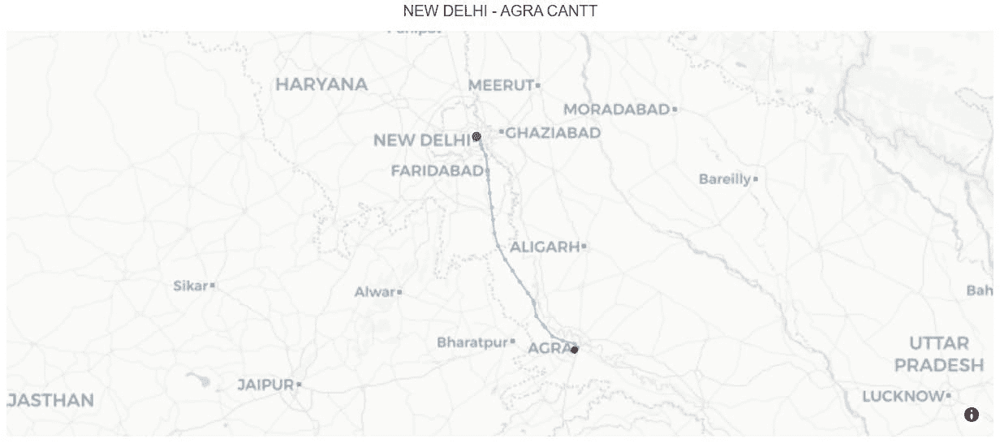

# 印度铁路—数据可视化应用程序

> 原文：<https://medium.com/mlearning-ai/indian-railways-data-visualization-app-e67ac0082e46?source=collection_archive---------5----------------------->

印度铁路——一种生活方式。


Photo by [eberhard 🖐 grossgasteiger](https://unsplash.com/@eberhardgross?utm_source=medium&utm_medium=referral) on [Unsplash](https://unsplash.com?utm_source=medium&utm_medium=referral)

# 介绍

印度铁路是管理整个印度国家铁路系统的法定机构，由印度政府铁道部维护。截至 2022 年 3 月 31 日，它管理着世界第四大国家铁路系统，总路线长度为 67，956 公里(42，226 英里)。每天，它运行 13，169 列长途和市郊客运列车，几乎覆盖了全印度的 7，325 个车站。



Image from Wikipedia

显然，印度铁路是人们出行的首选。这个博客主要是讨论我们如何在地图上直观地显示每个车站的铁路数据。

# 数据源

印度铁路数据由 [Sanjay](https://twitter.com/sanjaybhangar) 和 [Sajjad](https://twitter.com/geohacker) 收集。

为了更多地了解他们在收集数据时所面临的困难——主要是为了保持真实性，你可以从[这里](https://sajjad.in/2016/08/gathering-indian-railways-data/)阅读。

**来源**:[github.com/datameet/railways](https://github.com/datameet/railways)

主要有三个文件-

*   **站** →包含印度所有站的数据以及坐标值和其他详细信息。文件的格式是类型`GeoJSON`。

```
{
  "**geometry**": {
      "**type**": "Point",
      "**coordinates**": [75.4516454, 27.2520587]
  },
  "**type**": "Feature",
  "**properties**": {
      "**state**": "Rajasthan",
      "**code**": "BDHL",
      "**name**": "Badhal",
      "**zone**": "NWR",
      "**address**": "Kishangarh Renwal, Rajasthan"
  }
}
```

*   **列车** →包含所有列车路径(铁路路线)的数据以及坐标值和其他详细信息。文件的格式是类型`GeoJSON`。

```
{
  "**geometry**": {
      "**type**": "LineString",
      "**coordinates**": [
          [72.89173899999999, 19.070320000000002],
          [78.2266994458, 26.0352337224],
          [78.18700399999999, 26.145594],
          [78.18229199999999, 26.216483]
      ]
  },
  "**type**": "Feature",
  "**properties**": {
      "**third_ac**": true,
      "**arrival**": "15:35:00",
      "**from_station_code**": "LTT",
      "**name**": "Mumbai LTT - Gwalior (Weekly) Special",
      "**zone**": "CR",
      "**chair_car**": true,
      "**first_class**": true,
      "**duration_m**": 45,
      "**sleeper**": true,
      "**from_station_name**": "LOKMANYA TILAK TERM",
      "**number**": "01101",
      "**departure**": "15:50:00",
      "**return_train**": "01102",
      "**to_station_code**": "GWL",
      "**second_ac**": true,
      "**classes**": "",
      "**to_station_name**": "GWALIOR JN",
      "**duration_h**": 23,
      "**type**": "Exp",
      "**first_ac**": true,
      "**distance**": 1216
  }
}
```

*   **时刻表** →包含所有列车时刻表的数据以及其他细节。文件的格式属于`JSON`类型。

```
{
  "**arrival**": "None",
  "**day**": 1,
  "**train_name**": "Falaknuma Lingampalli MMTS",
  "**station_name**": "KACHEGUDA FALAKNUMA",
  "**station_code**": "FM",
  "**id**": 302214,
  "**train_number**": "47154",
  "**departure**": "07:55:00"
}
```

> 除此之外，我还下载了包含各州边界的印度形状文件。

# 履行

## `import`套餐

像往常一样，我们从导入对这个项目至关重要的包开始。

## 数据读取

*   `JSON`文件阅读器-所有的`JSON`文件数据，包括`GeoJSON`格式，都可以使用下面的功能读取。

*   `SHP`文件阅读器-帮助读取形状文件数据。

## 数据准备

文件`stations.json`和`trains.json`需要转换成形状文件，因此可以使用`geopandas`包方便地进一步操作数据。

**站**形状文件

**车次**外形文件

**印度各邦的边界**

在`stations`形状文件中，有太多丢失的值(尤其是在`state`列中。为了获得州名，我们需要执行空间连接，左边是 T2，右边是印第安州的边界。

同样，在`trains`形状文件中，有一些站包含多个状态。以下是相同的列表。

*   **莫拉阿里** →旁遮普省的特伦甘纳邦
*   **那加尔加利** →马哈拉施特拉邦，卡纳塔克邦
*   INDARGARH →中央邦拉贾斯坦邦
*   **ALAI** →拉贾斯坦邦，乌特拉坎德邦
*   贾格迪什普尔 →比哈尔邦，贾坎德邦
*   KOMATIPALLI →安得拉邦的特伦甘纳邦
*   **纳加里** →马哈拉施特拉邦安得拉邦
*   **喀什噶尔站** →西孟加拉邦，奥里萨邦
*   苏尔加尔 →马哈拉施特拉邦，查蒂斯格尔邦

## 数据可视化

现在数据准备好了，我们可以使用 Plotly 来获得一个交互式的地图绘图。

**车站**

利用上面的函数，我们可以通过提供`state_name`参数来绘制站点。

**安得拉邦**车站

**火车**

利用上面的函数，我们可以通过提供`state_name`参数来绘制列车路径。

安得拉邦的火车

**列车(来自车站)**

通过以上功能，我们可以绘制出`from_`站提供的列车运行轨迹。

**钦奈海滩**车站

# 应用程序开发

使用上面所有的过程和其他支持 Plotly 图形的包(如`dash`)，我们可以开发一个成熟的 web 应用程序。

由于我们有两个方面`stations`和`trains`，我们可以创建`HTML`选项卡并相应地显示地图。

## 站

**输入布局**



Image by Author

除了只有`state_name`之外，它还有额外的输入，例如显示状态的边界。

**输出布局**



Image by Author

## 火车

**输入布局**



Image by Author

**输出布局**

下图显示了从`from_`站到所有其余站的每一站。



Image by Author

下图未显示任何站点，但以网络形式显示了从`from_`站开始的所有站点。



Image by Author

`from` **站** `to` **站**

如果我们选择一个特定的`to_`车站，我们可以看到列车的其他细节，如-

*   **到站** →列车到站时间。
*   **发车** →列车发车时间。
*   **一等** → `1`如果列车为一等，否则`0`。
*   **时间** →到达目的站的时间。
*   **卧铺** → `1`如果列车为卧铺类型等级，否则`0`。
*   **距离** →以公里为单位的总距离。



Image by Author

同样的地图在下面。



Image by Author

好了，这篇文章就到这里。你可以在下面的链接中找到我的作品。

*   [笔记本](https://jovian.ai/msameeruddin/explore-railways-data)
*   [GitHub](https://github.com/msameeruddin/Indian_Railways)

你也可以订阅我的时事通讯来获取这些独家内容。谢谢大家。

**结束**

[](/mlearning-ai/mlearning-ai-submission-suggestions-b51e2b130bfb) [## Mlearning.ai 提交建议

### 如何成为 Mlearning.ai 上的作家

medium.com](/mlearning-ai/mlearning-ai-submission-suggestions-b51e2b130bfb)