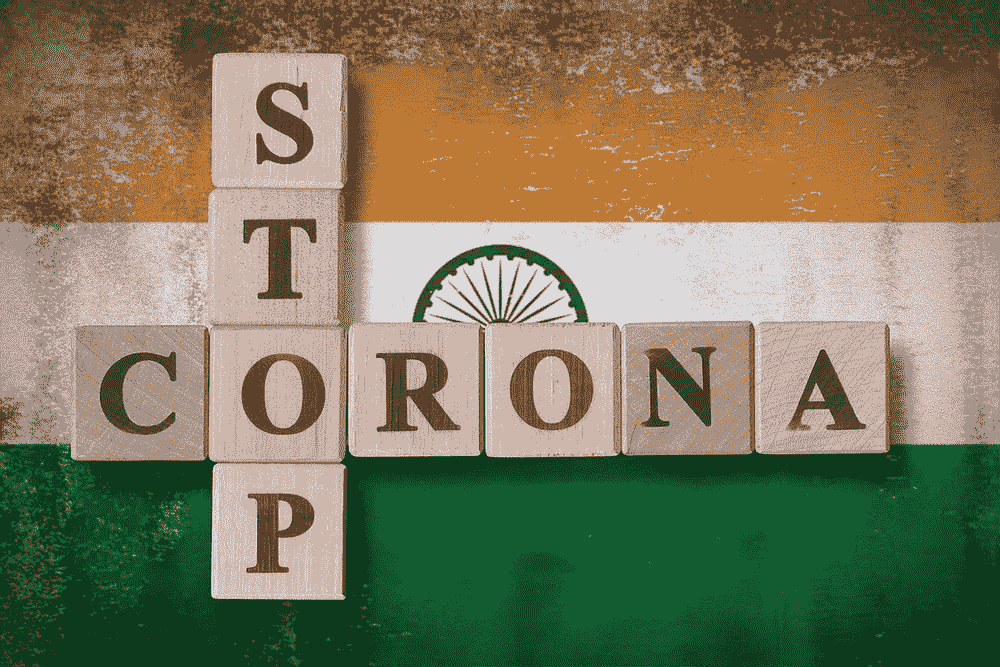

# 推特上的印度灾难:孟买 vs 新德里

> 原文：<https://medium.com/mlearning-ai/indias-covid-catastrophe-in-tweets-mumbai-vs-new-delhi-214a6767f72f?source=collection_archive---------6----------------------->

现代印度有很多形容词，有好的也有坏的。从许多方面来看，它肯定是一个异类。在印度的众多事物中，人们常常忽略了印度也是一个充满故事的国度。也许，印度本身就是一个故事，至少是一个谜。定义印度的众多故事之一是印度自己的双城记。