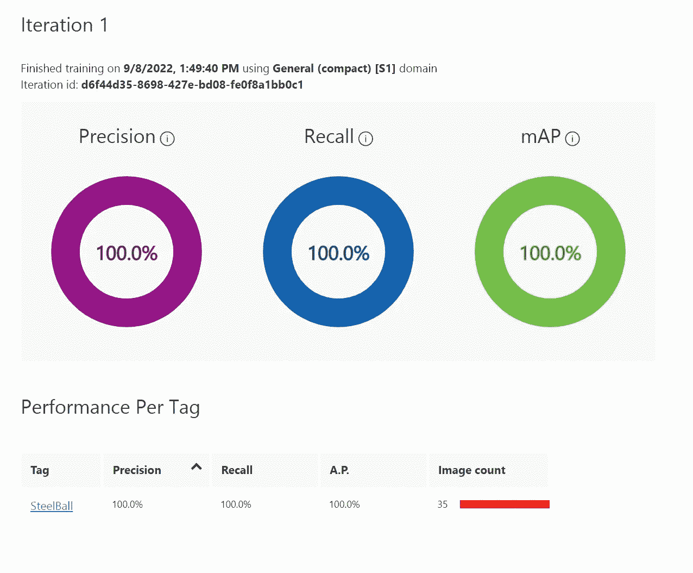
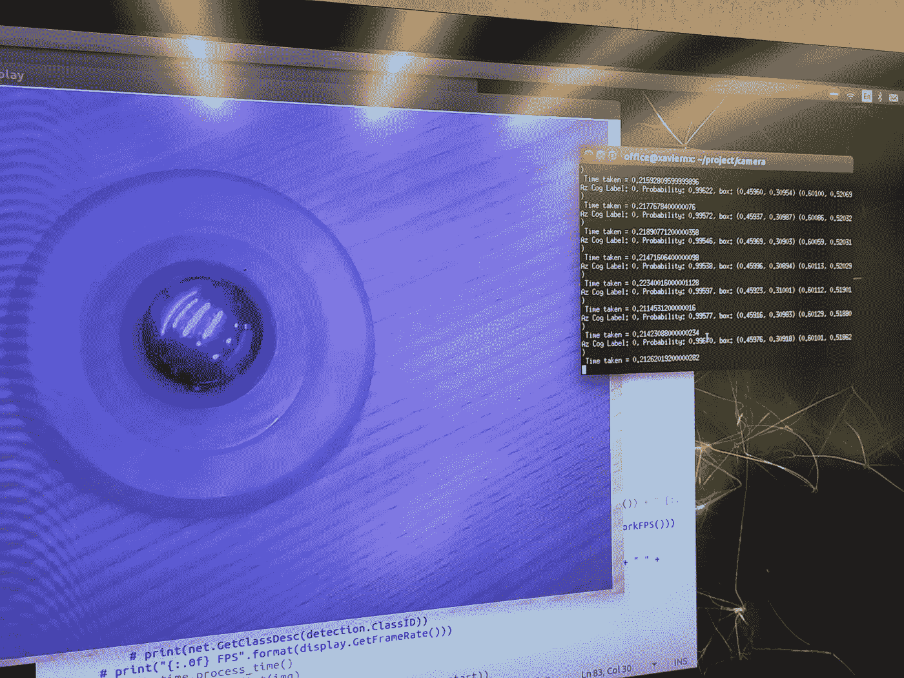
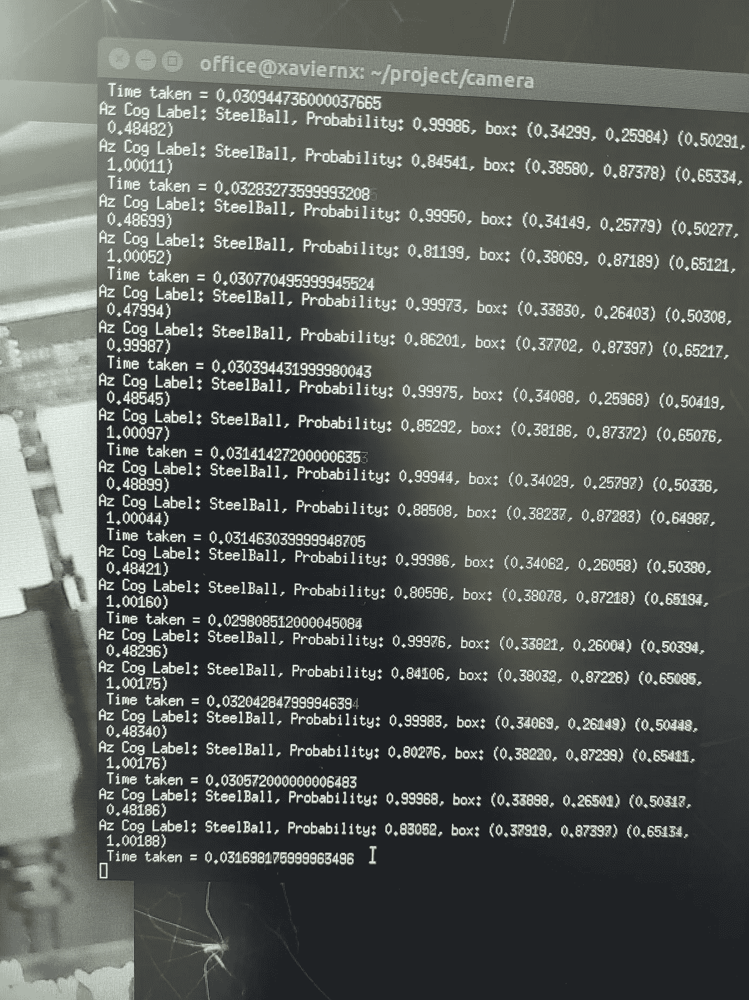

# ONNX 中 Jetson Xavier 的推理 Azure 认知定制视觉模型

> 原文：<https://medium.com/mlearning-ai/inference-azure-cognitive-custom-vision-model-in-jetson-xavier-in-onnx-c8a44524d10?source=collection_archive---------5----------------------->

# 定制视觉紧凑型 S1 模型导出到 ONNX

# 设置

*   Azure 帐户
*   Azure 存储
*   Azure 认知定制视觉服务
*   我使用 customvision.ai 网站上传图像并创建模型
*   将模型导出为 ONNX 格式
*   jetson Xavier NX huehd.com 的 Usb 摄像头

```
Note: working with Xavier is not super easy with open source packages
```

# 设置 Xavier

*   我只有喷气背包 4.6
*   将 python 3.6.9 升级到 python 3.7.5
*   跟随本教程—[https://www . itsupportwale . com/blog/how-to-upgrade-to-python-3-7-on-Ubuntu-18-10/](https://www.itsupportwale.com/blog/how-to-upgrade-to-python-3-7-on-ubuntu-18-10/)

```
sudo apt-get install python3.7
```

*   安装 pip

```
sudo apt install python3-pip
```

*   设置备选方案

```
sudo update-alternatives --install /usr/bin/python3 python3 /usr/bin/python3.6 1
sudo update-alternatives --install /usr/bin/python3 python3 /usr/bin/python3.7 2sudo update-alternatives --config python3
```

*   选择 2 将 3.7 设置为默认值
*   现在检查 python3 版本

```
python3 --version
```

*   应显示 3.7.5

# 现在设置杰特森推理

*   设置 jetson 推理包

```
sudo apt-get update
sudo apt-get install git cmake libpython3-dev python3-numpy
git clone --recursive https://github.com/dusty-nv/jetson-inference
cd jetson-inference
mkdir build
cd build
cmake ../
make
sudo make install
sudo ldconfig
```

*   从那里开始跟随教程—[https://github . com/dusty-NV/jetson-inference/blob/master/docs/building-repo-2 . MD](https://github.com/dusty-nv/jetson-inference/blob/master/docs/building-repo-2.md)
*   python 3.7 安装后再安装 Pillow，imutils，matlabplot，opencv-python

```
pip3 install pillow, imutils, opencv-python
sudo python3 -m pip uninstall matplotlib
sudo python3 -m pip install matplotlib
pip3 install tensorflow
pip3 install pytorch
```

*   用于访问 Azure Cognitive Custom vision 导出模型的示例 URL—[https://github . com/Azure-samples/Custom vision-export-samples](https://github.com/Azure-samples/customvision-export-samples)
*   现在安装 onnx 运行时

```
pip3 install onnx
pip3 install onnxruntime
```

# 从 Azure 认知服务自定义视觉导出模型

*   go tho[http://custom vision . ai](http://customvision.ai/)



*   转到导出选择 onnx 格式


# 使用图像文件测试示例代码

*   这是为了在我们集成到主代码之前测试 onnx 运行时是否工作
*   下面是代码 repo—[https://github . com/balakreshnan/aipinbothack/tree/main/AIPinBall/camera](https://github.com/balakreshnan/aipinbothack/tree/main/AIPinBall/camera)

```
python3 predictonnx.py steelball/model.onnx pinballframe8890.jpg
```

# jetson xavier nx 中使用 Onnx 进行推理的代码

*   下面是代码 repo—[https://github . com/balakreshnan/aipinbothack/tree/main/AIPinBall/camera](https://github.com/balakreshnan/aipinbothack/tree/main/AIPinBall/camera)
*   现在导入必要的库
*   模型路径—[https://github . com/balakreshnan/aipinbothack/tree/main/ai pinball/camera/steel ball](https://github.com/balakreshnan/aipinbothack/tree/main/AIPinBall/camera/steelball)

```
from jetson_inference import detectNet
from jetson_utils import videoSource, videoOutput
import jetson.inference
import jetson.utils
import argparse
import pathlib
import numpy as np
import onnx
import onnxruntime
import PIL.Image
import time
```

*   设置阈值

```
PROB_THRESHOLD = 0.40  # Minimum probably to show results.
```

*   现在创建用 onnx 预测的类

```
class Model:
    def __init__(self, model_filepath):
        self.session = onnxruntime.InferenceSession(str(model_filepath))
        assert len(self.session.get_inputs()) == 1
        self.input_shape = self.session.get_inputs()[0].shape[2:]
        self.input_name = self.session.get_inputs()[0].name
        self.input_type = {'tensor(float)': np.float32, 'tensor(float16)': np.float16}[self.session.get_inputs()[0].type]
        self.output_names = [o.name for o in self.session.get_outputs()] self.is_bgr = False
        self.is_range255 = False
        onnx_model = onnx.load(model_filepath)
        for metadata in onnx_model.metadata_props:
            if metadata.key == 'Image.BitmapPixelFormat' and metadata.value == 'Bgr8':
                self.is_bgr = True
            elif metadata.key == 'Image.NominalPixelRange' and metadata.value == 'NominalRange_0_255':
                self.is_range255 = True def predict(self, image_filepath):
        # image = PIL.Image.open(image_filepath).resize(self.input_shape)
	#height = image_filepath.shape[0]
	#width = image_filepath.shape[1]
        image_array = jetson.utils.cudaToNumpy(image_filepath)
        image = PIL.Image.fromarray(image_array, 'RGB').resize(self.input_shape)
        # image = PIL.Image.frombuffer("RGBX", (720,1280), image_filepath).resize(self.input_shape)
        # image = image_filepath.resize(320,320)
        input_array = np.array(image, dtype=np.float32)[np.newaxis, :, :, :]
        input_array = input_array.transpose((0, 3, 1, 2))  # => (N, C, H, W)
        if self.is_bgr:
            input_array = input_array[:, (2, 1, 0), :, :]
        if not self.is_range255:
            input_array = input_array / 255  # => Pixel values should be in range [0, 1] outputs = self.session.run(self.output_names, {self.input_name: input_array.astype(self.input_type)})
        return {name: outputs[i] for i, name in enumerate(self.output_names)} def print_outputs(outputs):
    assert set(outputs.keys()) == set(['detected_boxes', 'detected_classes', 'detected_scores'])
    for box, class_id, score in zip(outputs['detected_boxes'][0], outputs['detected_classes'][0], outputs['detected_scores'][0]):
        if score > PROB_THRESHOLD:
            # print("{class_id}")
            print(f"Az Cog Label: {class_id}, Probability: {score:.5f}, box: ({box[0]:.5f}, {box[1]:.5f}) ({box[2]:.5f}, {box[3]:.5f})")
```

*   调用 ssd 基本模型

```
net = detectNet("ssd-mobilenet-v2", threshold=0.5)
# net = jetson.inference.detectNet(argv=["-model=home/office/project/camera/steelball/model.onnx",  "--labels=home/office/project/camera/steelball/ labels.txt", "--input-blob=input_0", "--output-cvg=scores", "--output- bbox=boxes"], threshold=0.5)
```

*   初始 onnx 模型

```
camera = videoSource("/dev/video0")      # '/dev/video0' for V4L2
display = videoOutput("display://0") # 'my_video.mp4' for file
model_path = "steelball/model.onnx"model = Model(model_path)
```

*   现在运行模型库并创建自定义模型

```
while display.IsStreaming():
	img = camera.Capture()
	detections = net.Detect(img)
	display.Render(img)
	dimensions = img.shape
	# print(dimensions)
	display.SetStatus("Object Detection | Network {:.0f} FPS".format(net.GetNetworkFPS()) + " {:.0f} Frame Rate display".format(display.GetFrameRate()))
	print("Object Detection | N<<<<<<<<<<<<<<<<etwork {:.0f} FPS".format(net.GetNetworkFPS()))
	# for detection in detections:
	    # print(detection)
	#     print(net.GetClassDesc(detection.ClassID) + " " + str(detection.Confidence) + " " + str(detection.Left) + " " + str(detection.Top) + " " + str(detection.Right) + " " + str(detection.Bottom) + " " + str(detection.Width) + " " + str(detection.Height))
	    # print(net.GetClassDesc(detection.ClassID))
	# print("{:.0f} FPS".format(display.GetFrameRate()))
	outputs = model.predict(img)
	print_outputs(outputs)
```

*   现在你应该看到一个视频源，终端也应该显示 onnx 模型的输出
*   帧以 4 或 5 帧速率运行
*   SSD 型号每秒可运行 70 帧
*   Azure Cognitive Custom Vision Onnx 导出模型的单个类别预测大约需要 210 到 230 毫秒
*   onnx 型号的大小接近 10MB
*   下面你可以看到模型检测钢珠的输出。



*   仅限 1.11.0 版本的 onnxruntime-gpu
*   我卸载了 onnxruntime 和 onnxruntime 1 . 21 . 1——两个版本
*   1.12.1 不适用于 jetson xavier nx 和 jetpack 4.6.1



*   从 0.220 秒到 0.03 或 0.04 秒
*   超级快

*最初发表于*[*【https://github.com】*](https://github.com/balakreshnan/Samples2022/blob/main/AzureAI/CustomVisioninfxavier.md)*。*

[](/mlearning-ai/mlearning-ai-submission-suggestions-b51e2b130bfb) [## Mlearning.ai 提交建议

### 如何成为 Mlearning.ai 上的作家

medium.com](/mlearning-ai/mlearning-ai-submission-suggestions-b51e2b130bfb)