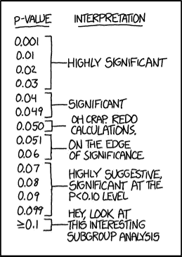
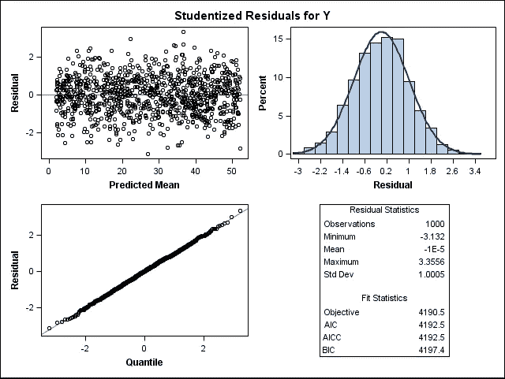
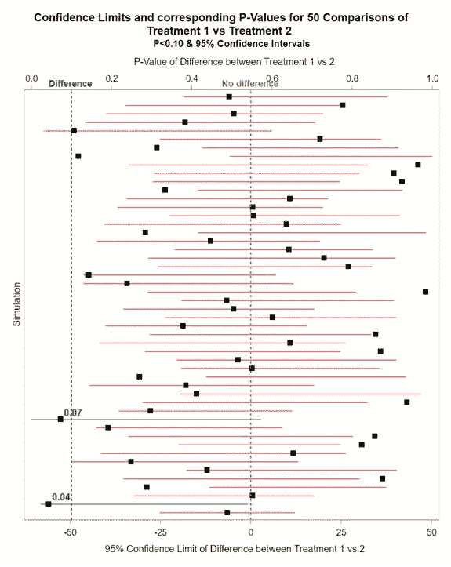
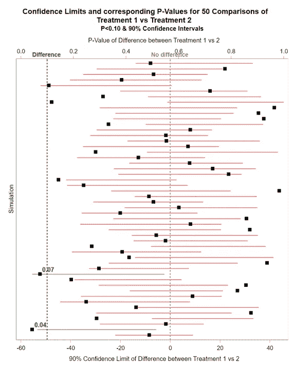

# 推断、估计、p 值和置信限

> 原文：<https://medium.com/mlearning-ai/inference-estimates-p-values-and-confidence-limits-a-frequentist-approach-acdd45d94bd5?source=collection_archive---------0----------------------->

## 频繁主义的方法

我们进行实验来满足我们观察、了解和控制的内在需求。通过分析收集的数据，我们希望回答问题和测试假设，扩展我们对世界及其过程的知识。每次都多一点。

在统计频率理论中，这种搜寻练习被称为**推理**，这是将你的样本发现扩展到样本应该来自的人群的同义词。

> "我的实验和模型的发现类似于‘真实世界’效应吗？"

频繁主义范式在统计学中爆炸性应用的催化剂是 **p 值**或概率值。尽管它有连续的基数，并且依赖于所使用的潜在概率分布，但 p 值通常被用作二分法:p 值等于或低于 0.05 表示有实际影响，p 值高于 0.05 表示有机会。

更符合其本质的一种解释是，p 值为 0.05 表示发现的显著估计值(或差异)不是“真实”的**可接受的** 5%或更低的概率(**假阳性率**)。通常，但错误的是，人们会说发现的差异是“由于偶然”。

> “p 值等于或低于 0.05 表示有实际影响，p 值高于 0.05 表示有机会。”

无论真假，这种二分法仍然被广泛接受，并且经常是出版和接受研究资助的必要条件，这导致了一种平等的连续形式的解释。

The usability of p-values has gotten way out of control.

这些“解读指南”读起来既幽默又痛苦，因为 p 值陷阱都是真实的。就我而言，我不止一次地被它的简单和后果所吸引。此外，通过使用当代统计软件，部署复杂的算法来寻找令人垂涎的 p 值边界变得非常容易。人们很容易忘记 p 值的适当性(如果适当的话)完全取决于所使用的模型和概率分布的适当性。

> “通过使用当代统计软件，部署复杂的算法来寻找令人垂涎的 p 值边界变得非常容易。”

例如，大多数模型假设误差部分由*同分布* : **独立同分布随机变量**的值的观测值组成。这意味着当比较你的模型预测和你的观察时，差异是毫无根据的。

Normal and homogenous studentized residuals in a set of 1000 simulate data points via the Normal Distribution.

一旦可以相信您的估计至少不会违反您的模型的假设(模拟用于分析数据的概率分布的假设)，大多数研究人员认为是时候寻找 p 值了。幸运的是，大多数可用的统计软件也会自动提供**置信区间**。

简而言之，置信限代表了如果我重复相同的实验和分析给定的次数，我可以预期的结果的范围。例如，95%的置信区间为我提供了一系列可能的值，我可能会在 100 次重复试验中的 95 次中预期这些值。

就我个人而言，我认为置信区间代表了 p 值的可取之处，但它们本身也不是没有警告的。当然，他们已经被仔细审查过了。然而，如果你要使用频率主义的方法进行统计，我宁愿看到你使用置信区间而不是 p 值。

Confidence Limits, but not estimates of the mean, are more susceptible to sample size change. Even in a perfect i.i.d simulation, created by N=100k simulations.

不要过多地陷入定义置信限是什么或不是什么的陷阱，模拟 p 值和置信限是同一枚硬币的两面可能更容易。这意味着，如果我接受 0.05%的 p 值，我也应该使用 95%的置信限——或 0.95%的 CI。原因是它们都绑定到我接受的同一个假阳性率。

为了显示估计值、p 值和置信限是如何相互作用的，我模拟了五个处理，每个处理从同一个正态分布中抽取 10 个样本(均值=791.5，方差=1000)。然后，我使用 0.05%的 p 值和 95%的置信区间比较了治疗 1 和治疗 2。该过程重复 50 次，导致治疗 1 与治疗 2 的 50 次比较。

Black squares are p-values based on the 0.05% cut-off, red lines are 95% confidence limits, and the green line is a ‘significant’ difference based on the 0.05% p-value.

尽管重复和模拟的数量很少，但上图能够清楚地突出 p 值和置信限固有的几个问题:

1.  在不应该有影响的地方发现了一个显著的影响。鉴于我们在模拟中允许 5%的假阳性率，这实际上比我们预期的要少。欢迎来到模拟和概率的世界！
2.  p 值本质上是无信息的。不仅不同的置信区间——位置不同，大小不同——具有相同的 p 值，p 值本身并不能真正告诉你任何关于效应大小的信息。
3.  显著性 p 值的置信限可以接近“非显著性”的边界，等于零。这意味着一个 p 值，即使被认为是“显著的”，也需要从一个更全面的角度来考虑，以评估它所附属的估计值的有用性。因此，它很可能是一个临床上不相关的重大影响。

> “一个 p 值，即使被认为是‘显著的’，也需要从更全面的角度来考虑，以评估它所附属的估计值的有用性。”

我已经提到过 p 值和置信限之间的关系就像硬币的两面。如果我不将 p 值的水平调整到置信限的水平，反之亦然，下面您可以看到对估计值的解释会发生什么。

Not changing the level of the confidence limit to mimic the level of the p-value means that we will find ‘significant’ p-values combined with non-significant confidence limits and vice versa. I short, both metrics will have different false positive rates. Due to the small number of repetitions and simulations, the theoretical false positives are not achieved.

就我个人而言，我一点也不喜欢 p 值，但我确实认识到它们仍被大量使用，而且研究人员确实依赖于它们。因此，我认为，在首先展示 p 值的内在局限性及其与置信限的联系之前，我创建一个提倡废除 p 值的帖子是愚蠢的，我认为置信限是一个信息量更大的指标。

因此，如果你无法摆脱 p 值，我希望你记住 p 值和置信限是交织在一起的，但后者本质上更能提供信息。实际上，考虑到您的模型假设得到满足，置信限为您提供了一系列似是而非的值。

现在，你需要说服期刊编辑去掉均值(标准误差)表，开始显示和报告置信限。

 [## Mlearning.ai 提交建议

### 如何成为 Mlearning.ai 上的作家

medium.com](/mlearning-ai/mlearning-ai-submission-suggestions-b51e2b130bfb)