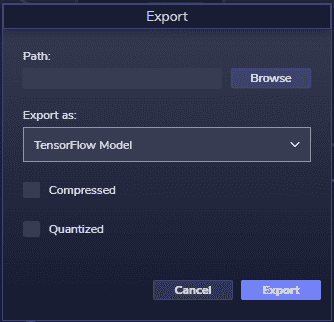

# 对现实世界的推断:一旦你训练好了你的 ML 模型，该怎么做

> 原文：<https://medium.com/mlearning-ai/inference-for-the-real-world-what-to-do-with-your-ml-model-once-youve-trained-it-772fedc4e373?source=collection_archive---------2----------------------->


Image [Source](https://unsplash.com/photos/FRVKf7GTnkA).

在我们的博客中:[抽象的力量:ML 框架和感知实验室如何为描述 ML 模型提供一种更加人类可读的语言](https://blog.perceptilabs.com/the-power-of-abstraction-how-ml-frameworks-and-perceptilabs-provide-a-more-human-readable-language-for-describing-ml-models/)，我们讨论了对*做*机器学习(ML)建模意味着什么，以及 ML 框架为描述 ML 模型提供的语言。ML 建模过程的最终结果是一个包含模型的训练权重的文件，用于推断(即，用于进行真实世界的预测、分类等)。).

但是一旦你有了这个文件，你实际上如何使用它来进行推理呢？在这篇博客中，我们将快速回顾 ML 模型导出过程，深入研究下一步如何处理您训练过的模型文件，并探索为什么这个过程的知识对您组织中的技术和非技术成员都有价值。

## **出口概述**

导出是 ML 建模过程的一部分，您可以将训练好的模型保存到一个特殊格式的文件中。在导出过程中，您还可以选择优化(减小)结果文件的大小，以便它可以更容易地通过互联网传输，同时在目标设备上消耗更少的空间和内存。

两种常见的优化方法是:

*   **压缩** : *通过移除一些不太影响预测的不太重要的权重来修剪*模型。
*   **量化**:减少用于存储权重值的位数(例如，从 32 位浮点值减少到 8 位整数)。

请注意，这两种方法都可能降低模型的准确性，因此建议进行一些实验。

使用 PerceptiLabs，导出只需选择**文件** > **导出**菜单，指定目标位置，选择优化选项，然后单击**导出**:



*Figure 1 — PerceptiLabs export popup with the option to compress or quantize the model. Image source:* [*PeceptiLabs*](http://www.perceptilabs.com)*.*

通过这个简单的接口，几乎团队中的任何成员，从开发人员到非技术用户，都可以很容易地用 PerceptiLabs 导出一个经过训练的模型。

导出过程将在目录结构中生成许多文件，如下所示:

```
/mymodel/1/assets/variablesvariables.data-00000-of-00001variables.indexsaved_model.pbcheckpointmodel.ckpt-1.data-00000-of-00002model.ckpt-1.data-00001-of-00002model.ckpt-1.index
```

在这些文件中，您唯一需要关注的是**。pb** 文件，本例中: **saved_model.pb** 。的。pb 文件是最终的、经过训练的模型文件，可以用于推理。如果你的技术读者想知道，这个文件遵循[协议缓冲区](https://developers.google.com/protocol-buffers) (ProtoBuf)格式。

现在让我们看看您需要如何处理这个文件。

## **使用训练好的模型**

下一步是将模型文件传输到设备(例如，云服务器、边缘设备等)。)在那里它将被呈现以真实世界的数据来分析和执行推理。然而，这只是等式的一半。有了需要的模型之后(例如，在目标设备上)，另一个需求是提供某种代码或应用程序来加载文件，向其提供数据，并使其结果可供使用。TensorFlow 为此提供了两个选项。

第一个选项是使用 TensorFlow 的 [tensorflow-model-server](https://www.tensorflow.org/tfx/tutorials/serving/rest_simple#serve_your_model_with_tensorflow_serving) 命令行工具在某个端口上托管(服务)模型，同时处理调用模型预测的 [REST](https://en.wikipedia.org/wiki/Representational_state_transfer) 请求。REST 请求本质上是特殊的 URL，应用程序可以访问这些 URL 来发送和接收数据。这种方法对于允许远程(例如，分布式)应用程序使用相同的模型进行推理是有用的。

第二种选择是使用 TensorFlow 的 API 在应用程序中直接以编程方式加载模型并与之交互。例如，我们最近的[端到端工作流](https://www.youtube.com/watch?v=CnQ93Q-SHLU)视频展示了如何从感知实验室导出一个模型，并在 [Streamlit](https://streamlit.io/) 应用中使用它。或者，您可以使用其他 API，比如我们的 [Coral 教程](https://docs.perceptilabs.com/perceptilabs/tutorials/coral-sign-language-tutorial)中使用的 API。

不管怎样，这就是全部了！

## 但是谁在乎呢？

学习导出过程，如何使用一个训练好的模型，甚至如何创建 ML 模型，对一个组织的所有成员，包括非开发者和非 ML 利益相关者都是有益的。

例如，IT 人员可能负责设置云服务器来托管模型，因此他们可能想知道模型有多大，估计需要多少处理能力，从哪里获得模型文件，以及如何最好地保护它。

在业务方面，例如，业务分析师可能负责使用模型或运行模型的应用程序来做出决策。他们的任务甚至是确定 ML 模型在哪里适合他们组织的目标，以及这些模型需要做出什么贡献。

营销和销售部门也可以从内部知识中受益。例如，他们可能规定使用过去的数据来预测市场或销售趋势所需的要求，或者他们的模型准确度的目标水平。他们甚至可以直接与数据科学家合作，或者访问运行模型的应用程序进行推理。

还要记住，训练、导出和使用模型的过程通常是一个迭代和持续的过程。这可能是由于诸如[模型漂移和衰减](https://docs.paperspace.com/machine-learning/wiki/model-drift-and-decay)等因素、业务需求的变化或持续改进的需要。不管是什么原因，构建和提炼模型的持续本质已经导致了一种被称为 [MLOps](https://blog.perceptilabs.com/mlops-an-ops-just-for-machine-learning/) 的正式方法，它可以包括上面所有的成员。

迎合这些不同利益相关者的需求是 PerceptiLabs 真正闪光的地方。首先，我们的可视化工作流允许用户拖放模型[组件](https://docs.perceptilabs.com/perceptilabs/references/components)，而无需编写代码。甚至一个非技术、非 ML 的从业者也可以看到 PerceptiLabs 模型，并且看到在输入和输出之间有某种流动。通过每个提供可视化的模型组件，用户可以深入了解模型的工作方式以及模型的每个部分如何转换数据。

此外，PerceptiLabs 通过将模型编辑过程与模型训练过程分离来增强 ML 建模。这使得建模比在 TensorFlow 中更快，后者通常需要在整个训练集上运行整个模型(并且全部来自代码)。使用 PerceptiLabs，在建模过程中只使用第一个训练样本，并且在模型更改时，只对该样本重新运行模型的受影响部分。这既节省了时间，又降低了创建模型所需的计算能力。然后，在训练期间，任何用户都可以查看统计数据和其他可视化信息，以了解模型的执行情况，并确定是否应该提前中断训练以进一步调整模型。

最后，PerceptiLabs 就是让你更快地得到一个导出的模型，一个你可以信任的模型，因为你已经洞察了它是如何被构建的。

## **结论**

ML 建模的目标是在一个文件中生成一个经过训练的 ML 模型，该模型可以被部署用于现实世界中的推理。然后，API 或服务应用程序将加载该文件，向其提供数据，并返回其输出。从那里，应用程序可以使用输出作出决定。

正如我们所见，PerceptiLabs 不仅使建模过程变得更加简单，便于各种用户使用，还将 TensorFlow 的导出过程简化为一个简单的导出菜单。然后，只需将结果文件传输到目标设备，并创建一个应用程序来使用或服务于该模型。

更一般地说，PerceptiLabs 的面向视觉的工作流程和特性使得更多的组织成员参与到 ML 模型的设计、培训和导出中成为可能。

欲了解更多信息，请参见我们的感知实验室[文档](https://docs.perceptilabs.com/perceptilabs/)中的[导出](https://docs.perceptilabs.com/perceptilabs/references/advanced-topics/exporting)页面。