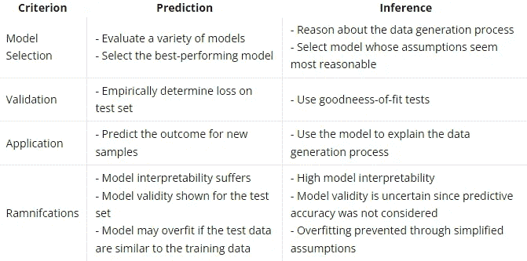

# 推理模型是什么？

> 原文：<https://medium.com/mlearning-ai/inference-model-8fa2058fce8e?source=collection_archive---------5----------------------->

# 推理模型是什么？

**推理**是评估*预测器*和*响应变量*之间关系的过程。我们可以将推理定义为使用模型**学习**关于数据*生成过程*，因此它的**目标**是理解业务/模型结果的*驱动因素*。

# 它有哪些类型？

推论可以进一步分类如下:

*   **单变量推理**(单个预测因子和反应之间的关系):这种类型的推理有助于我们理解一个预测因子变量的值如何随着另一个预测因子或一组预测因子的变化而变化。
*   **双变量推理**(反应和两个预测变量之间的关系):这种类型的推理有助于理解反应变量的值如何随着两个预测变量的变化而变化。
*   **多变量推断**(反应和两个以上预测变量之间的关系):这种类型的推断有助于理解反应变量的值如何随着多个预测变量的变化而变化。

# 模型的可解释性是推理的必要条件

本质上，适用于推理的模型和不适用于模型可解释性的模型之间的区别。我所说的*模型可解释性*是什么意思？我认为一个模型是可以解释的，如果一个人，特别是一个门外汉，可以追溯模型如何产生它的估计。考虑以下预测方法:

*   **可解释:**广义线性模型(如线性回归、逻辑回归)、线性判别分析、线性支持向量机(SVMs)、决策树
*   **可解释性较差:**神经网络、非线性支持向量机、随机森林

只有可解释方法的子集对推断有用。例如，线性支持向量机是可解释的，因为它们为每个特征提供了一个系数，从而可以解释单个特征对预测的影响。然而，支持向量机不允许估计与模型系数(例如方差)相关的不确定性，并且不可能获得模型置信度的隐式度量。注意，支持向量机能够输出概率，但是这些概率只是决策值的变换，并不基于与参数估计相关联的置信度。这就是为什么即使是线性支持向量机和决策树这样的可解释方法也不适合进行推理。

# 推理工作流

1.  **建模:**推理数据生成过程，选择最接近数据生成过程的随机模型。
2.  **模型验证:**使用残差分析或拟合优度测试评估随机模型的有效性。
3.  **推论:**利用随机模型了解数据生成过程。

# 比较推理和预测模型

# 两个模特团体

请注意**机器学习通常与预测建模**有关，而统计社区通常依赖于执行推理的随机模型。由于机器学习模型的复杂性，**它们经常被当作黑盒**。另一方面，对于推理问题，所用模型的工作原理很好理解。

# 推理示例

你想了解臭氧水平如何受温度、太阳辐射和风的影响。因为假设残差是正态分布的，所以使用线性回归模型。为了利用完整数据集中的信息，并且您不关心预测准确性，您可以在完整数据集中拟合模型。基于拟合的模型，您可以解释要素对测量的臭氧水平的作用，例如，通过考虑估计值的置信带。

# 摘要

在我们看到推理模型的意义之后，我们可以理解:

*   目标是理解业务成果的驱动因素
*   以推理为中心的模型是可解释的
*   **推理**是评估*预测器*和*响应变量*之间关系的过程
*   我们使用推理模型来**了解**关于数据*生成过程*

谢谢，如果你支持我，我会很高兴😊

 [## Mlearning.ai 提交建议

### 如何成为 Mlearning.ai 上的作家

medium.com](/mlearning-ai/mlearning-ai-submission-suggestions-b51e2b130bfb)