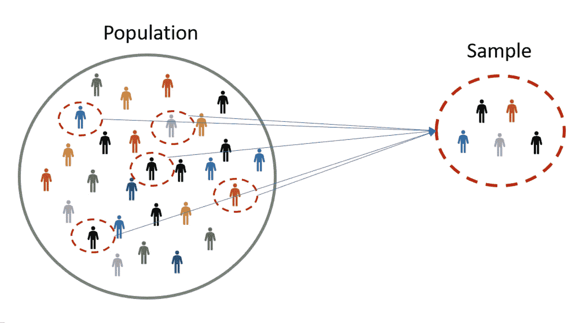
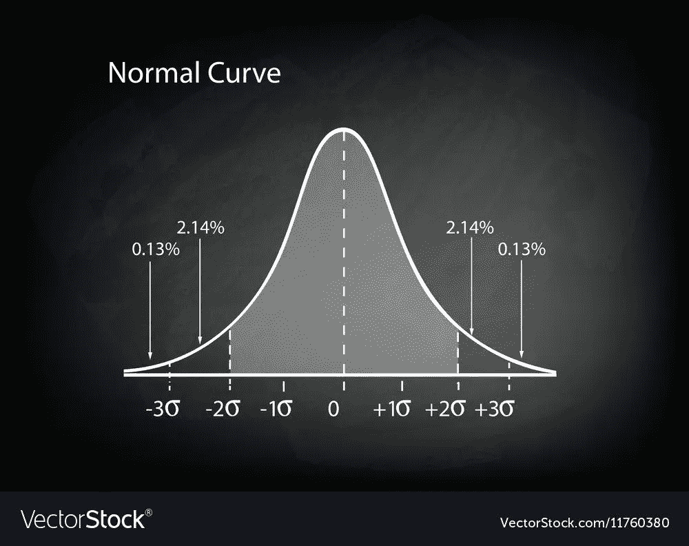
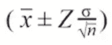
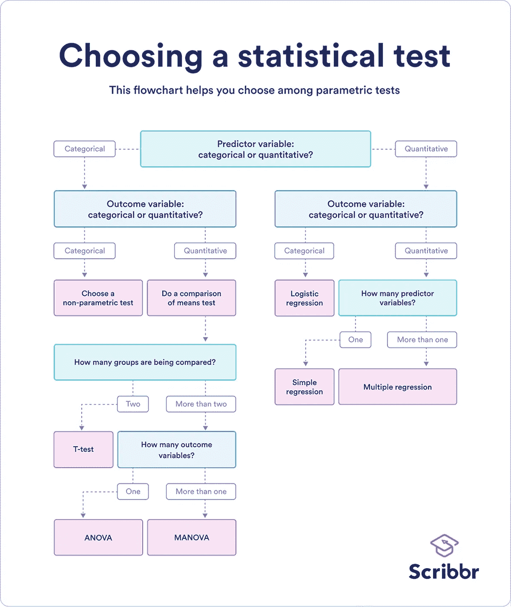

# 推断统计学

> 原文：<https://medium.com/mlearning-ai/inferential-statistics-6e189526525d?source=collection_archive---------3----------------------->

## 理解推断统计学| CLT |统计检验|假设检验

inferential statistics on sample

你曾经试图理解某些事件的行为吗？你是否对为此目的收集大量数据的想法感到不知所措？您是否担心从整个人口中收集数据的成本？

嗯，推理统计学给出了答案。让我们试着去理解它…

**什么是推断统计学？**

推理统计使我们能够根据收集的样本估计总体的参数。我们不需要从整个群体中收集数据来推断某些事件的行为。

使用推断统计，我们从样本中获取数据，并对总体进行归纳

> 但是 Sourav，它是如何工作的？

别担心，我们会深入探究与推断统计相关的概念，让我们的*生活更简单*

**点估计和区间估计**

集中趋势的度量，如代表点值的均值、中值、众数，是点估计，而由某个范围(如误差范围、置信区间)表示的是区间估计

**中心极限定理(CLT)**

给定一个大的总体，如果我们从总体中随机产生多个样本(样本大小(n)> 30；30 已经通过实验建立)，则中心极限定理陈述

> 样本均值 x̄近似遵循均值和标准差为σ/sqrt(n)的正态分布，其中和σ是样本所选总体的均值和标准差

normal distribution

> 我们可能会想，为什么是正态分布？它的意义是什么？

正态分布的主要优点是它是被广泛研究的分布。大多数自然发生的现象，类似于正态分布。

**置信区间和边际误差**

confidence interval for mean where sample size > 30

[置信区间](https://www.youtube.com/watch?v=hlM7zdf7zwU&ab_channel=KhanAcademy)是样本统计值的范围(如样本均值、样本方差等)。)可能包含总体参数。

换句话说，从样本均值中估计总体均值是在一定的区间内进行的。假设，如果样本均值为 2.5，那么我们认为总体均值位于 2.5 d 的区间内(“d”是常数)

常数‘d’是**边际误差**，它是从样本统计中估计总体参数的相关误差

对于置信区间，我们还考虑了出现的概率，比如区域有 **95%的概率**找到总体参数。

因此，我们说总体均值的 90%置信区间位于 **x̄和**之间(其中 x̄是样本均值，d 是边际误差)。

**统计测试**

(阅读本文了解更多关于[统计分析](https://www.scribbr.com/category/statistics/)的知识)

[统计测试](https://www.scribbr.com/statistics/statistical-tests/)确定如果零假设为真，样本数据将位于样本数据的预期分布的何处。它包括两个主要输出:检验统计-确定数据与零假设的差异程度| p 值-如果零假设实际上为真，获得结果的可能性

> 统计检验主要分为两类:参数检验和非参数检验

统计学中所有众所周知的分布，如正态分布(均值和标准差)、二次分布(偏移、标度和截距)都是使用某些参数定义的。**了解这些参数，为我们提供了分布的清晰概念**。当用于假设检验时，这种分布被称为参数检验。例子包括: **t 检验、配对 t 检验、方差分析**

非参数检验不需要分布的基本假设。例子包括:**克鲁斯卡尔-沃利斯检验、弗里德曼检验、斯皮尔曼等级相关**

(有关不同的[统计测试](https://www.analyticsvidhya.com/blog/2021/06/hypothesis-testing-parametric-and-non-parametric-tests-in-statistics/)的更多详细信息，请参考链接中的文章)

**何时使用哪种测试？？**

参数统计检验做出某些假设，如观察值的独立性、方差的同质性(所有研究组的方差都相似)和数据的正态性(正态分布)

然而，如果上述假设失败，可以使用非参数测试

(参考[链接](https://www.scribbr.com/statistics/statistical-tests/)了解选择正确测试的更多详情)

另外，你可以参考下面的流程图

Flowchart by Scribbr

**假设检验**

利用推断统计，用于分析变量之间的关系，并通过使用样本数据进行总体比较。

进行假设检验的程序

*   确定**零假设(H0)** 作为我们的研究假设——例如，如果我们希望确定 H0 的 b/w 身高和性别的关系:*性别组(男性和女性)之间的身高没有差异*
*   **替代假设(H1)** :男女身高存在统计学差异
*   根据现有数据进行统计检验
*   比方说，我们的测试结果显示身高有 12.7 厘米的差异，该差异的 p 值为 0.002(α:0.05-阈值)
*   我们的结论是，上述差异不太可能是偶然的；我们拒绝零假设

结论:本研究结果与我们的研究一致，即身高与性别有关系

> 谢谢你的阅读。希望，这篇文章能够增加你对推理统计学的理解，增强它的概念。

**结论**

因此，推理统计有助于我们在样本与其总体之间建立可量化的关系。利用推理统计学的概念，设计了假设检验，帮助我们确定群体分布之间的关系。

> 分享你的评论，建议和淋浴你的❤

 [## Mlearning.ai 提交建议

### 如何成为移动人工智能的作者

medium.com](/mlearning-ai/mlearning-ai-submission-suggestions-b51e2b130bfb)