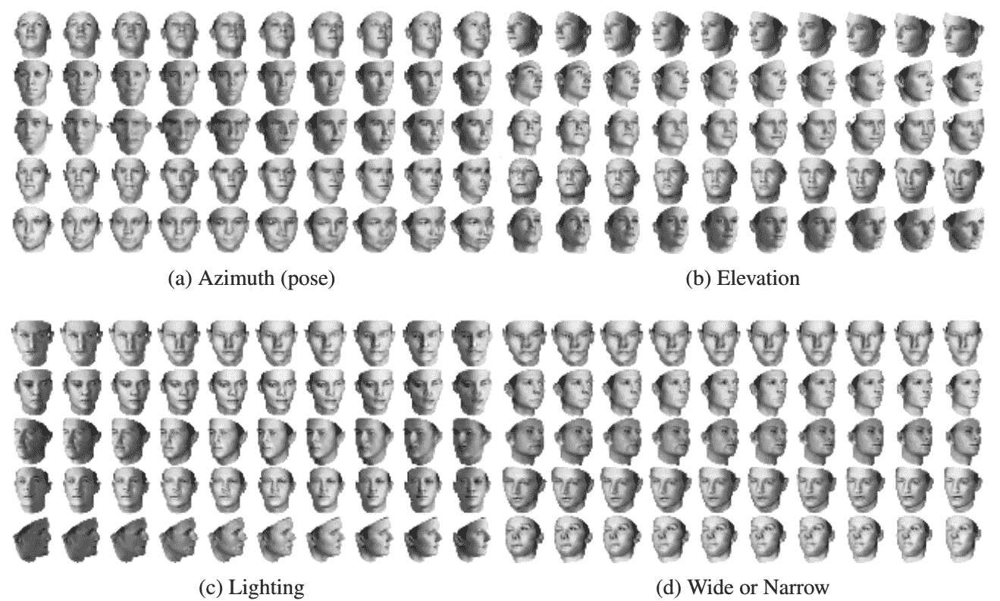
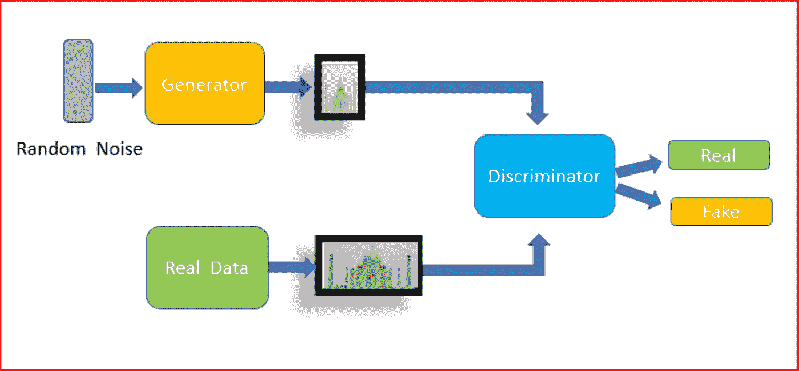
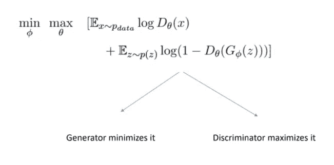
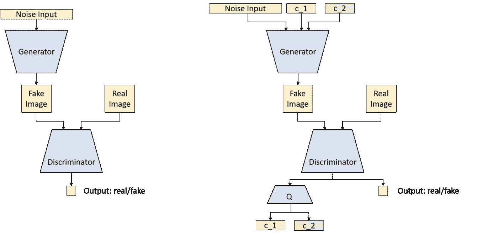
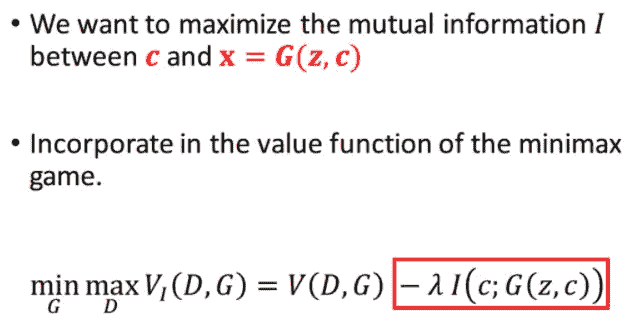
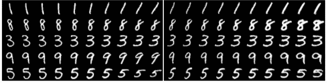

# InfoGAN:学习从零开始生成可控图像(Pytorch)

> 原文：<https://medium.com/mlearning-ai/infogan-learning-to-generate-controllable-images-from-scratch-pytorch-31a49ffc7b98?source=collection_archive---------3----------------------->

[https://proceedings.neurips.cc/paper/](https://proceedings.neurips.cc/paper/2016/file/7c9d0b1f96aebd7b5eca8c3edaa19ebb-Paper.pdf)

InfoGAN 是原始对抗性训练方法的一种特殊变体，其中生成器学习以一种*无监督的方式生成不同类别和属性的图像。*这意味着，例如，如果在使用 InfoGAN 训练生成器生成 MNIST(数字从 0 到 9)的图像后，您想只生成额外的*数字“8”*的图像，该数字有一定程度的向右倾斜(想象一个倾斜的 8)，那么在设置相应的参数后，您将能够很容易地做到这一点。

最棒的是，你可以在训练中不用任何标签就能做到这一点。这意味着你的模型会自动学习区分数字的类别和它们的显著属性(旋转、粗细等)，这正是我们下面要做的...

> 页（page 的缩写）S —本条分述如下；我们首先解释 GAN 理论并指出其缺点，然后继续理解 InfoGAN 如何修改原始架构，最后给出代码。

# 甘理论🦕

[medium.datadriveninvestor.com](https://www.google.com/url?sa=i&url=https%3A%2F%2Fmedium.datadriveninvestor.com%2Fgenerative-adversarial-network-gan-using-keras-ce1c05cfdfd3&psig=AOvVaw0V-9nrw0oonDGDgi1vdnLu&ust=1644128499845000&source=images&cd=vfe&ved=0CAsQjRxqFwoTCLCYzJX25_UCFQAAAAAdAAAAABAD)

以上面的图像为参考，GAN 生成器的目标是生成类似于真实数据分布的图像，以便鉴别器认为它来自真实数据而不是伪造的。另一方面，鉴别器具有相反的目的，即区分真实数据和生成的数据(假的)。

通常，我们希望生成器学习从高维分布空间到真实数据图像空间的映射，例如**高斯分布或均匀分布**。这就是为什么我们对发生器的输入是从高斯分布中采样的高维(约 100)随机噪声向量，我们将其表示为 ***Z*** ，并将实际数据表示为 **X *。***

我们优化如下所示的最小-最大损失函数，其中**θ**分别是鉴频器的参数，**φ**分别是发生器的参数。

GNR 638 IIT Bombay slides

## 缺点

在训练生成器之后，我们给它任意一个随机的 ***Z*** 值，我们将得到一个随机生成的图像，类似于真实数据集中的图像。然而，问题是我们对生成的图像没有任何控制。比方说，我们使用每个数字有 10 个类别的 MNIST 数据集作为我们的真实数据集，并且我们想要生成许多具有某些属性的图像(**旋转、厚度、大小*、*** **等)..**)但只有一个数字“7”。不幸的是，我们不能使用普通的 GAN 来实现这一点，我们必须使用 InfoGAN 来实现。

# 信息根理论🦖

如上图所示，与原始 GAN 相比，InfoGAN 中的额外修改是**潜在变量 c1 和 c2** ，它们作为生成器的输入，由鉴别器从生成的图像(假图像)中强制预测。

## 输入

现在，这些潜在变量基本上是随机数的别出心裁的名字，随机数有两种类型:

1.  **c1 —一个热点编码** —例如在 MNIST，我们有 10 个类，如果我们想学习生成特定于类的图像，那么 c1 是一个随机的一个热点变量是有意义的。在训练之后，该模型自动学习将独热编码标签与特定类别相关联，并且仅生成该类别的图像。
2.  **C2——在 **-1 & 1** 之间的一个随机连续实数**。生成的图像的其他方面，如向左或向右倾斜的程度，在本质上是连续的，如果我们想对它们建模，它们需要一个连续的随机变量。例如，如果我想控制我的手指的**旋转角度**，那么将 c2 从 **-1 改变为 1** 将意味着从向左倾斜到向右倾斜改变旋转角度，反之亦然。

> *注意——这些潜在变量是随机的，这里的任何地方都没有使用类别标签 Y。该模型自动学习将一个类附加到一个独热编码中。*

## 该模型如何将潜在变量与生成的图像相关联？

如上图所示，还有一个修改，即来自生成图像的 **Q** 网络预测**C1&C2**(潜在变量)——**G(X/C1，C2)**。不要害怕 **Q** ，这个网络可以只是一个普通的 **softmax** 或 **nn.linear 层**在鉴别器的上面，事实上这就是原作者使用的。

现在，这样做的整个逻辑是，我们首先使用我们的生成器' **G** '生成假图像，通过给它 **Z，c_1 和 c_2** 作为我们的输入，我们将生成的图像表示为 **G(X / c_1，c_2 )** 。现在，我们将生成的图像传递给鉴别器，鉴别器输出真实/伪造分数，我们还强制它完全从图像中预测输入值**C1 和 C2**。这样，在正确训练我们的模型后，鉴别器自动学习将潜在变量 C 的某些值附加到生成的图像，类似地，生成器也根据潜在变量 C 生成某些类别/属性的图像。

我们必须有一个适当的损失函数，其目标是实现上述目标。幸运的是，这可以通过在**原始 g an 损耗**上增加一项来轻松实现。这个术语叫做**互信息**，用**‘I’**表示。并且它的目标是在给定潜变量 **C (c_1 & c_2)** 的指定值的情况下，最小化生成图像 X 中的不确定性。

GNR 638 IIT Bombay slides

互信息通常是鉴别器给出的 **C** 的**地真值**输入值与**预测值**之间的**交叉熵损失**或 **MSE 损失**。

# Pytorch 代码👩‍💻

在本例中，我们使用 Pytorch 数据加载器加载 MNIST 数据集，批量大小为 64。除此之外，我们还将所有图像归一化，使像素值介于-1 和 1 之间。这有助于稳定的训练和更快的收敛。

> *注—查看**[*https://github.com/soumith/ganhacks*](https://github.com/soumith/ganhacks)*了解更多训练技巧。**

*对于我们的 G**generator 神经网络，**注意我们如何在输入中包括 Z、c_1(称为“标签”，因为与数据集的类数量相同)和 c_2(表示为“代码”，我们使用 2 个连续变量)。我们通过 CNN 层传递输入，直到我们得到一个和 MNIST 一样大小的上采样图像。*

*接下来对于**鉴别器神经网络**，我们对其进行编码，以将输入作为我们生成的图像，并在我们的最后一层给出三个输出。正如您在 forward 函数中看到的，我们使用 **sigmoid** (self)输出一个**真实度分数**。adv)，标签预测使用 **softmax** 用于 **c_1** (self.catag)，以及一个**线性层**用于回归代码或连续变量 **c_2** (self。续)。我们在 CNN 层之后使用退出和批量规范，因为在实践中观察到它导致更稳定的训练。*

*下面我们定义**损失函数**用于训练发生器、鉴别器和两个网络的互信息损失。对于信息损失，我们对 C1 使用**交叉熵，对 C2**使用 **MSE 损失。***

*接下来，我们使用 **Adam 优化器**来训练两个网络，并使用 **itertools.chain** 来堆叠两个网络参数以训练信息丢失，因为我们希望在优化互信息的同时更新生成器和鉴别器的权重。*

*现在，我们将上述所有内容放入一个训练循环中，我们就完成了。*

# *结果🐈*

**

*[https://proceedings.neurips.cc/paper/2016/file/7c9d0b1f96aebd7b5eca8c3edaa19ebb-Paper.pdf](https://proceedings.neurips.cc/paper/2016/file/7c9d0b1f96aebd7b5eca8c3edaa19ebb-Paper.pdf)*

*我们以矩阵形式绘制图像，其中沿着每一行我们改变独热编码向量 C1，并且我们看到模型已经学会在类别之间分离。在各列中，我们使用两个连续的潜在变量，所以我们保持一个不变，而将另一个从-1 变化到 1。我们对另一幅图像重复同样的操作。我们观察到第一幅图像捕捉旋转，第二幅图像捕捉笔画的粗细。这些属性随潜在变量 C2 成比例变化。*

*有了这个模型，我们就有能力从数据集生成新的图像，同时控制类和属性，只需指定 C1 和 C2 的值作为生成器的输入。*

*谢谢你走到这一步，我希望你能学到一些新东西！*

* [## Mlearning.ai 提交建议

### 如何成为 Mlearning.ai 上的作家

medium.com](/mlearning-ai/mlearning-ai-submission-suggestions-b51e2b130bfb)*