# 使用 Python、Kinesis 和 Terraform 获取点击流数据

> 原文：<https://medium.com/mlearning-ai/ingesting-clickstream-data-with-python-kinesis-and-terraform-446371c6f032?source=collection_archive---------3----------------------->


Photo by [mauro mora](https://unsplash.com/@mauromora?utm_source=medium&utm_medium=referral) on [Unsplash](https://unsplash.com?utm_source=medium&utm_medium=referral)

# 介绍和动机。

我的目标是写几篇文章，每篇文章关注一个在任何公司都可以找到的流行数据源，然后将它们结合在一起，对一个成熟的数据平台有一个全面的了解。本文将是这一系列文章中的第一篇。目前的重点将是点击流数据，而未来的写作将集中在其他熟悉的来源，如 OLTP 数据库，第三方 API，可能还有 web 服务器日志。

# 先决条件。

*   Python3 已安装。你应该熟悉编程。
*   已安装 Terraform。如果你从未使用过 Terraform，你可以跟随我的代码。
*   具有凭证(有效访问和密钥)的 AWS 帐户。如果您在本地机器上配置了 AWS CLI，并且在`~/.aws/`目录中有一个凭证文件，这将会有所帮助。

# 项目要求。

为了让事情尽可能“真实”，让我们创建一个在数据团队中常见的场景。

我们是一家虚拟科技公司的数据工程师。用户访问我们公司的应用程序来执行各种活动，从而生成数据点。

我们的任务是获取这些数据，并让公司内的其他成员可以轻松地获得这些数据，以进行进一步分析。此外，在构建解决方案时，我们还应该考虑监控、可伸缩性、可扩展性和可再现性。

让我们以一种更加模块化的方式来重新构建这项任务——我们需要将实时点击流数据吸收到数据湖中，供不同的利益相关方(分析工程师、数据分析师、数据科学家等)在下游使用。).

在重申了需求之后，很明显这个任务可以分解成三个有序的子任务。

1.  摄取
2.  储存；储备
3.  消费

# 什么是点击流数据？

想象一下拥有一个网站或者一个网络应用。用户找到他们的方式到您的站点并执行各种操作。访问页面、点击按钮、提交信息和购买产品都是这类活动的例子。但是这些用户数据点是没有帮助的，除非您创建一个过程来记录它们。

那么，我们如何捕捉这些未开发的数据流呢？如今，您可以使用许多服务来收集和存储这些数据。这些服务包括谷歌分析、细分、振幅和混合面板。以 Segment 为例，您的网站被添加为数据源，然后 Segment 提供所需的 JavaScript 代码来开始跟踪用户事件并将它们发送给 Segment。

我希望每个人都清楚需要获取这些丰富的数据。例如，为每个用户分析一个按时间排序的事件列表(我们称之为用户之旅)可以让你理解用户的动机和行为。这反过来有助于做出更明智的决策，优化用户体验和转换。

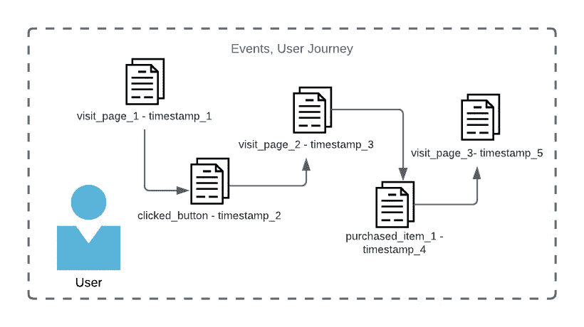

# 回到数据工程师的角度

> ***🚨真实世界警报🚨***
> 
> *作为一名数据工程师，通常情况下，你不会在设置点击流数据的跟踪和标记方面看到太多动作。相反，这个过程将由前端、产品管理和分析团队的成员共同完成。然而，在一些较小的公司中，数据工程是分析团队中的一个角色(而不是上升到工程)，可能在事件标记过程中有一些输入。*

# 我们如何获得点击流数据？

如果你一直在关注我以前的文章，你会知道我是一个生成自己的数据的爱好者。这篇文章也不例外。

这个项目假设我们已经有一个服务，如段，设置，并与标记的用户事件。从 Segment 导出的数据是半结构化和嵌套的。以下是 Segment 文档中的一个事件示例。

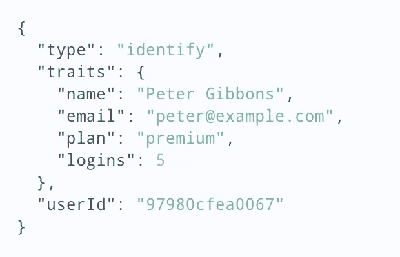

这个特定的有效载荷代表一个识别调用，它将一个已知的用户与其特征相匹配。这个调用可以在用户注册、登录或更新他们的信息时生成。注意 trait 字段本身是一个半结构化的对象，使得事件嵌套。Segment 还提供其他呼叫，如 track(用户在做什么？)，页面(用户访问的是哪个页面？)，还有更多。

我们将根据这个识别调用对生成的数据进行建模。然而，让我们不要关心有效载荷的实际内容。相反，更重要的是通过使我们的导出半结构化和嵌套来模仿有效载荷结构。

# 预览事件。

看一下我们稍后将生成的事件的示例。

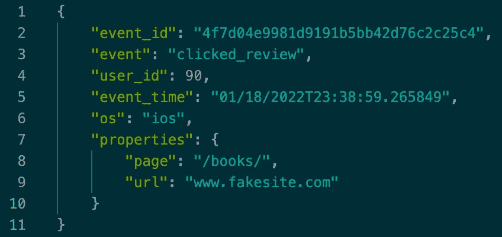

在这个有效负载中，我们有一个 ID 等于 90 的已知 iOS 用户，他访问了`www.fakesite.com/books/`路径并点击了一个评论。`properties`字段定义了另一个 JSON 对象。

这个示例事件的结构选择是由以下要求驱动的。

*   有效载荷应该是半结构化的。
*   至少应该嵌套一个字段。
*   为了模拟实际的点击流数据，我们的脚本必须以某种预定义的速率连续产生数据。
*   我们需要传递参数，让我们 1)控制生成事件之间的时间，2)指定我们想要生成的事件总数。

# 创建脚本。

让我们通过为您的项目创建一个名为`clickstream-kinesis`的目录来开始这个项目。


创建一个名为`clickstream_generator.py`的 python 文件，并粘贴以下代码。

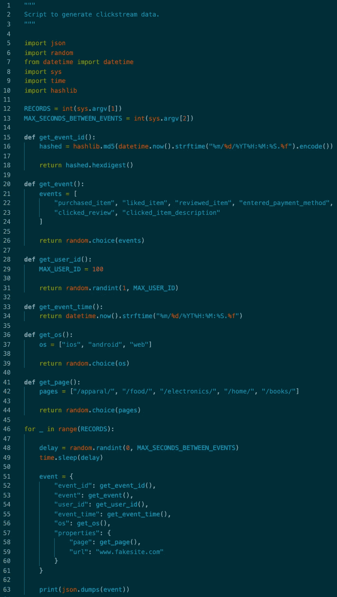

让我们详细介绍一下每个库。

*   **JSON** —该脚本生成的事件将被构造为 Python 字典。JSON 库有一个 dumps 方法，允许将 python 对象转换成等效的 JSON 对象。
*   **随机** —该库将增加生成事件之间的时间差异。此外，将为每个生成的事件随机选择事件描述、用户 Id、页面和操作系统的值。
*   **日期时间**—日期时间库将用于捕获事件创建时的时间戳。
*   这个库包含一个允许处理参数的方法。正如在需求部分提到的，您将需要向脚本提供一个时间间隔和记录计数。
*   **Time** —为了使该脚本不可预测，该库将允许在创建事件之间暂停。在随机模块的帮助下，该暂停的长度将被随机化。
*   Hashlib —每个事件都需要一个唯一的 Id。实现这个目标的一个快速方法是散列当前时间戳。我们如何知道事件之间的时间戳是唯一的？事件时间戳被记录到毫秒，而事件之间的暂停至少是一秒。

> **🚨真实世界警报🚨**
> 
> *在流处理中，每个事件通常包含三个时间戳。这个项目不需要这种复杂程度，但还是让我们仔细看看这些时间戳。*
> 
> *1。事件时间——创建事件的时间戳*
> 
> *2。摄取时间——流式处理捕获事件的时间戳*
> 
> *3。挂钟——流处理器处理事件的时间戳。*

至于脚本的其余部分，事件中的每个字段都有一个确定其值的函数。python 字典被迭代地实例化和填充，然后在每次迭代期间被转换成 JSON 以构造事件。

让我们测试一下这个脚本。要运行 10 条记录的脚本，事件之间的最大延迟为 2 秒，使用命令`python3 clickstream_generator.py 10 2`。


下一步是设置 kinesis 来接收这些事件消息。

# 基础设施

下图展示了支持点击流数据管道的整个基础设施。

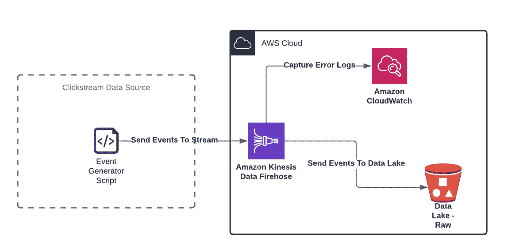

让我们回到我们虚构的场景，回忆一下我们的项目需求。摄取是要处理的第一个子任务。我们选择 Kinesis Firehose 是因为我们的目标是简单地将数据从源移动到目标，而不进行任何转换。对于这样一个简单的任务，Firehose 是一个显而易见的选择，因为它不会增加任何技术开销。没有什么需要管理的。所有资源(网络、计算、内存等。加载数据所需的)由 AWS 处理。这提供了我们想要的可伸缩性。

此外，我们可以假设我们的用户不需要实时数据。分析和数据科学团队可能有一些仪表板和分析需要近乎实时地刷新，但考虑到他们的需求，Firehose 带来的延迟是合理的(Firehose 可以在收到数据后 60 秒内将数据发送到 S3)。

将我们的关注点从接收转移到存储，我们选择将事件发送到数据湖(S3 桶的集合)。我们希望避免创建仅限于少数用例的数据系统。相反，将事件数据发送到湖中可以让我们的同事不受任何限制地进行自助服务(记住，出于安全原因，并非所有数据都会传递给我们的利益相关者)。任何人都可以使用数据湖，以他们需要的方式使用，数据工程团队的干预最少。

最后，请记住，数据是杂乱且不断变化的，我们需要监控。错误可能而且将会发生。我们有责任通过设置适当的日志来避免这些错误。CloudWatch 是一个简单的选择，因为它可以接收来自 Kinesis Firehose 的任何错误日志。

# 地形——作为代码的基础设施

到目前为止，我做过的最酷的事情是用几个终端命令在 AWS 上构建和破坏整个基础设施。所以，如果你是一名从事云计算的数据工程师，请花些时间学习 Terraform。

你不需要有任何使用 Terraform 的经验。我用来构建我们的管道的所有代码都将被解释到您应该能够理解的程度，但是我不会在本文中深入讨论 Terraform 的细节。

为此，您需要一个有效的 AWS 帐户和 IAM 用户的有效访问和密钥。您还需要安装 Terraform。

> ***🚨真实世界警报🚨***
> 
> *不同公司的数据工程角色大不相同。并非所有的数据工程师都专注于基础设施。后端团队成员做出数据平台决策的情况并不少见。出于这个原因，你可能不应该太关注 Terraform。相反，对云有一个高层次的理解，并更多地关注数据处理和转换的细节可能会更好地利用您的时间。*

# 项目结构

在您的项目目录中，创建另一个目录并将其命名为`infrastructure/`。在这个目录下，创建五个空的地形配置文件- `provider.tf`、`cloudwatch.tf`、`iam.tf`、`kinesis.tf`和`s3.tf`。

项目目录树应该如下所示。

```
|- clickstream-kinesis/
   |- clickstream_generator.py
   |- infrastructure/
      |- provider.tf
      |- s3.tf
      |- kinesis.tf
      |- iam.tf
      |- cloudwatch.tf
```

让我们仔细看看每个配置文件。

## provider.tf

我们将假设我们虚构的公司使用 AWS 来满足其云需求。

该配置用于将 AWS 指定为云提供商。我们还需要传入与 IAM 用户相关联的地区和凭证。这个动作让 Terraform 知道哪组资源可用于我们的项目。

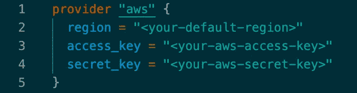

我希望将您的凭证以纯文本字符串的形式传递到这个文件中会引起一些关注。也就是说，只要代码不离开您的本地机器，这种配置就很好。

向 Terraform 传递您的 AWS 凭证有几种方法。我将提供一些有用的 Terraform 文档的链接，如果你打算公开你的代码(比如把它添加到 Github 仓库)，你应该遵循这些链接。

*   [环境变量](https://registry.terraform.io/providers/hashicorp/aws/latest/docs)
*   [AWS 凭证文件](https://registry.terraform.io/providers/hashicorp/aws/latest/docs)

**如果使用凭证文件进行身份验证，请按照这些[步骤](https://docs.aws.amazon.com/cli/latest/userguide/cli-configure-files.html)来配置您的 AWS CLI。

## s3.tf

对于本文，我们将把数据湖限制在两个 S3 桶。

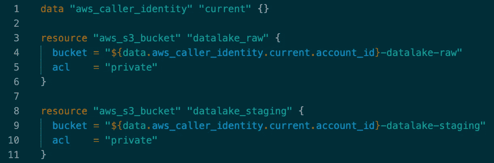

注意脚本中的两种类型的配置块— `data`和`resource`。

在这种情况下，我们使用数据块来获取特定于我们帐户的信息。因为在 AWS 帐户中，存储桶名称需要是唯一的，所以我们调用`aws_caller_identity`数据块来检索我们的帐户 ID，我们将它添加到两个存储桶的名称中。两个`aws_s3_bucket`资源块创建私有 S3 桶，一个用于存储原始数据，另一个用于存储转换后的数据。

请注意我们如何在 bucket name 参数中引用我们的帐户 ID。`aws_caller_identity`数据块包含许多我们可用的属性。我们使用`DATA.<DATA_RESOURCE_NAME>.<ATTRIBUTE>`语法来访问`account_id`属性。

## kinesis.tf

Kinesis 有相当多的参数需要考虑，但是，大多数参数对于这个项目的最低要求并不重要——将数据流入数据湖。在任何情况下，我都将介绍重要的部分，您应该可以轻松地复制和粘贴其余的部分(并在自己的时间里进一步研究这些高级参数)。

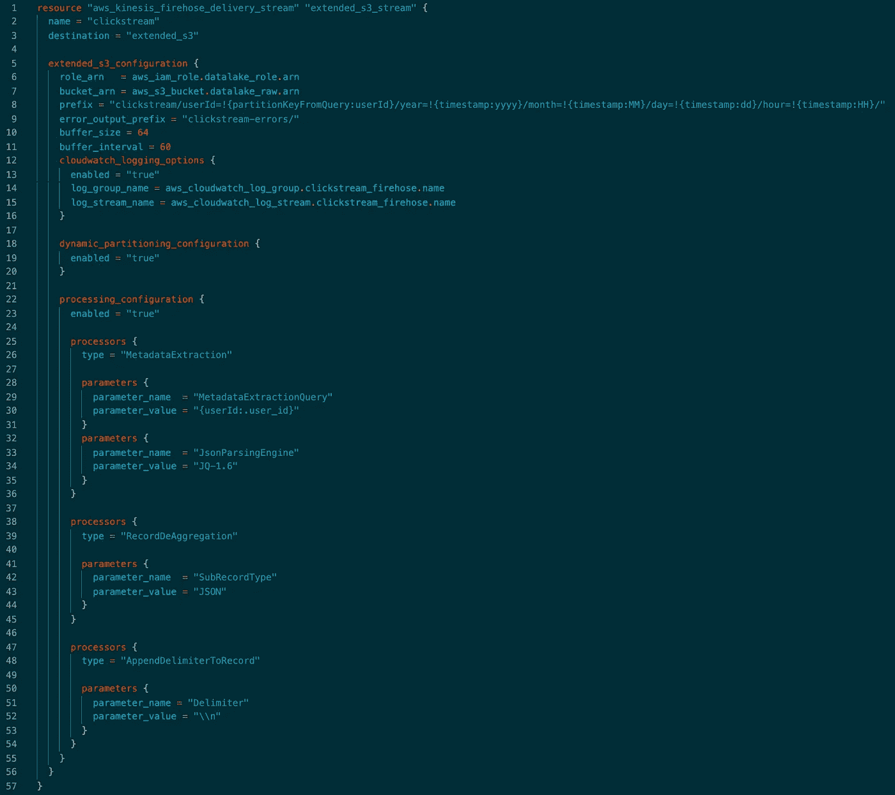

在分解上述代码之前，我们应该了解一下资源如何引用 Terraform 中的其他资源。

回想一下在`s3.tf`配置中我们命名为`datalake_raw`和`datalake_staging`的两个`aws_s3_bucket`资源(注意资源名和存储桶名之间的区别)。我们可以使用下面的语法`<RESOURCE>.<RESOURCE_NAME>.<PROPERTY>`访问一些特定于已创建资源的属性。例如，如果我们想要访问原始 bucket 的名称`<ACCOUNT_ID>-datalake-raw`，那么正确的语法应该是`aws_s3_bucket.datalake_raw.bucket`。这个值也可以通过封装在模板文字`"${aws_s3_bucket.datalake_raw.bucket}"`中在字符串中使用。

将焦点转移回运动形态。前几个参数命名我们的 firehose 流并指定一个目的地。S3 配置块告诉 Kinesis 向哪里发送数据，使用哪些权限，以及如何处理错误日志。

*有一些对 CloudWatch 资源的引用将在下一个配置文件中创建。

需要注意的两个重要参数是`buffer_size`和`buffer_interval`。Kinesis Firehose 会保持输入的数据流，直到满足这两个参数中的一个。给定我们的值，S3 将在我们的流大小达到 64MB 时或 60 秒后接收数据，以先到者为准。

此外，Kinesis 还对发送到 S3 的数据进行动态分区。这意味着我们通过从事件中选择一个键/字段来分组数据，从而控制数据在 S3 的分布。在这个配置中，选择用户 id 作为分区键，这意味着 ID 为 45 的用户将在 S3 拥有自己的“文件”路径— `s3://datalake_raw/clickstream/userId=45/...`。有了分区，我们避免了扫描大量文件来检索用户 id 为 45 的数据，相反，该用户所需的所有数据都存储在一个对象中。这个概念不仅可以扩展到单个用户，还可以扩展到其他分区键。

最后，处理配置允许我们在流上做一些光转换。`MetaDataExtraction`帮助解析用于分区的用户 ID，而`RecordDeAggregation`区分传入的记录。

与之前的两个参数相比,`AppendDelimiterRecord`更需要理解。出于某种原因，加入到 Kinesis 流中的事件被连接成一条连续的数据线。我不认为我必须解释为什么查询一行连续的数据是一个问题。这就是`AppendDelimiterRecord`处理器的用武之地。它在事件有效负载之间添加了一个换行符，使得事件之间的区别更加清晰。

## cloudwatch.tf

为了捕获错误日志，我们在 Cloudwatch 中创建一个日志组和日志流。

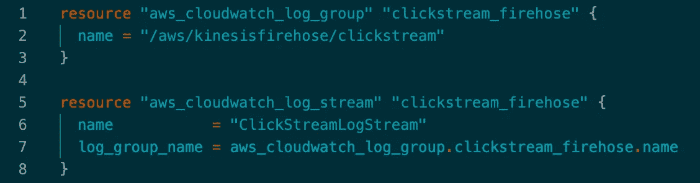

如果由于某种原因事件被发送到 Kinesis 而没有所需的分区键，就会发生错误。设置好一切后，您可以通过注释掉`clickstream_generator.py`脚本中的用户 ID 字段来模拟这种情况。

## iam.tf

Kinesis 将与 S3 和 Cloudwatch 互动。对于 S3，Kinesis 需要能够列出所需的桶，以及将对象加载到这些桶中。对于 Cloudwatch，Kinesis 需要访问以将事件添加到上一步中创建的日志组和流中。

为了实现这一点，我们创建了一个 Kinesis 可以承担的角色。我们把这个命名为`datalake_role`。

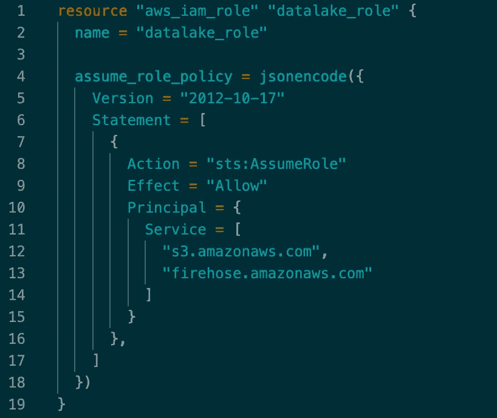

对于 S3，我们需要允许访问数据湖桶和该角色的对象的策略。


**在`aws_iam_policy`资源中引用 S3 存储桶资源告诉 Terraform，它需要在创建此策略之前创建 S3 存储桶。引用资源时总是如此。超级智能地形！

对于 Cloudwatch，我们创建了向日志组和流添加事件的策略。

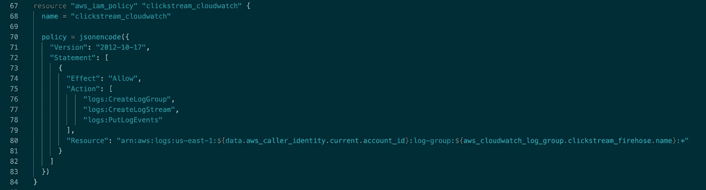

确保将您的 AWS 区域添加到策略定义中的资源参数中(第 80 行)。格式应该类似于`arn:aws:logs:<REGION>:<ACCOUNT_ID>:log-group:${aws_cloudwatch_log_group.clickstream_firehose.name}:*`。

最后，我们将所有策略附加到`datalake_role`上，并在 Kinesis 配置中使用这个角色。

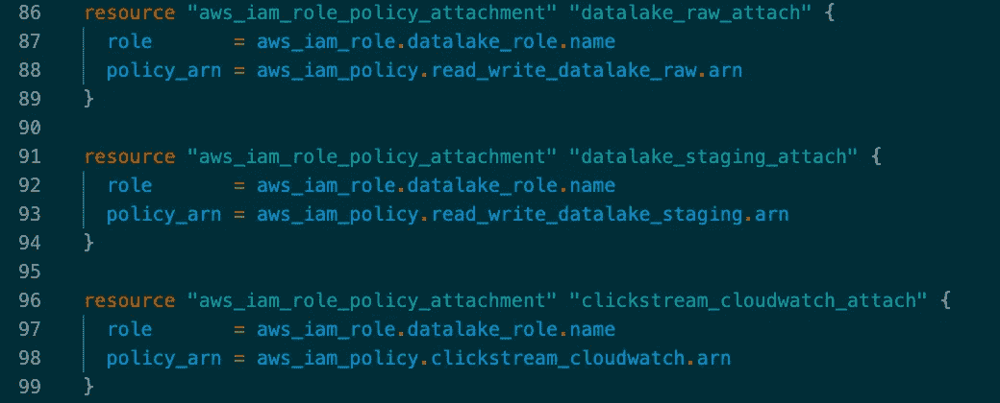

恭喜你！现在，您可以用几个命令创建一个完整的 AWS 基础设施。但是请耐心等待，在使用 Terraform 之前，我们必须对我们的脚本进行最后一次修改。

# 将 Boto3 添加到脚本中。

让我们回到我们的脚本，添加几行代码来与 Kinesis 通信。

从导入`boto3`库开始。

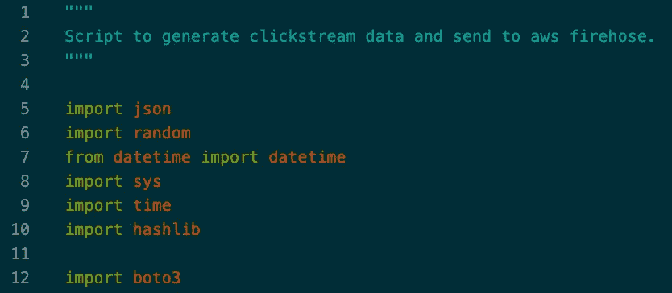

这个库需要安装，简单的`pip3 install boto3`就可以完成。

现在，对生成事件的循环做一些更改。

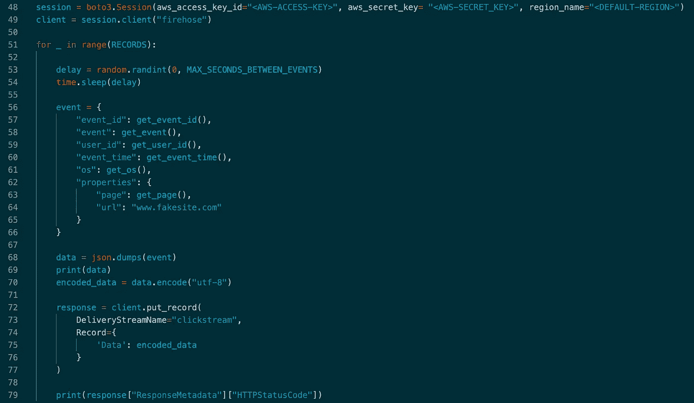

实例化`boto3.Session()`对象，并传入认证所需的参数。同样，这些代码对于本地工作来说很好，但是对于任何公共项目来说，请考虑使用环境变量或共享凭证。从会话对象中，我们创建一个客户机来访问我们的 Kinesis firehose 资源。在向 Kinesis 发送数据之前，必须首先对数据进行编码，这可以通过 JSON 转储中可用的 encode 方法轻松完成。最后，我们创建一个响应对象，将数据发送到`clickstream`交付流并返回一个`HTTPStatusCode`。

保存文件并返回到包含 Terraform 文件的目录。

# 地形命令。

## **地形初始化**

任何 Terraform 项目的第一步都是在包含配置文件的目录中运行`terraform init`命令。如果你一直遵循前面的步骤，这个目录是`clickstream-kinesis/infrastructure/`。


您可以多次运行这个命令，而不用担心会破坏任何东西。初始化 Terraform 后会创建一些新文件。您唯一需要担心的是`terraform.tfstate`，它存储了关于您的 Terraform 基础设施中资源的元数据。这就是 Terraform 知道管理哪些资源的方式。

* * terra form 状态文件不应公开。考虑将状态文件添加到您的`.gitignore`或存储在 S3，如这里[所述](https://www.terraform.io/language/settings/backends/s3)。此文件中可能有以纯文本形式存储的不应公开的敏感信息。

## 地形图

使用`terraform plan`输出 Terraform 计划对您的基础设施进行的更改。


检查这个输出，您将会看到一个创建我们在本文中使用的所有资源的计划。

## 地形应用

运行`terraform apply`执行提议的计划。系统将提示您确认资源的创建。输入“yes”并等待几分钟，让 Terraform 设置好一切。


导航到 AWS 控制台以检查资源。

两个 S3 存储桶都是按照预期创建和命名的。

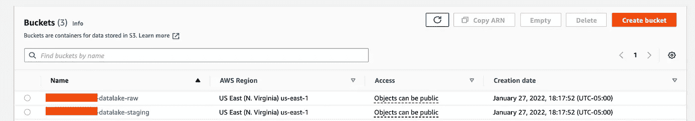

Kinesis 流正确地指向原始数据湖目的地。

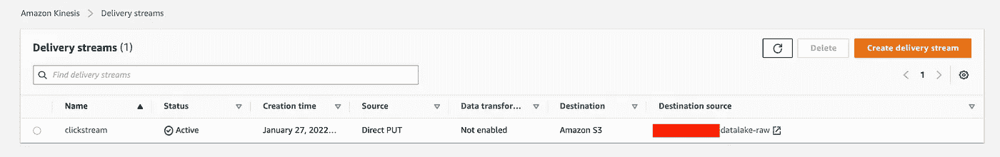

# 生成事件。

现在基础设施已经准备好了，是时候测试管道了。让我们生成 100 个事件，每个事件之间最多间隔 1 秒。


请注意终端输出中的 200 HTTP 响应代码，它表明记录已成功交付给 Kinesis。

让我们跳回控制台，看看 Kinesis 中的交付流指标。

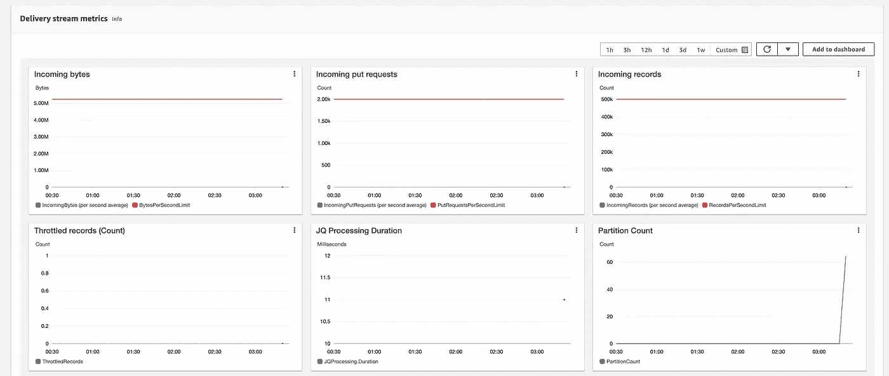

将鼠标悬停在蓝色数据点上，查看活动情况。分区计数显示了 100 个事件是如何分布的。在我的例子中，创建了 65 个分区，这意味着我的 100 条记录由 65 个不同的用户组成，并且相应地创建了 S3 对象。

转到 S3，我们可以确认对象是根据用户 ID 进行分区的。

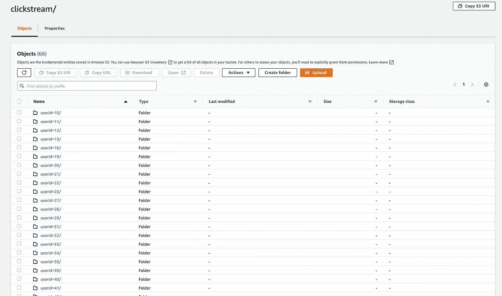

同样，如果我们的任何下游用户需要查询特定(或子集)用户 id 的数据，以这种方式划分数据将避免扫描大量文件。

最后，下载这些对象中的一个，验证每条记录是否由换行符分隔。

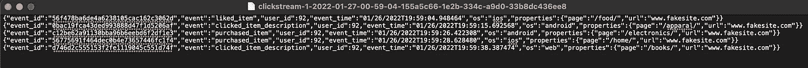

正如所料，每一行都是一个 JSON 对象，代表一个不同的记录。这种格式很容易被 Spark、Pandas 或像雪花这样的现代数据仓库解析。

太好了！我们的流媒体管道已经建立并开始运行。我们可以从脚本中生成尽可能多的事件，并根据需要近乎实时地填充我们的数据湖。

# 产生错误事件。

我前面提到过，如果出于某种原因，事件缺少用于分区的用户 ID 字段，就会发生数据传递错误，这些事件将永远不会到达我们的数据湖。为了解决这个问题，我们设置了 CloudWatch 日志来捕获这些错误。让我们模拟一个错误事件，并检查我们的系统如何处理它。

回到`clickstream_generator.py`脚本，注释掉事件对象中的`user_id`属性。

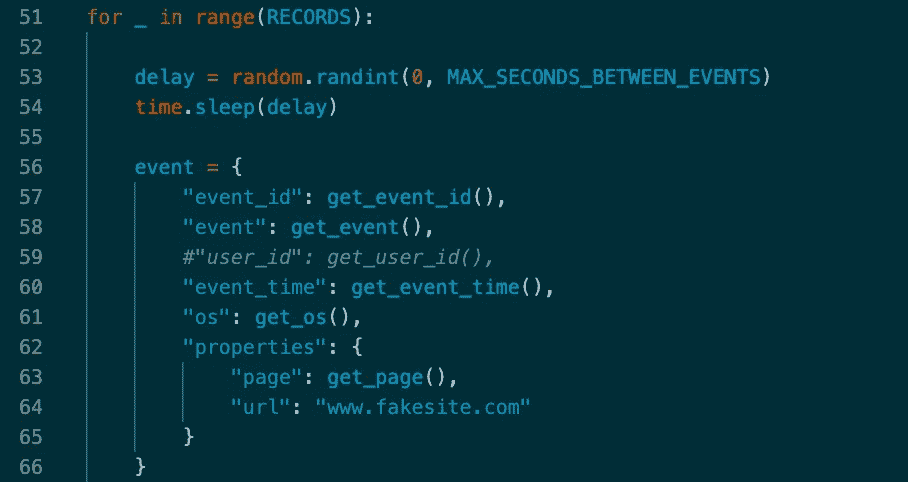

重新运行脚本，但这次创建单个事件(如果您愿意，也可以创建多个事件)。您仍然应该看到一个 200 响应，因为向 Kinesis 的交付将正常工作，但是，一旦数据被发送到 S3，就会出现错误。

回到 AWS 控制台，前往 CloudWatch。搜索`aws/kinesisfirehose/clickstream`日志组，点击您通过 Terraform 创建的`ClickStreamLogStream`日志流。大约 5 分钟后，CloudWatch 中应该会记录并显示一个错误。

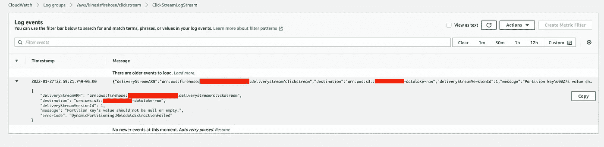

该错误与预期一致—“分区键的值不应为 null 或空”。

我们可以检查 S3，以确认我们在 Terraform 中包含的错误日志记录配置正在工作。

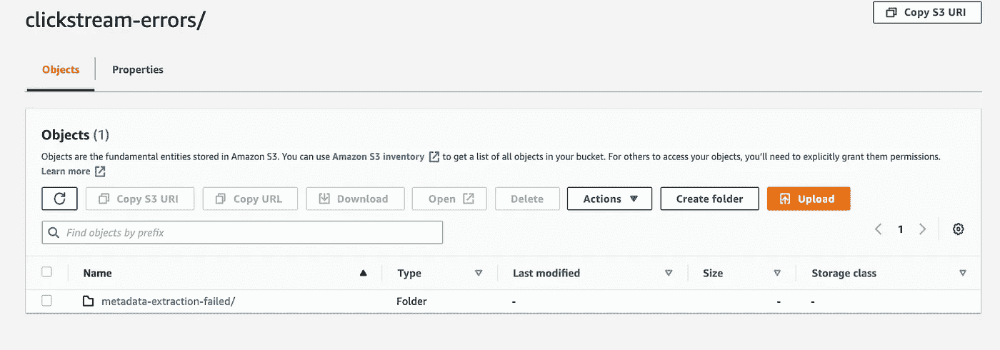

完美！另一个对象——`clickstream-errors/...`——是在我们的原始数据湖中创建的，用来捕获这些错误的记录。

# 将（行星）地球化（以适合人类居住）...摧毁！

这是这个项目中我最喜欢的部分。

在我们用一个命令摧毁整个基础设施之前，我们必须清空我们的水桶。S3 在尝试删除非空桶时会产生一个错误。转到`<ACCOUNT_ID>-datalake-raw`桶，删除`clickstream/`和`clickstream-errors/`对象。抛开其他一切，回到你的终端。

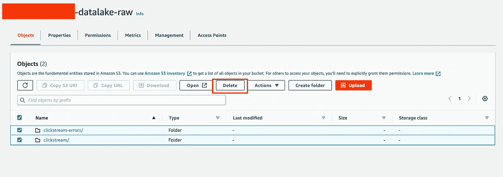

导航到`infrastructure/`目录并输入`terraform destroy`。当要求确认时，输入“是”。

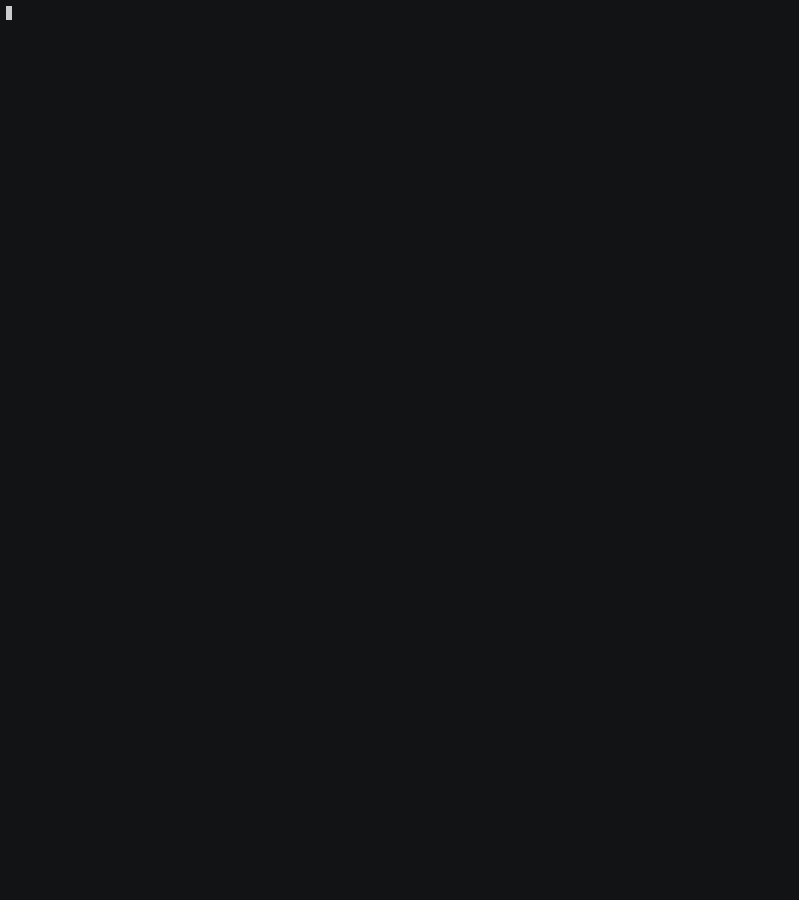

在 AWS 控制台中，您应该找不到管道的踪迹。没有 IAM 角色或策略，没有 S3 桶，没有错误日志，也没有 Kinesis。

# 包裹

我们将需求分成三个不同的部分——摄取、存储和消费。这提供了一个超出点击流管道的框架。专注于这些领域的工程师现在有了一种模式，可以遵循每一个需要整合到数据平台中的额外项目。我们越标准化，规模就越大。

尽管这篇文章很长，但仍有许多工作要做。

如果您已经跟随了，我建议您保存您的代码。在以后的文章中，我们将添加以下内容。

*   使用 AWS Lake Formation 对原始存储桶和暂存存储桶实施访问控制。在现实世界中，原始存储桶将包含并非每个人都可以访问的敏感数据(例如，SSN、银行信息等)。)
*   转换我们的原始事件，并将输出发送到暂存桶。我们可以通过 AWS Glue 或 EMR 使用 Spark 来实现这一点。
*   为需要实时数据的用例设置 Kinesis 数据流(不同于 Kinesis Firehose)。
*   扩展我们的数据湖，以接收来自 OLTP 和第三方 API 等不同来源的数据。

提醒一下，接下来几篇文章的目标是构建一个完整的数据平台。因此，它们会比通常的阅读时间更长，但希望内容丰富。

查看这个项目的 [Github 库](https://github.com/jduran9987/data-platform)。请记住，随着我添加更多的来源和管道，这个回购将随着时间的推移而演变。

如果任何人对这个项目有任何问题，我的猜测是它与 AWS 认证有关，我很乐意帮忙。联系我的最好方式是通过[推特](https://twitter.com/jduran9987)。

感谢阅读并期待下一篇文章。

[](/mlearning-ai/mlearning-ai-submission-suggestions-b51e2b130bfb) [## Mlearning.ai 提交建议

### 如何成为 Mlearning.ai 上的作家

medium.com](/mlearning-ai/mlearning-ai-submission-suggestions-b51e2b130bfb)