# Instacart 市场篮分析

> 原文：<https://medium.com/mlearning-ai/instacart-market-basket-analysis-a726bb56d62?source=collection_archive---------4----------------------->

*用户在下一个订单中会对之前订购的哪些产品* ***再订购*** *？*

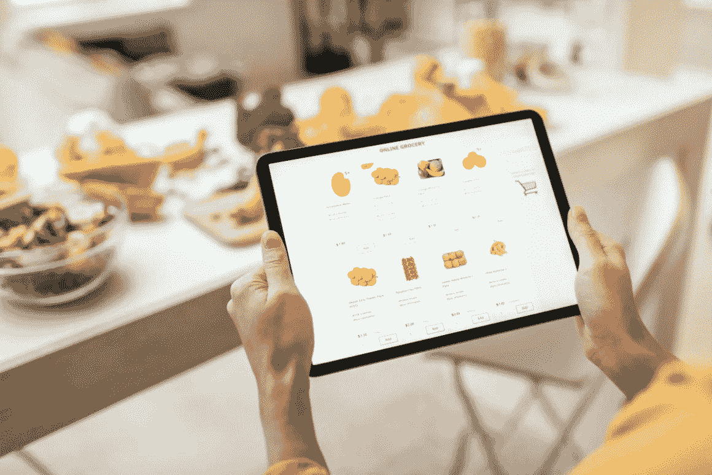

Source: EnvatoElements/RossHelen

# 问题描述:

Instacart 是一款杂货订购和交付应用程序，允许客户在其应用程序或网站上选择产品，个人购物者通过店内购物挑选这些产品并交付订单。在这场 Kaggle 比赛中，Instacart 向机器学习从业者提供了他们的匿名数据，旨在建立最佳机器学习模型来分析客户的再订购模式，并根据客户之前的购物数据预测客户可以再订购哪些产品。

杂货包括日常必需品、食品、护肤品和更多更有可能被重新订购的商品。这种重新排序行为在与日常必需品、食品等产品相关的每个人中都很常见，并且可能与其他产品不同。即使每个人都需要一些共同类型的产品，选择也因品牌和其他因素而不同。例如，每个人都需要洗发水，但他们使用哪种洗发水取决于顾客的兴趣。客户选择的产品将取决于他们的品味、文化多样性、生活方式和其他因素。但是这种订购模式可以通过客户在一段时间内所下的大量订单来分析。

这里的业务需求是预测哪些以前购买的产品将出现在客户的下一个订单中。这个模型应该使用匿名数据开发，这些数据包含 Instacart 开源的数百万条记录。这改善了用户体验以及 Instacart 的业务。这不同于常规的推荐系统问题。该任务不涉及冷启动问题，即我们的目标是预测**用户是否会再次订购**之前购买的特定产品。此任务不期望向客户推荐新产品。

# 数据集分析:

可用的数据集是一组描述客户订单的相关文件。

1.  **aisles.csv** :这个 csv 文件有两个字段，aisle_id 和 aisle name。
2.  **departments.csv:** 一个部门有多个过道。这个 csv 文件有两个字段，部门标识和部门名称。
3.  **orders.csv:** 这个 csv 文件包含一段时间内客户订单的信息。这有七个字段，order_id(订单的唯一 id)、user_id(下订单的用户的唯一 id)、eval_set(记录是否属于先前、训练或测试集)、order_number、order_dow(星期几)、order_hour_of_day、days_since_prior_order。Instacart 为每个用户提供了 4 到 100 个订单。
4.  **products.csv:** 这个 csv 文件有四个字段。product_id(产品的唯一 id)、product_name、aisle_id(该产品可用的通道 id)、department_id(该产品可用的部门 id)。
5.  **Order _ products _ _ prior . csv:**这个 CSV 文件有用户以前的订单记录(除了最近的)。订单文件中的 eval_set=prior 意味着它属于这个先前的文件。这个文件有四个字段，order_id，product_id，add_to_cart_order，redordered(0 =新订购的产品，1 =以前订购的产品)。
6.  **order _ products _ _ train . csv:**该 CSV 文件记录了用户最近的订单。订单文件中的 eval_set=train 意味着它属于该 train 文件。此处的字段与 Order_products__prior 相同。

***该数据集没有关于订购产品数量的信息。***

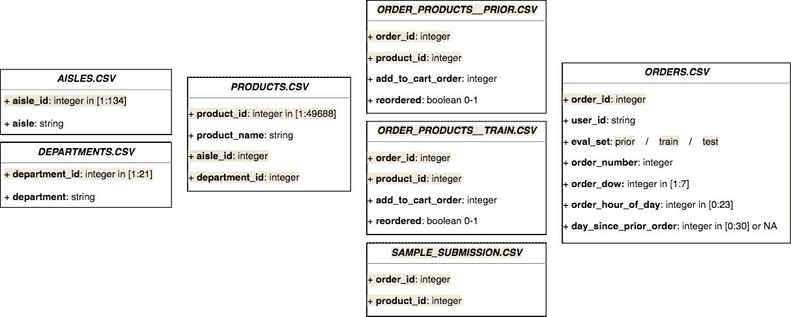

This image convey relation between datasets. source: [https://www.kaggle.com/c/instacart-market-basket-analysis/discussion/33128](https://www.kaggle.com/c/instacart-market-basket-analysis/discussion/33128)

# 机器学习的问题公式化；

在 order_prior__train 中，我们有每个用户最近订单的记录。使用关系表，我们可以获取订购了具有 order_id 的产品的 user_id，并且我们可以以这样的方式制定，即我们拥有 user_id、product_id 和 ordered。

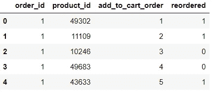

**to**

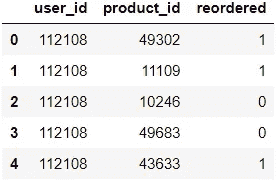

fetched user_id using order_id

这里，ordered=1 表示这是用户以前订购的产品，ordered=0 表示这是用户第一次订购的产品。

但是这个竞赛的任务是预测客户的下一个订单中会出现哪些以前购买过的产品。对于这个问题，我们不应该考虑新订购的产品。因此，我们可以删除 reordered = 0 的记录，并从 order _ products _ _ prior 中获取每个用户在最近订单(order_products__train)中没有订购的产品，并将它们标记为 0。

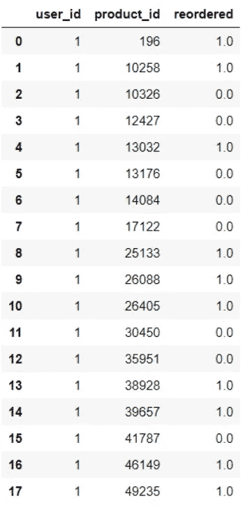

formulation for ML problem

上图说明了我是如何为 ML 建模制定数据的。这是 user_id=1 的最近顺序的数据。到目前为止，该用户订购了 18 种独特的产品(之前),其中他/她在最近的订单中重新订购了 10 种产品。这里，重新订购=1 意味着用户**在最近的订单中重新购买了之前订购的产品**，重新订购=0 意味着用户**没有在最近的订单中重新购买之前订购的产品**。现在，我们可以从先前的数据中提取用户相关特征、产品相关特征、用户-产品交互特征、时间相关特征等等，并使用重新排序作为类别标签来构建 ML 模型。

***这是一个二元分类问题，数据高度不平衡。***

# 绩效指标:

**平均 f1 分数**是根据 Kaggle 竞赛的性能指标，但考虑到现实世界的情况**,“1 =将重新排序”**的 F1 分数是应特别评估模型的性能指标。更进一步，对'**的回忆会重新排序**'可以给出观察结果。

# 探索性数据分析:

***都是质疑。***

1.  **有多少订单没有再订购的产品？**

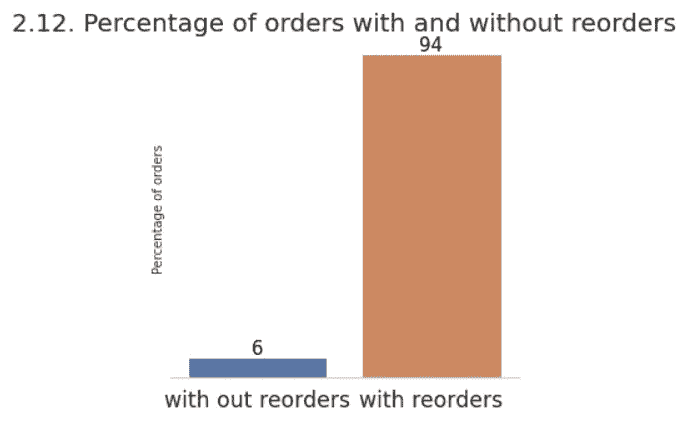

我们可以观察到，大多数订单包含用户以前购买的产品。

**2。哪些部门的再订购率较高？**

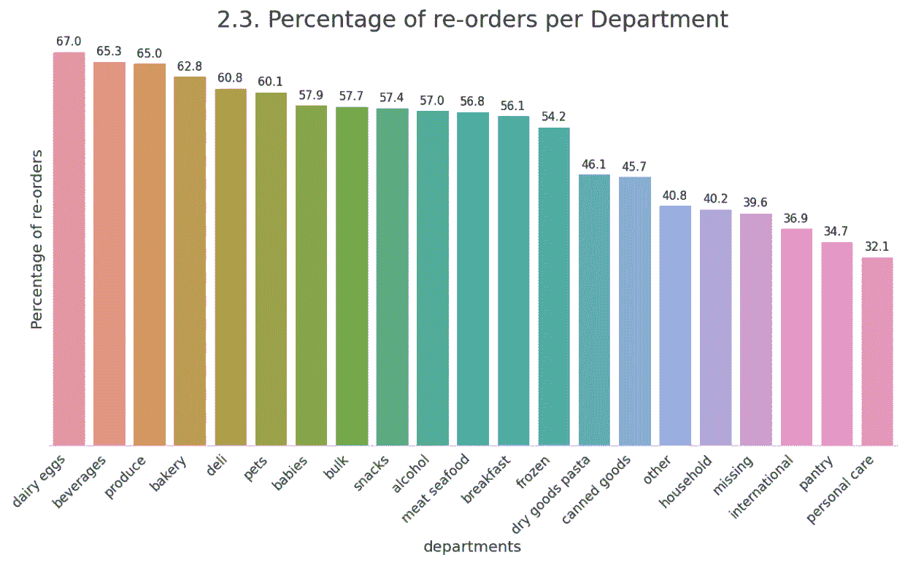

**3。订购最多的前 20 种产品是什么？**

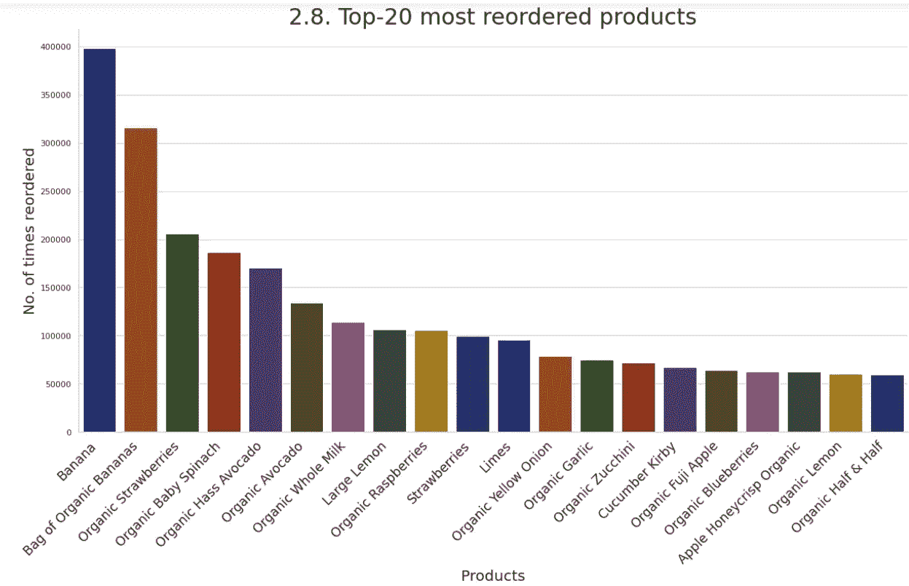

水果和蔬菜，尤其是“有机”显示出完全的优势。

**4。一周中的哪几天订购和再订购的产品数量最多？**

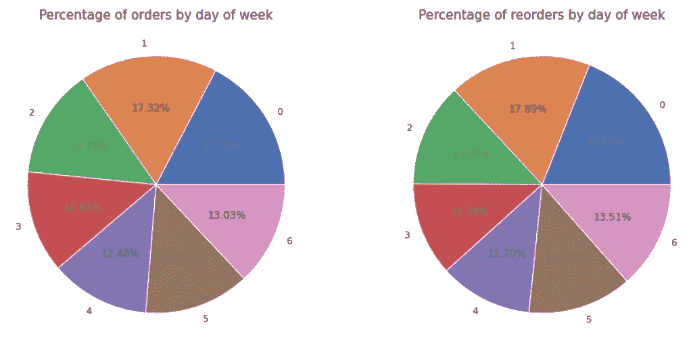

肉和酒精有什么不同吗？

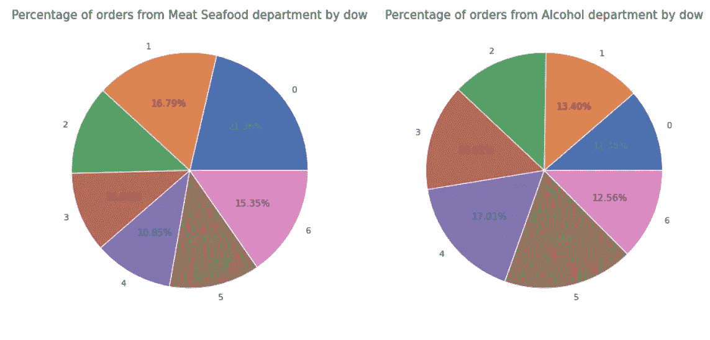

在一周的第 0 天和第 1 天下的订单数量较高，在再订购的百分比中也观察到了同样的情况。但是酒精产品在一周的第 4 天和第 5 天被订购的最多。可能是因为周末快到了。

**5。每个用户订购了多少独特的产品？**

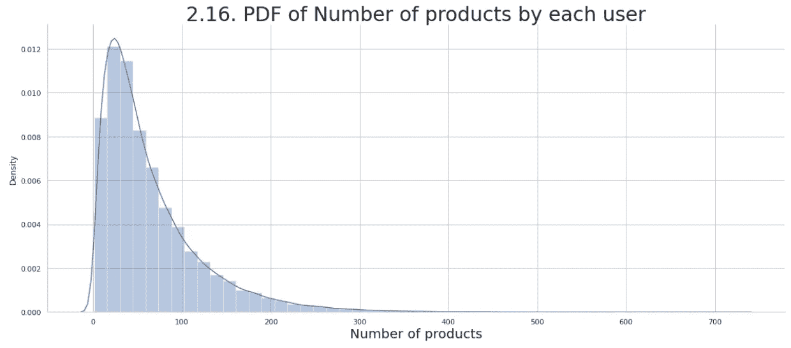

这看起来像表现出对数正态行为。是吗？

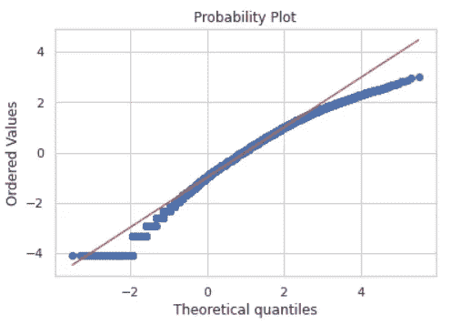

是的，在某种程度上。

**6。没有再订购产品的订单(无订单)之间的订单差距有多大？**

在用户最后一次订购后一个月，订购了大量新订购的产品(无再订购)。

那再订购产品的订单怎么办？

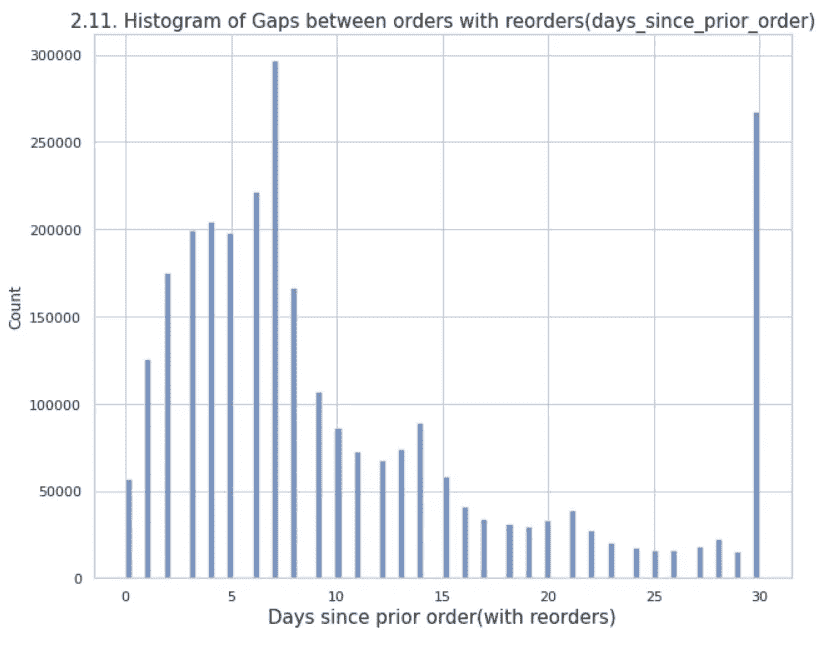

周订单重要性增加，其次是月订单。

***深入 EDA 可以在我的 Github 资源库中探索。我进一步探讨了关于某些部门的星期几和一天中的小时之间的关系、部门和每月、每周订单之间的关系等等。***

# 特色化:

我从第二名获奖者的博客中实现了一些最重要的功能，当然它们工作得很好。

可以查看:[https://medium . com/ka ggle-blog/insta cart-market-basket-analysis-feda 2700 cded](/kaggle-blog/instacart-market-basket-analysis-feda2700cded)

我将只展示那些我额外开发的功能。

## 1.通过奇异值分解(SVD)使用矢量表示的基于余弦相似性的特征:

使用 SVD，我获得了每个用户和产品的向量表示，使用用户购买产品的次数作为邻接矩阵中的交互元素。在将每个向量转换成单位向量(除以大小——余弦相似性)后，我计算了某个用户以前购买的特定产品与该用户订购最多的前 3 个产品的余弦相似性。利用这一点，我开发了三个特征，前三个相似性的最大值、前三个相似性的总和以及前三个相似性的乘积。

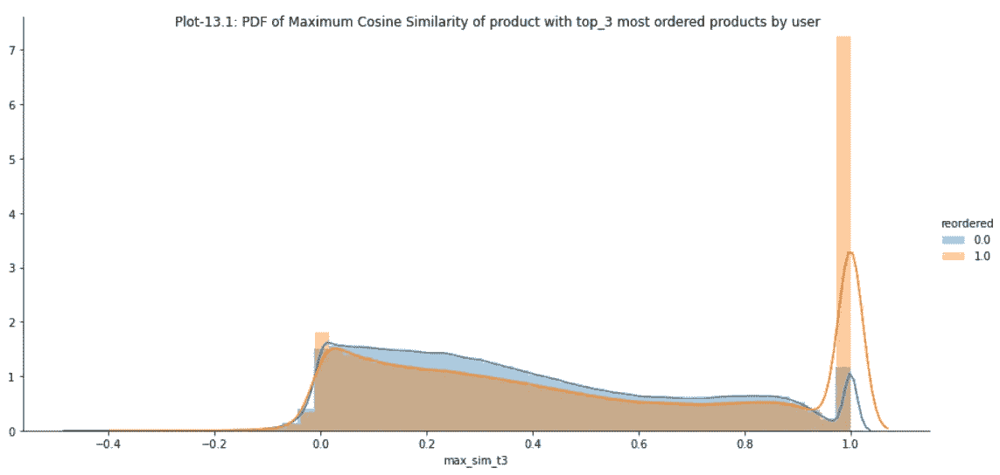

在这里，我们可以观察到，对于最大相似度=1 的数据点(即，用户订购最多的前 3 个产品中的产品)，重新排序的次数更多。

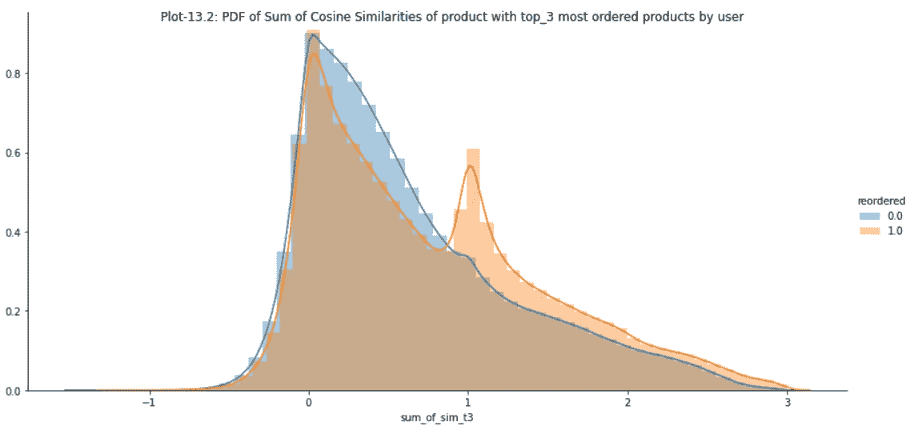

重新排序的数量在前 3 个相似性之和等于 1 时达到峰值，并且优势持续到更高的值。

## 2.产品的平均订购次数:

当特定产品被更少数量的独立用户订购更多次数时，产品的平均订购次数将会更多。通过这种方式，可以识别由特定人群订购的产品(例如，与宠物相关的产品不会被所有人订购)。

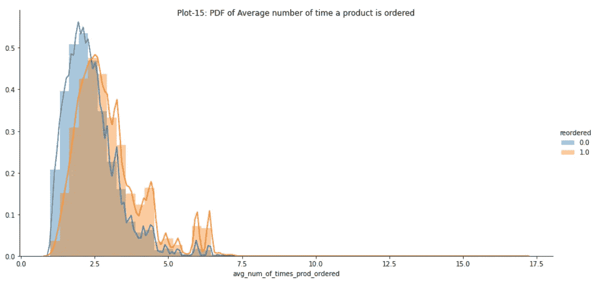

随着平均值的增加，再订购的优势也增加了。

## 3.首次购买该产品后的用户-产品订单比率:

让用户 A 下了 100 个订单，从第 51 个订单开始，用户购买了产品 A 30 次。现在，当我们计算用户订购产品 A 的次数比率时，我们得到 30/100=0.3。但是我们可以观察到，用户 A 是最近订单中频繁购买的产品 A。因此，这个特性捕获了关于用户 A 在第一次购买产品后购买了多少次的比率的信息(30/50=0.6)。我为最近的 5 个订单以及每个用户的所有订单开发了这个。

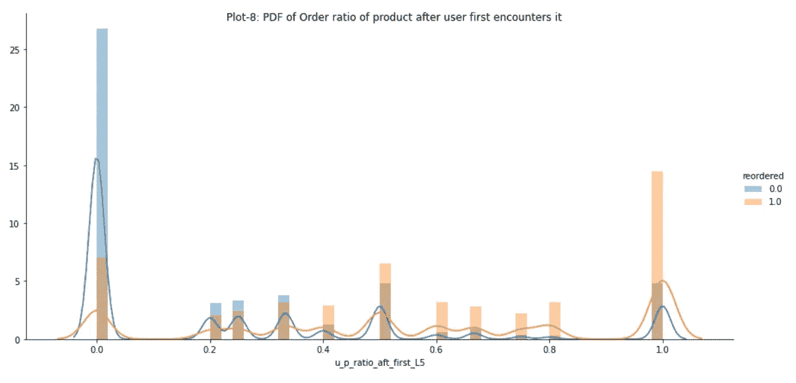

for recent 5 orders of every user

for all prior orders of every user

为了探索我开发的其他功能，我详细解释了每个功能，并记录了如何开发这些功能的说明。我总共开发了 30 个功能，这些功能基于用户订购特定产品、与用户相关的功能、与产品相关的功能以及更多用户-产品交互功能之间差距的统计测量。

# 最佳模特:

## 1.XGBClassifier:

**超参数** : n_estimators=1000，max_depth=3

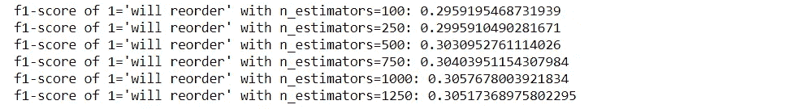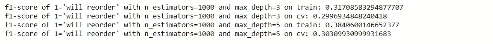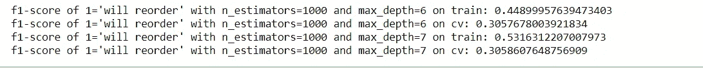

随着基础学习者数量的增加，xgb 分类器往往会过度适应。在 n_estimators(基础学习者的数量)=1000 和 max_depth(每个基础学习者的最大深度)=3 的情况下，没有观察到过度拟合。

决定类标签被调整的概率阈值。

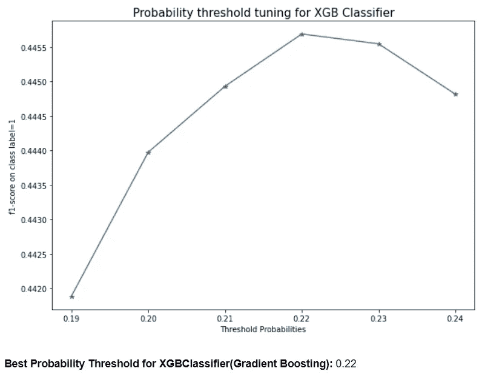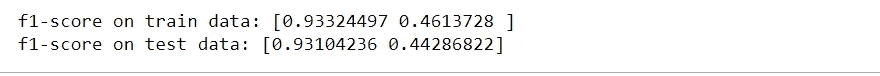

Confusion, Precision, Recall matrices

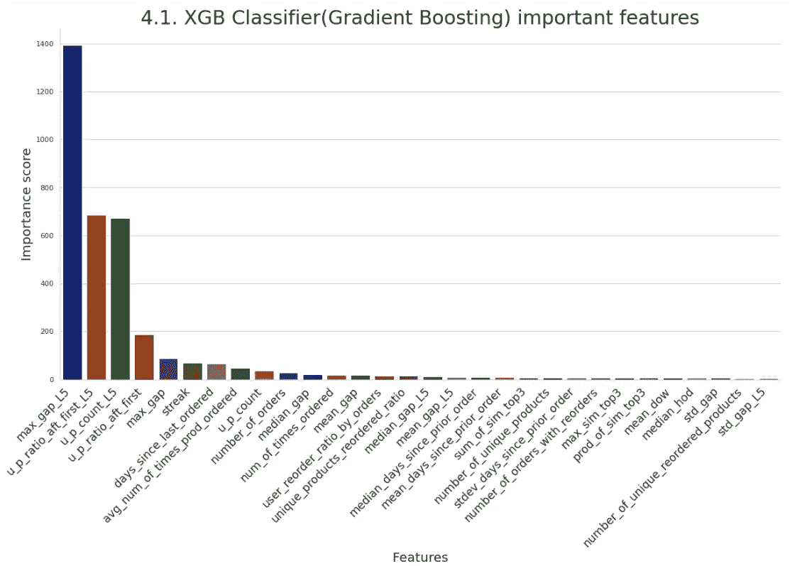

**使用 XGBClassifier 的 Kaggle 评分:**

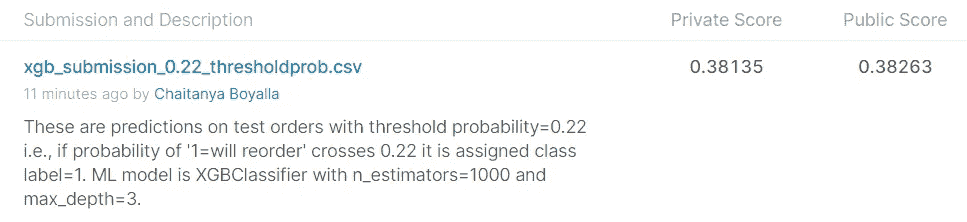

## 2.具有平衡类权重的随机森林分类器；

**超参数** : n_estimators=1000，max_depth=12

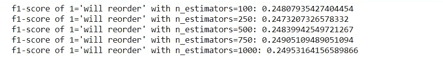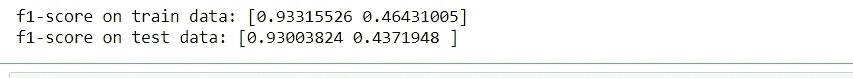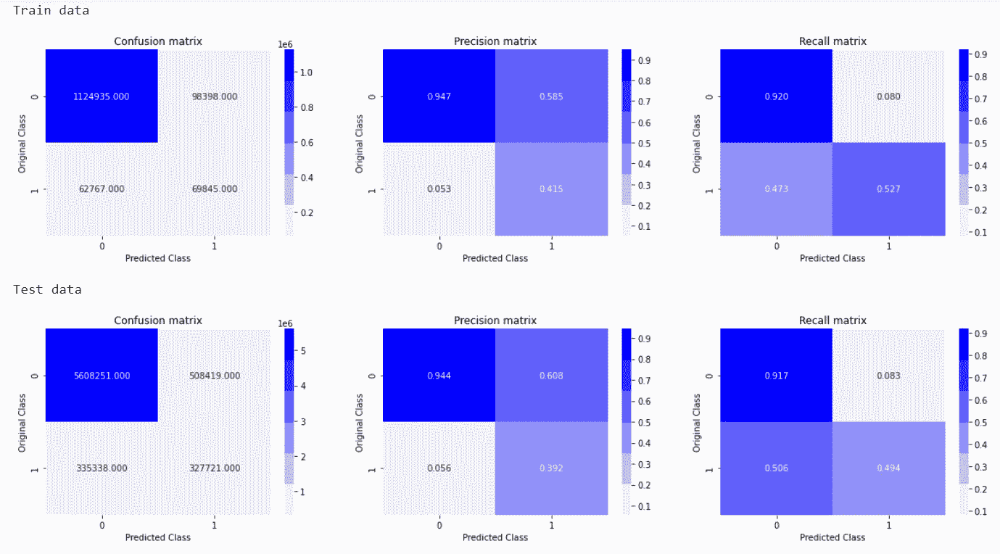

Confusion, Precision and Recall matrices

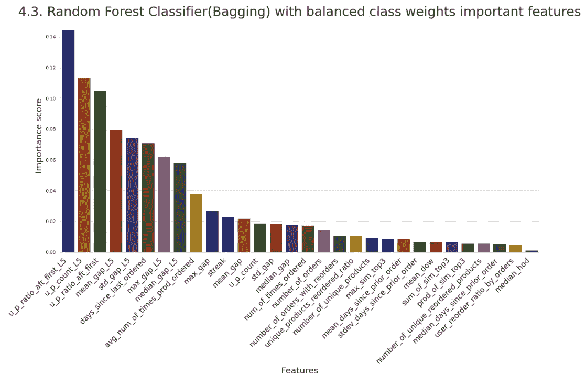

**使用具有平衡类权重的随机森林的 Kaggle 分数:**

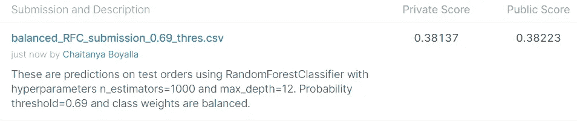

***XGB 和随机森林的得分几乎相似，但随机森林预测的概率阈值更高(0.69)。***

# 所有车型的 Kaggle 排名:

***由于有限的计算能力和巨大的数据量，我对 ML 模型进行的所有超参数调整仅使用了大约 20%的数据。如果使用大量数据和调整其他超参数如学习速率、正则化强度等进一步调整。，分数可以进一步提高。***

**浏览我的 Github 存储库，探索我调优和使用的模型。我还开发了“深度神经网络”。**

# 未来工作:

*   **‘购物篮分析’**是数据挖掘的一个概念。可以开发和检查基于此概念的功能。
*   并且如上所述，如果计算能力支持，可以使用更大量的数据来执行进一步的超参数调整。
*   **支持向量机(SVM)** 如果要使用的正确内核是已知的，可以尝试。
*   此外，可以使用不同的优化器开发更深层次的神经网络。到目前为止，我在深度学习模型中只使用了**亚当**。

# 参考资料:

*   **冠军访谈:第二名，友川翁德拉:**[**https://medium . com/ka ggle-blog/insta cart-market-basket-analysis-feda 2700 cded**](/kaggle-blog/instacart-market-basket-analysis-feda2700cded)
*   [**https://www.appliedaicourse.com/**](https://www.appliedaicourse.com/)
*   [**https://maielld1.github.io/posts/2017/08/Instacart-Kaggle**](https://maielld1.github.io/posts/2017/08/Instacart-Kaggle)
*   **ML—insta cart F1 0.38—第二部分；XGBoost+F1 Max:**[**https://www . ka ggle . com/Koko vidis/ml-insta cart-F1-0-38-part-two-XGBoost-F1-Max**](https://www.kaggle.com/kokovidis/ml-instacart-f1-0-38-part-two-xgboost-f1-max)
*   **购物篮分析-关联规则简介:**[**https://towardsdatascience . com/A-Gentle-Introduction-on-Market-Basket-Analysis-Association-Rules-fa 4b 986 a4ce**](https://towardsdatascience.com/a-gentle-introduction-on-market-basket-analysis-association-rules-fa4b986a40ce)

***Github 资源库:***[https://Github . com/Chaitanya-Boyalla/insta cart-Market-Basket-Analysis](https://github.com/Chaitanya-Boyalla/Instacart-Market-Basket-Analysis)

***领英:***[www.linkedin.com/in/chaitanya-boyalla-23051998](http://www.linkedin.com/in/chaitanya-boyalla-23051998)

***邮箱:***chaitanya.boyalla@gmail.com