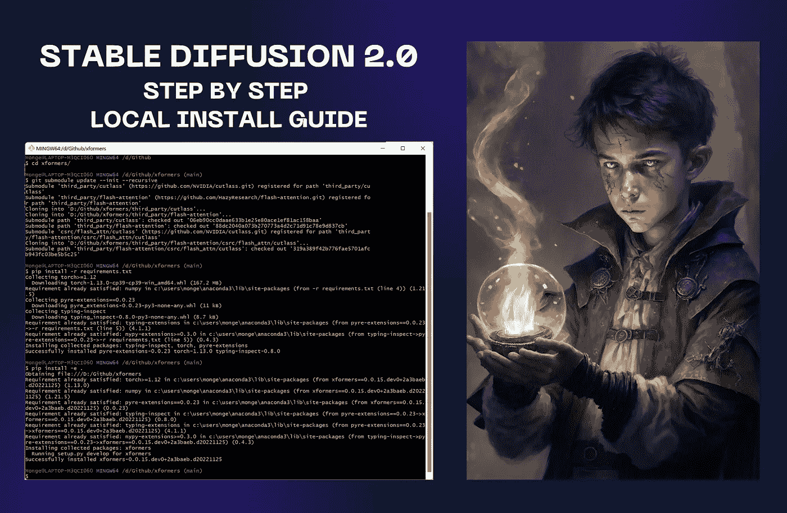

# 如何在您的本地 PC 上运行稳定的扩散 2.0—无代码指南

> 原文：<https://medium.com/mlearning-ai/install-and-run-stable-diffusion-2-0-on-your-local-pc-no-code-guide-7e6270aaa9e?source=collection_archive---------0----------------------->

Cover by [Jim Clyde Monge](https://medium.com/u/819323b399ac?source=post_page-----7e6270aaa9e--------------------------------). AI image by [Kethran](https://www.midjourney.com/app/feed/117745702926417923/)

S 新版本带来了前一版本的许多改进和提高。OpenCLIP 中新的深度检测和更好的文本到图像模型是我最感兴趣的功能。