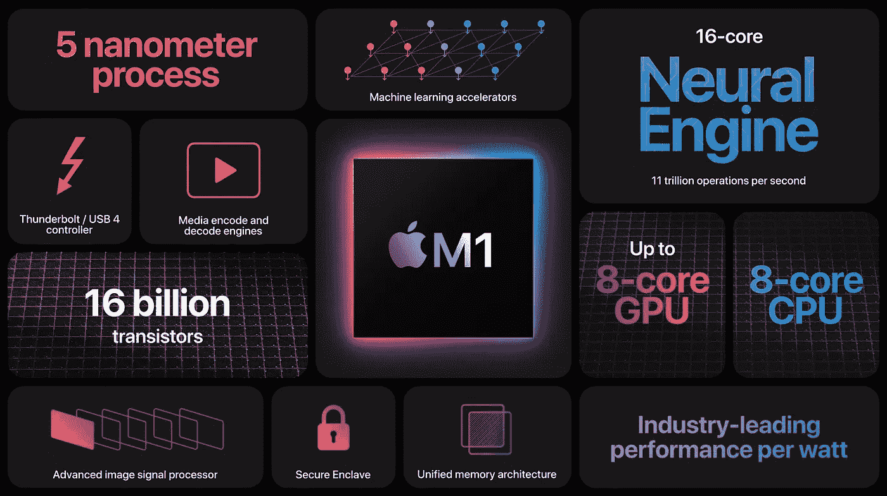

# 在支持 GPU 的 Mac M1/M2 上安装 TensorFlow

> 原文：<https://medium.com/mlearning-ai/install-tensorflow-on-mac-m1-m2-with-gpu-support-c404c6cfb580?source=collection_archive---------0----------------------->

借助 GPU 支持，只需几个步骤即可在 Mac M1/M2 上安装 TensorFlow，并受益于全新 Mac ARM64 架构的原生性能。

Fig 01: Apple M1 (image by Apple)

# 为什么要用 Mac M1/M2 进行数据科学和深度学习？

让 MAC M1 和新 M2 脱颖而出的不仅是它们出色的性能，还有极低的功耗…