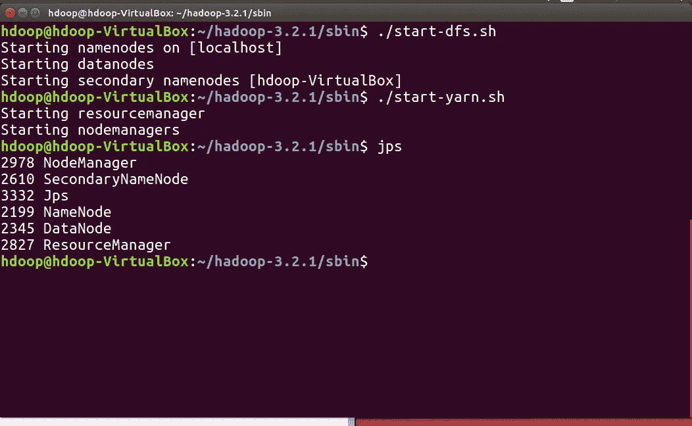
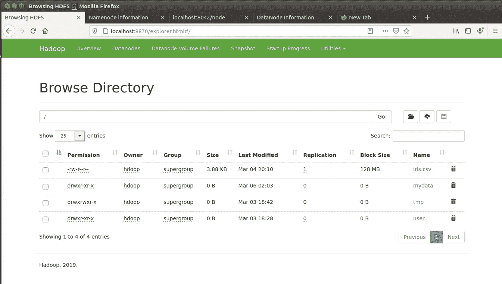
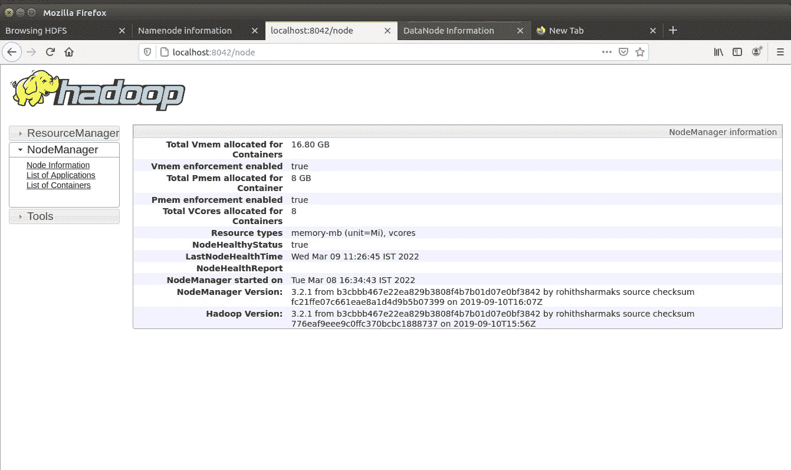
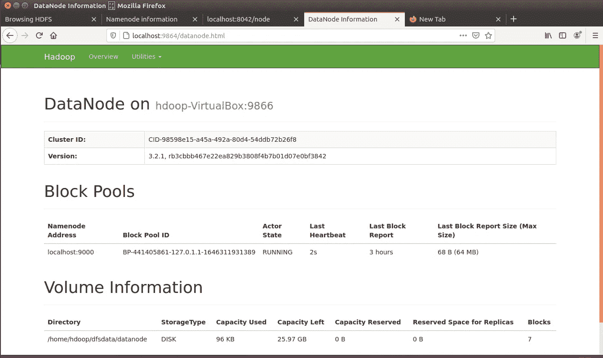

# 在 Ubuntu 上安装 Apache Hadoop 3.2.1

> 原文：<https://medium.com/mlearning-ai/installation-of-apache-hadoop-3-2-1-on-ubuntu-67073ce208d7?source=collection_archive---------0----------------------->

嘿伙计们，

在之前的文章(Hadoop 第 1-4 部分介绍)中，我已经讨论了 Hadoop 和 Hadoop echo 系统，以便对 Hadoop 分布式计算环境有一个初步的了解。在本文中，我将解释 Hadoop 3.2.1 在 Ubuntu 16.4 上的安装过程(一步一步)。因此，如果您对使用 Hadoop 集群感到兴奋，或者对了解 Hadoop 的安装过程感兴趣，那么这篇文章就是为您准备的。

我们将看到，如何在独立模式下逐步安装 Apache Hadoop 3.2.1。但是在安装 Hadoop 之前，我们将讨论安装 Hadoop 的先决条件。

安装 Ubuntu 16.04 或更高版本(首选)。

创建一个用户名和密码，用 sudo 或 root 权限登录到 ubuntu 的命令行，我已经用**h OOP 用户**登录到 Ubuntu。

要更新系统，请运行以下命令(此处$表示 Ubuntu 命令行提示符):

$ sudo apt 更新

要检查 java 版本并确认 java 版本，请运行以下命令

$ java 版本

如果 java 版本低于 1.8，请安装 java 1.8 或更高版本。要安装 java 1.8，请运行以下命令:

$ sudo 安装 openjdk-8-jdk -y

ssh 命令通过不安全的网络在两台主机之间提供安全的加密连接。要在 Ubuntu 上安装 OpenSSH，请运行以下命令:

$ sudo 安装 openssh-server openssh-client -y

要在 Hadoop 环境中添加用户，请运行以下命令:

$ sudo adduser hdoop

向添加的用户提供 sudo 权限

$ su—h OOP

它会提示输入密码，所以输入密码。

要验证当前登录，请运行以下命令:

$ whoami

要为 Hdoop 用户配置无密码 SSH 并创建公钥/私钥对，请运行以下命令:

$ ssh-keygen -t rsa -P '' -f ~/。ssh/id_rsa

要将 id_rsa.pub 中的公钥复制到 authorized_keys，请运行以下命令:

$猫~/。ssh/id _ RSA . pub > > ~ ~/。ssh/授权密钥

要将权限更改为 hdoop user，请运行 chmod 命令:

$ chmod 0600 ~/。ssh/授权密钥

要使用 hdoop user to SSH to localhost 来验证 localhost 设置是否正确，请运行以下命令:

$ ssh 本地主机

要下载 Apache Hadoop-3.2.1 和 untar Hadoop，请运行以下命令:

$ wget[https://archive . Apache . org/dist/Hadoop/common/Hadoop-3 . 2 . 1/Hadoop-3 . 2 . 1 . tar . gz](https://archive.apache.org/dist/hadoop/common/hadoop-3.2.1/hadoop-3.2.1.tar.gz)

$ tar xzf hadoop-3.2.1.tar.gz

要在独立/单节点/伪分布式模式下设置 Apache Hadoop，需要编辑六个环境配置文件。这些配置文件是

**1。。bashrc**

**2。hadoop-env.sh**

**3。core-site.xml**

**4。hdfs-site.xml**

**5。mapred-site-xml**

**6。yarn-site.xml**

**1。**配置**中的环境变量。bashrc** 文件，运行以下命令:

$须藤纳米~/。bashrc

编辑。bashrc 文件，并在的末尾添加以下 Hadoop 环境变量。bashrc 文件，保存更改并退出文件。

#Hadoop 相关选项

导出 HADOOP _ HOME =/HOME/hdoop/HADOOP-3 . 2 . 1

导出 HADOOP_INSTALL=$HADOOP_HOME

导出 HADOOP _ MAPRED _ HOME = $ HADOOP _ HOME

导出 HADOOP _ COMMON _ HOME = $ HADOOP _ HOME

导出 HADOOP_HDFS_HOME=$HADOOP_HOME

导出 YARN_HOME=$HADOOP_HOME

导出 HADOOP _ COMMON _ LIB _ NATIVE _ DIR = $ HADOOP _ HOME/LIB/NATIVE

导出路径= $ PATH:$ HADOOP _ HOME/sbin:$ HADOOP _ HOME/bin

export HADOOP _ OPTS = "-DJ ava . library . path = $ HADOOP _ HOME/lib/native "

要将更改应用到当前 hadoop 环境，请运行以下命令:

$ source ~/。bashrc

**2。**要在 **hadoop-env.sh** 文件中进行配置更改，需要 java 路径。我们可以使用以下命令检查 java 路径:

哪个 javac

$ readlink -f /usr/bin/javac

现在，要编辑 hadoop-env.sh 文件，请运行以下命令:

$ sudo nano $ HADOOP _ HOME/etc/HADOOP/HADOOP-env . sh

在文件末尾添加以下代码(java 路径)，保存更改并退出。

导出 JAVA _ HOME =/usr/lib/JVM/JAVA-8-open JDK-amd64

**3。**要在 **core-site.xml** 文件中设置配置更改，我们需要为临时目录添加默认路径并添加 HDFS URL。因此，运行以下命令:

$ sudo nano $ HADOOP _ HOME/etc/HADOOP/core-site . XML

在文件末尾(在“<configuration>”和“”标记之间)添加以下行，保存并退出。</configuration>

<name>hadoop.tmp.dir</name>

<value>/home/h OOP/tmpdata</value>

<description>其他临时目录的基地。</description>

<name>fs.default.name</name>

<value>hdfs://localhost:9000</value>

<description>默认文件系统的名称></description>

**4。**要更改 **hdfs-site.xml** 文件中的配置，请运行以下命令:

$ sudo nano $ HADOOP _ HOME/etc/HADOOP/HDFS-site . XML

在 hdfs-site.xml 的末尾(在“<configuration>”和“”之间)添加以下给定的行，以指示 NameNode 和 DataNode 目录，保存并退出。</configuration>

<name>dfs.data.dir</name>

<value>/home/h OOP/DFS data/NameNode</value>

<name>dfs.data.dir</name>

<value>/home/h OOP/DFS data/datanode</value>

<name>dfs.replication</name>

<value>1</value>

#大于 1 表示复制因子的数量为 1。

**5** 。要在 **mapred-site-xml** 文件中进行更改，请运行以下命令:

$ sudo nano $ HADOOP _ HOME/etc/HADOOP/map red-site . XML

在文件末尾添加以下代码行(在“<configuration>”和“”之间)，将默认的 MapReduce 框架名称值更改为 yarn，保存并退出。</configuration>

<name>mapreduce.framework.name</name>

<value>纱线</value>

**6** 。yarn-site.xml 用于描述与 yarn 相关的设置，包括节点管理器、资源管理器、容器和应用程序主机的设置。要在 **yarn-site.xml** 文件中进行更改，请运行以下命令:

$ sudo nano $ HADOOP _ HOME/etc/HADOOP/yarn-site . XML

在文件末尾添加以下行(在“<configuration>”和“”之间)，保存并退出。</configuration>

<name>yarn . node manager . aux-services</name>

<value>mapreduce_shuffle</value>

<name>yarn . node manager . aux-services . MapReduce . shuffle . class</name>

<value>org . Apache . Hadoop . map red . shuffle handler</value>

<name>yarn . resource manager . hostname</name>

<value>127.0.0.1</value>

<name>yarn.acl.enable</name>

<value>0</value>

<name>yarn . node manager . env-白名单</name>

<value>JAVA_HOME，HADOOP_COMMON_HOME，HADOOP_HDFS_HOME，HADOOP _ CONF _ 目录，CLASSPATH_PERPEND_DISTCACHE，HADOOP_YARN_HOME，HADOOP_MAPRED_HOME</value>

所以，现在 Hadoop 配置好了。第一次格式化 NameNode 很重要。要格式化 NameNode，请运行以下命令:

$ HDFS NameNode-格式

要启动 Hadoop 集群，请遍历到~/hadoop-3.2.1/sbin/目录，并执行以下命令。它将启动 NameNode、DataNode 和 SecondaryNode。

$ cd ~/hadoop-3.2.1/sbin/

$ ./start-dfs.sh

要启动 YARN 资源和节点管理器，请执行以下命令:

$ ./start-yarn.sh

要检查和验证所有 Hadoop 守护进程都已启动，我们可以使用以下命令

$ jps

也可以通过浏览器(Google Chrome/Mozilla Firefox)访问 NameNode 和 YARN 资源管理器。Hadoop NameNode 运行在默认端口 9870 上。在浏览器中运行 [http://localhost:9870/](http://localhost:9870/) 。

通过访问端口 8042，我们可以获得关于集群和所有应用程序的信息。在浏览器中运行 [http://localhost:8042/](http://localhost:8042/) 。

要获得 Hadoop 节点的详细信息，您可以访问端口 9864。在浏览器中运行 [http://localhost:9864/](http://localhost:9864/) 。

要停止 Hadoop 集群的服务，请执行以下命令:

$ ./stop-all.sh

# **结论**

Apache Hadoop 是一个开源的分布式文件系统框架，最适合处理大型数据集。单节点 Apache Hadoop 安装是探索 HDFS 环境和获得 Hadoop 集群经验的良好起点。

总结笔记时，感谢您的阅读，并随时分享您的意见。你的评论一定会帮助我更好地展示内容。下周见。

参考:[https://hadoop.apache.org/docs/r3.2.1/](https://hadoop.apache.org/docs/r3.2.1/)

 [## Mlearning.ai 提交建议

### 如何成为 Mlearning.ai 上的作家

medium.com](/mlearning-ai/mlearning-ai-submission-suggestions-b51e2b130bfb)