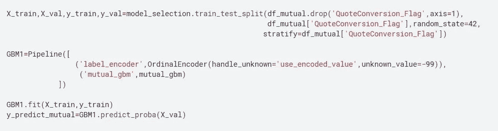

# 保险报价转换:二元分类问题

> 原文：<https://medium.com/mlearning-ai/insurance-quote-conversion-binary-classification-problem-554aa62d4c62?source=collection_archive---------0----------------------->

## 哪些客户会购买报价的保险计划？

这是一个过去的 Kaggle 竞赛，参与者面临的挑战是发现我们要联系的客户是否会接受或拒绝电话营销人员的报价。尽管这种情况下的数据集是由保险公司提供的，但这是一个适用于许多行业领域的一般性问题。基本上，如果我们有一个水晶球，并准确地知道谁将成为我们未来的客户，那么通过执行有针对性的优惠来分配营销预算和策略将非常容易。不幸的是，现实世界是混乱的，我们需要找到自己的路。

这就是机器学习模型可以帮助和指导我们的地方。在这篇文章中，我将通过在给定的数据上训练一个机器学习模型来分享我处理这个问题的方法。我会试着解释每一步为什么我会做出某个决定。

在机器学习领域，在两个选择之间进行预测通常被称为监督二进制分类问题，在这种情况下，我们需要在积极和消极两种结果之间进行预测(客户转化或客户未转化)。

**数据集。和评估指标**

提供的数据集是一个巨大的 260，000 个样本，每个样本有 299 个特征。为了应对这一挑战，每个特征都被匿名化了。这阻止了创建任何有意义的特征。从问题陈述中，我意识到这个模型可能会以接近实时的方式部署，我们可能需要更快的预测，因此我决定建立一个具有最少特征和最大可能准确性的模型光模型。此外，提供的数据集是不平衡的，没有购买报价的人比购买报价的人多，因此我决定设置一个验证指标作为 ROC-AUC 得分。

AUC-ROC curve

AUC-ROC 曲线是在各种阈值设置下对分类问题的性能测量。ROC 是概率曲线，AUC 代表可分性的程度或度量。它告诉我们这个模型在多大程度上能够区分不同的类。AUC 越高，模型预测 0 为 0 和 1 为 1 的能力越强。以此类推，AUC 越高，模型在区分两个类别方面就越好。随机模型的 ROC-AUC 得分为 0.5，我们的目标应该是让模型的 ROC-AUC 得分为 1。

**功能选择:**

这是开发任何机器学习模型的重要一步。真实世界的数据杂乱而嘈杂。如果我们训练这样一个噪声数据的模型，我们很可能不会得到一个非常好的模型，所以过滤掉数据中的噪声非常重要。同样，我的目标是有一个快速的推理模型，因此从最少的特征中提取最多的信息是很重要的。从我的探索性数据分析中，我发现很少有列带有大量的空值，比如 close 50% where null，所以我决定删除它们。很少有列只有一个值，所以我也删除了这样的列。

在此之后，我开始实施以下特征选择策略。我决定从给定的 299 个特性中保留 50 个最佳特性和目标列。

*   **互信息:**两个随机变量之间的互信息(MI)是非负值，它度量变量之间的依赖关系。当且仅当两个随机变量独立时，它等于零，更高的值意味着更高的依赖性。
*   **递归特征消除:**给定一个给特征分配权重(例如，线性模型的系数)的外部估计器，递归特征消除(RFE)的目标是通过递归地考虑越来越小的特征集来选择特征。首先，在初始特征集上训练估计器，每个特征的重要性通过任何特定属性或可调用属性获得。然后，从当前特征集中删除最不重要的特征。该过程在删减集上递归重复，直到最终达到要选择的特征的期望数量。

在经过缩小的列后，我决定将它们视为分类的，因为它们中的所有值都有差异，并且它们中的唯一值从 2 到 26 不等。

# 模型结构

看到问题的本质，我决定尝试逻辑回归作为我的基线模型和提升树算法之一，以击败我的基线分数。在三个著名的 boosting 算法实现中，我决定使用 [LightGBM](https://github.com/microsoft/LightGBM) ，因为它训练速度更快，推理时内存效率更高。

对于逻辑回归，我不得不将我的 50 个特征转换成一个热编码，它创建了一个接近 900 列的稀疏矩阵，这需要很长时间来训练，也需要很长时间来预测。即使使用这样一个简单而低效的模型，我也能够使用 5 重交叉验证得到 0.95 的平均 ROC-AUC 分数。同样，由于数据集是不平衡的，我的 5 个折叠都是以相同的比例分层的。

梯度推进方法有许多参数要调整，如果不小心处理，可能会过度拟合数据集，并使用我们的模型泛化的错误图像。因此，我决定将数据分为训练集和验证集。我使用了 [Optuna](https://github.com/optuna/optuna) 来调整 my Light-GBM 模型的超参数。Optuna 是一个自动超参数优化软件框架，专门为机器学习而设计。它有一个命令式的，*运行定义*风格的用户 API。用 Optuna 编写的代码具有高度的模块化，Optuna 的用户可以动态地构造超参数的搜索空间。它还允许使用设置标准，以在几个时期后取消没有希望的优化运行，这允许使用搜索更大的超参数空间。

在通过互信息获得的特征上运行和优化 Light-GBM 给了我 0.93 的 ROC-AUC 分数，而隐居特征消除(RFE)特征给了我 0.9641 的 ROC-AUC 分数。因为我能够击败我的逻辑回归基线，所以我决定在隐藏测试集上使用带有 RFE 选择特征的 Light-GBM 模型。

Pipeline code

我实现了一个 Sk-learn 管道，能够处理在训练集中没有遇到的特性。这将防止模型在生产中遇到未知值时被破坏。上图显示了在训练和验证中拆分数据的代码行，然后通过管道传递训练数据，然后对保留数据集的验证进行预测。

我能够得到 0.962 的私人测试集分数，这非常接近我的训练集分数 0.9641

**点改进模型**

我决定去掉一个日期栏。但是在我的下一次迭代中，我计划在它的基础上创建更多的特性，并安装同样的轻型 GBM 模型，看看它是否能增加我的分数

**最终模型实现** : [链接到我的笔记本](https://www.kaggle.com/sumeetsawant/insurance-quote-xgboost-and-pipeline-auc-0-9627)

**笔记本显示 EDA 和优化上述代码**:将很快添加到这个职位

如果你觉得这个帖子有用，请给它投票。

关注我: [LinkedIn](https://www.linkedin.com/in/sawantsumeet/)