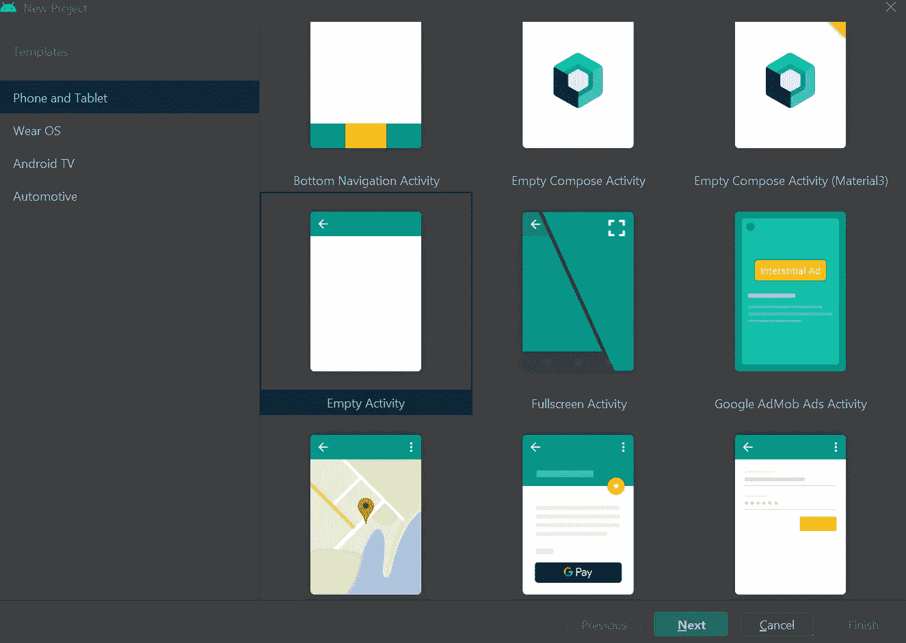
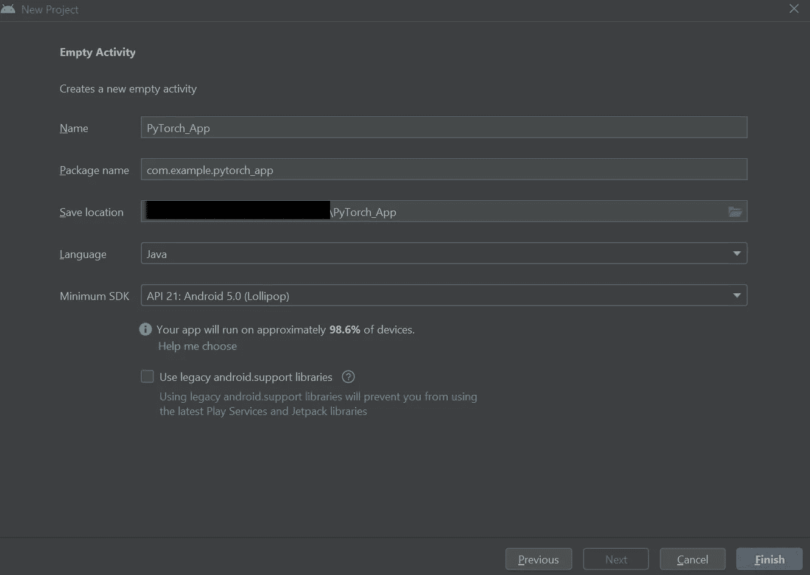
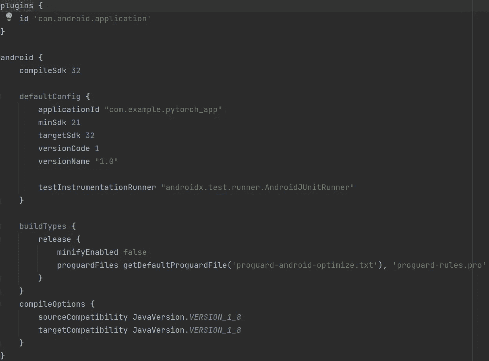
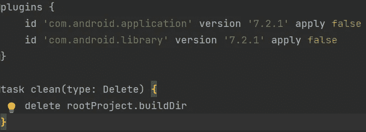
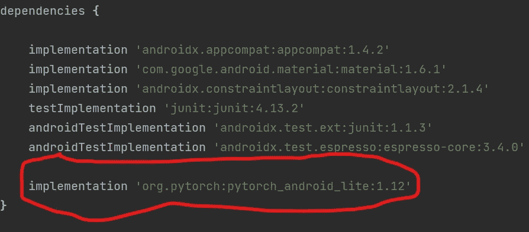
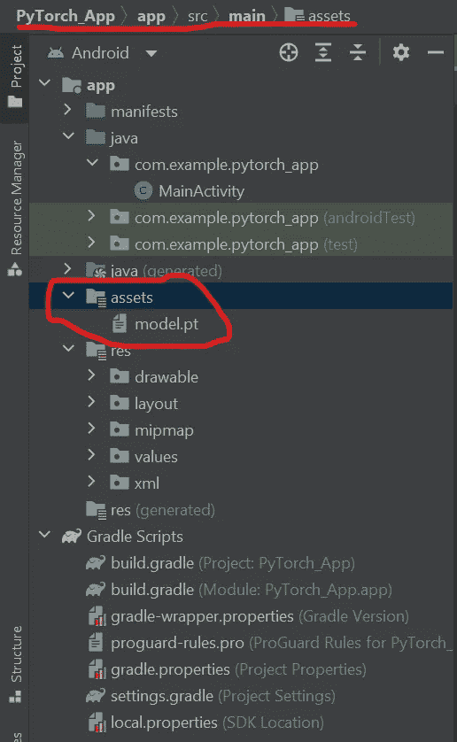
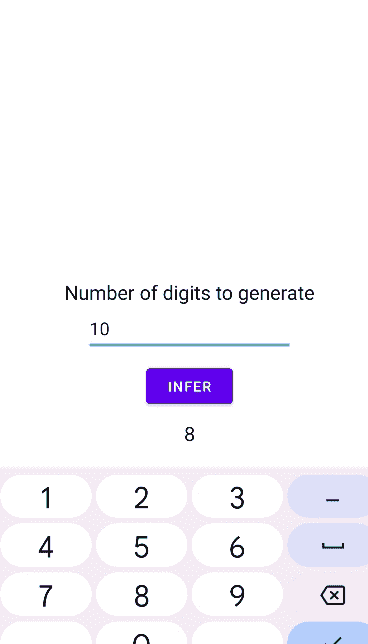
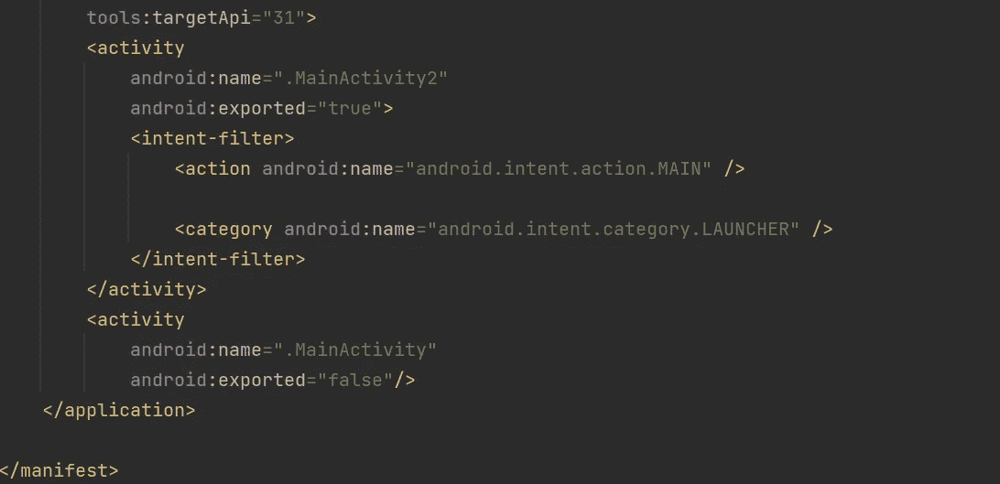

# 将定制 PyTorch 模型集成到 Android 应用程序中

> 原文：<https://medium.com/mlearning-ai/integrating-custom-pytorch-models-into-an-android-app-a2cdfce14fe8?source=collection_archive---------0----------------------->

最近一直在学习安卓 app 开发。虽然从头构建一个应用程序真的很酷，但我想知道是否有可能将 PyTorch 模型集成到我的应用程序中。我不想做任何后端调用，因为那需要一段时间，而且我不得不使用一个数据库服务，这将花费金钱。幸运的是，PyTorch 支持 Android，我将介绍如何轻松地将您的定制模型放入您的应用程序。

我也有一个代码的[报告来配合这个教程。](https://github.com/gmongaras/PyTorchLite_Demo)

# 设置

首先，你需要安装 android studio，你可以[免费获得它！](https://developer.android.com/studio/install)

接下来，让我们创建一个空项目。



Selecting a new project

确保您选择 Java 作为这个项目的语言，因为我将在本教程中使用它。您可以随意命名该项目。我将把这个项目命名为 PyTorch_App。下面是您的配置应该是什么样的:



New project configuration example

以下是我的初始设置文件，以防你想和我一样使用相同的库版本:



App-level build.gradle



Project-level build.gradle

如果你没有设备模拟器设置，你应该[设置一个](https://developer.android.com/studio/run/managing-avds)，这样你就可以运行这个应用程序。

创建好项目后，让我们将 PyTorch 库添加到我们的应用程序中。这样做很容易，只需要在应用程序级 build.gradle 文件中添加一行代码:



Updated app-level build.gradle

单击右上角的“立即同步”,项目应该会更新。现在设置完成了，我们可以开始创建我们的应用程序了！

# 模型创建

为了展示 PyTorch 如何与模型一起使用，我将创建一个简单的模型，该模型将 *N* 个噪声向量作为输入，输出 0 到 9 之间的 *N* 个数字。所以，我们开始编码吧！

```
import torch
from torch import nn
class Model(nn.Module):
    def __init__(self):
        super(Model, self).__init__()

        # Basic MLP with 2 inputs, 4 hidden layers
        # and 10 outputs where each output is
        # the softmax probabilities of a number 0 to 9
        self.MLP = nn.Sequential(
            nn.Linear(2, 5),
            nn.Linear(5, 10),
            nn.Linear(10, 15),
            nn.Linear(15, 20),
            nn.Linear(20, 15),
            nn.Linear(15, 10),
            nn.Softmax(-1)
        )

    def forward(self, X):
        return torch.argmax(self.MLP(X), dim=-1)
```

该模型将接受一个包含 2 个元素的向量(这只是我选择的某个任意数字)，并输出一个包含 10 个元素的向量，其中输出向量中的每个元素都是该模型认为应该选择该数字的概率。当然，模型没有经过训练，所以概率输出没有任何上下文。尽管如此，我们可以只取向量中最大输出值(argmax)的索引来获得预测值。下面的函数用于显示我们如何通过输入 *N* 个噪声向量从模型中获得一个由 *N* 个基本随机数组成的样本。

```
def main():
    # Create the model
    model = Model()

    # Create 4 random noise vectors
    # meaning we want 4 random numbers
    X = torch.distributions.uniform.Uniform(-10000,\
        10000).sample((4, 2))

    # Send the noise vectors through the model
    # to get the argmax outputs
    outputs = model(X)

    # Print the outputs
    for o in outputs:
        print(f"{o.item()} ")

    # Save the model to a file named model.pkl
    torch.save(model.state_dict(), "model.pkl")
```

然后，该模型被保存到一个名为“model.pkl”的文件中，我们将使用该文件作为 Android 应用程序的模型。

在开发应用程序之前，你可以想象一个正常的模型有几个问题。例如:

*   一个好的模型可能非常大
*   加载模型可能需要一段时间
*   模型可能需要一段时间才能做出预测

为了减少这些问题，PyTorch 有一个非常有用的特性叫做 [TorchScript](https://pytorch.org/docs/stable/jit.html) ，它优化了模型的部署。当然，减少的也只能有这么多。所以，不要指望它会神奇地把海量模型变成更小的模型。此外，在加载模型时不必定义模型结构，这使得它在我们的应用程序中非常容易使用。下面的代码采用我们保存的模型，针对移动设备进行优化，然后将其保存到一个新文件中。

```
from torch.utils.mobile_optimizer import optimize_for_mobile
def optimizeSave():
    # Load in the model
    model = Model()
    model.load_state_dict(torch.load("model.pkl", \
        map_location=torch.device("cpu")))
    model.eval() # Put the model in inference mode

    # Generate some random noise
    X = torch.distributions.uniform.Uniform(-10000, \
        10000).sample((4, 2))

    # Generate the optimized model
    traced_script_module = torch.jit.trace(model, X)
    traced_script_module_optimized = optimize_for_mobile(\
        traced_script_module)

    # Save the optimzied model
    traced_script_module_optimized._save_for_lite_interpreter(\
        "model.pt")
```

现在我们有一个优化的模型放在我们的应用程序中！

# 创建应用程序

该应用程序将包括一个基本的编辑文本字段，供用户指定要生成的随机数的数量，一个生成一些随机数的按钮，以及一个显示随机数的文本字段。“activity_main.xml”中的代码如下:

```
<?xml version="1.0" encoding="utf-8"?>
<androidx.constraintlayout.widget.ConstraintLayout
    xmlns:android="[http://schemas.android.com/apk/res/android](http://schemas.android.com/apk/res/android)"
    xmlns:app="[http://schemas.android.com/apk/res-auto](http://schemas.android.com/apk/res-auto)"
    xmlns:tools="[http://schemas.android.com/tools](http://schemas.android.com/tools)"
    android:layout_width="match_parent"
    android:layout_height="match_parent"
    tools:context=".MainActivity"><TextView
        android:id="@+id/textView"
        android:layout_width="wrap_content"
        android:layout_height="wrap_content"
        android:layout_marginBottom="100dp"
        android:text="Number of digits to generate"
        android:textColor="[@color/black](http://twitter.com/color/black)"
        android:textSize="20sp"
        app:layout_constraintBottom_toBottomOf="parent"
        app:layout_constraintEnd_toEndOf="parent"
        app:layout_constraintStart_toStartOf="parent"
        app:layout_constraintTop_toTopOf="parent" /><EditText
        android:id="@+id/etNumber"
        android:layout_width="wrap_content"
        android:layout_height="wrap_content"
        android:ems="10"
        android:hint="digits"
        android:inputType="number"
        android:minHeight="48dp"
        app:layout_constraintEnd_toEndOf="parent"
        app:layout_constraintStart_toStartOf="parent"
        app:layout_constraintTop_toBottomOf="@+id/textView" /><Button
        android:id="@+id/btnInfer"
        android:layout_width="wrap_content"
        android:layout_height="wrap_content"
        android:layout_marginTop="10dp"
        android:text="Infer"
        app:layout_constraintEnd_toEndOf="parent"
        app:layout_constraintStart_toStartOf="parent"
        app:layout_constraintTop_toBottomOf="@+id/etNumber" /><TextView
        android:id="@+id/tvDigits"
        android:layout_width="wrap_content"
        android:layout_height="wrap_content"
        android:layout_marginTop="10dp"
        android:textColor="[@color/black](http://twitter.com/color/black)"
        android:textSize="20sp"
        app:layout_constraintEnd_toEndOf="parent"
        app:layout_constraintStart_toStartOf="parent"
        app:layout_constraintTop_toBottomOf="@+id/btnInfer"
        tools:text="123456789" />
</androidx.constraintlayout.widget.ConstraintLayout>
```

现在我们已经有了应用程序的结构，让我们添加模型。首先，在 *app/src/main* 中创建一个名为 *assets* 的新目录。然后将“model.pt”文件放在*资产*文件夹中。您的文件系统应该如下所示



Image showing the proper location of the assets directory

现在我们可以开始加载模型了。在“MainActivity.java”中，让我们在 *onCreate* 之外添加一些全局变量，这将有助于我们在视图中存储模型和元素。

```
// Elements in the view
EditText etNumber;
Button btnInfer;
TextView tvDigits;

// Tag used for logging
private static final String *TAG* = "MainActivity";

// PyTorch model
Module module;
```

现在，让我们在 *onCreate* 方法中加载模型。

```
// Get all the elements
etNumber = findViewById(R.id.*etNumber*);
btnInfer = findViewById(R.id.*btnInfer*);
tvDigits = findViewById(R.id.*tvDigits*);

// Load in the model
try {
    module = LiteModuleLoader.*load*(assetFilePath("model.pt"));
} catch (IOException e) {
    Log.*e*(*TAG*, "Unable to load model", e);
}
```

*assetFilePath* 是我们需要定义的一个函数。它所做的只是创建“model.pt”的路径，假设它在 *app/src/main/assets* 文件夹中。

```
// Given the name of the pytorch model, get the path for that model
public String assetFilePath(String assetName) throws IOException {
    File file = new File(this.getFilesDir(), assetName);
    if (file.exists() && file.length() > 0) {
        return file.getAbsolutePath();
    }

    try (InputStream is = this.getAssets().open(assetName)) {
        try (OutputStream os = new FileOutputStream(file)) {
            byte[] buffer = new byte[4 * 1024];
            int read;
            while ((read = is.read(buffer)) != -1) {
                os.write(buffer, 0, read);
            }
            os.flush();
        }
        return file.getAbsolutePath();
    }
}
```

此外，应该定义另一个辅助函数，它以一个大小作为输入，并输出该大小的张量。

```
// Generate a tensor of random numbers given the size of that tensor.
public Tensor generateTensor(long[] Size) {
    // Create a random array of floats
    Random rand = new Random();
    float[] arr = new float[(int)(Size[0]*Size[1])];
    for (int i = 0; i < Size[0]*Size[1]; i++) {
        arr[i] = -10000 + rand.nextFloat() * (20000);
    }

    // Create the tensor and return it
    return Tensor.*fromBlob*(arr, Size);
}
```

最后，让我们为按钮创建一个 *onClick* 事件，这样当它被点击时就会生成一个新的数字序列。该函数将在模型加载后立即定义

```
// When the button is clicked, generate a noise tensor
// and get the output from the model
btnInfer.setOnClickListener(new View.OnClickListener() {
    @Override
    public void onClick(View view) {
        // Error checking
        if (etNumber.getText().toString().length() == 0) {
            Toast.*makeText*(MainActivity.this, "A number must be supplied", Toast.*LENGTH_SHORT*).show();
            return;
        }

        // Get the number of numbers to generate from the edit text
        int N = Integer.*parseInt*(etNumber.getText().toString());

        // More error checking
        if (N < 1 || N > 10) {
            Toast.*makeText*(MainActivity.this, "Digits must be greater than 0 and less than 10", Toast.*LENGTH_SHORT*).show();
            return;
        }

        // Prepare the input tensor (N, 2)
        long[] shape = new long[]{N, 2};
        Tensor inputTensor = generateTensor(shape);

        // Get the output from the model
        long[] output = module.forward(IValue.*from*(inputTensor)).toTensor().getDataAsLongArray();

        // Get the output as a string
        String out = "";
        for (long l : output) {
            out += String.*valueOf*(l);
        }

        // Show the output
        tvDigits.setText(out);
    }
});
```

这种方法与 Python 代码中的 main 函数非常相似，因为它创建一个噪声向量，将其传递给模型，然后迭代输出以显示输出的字符。

如果你现在运行应用程序，你应该能够在点击按钮时生成随机字符



Demo of the app we created!

**注意**:如果你在向前传递时得到一个 *null* 错误，模型文件可能在错误的目录中。确保*资产*目录位于 *app/src/main/* 中，而不是*app/src/【Android test】*中。

# 图像生成

和点击按钮生成随机数一样有趣的是，图像呢？

我已经训练了一个 StyleGAN3 模型，我们将使用它来生成图像。虽然模型非常大，但它仍然是一个很好的例子，说明了如何在 Android 中使用图像模型。首先，创建一个名为 *MainActivity2* 的新的空活动。然后进入 Android Manifest 将初始活动从*主活动*更改为*主活动 2* 。Android 清单应该如下所示



Updated AndroidManifest.xml

注意 *<意图过滤>* 位置从*主活动*到*主活动 2* 的切换。这就是改变开始活动的原因。现在让我们创建 XML 文件。XML 文件中有几个视图，用于在单击按钮时显示图像

```
<?xml version="1.0" encoding="utf-8"?>
<androidx.constraintlayout.widget.ConstraintLayout xmlns:android="[http://schemas.android.com/apk/res/android](http://schemas.android.com/apk/res/android)"
    xmlns:app="[http://schemas.android.com/apk/res-auto](http://schemas.android.com/apk/res-auto)"
    xmlns:tools="[http://schemas.android.com/tools](http://schemas.android.com/tools)"
    android:layout_width="match_parent"
    android:layout_height="match_parent"
    tools:context=".MainActivity2"><Button
        android:id="@+id/btnGenerate"
        android:layout_width="wrap_content"
        android:layout_height="wrap_content"
        android:text="Create new image"
        app:layout_constraintBottom_toBottomOf="parent"
        app:layout_constraintEnd_toEndOf="parent"
        app:layout_constraintStart_toStartOf="parent"
        app:layout_constraintTop_toTopOf="parent" /><ImageView
        android:id="@+id/ivImage"
        android:layout_width="wrap_content"
        android:layout_height="wrap_content"
        app:layout_constraintBottom_toTopOf="@+id/btnGenerate"
        app:layout_constraintEnd_toEndOf="parent"
        app:layout_constraintStart_toStartOf="parent"
        app:layout_constraintTop_toTopOf="parent"
        tools:srcCompat="[@tools](http://twitter.com/tools):sample/avatars" /><TextView
        android:id="@+id/tvWaiting"
        android:layout_width="wrap_content"
        android:layout_height="wrap_content"
        android:text="Generating image..."
        android:textColor="[@color/black](http://twitter.com/color/black)"
        android:textSize="20sp"
        android:visibility="invisible"
        app:layout_constraintBottom_toTopOf="@+id/btnGenerate"
        app:layout_constraintEnd_toEndOf="parent"
        app:layout_constraintStart_toStartOf="parent"
        app:layout_constraintTop_toTopOf="parent" />
</androidx.constraintlayout.widget.ConstraintLayout>
```

现在，让我们开始编写活动代码。首先，让我们添加一些全局变量，以便在稍后的活动中有所帮助。

```
// Elements in the view
Button btnGenerate;
ImageView ivImage;
TextView tvWaiting;

// Tag used for logging
private static final String *TAG* = "MainActivity2";

// PyTorch model
Module module;

// Size of the input tensor
int inSize = 512;

// Width and height of the output image
int width = 256;
int height = 256;
```

stylegan 模型将 512 维噪声向量作为输入，并输出形状 256✕256✕3 的图像，其中 3 是 RGB 通道。

现在，让我们使用上一个活动中使用的相同函数来获取资产的路径。该功能与上一个活动中的功能完全相同。

```
// Given the name of the pytorch model, get the path for that model
public String assetFilePath(String assetName) throws IOException {
    File file = new File(this.getFilesDir(), assetName);
    if (file.exists() && file.length() > 0) {
        return file.getAbsolutePath();
    }

    try (InputStream is = this.getAssets().open(assetName)) {
        try (OutputStream os = new FileOutputStream(file)) {
            byte[] buffer = new byte[4 * 1024];
            int read;
            while ((read = is.read(buffer)) != -1) {
                os.write(buffer, 0, read);
            }
            os.flush();
        }
        return file.getAbsolutePath();
    }
}
```

至于 *generateTensor* 函数，我们需要稍微改一下。因为我们一次只生成一个图像，所以我们想生成一个有 512 个元素的张量。此外，stylegan 噪声是专门从高斯分布中采样的，因此我们可以将 rand.nextrand()更改为 rand.nextGaussian()。因为模型实际上是经过训练的，所以我们不需要像在其他活动中那样将噪声乘以任何值。

```
// Generate a tensor of random doubles given the size of
// the tensor to generate
public Tensor generateTensor(int size) {
    // Create a random array of doubles
    Random rand = new Random();
    double[] arr = new double[size];
    for (int i = 0; i < size; i++) {
        arr[i] = rand.nextGaussian();
    }

    // Create the tensor and return it
    long[] s = {1, size};
    return Tensor.*fromBlob*(arr, s);
}
```

现在，助手变量和函数已经就绪，下载 [*imageGen.pt*](https://github.com/gmongaras/PyTorchLite_Demo/tree/main/app/src/main/assets) 模型，并将其放入 *assets* 目录，就像您对其他模型所做的那样。

我不打算解释这个*是怎么来的。pt* 模型的创建过程与数字生成模型非常相似，但是如果您有兴趣查看生成模型的脚本，您可以在本文附带的代码的[部分找到它。](https://github.com/gmongaras/PyTorchLite_Demo/blob/main/Python/stylegan3-main/optimize.py)

有了模型，我们就可以开始编写 *onCreate* 函数了。首先，让我们添加基本的视图查找和模型加载。

```
// Get the elements in the activity
btnGenerate = findViewById(R.id.*btnGenerate*);
ivImage = findViewById(R.id.*ivImage*);
tvWaiting = findViewById(R.id.*tvWaiting*);

// Load in the model
try {
    module = LiteModuleLoader.*load*(assetFilePath("imageGen.pt"));
} catch (IOException e) {
    Log.*e*(*TAG*, "Unable to load model", e);
}
```

最后，我们要做的就是在按钮上放置一个 onClick 监听器。

```
// When the button is clicked, generate a new image
btnGenerate.setOnClickListener(new View.OnClickListener() {
    @Override
    public void onClick(View view) {
        // Error handing
        btnGenerate.setClickable(false);
        ivImage.setVisibility(View.*INVISIBLE*);
        tvWaiting.setVisibility(View.*VISIBLE*);

        // Prepare the input tensor. This time, its a
        // a single integer value.
        Tensor inputTensor = generateTensor(inSize);

        // Run the process on a background thread
        new Thread(new Runnable() {
            @Override
            public void run() {
                // Get the output from the model. The
                // length should be 256*256*3 or 196608
                // Note that the output is in the layout
                // [R, G, B, R, G, B, ..., B] and we
                // have to deal with that.
                float[] outputArr = module.forward(IValue.*from*(inputTensor)).toTensor().getDataAsFloatArray();

                // Ensure the output array has values between 0 and 255
                for (int i = 0; i < outputArr.length; i++) {
                    outputArr[i] = Math.*min*(Math.*max*(outputArr[i], 0), 255);
                }

                // Create a RGB bitmap of the correct shape
                Bitmap bmp = Bitmap.*createBitmap*(width, height, Bitmap.Config.*RGB_565*);

                // Iterate over all values in the output tensor
                // and put them into the bitmap
                int loc = 0;
                for (int y = 0; y < width; y++) {
                    for (int x = 0; x < height; x++) {
                        bmp.setPixel(x, y, Color.*rgb*((int)outputArr[loc], (int)outputArr[loc+1], (int)outputArr[loc+2]));
                        loc += 3;
                    }
                }

                // The output of the network is no longer needed
                outputArr = null;

                // Resize the bitmap to a larger image
                bmp = Bitmap.*createScaledBitmap*(
                        bmp, 512, 512, false);

                // Display the image
                Bitmap finalBmp = bmp;
                runOnUiThread(new Runnable() {
                    @Override
                    public void run() {
                        ivImage.setImageBitmap(finalBmp);

                        // Error handing
                        btnGenerate.setClickable(true);
                        tvWaiting.setVisibility(View.*INVISIBLE*);
                        ivImage.setVisibility(View.*VISIBLE*);
                    }
                });

            }
        }).start();

    }
});
```

这个函数看起来有点吓人，我来分解一下:

1.  单击按钮时，禁用按钮并生成输入张量。
2.  在一个后台线程上，通过模型发送噪声以获得一个名为 *outputArr* 的浮点输出数组。
    -这个输出数组有 1 个数据维，256*256*3 或 196608 个浮点值。
    -数组被构造成一个扁平的图像，其中前 256*3 或 768 个值属于图像中的第一行像素。
    -在数组中，RGB 值按如下顺序存储:[R，G，B，R，G，B，… R，G，B]。因此，第一个像素由数组中的前三个值表示，第二个像素由后三个值表示，依此类推。
3.  获得浮点数组后，我们需要将值限制在 0 到 255 之间，因为这是 RGB 值的范围。
4.  然后，我们可以使用数组的属性将这些值转换为 RGB 位图。
5.  为了更好地观看，位图从 256✕256 调整到 512✕512。
6.  最后，在主线程上，我们可以用新创建的图像更改图像视图，并允许单击按钮。

下面显示了一个输出示例


Example output

**注意**:如果你的应用在生成新图像时崩溃，那么它可能耗尽了内存或者有相关的问题。我不知道有多少方法可以在不改变模型的情况下解决这个问题，但为了以防万一，我在 Windows 笔记本电脑上使用了带有 API 32 (Sv2)的 Pixel 4 模拟器。

由于 stylegan 模型非常大，并且使用了大量的内存，它可能会使您的仿真器崩溃，但是从张量中提取图像数据的过程对于其他图像生成模型应该是相同的。在实践中，如果一个图像生成模型被放在一个 Android 应用程序上，它可能需要为移动设备进行更多的优化。

这就是将 PyTorch 模型集成到 Android 应用程序的全部内容。这不是很难，虽然处理图像输出可能有点乏味。不管怎样，我希望这篇文章对你有所帮助！

[](/mlearning-ai/mlearning-ai-submission-suggestions-b51e2b130bfb) [## Mlearning.ai 提交建议

### 如何成为 Mlearning.ai 上的作家

medium.com](/mlearning-ai/mlearning-ai-submission-suggestions-b51e2b130bfb)