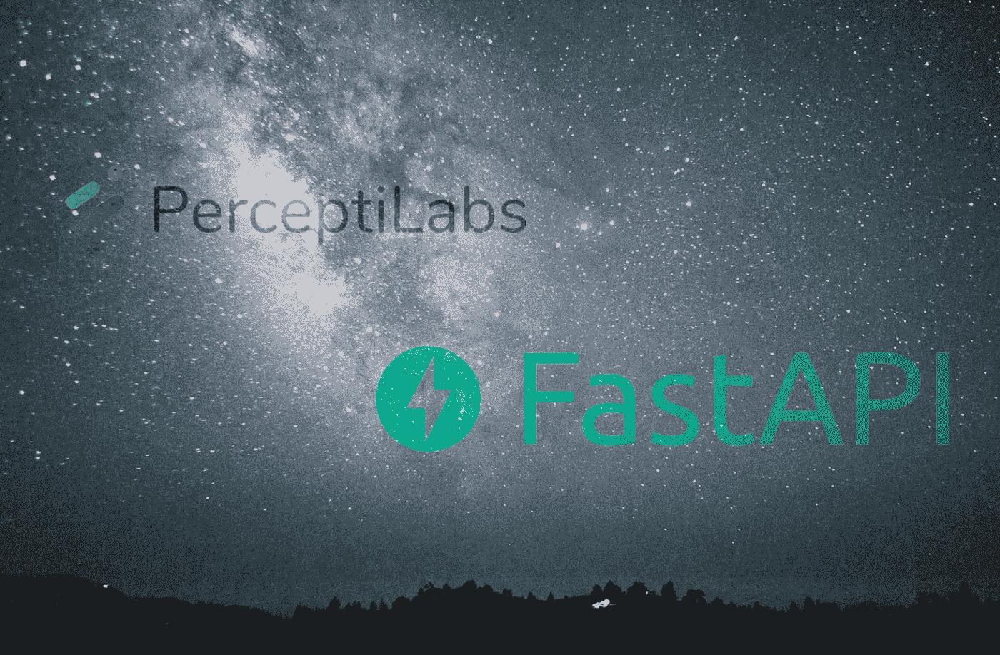
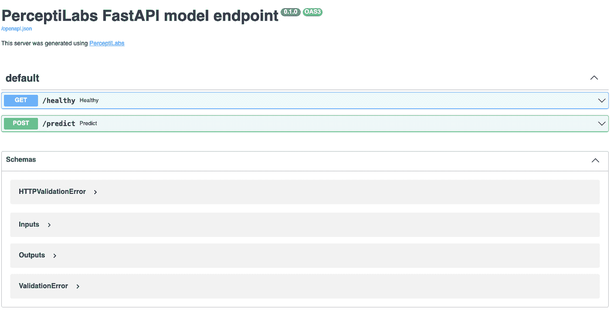

# 集成:用于快速 SaaS 应用程序部署的 FastAPI

> 原文：<https://medium.com/mlearning-ai/integrations-fastapi-for-fast-saas-application-deployments-5e1e5861940a?source=collection_archive---------5----------------------->

PerceptiLabs and FastAPI Integrations.

我们开发人员社区中的许多人都曾问过，一旦从 [PerceptiLabs](https://www.perceptilabs.com/) 中导出模型，如何部署和使用它。因此，在 [0.13 版本](https://docs.perceptilabs.com/perceptilabs/support/changelog#version-0.13-november-4-2021)中，我们在感知实验室的[部署视图](https://docs.perceptilabs.com/perceptilabs/advanced/ui-overview/exporting)中添加了一个 [FastAPI](https://fastapi.tiangolo.com/) 部署目标。此功能不仅可以部署您的 TensorFlow 模型，还可以生成一个完全可用的应用程序，您可以使用它在几分钟内验证和运行您的模型以进行真实世界的推理。

我们选择 FastAPI 作为基础，因为它是构建 RESTful API 的高性能 web 框架，更不用说 2021 年第三受欢迎的 web 框架了。让我们仔细看看这给了你什么。

## **为什么是 FastAPI？**

FastAPI 部署目标导出 TensorFlow 模型，并生成基于 FastAPI 构建的 Python 服务器应用程序，以及与该服务器通信的示例 Python 客户端应用程序。我们选择这种架构是因为它展示了如何通过服务器托管模型进行推理，从远程客户端应用程序接收数据，然后将预测返回给客户端应用程序，这是当今 SaaS DL 解决方案中的典型模式。虽然 PerceptiLabs 的任何用户都可以通过单击按钮轻松地部署到这个目标，但 PerceptiLabs 生成的代码需要一些编程经验才能理解和定制。

## **FastAPI 部署目标如何在 PerceptiLabs 中工作**

FastAPI 服务器托管模型并公开一个 **/predict** 端点，客户端应用程序可以调用该端点来运行推理。当您运行服务器时，它在浏览器中呈现 API，如图 1 所示:

*Figure 1: FastAPI GUI Generated by PerceptiLabs.*

客户端应用程序加载一个 CSV 文件(也是由部署过程生成的)，该文件列出了一系列数据文件。然后，客户端从列出的数据文件中加载原始数据，并在请求的有效负载中将它发送到 **/predict** 端点。服务器通过其托管的 TensorFlow 模型提供数据，并返回一个 JSON 响应，其中包含与每个数据项对应的预测:

*{'labels': ['yes '，' yes '，' yes '，' no '，' yes '，' no '，' yes '，' yes '，' no']}*

请注意，在您部署了这个目标一次之后，您可能希望在感知器中的模型的后续导出中使用 TensorFlow 或 TensorFlow Lite 目标，因为您可能不想继续重新生成服务器和应用程序代码。然后，您可以用新生成的模型文件覆盖 FastAPI 文件夹中以前的模型。

## **FastAPI 用例**

FastAPI 部署目标生成的服务器和客户端应用程序为使用现实推理的用例提供了良好的基础，例如:

*   **您自己的基于云的 SaaS 解决方案:**示例服务器的功能是托管一个模型，并将预测请求封装在一个简单的 REST API 中，这可以作为您自己的基于云的 SaaS 解决方案的基础。例如，您可以将生成的代码转换为云服务，该云服务根据设备上传的数据执行推理。除了将预测返回给这些边缘设备之外，您的服务器代码还可以执行分析，例如检测上传图像的质量，或者记录简单的指标，例如在给定的时间范围内调用端点的次数。当接收到来自云的带有预测的 REST 响应时，设备可以执行额外的动作，例如激活另一个设备(例如，致动器)，或者调用您添加到服务中的其他端点(例如，触发警报)。
*   **调用云服务进行推理:**同样，客户端应用程序用于显示如何调用云服务进行推理。例如，您可以修改应用程序，使其在边缘设备上运行，以收集相机或视频数据。该应用程序可以收集多个图像或帧，将它们打包到一个有效载荷中，然后在调用端点进行基于云的推理时包含该有效载荷。然后，可以在服务器上分析这些预测，服务器进而发出警报和/或提供用于洞察的仪表板。
*   **捕获时间度量:**您可以做的另一个有趣的增强是向服务器和应用程序添加代码来捕获时间度量。例如，您可以用系统调用包装服务器上的推理调用以及客户机中的 POST 请求，以收集各个调用前后的时间。然后，您可以计算时间增量来测试您的推理速度和往返请求/响应时间。

## **FastAPI 学习资源**

如需了解更多信息，请务必查看感知器实验室文档中的 [FastAPI 部署指南](https://docs.perceptilabs.com/perceptilabs/advanced/using-the-exported-deployed-model#fastapi-server)。它提供了有关导出内容以及如何运行服务器和应用程序的更多详细信息。

试试看，[让我们知道](https://forum.perceptilabs.com/)它是如何为你工作的。

如果你还没有我们的免费版感知实验室，一定要看看我们的[快速入门指南](https://docs.perceptilabs.com/perceptilabs/getting-started/quickstart-guide)。

【https://en.wikipedia.org/wiki/FastAPI 

 [## Mlearning.ai 提交建议

### 如何成为 Mlearning.ai 上的作家

medium.com](/mlearning-ai/mlearning-ai-submission-suggestions-b51e2b130bfb)