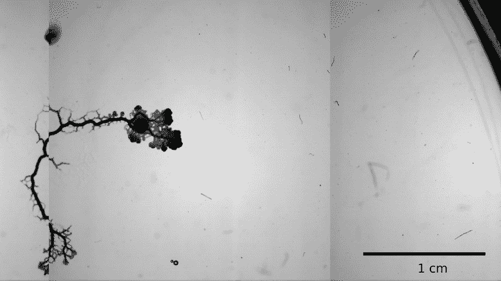
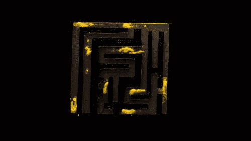
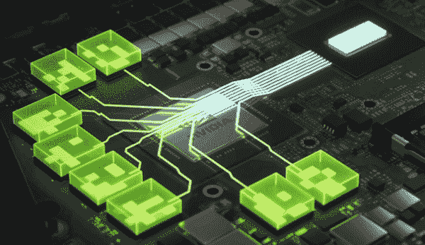
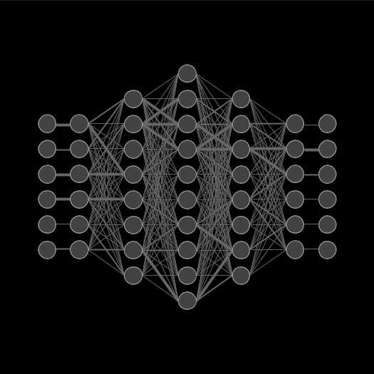

# 观察单个细胞的智能洞察力

> 原文：<https://medium.com/mlearning-ai/intelligence-insights-from-observing-a-single-cell-5a2567e2edb1?source=collection_archive---------1----------------------->

这里存在一种迷人的单细胞生物(多头绒泡菌)，由于其类似霉菌的外观和生长模式，非正式地被称为“黏菌”或“斑点”。在分析了这种有机体如何智能地扩展、成功地解决迷宫并在其整个生命周期中被推向资源之后，我们将考虑我们当前对“智能有机体”的定义，以及这种迷人的模具如何重塑被人类标准视为“真正智能”的要求。

我们首先来看看这个模型到底是什么，它的核心组件是什么。黏菌有一些独特的特征，例如有一个称为“伪足”的管状延伸的广泛网络，可以覆盖几平方米的全尺寸，能够每天增加一倍的质量(如果资源允许)，避免潜在的有毒区域，如果被切成两半，可以完全自愈。

甚至这种生物移动的方式也非常有趣:“在以 1 厘米/小时的速度移动的过程中，管道的大小和网格根据生物体内的位置而演变。一名研究人员说:“在疟原虫的前部，小管的小部分连接非常紧密，一些小管逐渐变粗，而大多数小管向后部消失。”**这种有趣的生物不含大脑，但能够了解其环境的各个方面，甚至已知如果或当其他模具碰巧接触到对方的卷须时，它会将信息传递给其他模具。**

既然“什么是黏菌”这个问题是不碍事的，让我们来看看一些围绕 blob 在探索空间时非凡的智能和记忆存储这一主题的实验，避免某些物质并记录在整个搜索过程中被证明是最优或次优的路径。第一个实验包括研究人员将模具放在一个二维迷宫中，这个迷宫是由一个潮湿表面周围的塑料膜制成的(模具更喜欢在这个表面上移动，而不是作为负面奖励屏障的干膜)。这个实验的唯一目的是找到并吃掉放在迷宫内两个位置的一些食物；只需要几个小时，这团东西就会向食物延伸并最终吃掉它。

> **这里有趣的观察是，起初，斑点在迷宫的所有可能的路线上展开自己寻找食物，但在它找到所需的来源后，只有其管道的最短路径被保留，其余的被收回/用于加强最佳路径，以更好地将营养物运输回细胞的主要部分**:

“在迷宫中的疟原虫中，收缩波在两种食物源之间传播:波源每隔几个波就从一种食物源转换到另一种食物源。迷宫死胡同里的部分疟原虫相当同步地收缩。这种收缩模式意味着疟原虫的死端部分收缩，连接食物来源的管道生长，”一名研究人员说。

Andrew Adamatzky 在有机体上做了第二个实验，目标是**利用 blob 的高度动态但有组织的架构来实现基本逻辑门，如 XOR 和 NOR。**在受控衬底上生长斑点之后，鼓励斑点的生长采用树状结构，以便形成根据需要传递信息的逻辑门。通过使用各种刺激和阻断技术，细胞变成了一个基本的逻辑门结构，并更多地展示了**模具如何能够传递各种信息**，以便为给定的任务增长或收缩其管道。作者甚至谈到了这种“**湿件计算设备**的巨大潜力，这种设备可能会应用于某些计算领域:

> “绒泡菌微流体门很慢:它们的速度在秒的数量级，比硅门慢得多。然而，黏菌微流体门可以自我生长和自我修复，并可以纳入混合湿件:用于感测和分析非致命物质的硬件设备，以及检测分子或某些类型的活细胞。绒泡菌属的微流体门可以成为一次性生物相容的机械控制装置的基础，作为受生物启发的机器人中的嵌入式流体控制器和电路，或嵌入软体机器人中的存储器阵列”

接下来，我们将看看生物体的记忆功能是如何运作的，以及与哺乳动物的认知过程+存储技术相比，哪些是不同的或同义的。模具的结构与 CPU 的布局不同，而是在处理组件方面非常分散:

> “从计算科学的角度来看，疟原虫的计算方法很有趣，因为它没有像大脑一样的中央处理单元，而是原生质相似部分的集合。计算是在这些并行且相互耦合的部分中进行的。这种类型的计算称为并行计算。”

这种并行处理方法在现代 GPU 中可以看到，并且是一种非常相关的学习给定状态空间的方法，该方法基于反复试验并结合强化学习领域中的大数据量或训练模型。对于哺乳动物来说，我们的学习技术包括生长新的树突或加强现有的树突，这取决于该事件对我们的影响程度。然后，突触在位于轴突尖端的轴突末梢被激发，轴突是神经元上的分支结构，以便形成与相邻神经元的连接，从而初始化记忆的保存过程。与黏菌拥有的相比，这种形式的人类保存路径是一种更大更复杂的结构，但基本的映射功能在准系统级别上仍然是相似的。

如前所述，当 blob 被放置在迷宫中并开始扩展其管道时，所有的管道都具有相等的直径和大致相同的长度，因为这只是“搜索阶段”,并且还不需要更大的管道将资源传输回单元。**一旦食物最终被找到，细胞就开始加强形成到达所需目标的最短路径的管道，然后这些管道变宽，以便有效地将资源运输回有机体的核心。**

这些基本的信息处理相似性让一些研究小组非常兴奋，这对于智能生命应用的未来以及了解我们世界的居民可能意味着什么。

**我一直在做的一个项目是一个人工智能体，它利用了一个基于给定任务的自适应泛化框架。这在很大程度上是通过计算资源重新分配来完成的——基于模式预测+概率推理。允许神经网络在代理人的命令下变异并相互融合。我的软件中的这种经验分享方式很大程度上是受黏菌的认知模式和在处理问题集时表现出的高度重组的启发。**

在阅读了 blob 是如何构造、存储记忆、功能以及与其他生物体交流之后，人们不得不思考我们自己头脑中当前对智力的定义，并真正考虑我们是否真的需要重新定义“真正智力”的初始阈值，以及这个新定义对于我们认为可以归类为真正“有意识”的生物体意味着什么。

一旦这种思想被引入，自然的推断是:“我们应该重新考虑我们对‘真正有意识的’人工智能代理的分类吗？”我认为，在人类有机会创造一个被认为是“人工普遍智能”的智能体之前，一些人工智能智能体目前至少是部分有意识的，因为这些当前形式的认知包含一些意识参数，如意识到一个人的自我存在于给定的状态空间中，并实现有利于某种形式的预定义和/或动态奖励功能的目标。

有了这个关于人工智能代理的新观点，我们面临着一个潜在的伦理问题:“既然它们在某种程度上可能是有意识的，我们是否应该以我们认为合适的方式终止这些代理的每一次数字存在？”当我们快速向 AGI 前进时，这些都是非常相关的问题，我相信像黏菌这样的简单生物为这个主题提供了一些最强有力的案例，因为它们拥有许多“意识参数”，但它们似乎远远没有达到我们人类存在和发挥作用的水平。

欢迎分享和/或给我发电子邮件来进一步聊天:**seth141592@gmail.com**

2022 赛斯·努祖姆和艾瑞斯。保留一些权利。

 [## Mlearning.ai 提交建议

### 如何成为 Mlearning.ai 上的作家

medium.com](/mlearning-ai/mlearning-ai-submission-suggestions-b51e2b130bfb)