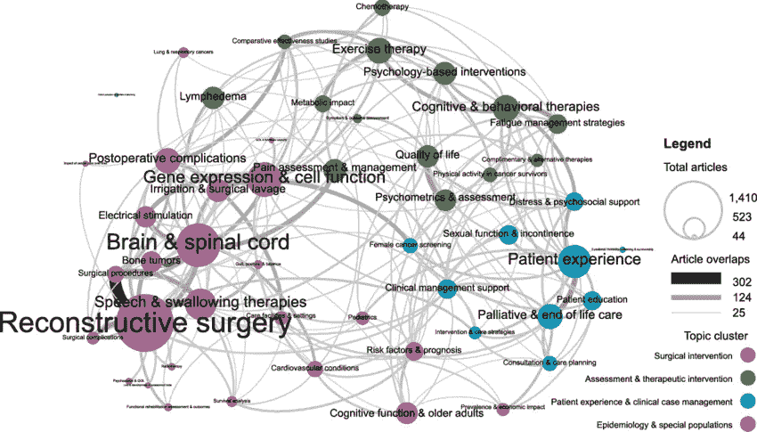
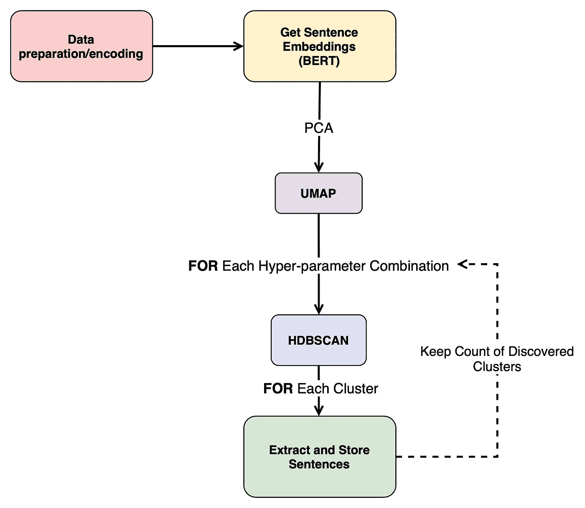
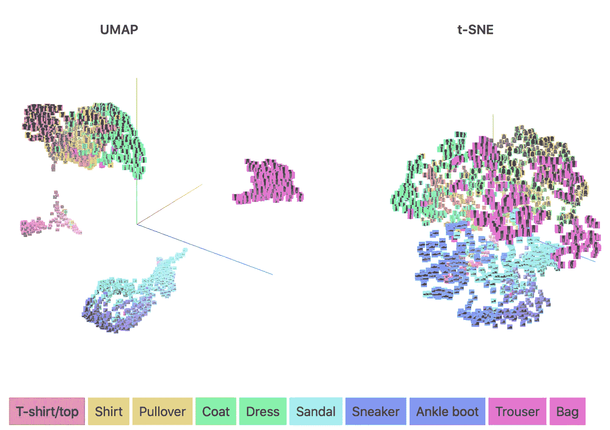
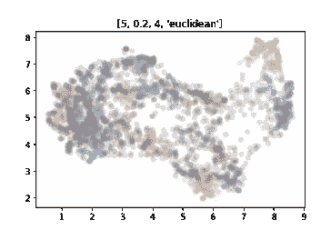
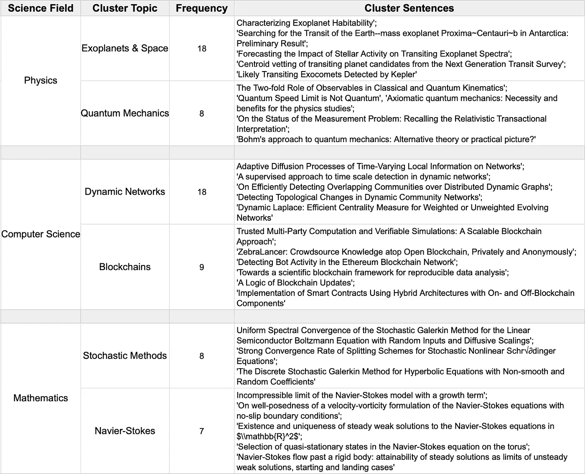
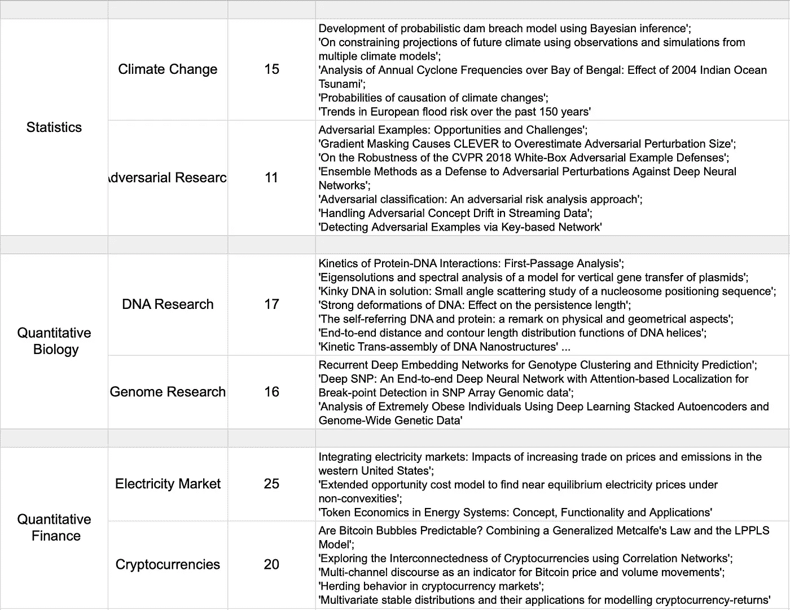

# 基于降维和 BERT 的文本数据类间聚类

> 原文：<https://medium.com/mlearning-ai/inter-class-clustering-of-text-data-using-dimensionality-reduction-and-bert-390a5f9954b8?source=collection_archive---------0----------------------->



**Source:** *A Bibliometric Analysis of the Landscape of Cancer Rehabilitation Research (*Stout, N. L. et al., 2018*)*

主题建模是一种有吸引力的自然语言处理工具，用于发现文本集合的模式、方面和特征。在生物文本挖掘或医学和临床信息学领域，它可用于了解全球疫情期间公众的看法。

这些年来，我对主题建模进行了一点点修补，但经常发现自己对与方法相关的常见问题感到沮丧。为了得到满意的结果，通常需要花相当多的时间对数据进行预处理。例如停用词的移除、词汇表的清理和标准化，甚至是移除封闭类的词性词。最重要的是，大多数主题建模方法受益于大型数据集，输出通常是每个主题的单个单词的集合，这些单词并不总是容易解释。某些方法仅适用于较长的文本，并且通常需要不同的超参数，例如主题的数量。

主题建模也可以看作是一种聚类的形式，寻找意义相似的词，并将它们放在一个主题中。这种形式的无监督学习，结合语言模型的日益流行，已经带来了更新的方法，如 [Top2Vec](https://github.com/ddangelov/Top2Vec) ⁴.本文概述了我自己对该方法的实现，虽然它没有所有令人惊叹的功能作为灵感，但我确实提出了一个小的改变，以最小化超参数的选择。

# 任务和应用

让我们想象一个场景，其中我们有一个文本数据集合，属于几个不同的类/标签。虽然知道样本属于哪个类，但我们仍然希望发现每个类中的聚类。

这不仅有助于查找数据类内部的差异，也有助于查找数据类之间的差异。让我们想象一个医疗场景，每个类别属于一种疾病的不同严重程度，收集的数据是患者的经验丰富的文本投诉。换句话说，所有课程的主题都是一样的，我们想要发现它们之间微妙而有意义的差异。这在尝试描述或发现某个主题的新事物(如疾病)时特别有用。

或者我们收集了不同产品类别的顾客评论。为每个产品(类别)形成集群有助于发现哪些产品做得好，哪些产品需要更多关注，以及营销需要如何调整。

只要有一点创意，用例就有很多，而且应用广泛，而实际的实现并不复杂！

所以让我们开始吧。当然，所有用于此的代码和文件都可以在下面的[库](https://github.com/boorism/medium-clustering.git)中找到。

# 拟议管道

所提出的方法的总体思想紧密遵循用于主题建模和语义搜索的 [Top2Vec](https://github.com/ddangelov/Top2Vec) 算法，我们将遵循的流水线可以在图 1 中看到。



Figure 1: The proposed clustering pipeline

对于每个单词、句子或段落(取决于我们的数据)，我们使用[句子转换器](https://github.com/UKPLab/sentence-transformers)库计算单词嵌入。这个模块的好处在于它提供了对大量语言模型的访问。

典型地，结果嵌入是高维的，在 BERT 语言模型的情况下超过 760。在送入 UMAP 维数约简方法之前，用 PCA 将这些数据约简到某个期望的方差。

UMAP(就像 t-SNE 一样)因严重依赖 used⁵.的超参数集而臭名昭著结合这些参数的非平凡直观性，到较低维度的适当映射通常需要反复试验。此外，对于更加统一的数据集，决定“正确”的投影可能过于主观，并且会在 data⁶.中引入不存在的聚类

而不是试图比较数百个情节(我自己也这么做过，没那么好玩..)，我们迭代了许多不同的超参数组合。在每个组合中，我们使用 HDBSCAN 对减少的嵌入进行聚类。对于每个聚类，我们提取最常见的类别标签和相关联的句子，并将它们存储在字典中。该字典跟踪每次运行中找到该特定聚类的次数。

所提出的方法的假设是,“最强”的聚类是在参数组合中出现最频繁的聚类，并且受 UMAP 投影的微小变化的影响较小。

# t-SNE VS UMAP

快速说明一下为什么我认为 UMAP 比 SNE 更合适。最初在设计这个方法的时候，我选择了 t-SNE 作为我的降维方法，主要是因为这是一个我经常遇到的技术。

虽然 SNE 霸王龙确实产生了令人满意的结果，但它总能找到比 UMAP 更少的集群。在寻找解释时，我看到了这篇[精彩的文章](https://pair-code.github.io/understanding-umap/)，它用简单易懂的术语比较了这两种方法。虽然这两种方法都深受对方的启发，但看起来最大的不同是在局部和全局结构上的平衡(图 2)。这两种方法都能找到有意义的聚类，但是 UMAP 倾向于产生更清晰分离的聚类，同时仍然保持较高的全局结构(属于相似类别的聚类倾向于共存)。



Figure 2: UMAP & t-SNE cluster formation comparison

# 数据

对于我们的聚类，我们将利用奇妙的 Kaggle 及其众多公开可用的数据集。当寻找一个数据集使用时，我想要的东西会对方法有一点挑战，同时仍然有一些实际用途。

我选定了[下面的研究论文摘要和标题的集合](https://www.kaggle.com/shivanandmn/multilabel-classification-dataset?select=train.csv)，跨越了六个不同的主题。这里的标签指的是不同的科学，然而它们中的大多数在本质上都是跨学科的，所以我们期望标题之间有一些重叠。此外，所使用的语言很可能是非常具体的行话和非常研究导向。看看这些科普领域之间的主要话题和研究趋势会是很有趣的。

当加载数据时，我们马上注意到标签的编码需要改变，最好是从 0 开始的唯一整数。现在，我们还更改了列名，将我们想要集群的列(标题)设置为“text”。似乎有些文章属于一个以上的类别，这些样本也被删除。

检查最长标题和摘要的长度是一个好主意，因为语言模型对标记的数量有限制。我们将对数据执行的唯一预处理是删除换行符(" \n ")。

```
**#Preparing dataset 2: Research paper abstracts and topic types
#Loading in the abstracts dataset** abstracts = pd.read_csv("datasets/science.csv")**#Check data encoding**
print(abstracts.head())**#Need to change the encodings. A way can be to first concat the binary indicators into a list/string of numbers which then is converted to the label** abstracts['labels'] = abstracts[abstracts.columns[3:]].apply(lambda x: "".join(x.astype(str)), axis = 1)**#Check class balance**
print(abstracts.labels.value_counts())**#Seems like there are cases where entries belong to multiple classes, remove those and just keep single members. Combine with mapping dict instead of making new list. A bit ugly, change later.. 0 = Physics, 1 = CS, 2 = Maths, 3 = Stats, 4 = Quantitative Biology, 5 = Quantitative Finance** labels_mapping = {"010000" : 0, "100000" : 1, "001000" : 2, "000100" : 3, "000010" : 4, "000001" : 5}abstracts = abstracts[abstracts.labels.isin(list(labels_mapping.keys()))]
abstracts.reset_index(drop=True, inplace= True)
abstracts.labels = abstracts.labels.apply(lambda x: labels_mapping[x])**#Rename**
abstracts.rename(columns={"ABSTRACT": "text1"}, inplace= True)
abstracts.rename(columns={"TITLE": "text"}, inplace= True)**#Only preprocessing can be removing the new-line character (\n)**
abstracts.text = abstracts.text.apply(lambda x: x.replace("\n", " "))
abstracts.text1 = abstracts.text1.apply(lambda x: x.replace("\n", " "))**#Lets check again the longest title entries:**
lengths_title = abstracts.text.str.len()
argmax = np.where(lengths_title == lengths_title.max())[0]**#Check length of longest title**
print(abstracts.text.iloc[argmax].to_numpy().ravel().tolist())
print(len(abstracts.text.iloc[argmax].to_numpy().ravel().tolist()[0].split()))**#Check length of longest abstract**
lengths_abstract = abstracts.text1.str.len()
argmax = np.where(lengths_abstract == lengths_abstract.max())[0]print(abstracts.text1.iloc[argmax].to_numpy().ravel().tolist())
print(len(abstracts.text1.iloc[argmax].to_numpy().ravel().tolist()[0].split()))**#Finally lets keep only the columns we are interested in further**
abstracts = abstracts[['text', 'text1', 'labels']]
```

# 获取嵌入

既然数据是我们满意的形式，我们可以将文本转换成相应的嵌入。如前所述，我们使用了[语句转换器](https://github.com/UKPLab/sentence-transformers)模块，并选择了“ *all-mpnet-base-v2* 语言模型。该库也支持使用其他模型，这取决于您的任务或所使用的语言。这个想法是创建两层(模型)，一层用于获得单词嵌入，另一层将它们汇集在一起形成句子嵌入。出于我们的目的，我们从每个班级中抽取 500 个样本(如果可能的话)。

由于这个过程需要一些时间，我们还定义了两个助手函数，用于将对象作为“pickles”保存和加载。以这种方式保存对象的好处是原始变量类型被保留下来，以后可以在不转换它的情况下进行处理。

```
**#Helper functions for saving/loading pickle objects**def save_obj(obj, name ):
   with open('datasets/'+ name + '.pkl', 'wb') as f:
      pickle.dump(obj, f, pickle.HIGHEST_PROTOCOL)def load_obj(name ):
   with open('datasets/' + name + '.pkl', 'rb') as f:
      return pickle.load(f)
```

获取嵌入的函数:

```
**#getting sentence embeddings for all the separated questions**
def get_sentence_embeddings(dataset): word_embedding_model = models.Transformer('sentence-transformers/all-mpnet-base-v2', max_seq_length=384)
   pooling_model = models.Pooling(word_embedding_model.get_word_embedding_dimension()) model = SentenceTransformer(modules=[word_embedding_model, pooling_model]) **#Store the embeddings in a list**
   sentence_embeddings = [] ** #Go through the data and get the sentence embeddings**
   for index in tqdm(range(len(dataset))):
      sentence = dataset.text[index]
      embedding = model.encode(sentence)
      sentence_embeddings.append(embedding) dataset['embeddings'] = sentence_embeddings return dataset
```

取 500 个样本，嵌入并保存以备后用…

```
**#Getting embeddings as well for the abstract titles**
abstracts_subset = abstracts.groupby("labels").head(500)
abstracts_subset.reset_index(drop = True, inplace = True)abstract_embeddings = get_sentence_embeddings(abstracts_subset)
save_obj(abstract_embeddings, "abstract_embeddings")
```

最后，在运行 UMAP 和 HDBSCAN 之前，我们使用 PCA 来降低嵌入的维数并提高性能。在解释了 75%的差异后，我们已经降到了 133 个维度。

```
**#Reduce the data using PCA**
pca = PCA(.75).fit(abstract_embeddings.embeddings.to_list())embeddings_pca_transformed = pca.transform(abstract_embeddings.embeddings.to_list())**#Define new column for new pca reduced embeddings**
abstract_embeddings['pca_embeddings'] = ""**#Add new embeddings to the dataframe**
for index in range(len(abstract_embeddings)): abstract_embeddings.pca_embeddings[index] = embeddings_pca_transformed[index]print(len(abstract_embeddings.pca_embeddings[0]))
```

# UMAP 和 HDBSCAN 聚类

现在我们到了管道中最有趣的部分。我不会在这里粘贴完整的函数，因为它们可能会占用太多的空间(听起来我需要编写更简洁的代码)，但会解释一般的过程和步骤。确保您检查了 [Jupyter 笔记本](https://github.com/boorism/medium-clustering/blob/main/clustering.ipynb)中的全部代码，以便您可以将它们应用到您自己的数据中！

PCA 简化嵌入现在被馈送到“ **umap_reduce()** ”函数，该函数目前具有一些最重要的 umap 超参数的预定义列表。使用每组超参数，数据被减少并映射到较低的维度，然后用于聚类(" **hdb_clustering()** ")。

HDBSCAN 的好处以及使用它的动机之一是只需要一个超参数，即最小集群大小。在这种情况下，在运行实际聚类之前，我们通过尝试 min_size 的范围并找到聚类概率低于 0.05 的点最少的情况来计算最佳聚类大小(" **get_optimum_min_size()** ")。

对于每个 HDBSCAN，我们还打印一个聚类图(图 3 ),以确保没有发生任何奇怪的事情，在返回带有聚类标签和概率的数据之前，我们过滤掉标签为-1(没有分配聚类)和概率低于 0.8 的点。



Figure 3: An example plot of the clustering, with the UMAP parameters in the title

接下来，我们通过找到最常见的标签和相关联的文本样本来分析每个聚类(" **analyze_clusters()** ")，这些标签和相关联的文本样本存储在临时字典中。然后迭代临时字典，发现的聚类连同它们在 UMAP 超参数迭代中的频率一起存储在另一个更“全局”的字典中。

这个过程相当复杂，可能有点复杂(这是我将来要考虑的事情)，但它是可行的，最终我们得到一个字典列表的对象，列表中的字典索引对应于类标签号(因此需要从 0 开始标记数据)..).这整个方法确实需要一些时间，在我那台有这么多超级参数的破旧 MacBook 上大约需要一个小时。

# **最终输出**

我们列表中的字典很好，但是其中的聚类不是根据它们的频率排序的。我们仍然希望遵循这样的假设，即在多次 UMAP 迭代中更频繁发现的聚类也更多地出现在数据中。

所以最后一步是对集群进行排序，并保存到一个 CSV 文件中供我们查看(" **order_clusters()** ")。在这样做的同时，我们还删除了只有一个成员和单一发现频率的集群。

很高兴看到这个方法确实有效。我们不仅没有对我们的数据进行预处理、超参数选择或探索性分析，我们还给它提供了相对少量的数据点用于无监督学习标准。此外，该方法能够处理不同长度的文本，而不仅仅是输出难以解释的单词集合。下面的表 1 和表 2 显示了每个标签的一些更常见的(有点“精选的”)清晰形成的簇的例子。



Table 1: Cluster examples for first three labels



Table 2: Cluster examples for last three labels

# 结论和未来工作

这里展示的工作希望向你展示语言模型和维度缩减技术可以实现的可能性和很酷的事情。我相信这里介绍的东西有广泛的适用性，可以让公司对不断增长的数据收集有有用的见解。

与典型的主题建模技术相比，所提出的方法的一些优点是:

*   不需要预处理:如停用词或特定的位置标签删除
*   不需要超参数调整或优化
*   处理不同程度的句子
*   输出更容易解释，而不是单个单词的集合
*   可以处理小型数据集

当然也有一些缺点，这种方法可以在未来的迭代中得到很大的改进！

*   不是最快的男孩(但也不是其他一些方法，如 SeaNMF⁷从经验)
*   应该合并的一些已发现的集群之间存在大量重叠
*   缺少有用的附加功能

# 结束语

我希望你喜欢我的第一篇关于 Medium 的文章，并设法在你自己的项目中找到这个管道的一些用途！虽然这里介绍的方法比较不同的类，但是同样的思想也适用于单个类。也可以随意试验不同的或更多的 UMAP 超参数，因为这可以提高性能，并在数据中找到更多隐藏的主题。

如果您有任何意见、反馈或问题，也请随时联系我们。我非常乐于讨论和学习新的东西！

# *参考文献*

[1]b . Marinov，Spenader，j .，& Caselli，T. (2020 年 12 月)。早期疫情荷兰新冠肺炎推特社区的话题和情感发展。

[2]宋 M，金 SY (2013)通过挖掘全文集合检测生物信息学的知识结构。

[3]黄 Z，董伟，纪立，甘 C，陆 X 等(2014)利用概率主题模型从事件日志中发现临床路径模式

[4]安杰洛夫特区(2020 年)。Top2vec:主题的分布式表示。

[5]胡，q .，&格林，C. S. (2018)。参数调整是通过单细胞 RNA 转录组的深度变分自动编码器降维的关键部分。

[6]“K-means 对 t-SNE 的输出进行聚类”。*交叉验证*。检索到 2018–04–16。

[7]施，t .，康，k .，周，j .，，雷迪，C. K. (2018 年 4 月)。基于非负矩阵分解的短文本主题建模