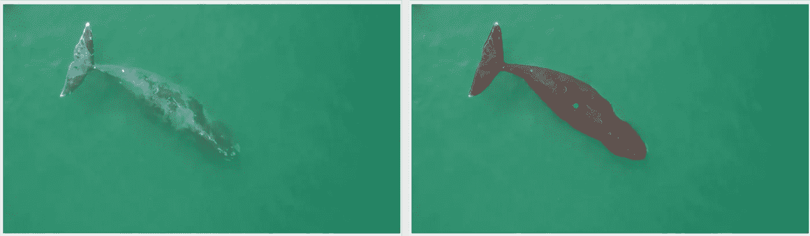
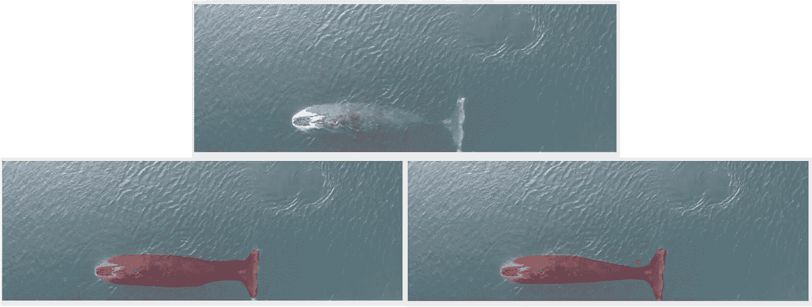
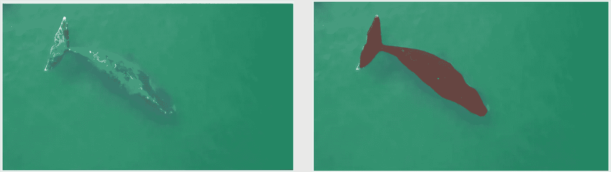
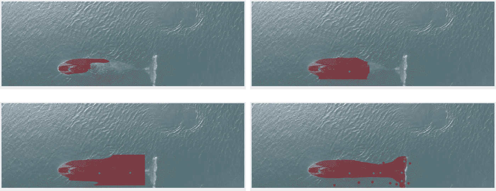
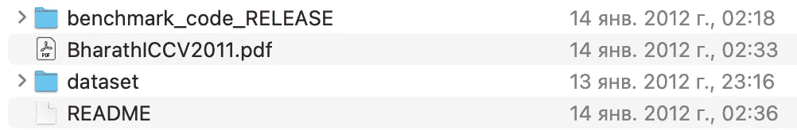
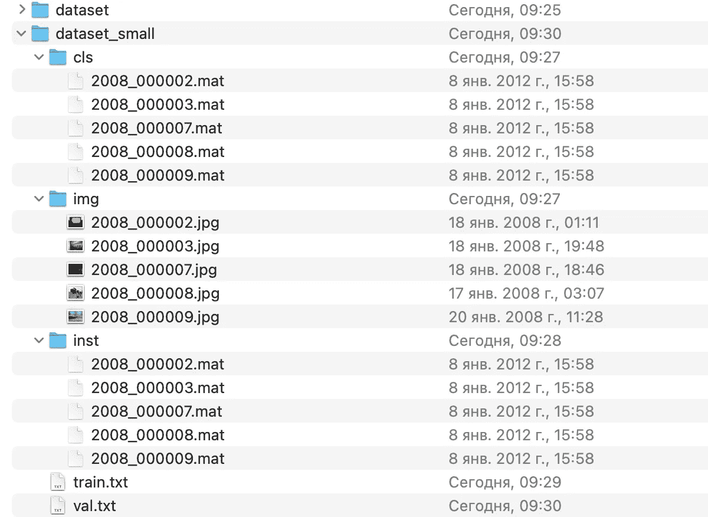
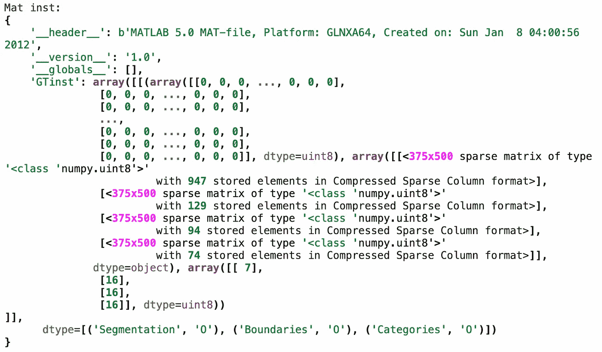
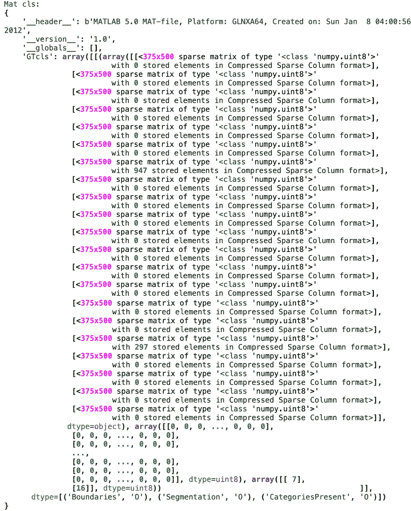

# 用 RITM 算法进行交互式分割(第一部分:SBD 数据集)

> 原文：<https://medium.com/mlearning-ai/interactive-segmentation-with-ritm-algorithm-part-1-sbd-dataset-bdad11d183af?source=collection_archive---------6----------------------->

大家好！我正在撰写一系列关于使用 RITM 算法进行交互式分割的文章。我计划涵盖以下主题:

***第一部分:*** *SBD 数据集以及如何使用它。*

***第二部分:*** *如何准备 SBD 格式的自定义数据集，以及如何在这些数据上训练 RITM。*

在本文中，我们将看看 SBD 数据集，了解如何使用这种格式，以便进一步将任何数据转换为这种格式。

文章的内容

1.  *简介*
2.  *SBD 数据集*
3.  *结论*

1.  **简介**

交互式分割是计算机视觉中的一个重要分支，它的任务是以最少的迭代次数将目标对象从背景中分离出来。我在看 RITM [1]算法，它的任务是使用正面和负面的用户点击来突出显示对象的遮罩。

交互式分割算法是用于语义或实例分割任务的大数据集的半自动标记的有用工具。从时间和人力资源的角度来看，完全手动标记分割任务的数据是昂贵的。为了加速这一过程，有一种替代形式的交互式分割算法。

图 1 中示出了交互式分割如何工作的示例。左图是鲸鱼的原图。右图是一条鲸鱼的分段图像，只需点击一下鼠标(绿点是用户插入的)。).



**Figure 1** — The results of the interactive **RITM** segmentation algorithm with one positive click (green dot).

绿色点击意味着在该点的区域中存在物体，并且算法正试图为其绘制遮罩，而红色点击(否定点击)意味着在该区域中没有物体，并且算法根据新的点击来改进预测的遮罩。使用正面和负面点击的示例如图 2 所示:



**Figure 2 —** The results of the interactive **RITM** segmentation algorithm with positive and negative clicks (green and red dots).

为什么算法这么擅长在这些数据上画掩膜？因为我在我定制的鲸鱼数据集上训练了 RITM 算法。这个数据集有 700 张鲸鱼图片。如果我使用在 SBD 数据集上训练的模型权重而不进行额外训练，结果将如下所示:



这里，假设我们进行了一次正面点击，我们得到了与图 1 中几乎相同的结果。再来一张照片怎么样(图 4)？



**Figure 4** — The results of the interactive **RITM** segmentation algorithm with positive and negative clicks (green and red dots). The best result is shown in image 4.

你可以看到，我们花了 8 次正面点击和 8 次负面点击来粗略绘制鲸鱼的面具，而不像之前的结果，我们只需要两次点击。我们看到，在 RITM 算法的鲸鱼上预先训练的权重比我们在 SBD 数据集上预先训练的权重工作得更好。

因此，能够为您的各种数据重新培训这样一个方便的工具以加快手动数据标记是非常重要的。

2. **SBD 数据集**

*SBD(语义边界数据集)*数据集包含取自 PASCAL VOC 2011 数据集的 11355 幅图像。所提供的分段和边界是针对 VOC 2011 挑战赛中的 20 个对象类别的。创建这个集合的主要目的是评估预测语义轮廓的问题。如果你想更多地了解这个数据集，请使用这个链接(【http://home.bharathh.info/pubs/codes/SBD/download.html】T2)。

让我们下载这个数据集，从内部看一下。



The structure of SBD dataset

这里的主要文件是“数据集”目录和“自述”文件。让我们更详细地看看“数据集”目录。



The structure of the SBD dataset in a shortened version.

```
*Description of directories:***img** — thishis directory contains all images**cls** — this directory contains category-specific segmentations and boundaries. There is one **.mat** file for each image.**inst** —this directory contains instance-specific segmentations and boundaries. There is one **.mat** file for each image. *Description of files:***train.txt** — this file contains names of the images for training**val.txt** — this file contains names of the images for validation
```


Contents of the file train.txt

因此，让我们编写一个小脚本来打开一个图像并从 **cls** 和 **inst** 中读取信息。mat 文件。

首先，让我们看看。来自 **inst** 和 **cls** 目录的 mat 文件。执行代码行 **68** 的结果如下所示:



该文件具有*字典*类型。该字典具有以下关键字:

```
__header__, __version__, __globals__, GTinst
```

这里最重要的键是 *GTinst* 。如果你想得到一个对象的遮罩或者一个边界或类别的遮罩，那么你只需要引用 *dtype* (“分割”、“边界”、“类别”)**(代码行 35 和 39)** 中指定的一个键。如果你想了解更多关于这种类型的阵列，我推荐你访问这个链接。[https://numpy.org/doc/stable/reference/arrays.dtypes.html](https://numpy.org/doc/stable/reference/arrays.dtypes.html)。

该文件中类别和边界的数量对应于图像中标记对象的数量。4 个对象，其中 3 个属于第 16 类，一个属于第 7 类。

*сls* 文件与 *inst* 文件的结构几乎相同。执行代码行 **69** 的结果如下所示:



这里值得注意的是，类别的数量等于图像中存在的唯一类的数量。 **cls** 目录中每个文件的边界数是 20，因为整个数据集只有 20 个类。*“0 个存储元素”*表示这些类别的对象的边界不存在于当前图像中。

那么我们来看看执行函数“read_mat_format”的最终结果:


3.**结论**

在这篇文章中，我们深入探讨了交互式分割问题的公式。我们研究了如何使用 RITM 算法标记照片，减少手动标记的时间和精力。我们熟悉了 SBD 数据集，详细研究了它的格式。

在下一篇文章中，了解了 SBD 数据格式后，我们将为此格式准备自己的数据集，并在此数据上训练 RITM 算法。

所有带示例的代码都可以在这个链接([https://github.com/Vlad188-1/RITM_Part_1_medium.git](https://github.com/Vlad188-1/RITM_Part_1_medium.git))获得

**参考文献**

[1]https://arxiv.org/abs/2102.06583(RITM)

[2][https://github.com/saic-vul/ritm_interactive_segmentation](https://github.com/saic-vul/ritm_interactive_segmentation)(RITM github)

[](/mlearning-ai/mlearning-ai-submission-suggestions-b51e2b130bfb) [## Mlearning.ai 提交建议

### 如何成为 Mlearning.ai 上的作家

medium.com](/mlearning-ai/mlearning-ai-submission-suggestions-b51e2b130bfb)