# 与我一起阅读论文:Data2Vec:语音、视觉和语言自我监督学习的一般框架

> 原文：<https://medium.com/mlearning-ai/interpretation-of-data2vec-a-general-framework-for-self-supervised-learning-in-speech-vision-and-43299fef41d4?source=collection_archive---------0----------------------->

## 跨模态学习模型 data2vec 解读

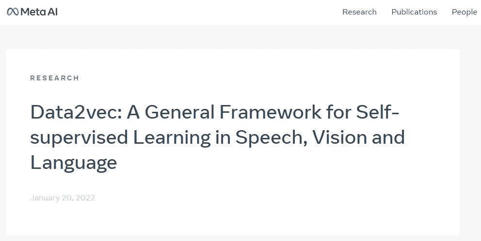

*   这篇博客介绍了一篇来自 Meta AI 的关于自我监督学习的新论文: [data2vec:语音、视觉和语言自我监督学习的通用框架](https://ai.facebook.com/research/data2vec-a-general-framework-for-self-supervised-learning-in-speech-vision-and-language)
*   如果你很难理解这个博客，建议先看看[我在 BYOL](/@YunchaoLanceLiu/read-paper-with-me-bootstrap-your-own-latent-a-new-approach-to-self-supervised-learning-e6580ce8dae5) 的博客。这部作品是以 BYOL 为基础的。

**背景:**传统的机器学习依靠有标签的数据进行训练。然而，数据的注释既费钱又费力。从更大的意义上说，给世界上所有的数据贴标签是不可能的。最近，s[elf-supervised learning(SSL)](https://viso.ai/deep-learning/self-supervised-learning-for-computer-vision/)作为一种解决这一问题的有前途的方法而受到关注，并用于[逼近人工智能系统中的常识，](https://ai.facebook.com/blog/self-supervised-learning-the-dark-matter-of-intelligence/)最终实现人工一般智能(AGI)。

SSL 不是使用来自标记数据的监督信号，而是利用数据之间的关系。然而，不同的模态通常需要不同的 SSL 模型。因此，本文提出了一个统一的框架，称为 data2vec(这个名字是对另一个著名的算法 [word2vec](https://en.wikipedia.org/wiki/Word2vec) 的一种发挥)，用于三种模态的 SSL:图像(在原始论文中，*计算机视觉*指的是这个)、文本(在原始论文中有时称为*语言*)、语音。Data2vec 实现了所有三种模式的最先进(SOTA)结果。

在我们继续之前，注意这三种模态之间的区别是很重要的:图像是 2D 结构化数据。文本是离散的 1D 数据，而语音是连续的 1D 数据。

Examples of three modalities: Image, speech, language (consistently called *texts* in this blog). Image from [the original paper](https://ai.facebook.com/research/data2vec-a-general-framework-for-self-supervised-learning-in-speech-vision-and-language).

*此项工作不用于[多通道学习](https://towardsdatascience.com/multimodal-deep-learning-ce7d1d994f4)中的培训(即，在培训过程中，三种模式中只有一种作为输入传递，而不是它们的混合)，但有助于多通道学习

**方法概述:** data2vec 使用一种模式，但有两种模式:教师模式和学生模式。在每个时间步骤中，data2vect 的学生模式将尝试从教师模式学习并更新模型参数

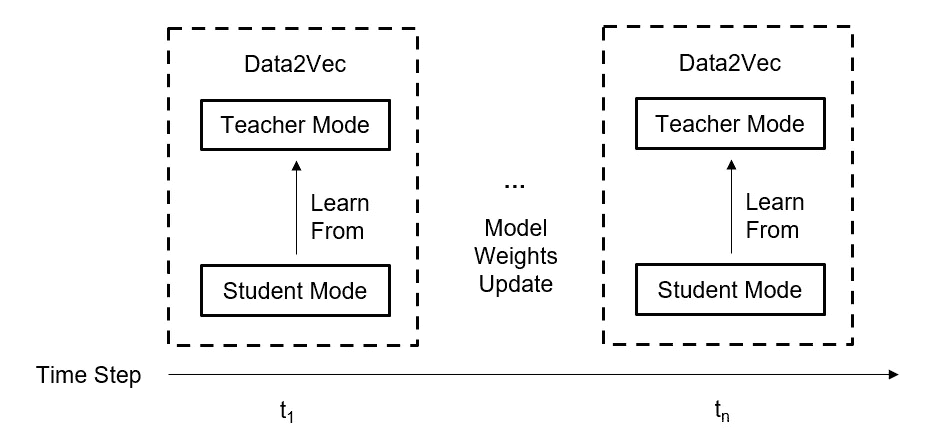

In each time step, data2vec in student mode learns from its teacher mode and updates its parameters. Image by the author.

具体来说，教师模式从给定样本(即图像、语音、文本)生成表示。同一样本的屏蔽版本被传递到学生模式。学习通过最小化学生对由教师参数构建的目标的预测之间的目标函数而发生。

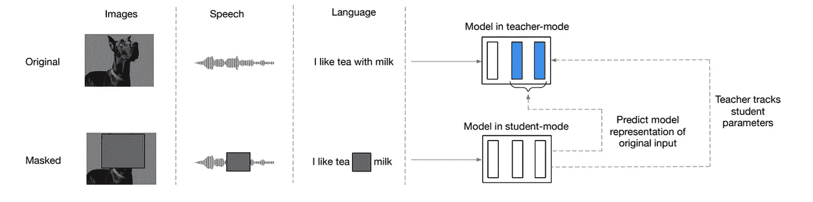

For a certain timestep, the input of the teacher is a full sample (i.e., unchanged image, speech, text) and that of the student is a masked one. The student learns from the teacher by predicting a target constructed using the last K layers of the teacher (shown in blue). Image from [the original paper](https://ai.facebook.com/research/data2vec-a-general-framework-for-self-supervised-learning-in-speech-vision-and-language).

**方法:**

1.  模型架构

data2vec 模型将样本转换为表示形式。完整样本的表示来自教师，屏蔽样本的表示来自学生。

这些是*语境化的表示，*意味着它们编码特定的时间步长以及来自样本的其他信息，这是由于在转换器中使用了自我关注。这是这部作品和以前作品的主要区别，以前的作品缺乏上下文信息。

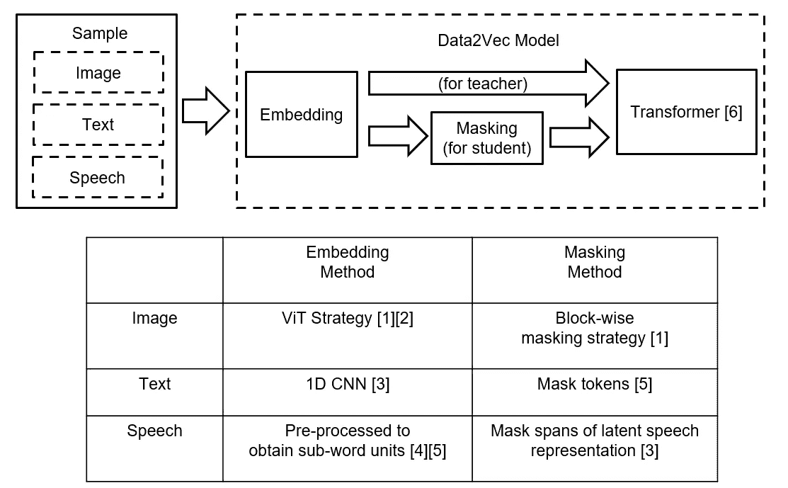

Samples turn into representations by passing through the data2vec model. First of all, samples are embedded into tokens. If in student mode, then a masking method is applied to the tokens before passing them to a [Transformer](https://arxiv.org/abs/1706.03762). If in teacher mode, the tokens are directly passed to the Transformer. Image by the author.

2.目标结构

使用指数移动平均线( [EMA](https://en.wikipedia.org/wiki/Moving_average#%7B%7Banchor%7Cexponential_moving_average%7CExponential%7D%7DExponential_moving_average) [7，8】，其为更近的数据点放置更大的权重)来更新教师的参数。这里的τ是线性增加的，并且允许在训练开始时更频繁地更新教师。

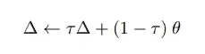

θ is the student-mode model parameters. Δ the teacher-mode model parameters and is updated using the exponential moving average ([EMA](https://en.wikipedia.org/wiki/Moving_average#%7B%7Banchor%7Cexponential_moving_average%7CExponential%7D%7DExponential_moving_average) [7, 8]) of θ. τ linearly increases from τ₀ to a target value τₑ for the first τₙ updates and then stays constant for the remaining of the training. Image from [the original paper](https://ai.facebook.com/research/data2vec-a-general-framework-for-self-supervised-learning-in-speech-vision-and-language).

然后，通过使用变压器的顶部 K 个(更靠近输出)模块来构建目标。

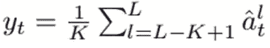

L is the total blocks in the network. aₜˡ-circumflex (cannot type the caret symbol) is obtained by a normalization from aₜˡ. aₜˡ denotes the output of block *l* at timestep t. Image from [the original paper](https://ai.facebook.com/research/data2vec-a-general-framework-for-self-supervised-learning-in-speech-vision-and-language).

3.目标函数

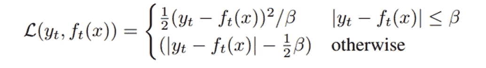

yₜ is the target. fₜ(x) is the prediction. β controls the transition from a squared loss to an L₁ loss. When the gap is large, L₁ is used to make the loss less sensitive to outliers. Image from [the original paper](https://ai.facebook.com/research/data2vec-a-general-framework-for-self-supervised-learning-in-speech-vision-and-language).

总之，教师和学生具有动态行为:学生的参数通过在步骤 3 中优化目标函数来更新，而教师的参数通过在步骤 1 中计算 EMA 来更新。这种动态被认为是防止模型崩溃成一个常数表示[7]。以后再写博客介绍[7]。

**结果:**

该文件报告了所有三种模式的 SOTA 结果。

1.  图像(公制:精确度。价值越高，性能越好):

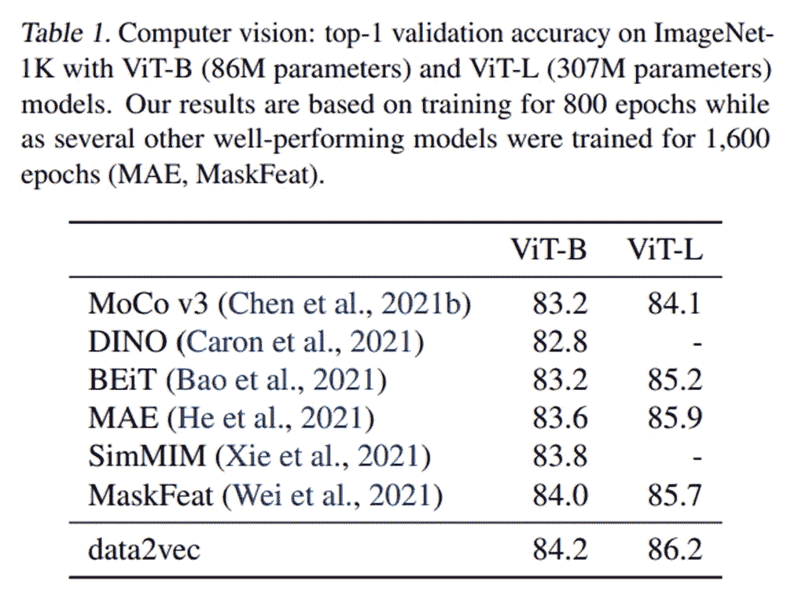

Image from [the original paper](https://ai.facebook.com/research/data2vec-a-general-framework-for-self-supervised-learning-in-speech-vision-and-language).

2.语音(度量:单词错误率。值越低，性能越好)

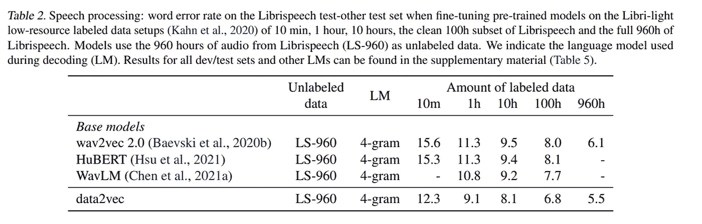

Image from [the original paper](https://ai.facebook.com/research/data2vec-a-general-framework-for-self-supervised-learning-in-speech-vision-and-language).

3.文本(度量:粘合分数。价值越高，性能越好)

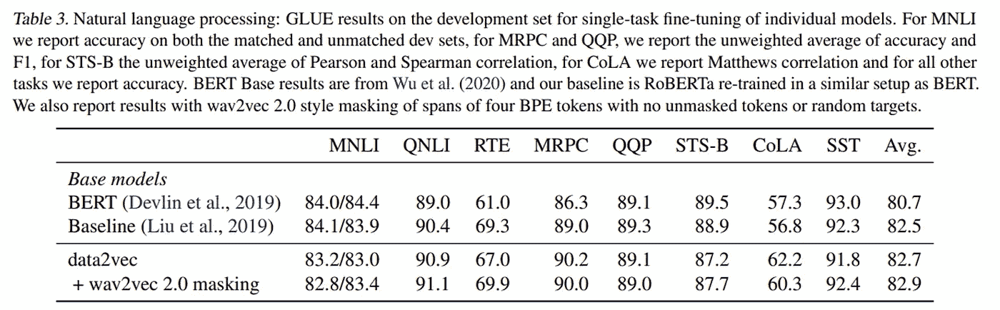

Image from [the original paper](https://ai.facebook.com/research/data2vec-a-general-framework-for-self-supervised-learning-in-speech-vision-and-language).

**消融研究:**

1.  前 K 个块

该论文认为，在教师模式中使用前 K 个块的平均值比仅使用前一个更好(在论文的这一部分中，作者使用“前 K 个层”，这与论文的“目标”部分中的“前 K 个块”不一致。我假设“层”和“块”可以互换使用，都指转换器中的块)。

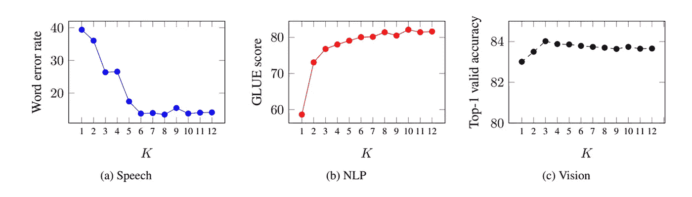

Using the average of top K blocks of the teacher model is better than just using the single top block. The results shown have better performance when the value is lower(speech), higher(NLP, i.e., texts) and higher(Vision, i.e., images ) respectively. The effect is more pronounced in speech and texts than in images. Image from [the original paper](https://ai.facebook.com/research/data2vec-a-general-framework-for-self-supervised-learning-in-speech-vision-and-language).

2.目标特征类型

除了使用顶部的 K 块，作者还尝试使用教师模式的不同部分，并发现使用 FFN 是最好的。

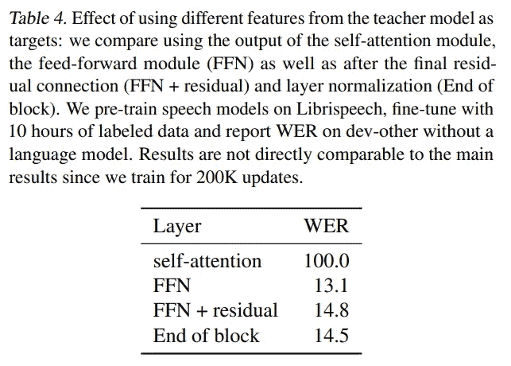

WER stands for word error rate. Image from [the original paper](https://ai.facebook.com/research/data2vec-a-general-framework-for-self-supervised-learning-in-speech-vision-and-language).

**结论:**本文介绍了一种新的通用自监督学习框架，并实现了三种模态的 SOTA 性能。

该框架包括一个模型和两种模式:教师和学生。教师得到完整的样本输入，而学生得到相同样本的屏蔽输入。自我监督学习是通过让学生向老师学习来实现的。

**个人备注:**

1.  更有意思的是，看看这种方法在非结构化的模态上表现如何，比如图形:P
2.  变压器和 [BYOL](/mlearning-ai/read-paper-with-me-bootstrap-your-own-latent-a-new-approach-to-self-supervised-learning-e6580ce8dae5) 在这种方法的成功中发挥了重要作用。Transformer 是一种灵活的架构，不局限于特定的设备，因此可以应用于不同的设备。BYOL 提供了这种方法的核心自我监督学习部分。
3.  这项工作是统一不同模态输入的关键步骤。由于人类很可能使用类似的学习过程来理解视觉世界，就像他们理解语言一样[9，10]，这项工作对于让我们更接近 AGI 具有重要意义。

**参考文献:**

[1]鲍，h，董，l，和魏，F. [拜特:伯特预训练的图像变压器](https://arxiv.org/abs/2106.08254) (2021)。ArXiv

[2] Dosovitskiy、a .、Beyer、l .、a .、Weissenborn、d .、Zhai、x .、Unterthiner、t .、Dehghani、m .、Minderer、m .、Heigold、g .、Gelly、s .、Uszkoreit、j .和 Houlsby、N. [一幅图像相当于 16x16 个字:大规模图像识别的变形金刚](https://arxiv.org/abs/2010.11929) (2020)。arXiv

[3] Baevski，A .，Zhou，y .，Mohamed，A .，Auli，M. [wav2vec 2.0:语音表征的自我监督学习框架](https://proceedings.neurips.cc/paper/2020/file/92d1e1eb1cd6f9fba3227870bb6d7f07-Paper.pdf) (2020)。进行中。神经突

[4] Sennrich，r .，Haddow，b .，Birch，A. [带子词单元的生僻字的神经机器翻译](https://aclanthology.org/P16-1162/) (2016)。进行中。ACL 的

[5] Devlin，j .，Chang，m-w .，Lee，k .，Toutanova，K. [Bert:用于语言理解的深度双向转换器的预训练](https://aclanthology.org/N19-1423.pdf) (2019)。继续。纳克的

[6]瓦斯瓦尼，a .，沙泽尔，n .，帕尔马，n .，乌兹科雷特，j .，琼斯，l .，戈麦斯，A. N .，凯泽，l .，波洛苏欣，I. [注意力是你所需要的全部](https://proceedings.neurips.cc/paper/2017/file/3f5ee243547dee91fbd053c1c4a845aa-Paper.pdf) (2017)。进行中。乳头

[7] Grill、J.-B .、Strub、f .、Altche、f .、Tallec、c .、Richemond、P. H .、Buchatskaya、e .、Doersch、c .、Pires、B. A .、Guo、Z. D .、Azar、M. G .、Piot、b .、Kavukcuoglu、k .、Munos、r .、Valko、M. [引导你自己的潜能:自我监督学习的新方法](https://arxiv.org/abs/2006.07733) (2020)。arXiv。

[8] Caron，m .、Touvron，h .、Misra，I .、Jegou，h .、Mairal，j .、Bo- janowski，p .、Joulin，A. [《自我监督视觉变形金刚的新兴特性》](https://arxiv.org/abs/2104.14294) (2021)。arXiv

[9] Friston，k .和 Kiebel，S. [根据自由能原理的预测编码](https://royalsocietypublishing.org/doi/10.1098/rstb.2008.0300) (2009)。皇家学会哲学汇刊:生物科学

[10] Friston，K. [自由能原理:统一的大脑理论？](https://www.nature.com/articles/nrn2787) (2010)，《自然评论神经科学》

**延伸阅读:**

[BYOL](/@YunchaoLanceLiu/read-paper-with-me-bootstrap-your-own-latent-a-new-approach-to-self-supervised-learning-e6580ce8dae5)(data 2 vec 构建的方法)

[Jimmy Chen 在 data2vec 上的博客](https://jimmy-shen.medium.com/finally-we-have-a-more-general-modality-unspecific-representation-method-data2vec-5dcba6c853ef)