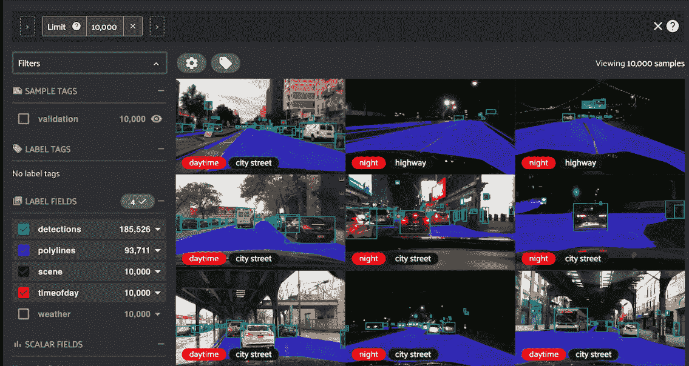
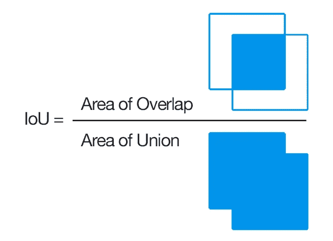
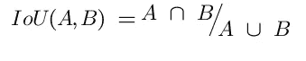
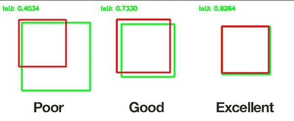

# 交集超过联合阈值使用它的目的是什么，它如何帮助对象检测和分割？

> 原文：<https://medium.com/mlearning-ai/intersection-over-union-threshold-whats-the-purpose-of-using-it-and-how-it-helps-in-object-1a2d74de296f?source=collection_archive---------1----------------------->

Image from Fiftyone repo after visualization

# 什么是并集上的交集(IoU)？

**IoU** 被称为交集/并集，用于比较两个距离较远的输出，或者在图像分割任务中，您可以将其视为检测图像是否被正确分割以及图像分割的完美程度的掩模。

一组建议的目标像素和一组真实目标像素的 IoU 计算如下

source : pyimagesearch

**用更多的数学符号来表示就是**

这里 A 和 B 是我们的对象遮罩，交集 B 表示两个遮罩的交集区域，而并集 B 表示图形的总区域。

## 如果 IoU 接近 1，那么我们可以说我们的模型完美地预测了对象

## 如果 IoU 接近 0 或 0，那么我们可以说我们的模型根本没有预测物体坐标

# 为什么它被认为是多重分割和目标检测竞赛的评价标准？

它决定了模型在各种类型的对象和分割任务上的表现。虽然有诸如 Detectron 2 的先进模型，它们在 COCO 数据集上的对象检测和分割任务中工作得非常好