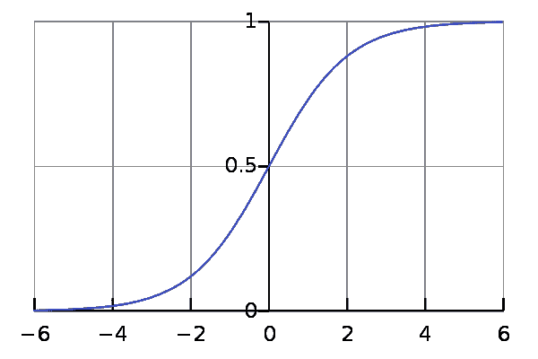

# 面试问题:什么是 Logistic 回归？列举一个你最近使用它的例子。

> 原文：<https://medium.com/mlearning-ai/interview-question-what-is-logistic-regression-39103a25a692?source=collection_archive---------0----------------------->

逻辑回归是一种统计模型，常用于分类和预测分析。它用于估计因变量和一个或多个自变量之间的关系，预测分类值。逻辑回归估计一个…