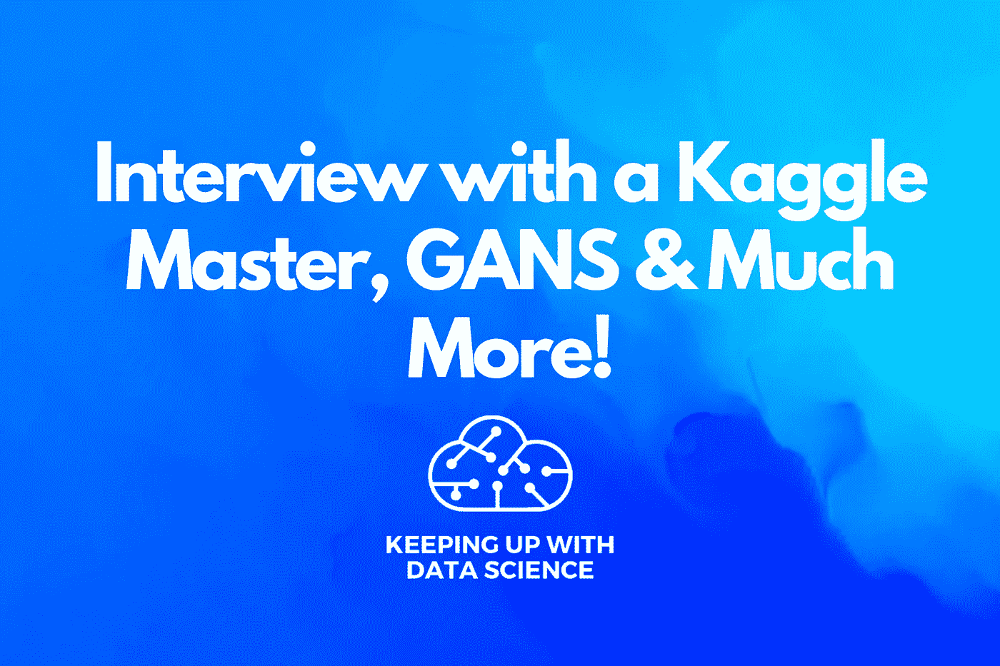

# 采访 Kaggle 大师，GANS 和更多！

> 原文：<https://medium.com/mlearning-ai/interview-with-a-kaggle-master-gans-much-more-319d1b182514?source=collection_archive---------10----------------------->

# 1.2x Kaggle 大师 Gilles Vandewiele 独家专访！

“我认为数据科学领域的一个好处是它是多学科的，任何渴望成为数据科学家的人都可以成为数据科学家。”—吉勒·范德维尔金玉良言！作为一名数据科学的初学者，这句话给了我很大的希望，前提是我和许多其他数据科学爱好者一样，不是来自科学或技术背景。虽然数据科学家应该对这种管道的每个步骤都有一些经验，但我们不能期望每个人都是所有这些步骤的专家。Kaggle 是一个比真实世界更好的学习环境的主要原因是，你的边界被其他竞争对手推得更远:你想在竞争中结束，从而创建一个比其他解决方案(往往是 1000 个)更好的解决方案；在现实世界中，你创建一个满足客户需求的解决方案，然后你就完成了。我通常从我的解决方案的示意图开始，这有助于我的文章的结构，也给我一个需要讨论的组件的概述。我认为 Kaggle 上一些最有价值的学习经历是在团队中获得的，就像你从其他人那里学习一样。

**类别:** Kaggle

**等级:**初学者

**整篇文章链接:**[https://www . analyticsvidhya . com/blog/2020/11/exclusive-interview-with-Gilles-vandekaggle-grand master-series-exclusive-interview-with-ka ggle-rank-147-and-competitions-master-Gilles-vandewielewiele/](https://www.analyticsvidhya.com/blog/2020/11/exclusive-interview-with-gilles-vandekaggle-grandmaster-series-exclusive-interview-with-kaggle-rank-147-and-competitions-master-gilles-vandewielewiele/)

# 2.使用面部检测开始使用 Kaggle

本文将指导您使用 python 中的 OpenCV(开源计算机视觉)库开始使用 Kaggle。Kaggle 通常被称为数据科学家的 Airbnb。如果你有兴趣进入机器学习领域，并希望通过尝试一些现成的算法和库来学习，那么 Kaggle 是正确的起点。让我们来看一下使用 OpenCV 执行面部检测的代码。

**类别:**人脸检测，面部检测，OpenCV

**级别:**高级

**整篇文章链接:**[https://www . analyticsvidhya . com/blog/2021/04/getting-started-with-ka ggle-using-face-detection/](https://www.analyticsvidhya.com/blog/2021/04/getting-started-with-kaggle-using-facial-detection/)

# 3.用 Keras 和深度学习基础训练神经网络

该模型可以是连续的，这意味着这些层一层一层地堆叠在另一层之上，具有单一的输入和输出。因为函数式 API 是一种数据结构，所以很容易将其保存为单个文件，该文件可用于重建精确的模型，而不必知道源代码。使用卷积图层类可以通过多种方式创建卷积图层。回调是一种可用于在训练过程的不同点完成任务的对象类型(即，在一个时期的开始/结束时，在一个批次之前/之后)。数据通常是原始格式，并以目录的形式组织，在提供给模型进行拟合之前，必须对其进行预处理。

**类别:** Keras，神经网络

**等级:**高级

**全文链接:**[https://www . analyticsvidhya . com/blog/2021/11/training-neural-network-with-keras-and-basics-of-deep-learning/](https://www.analyticsvidhya.com/blog/2021/11/training-neural-network-with-keras-and-basics-of-deep-learning/)

# 4.使用 Python 和 Excel 进行逻辑回归

p 与(1-p)的比值称为赔率，如下-在简单线性回归中，将连续响应变量 y 估计为解释变量 x 的线性函数的模型如下-然而，当响应变量是离散的，以 1 或 0(真或假，成功或失败)表示时，估计是基于成功的概率进行的。

**类别:**高级 MS Excel、Blogathon、逻辑回归、Python

**等级:**初学者

**整篇文章链接:**[https://www . analyticsvidhya . com/blog/2022/02/logistic-regression-using-python-and-excel/](https://www.analyticsvidhya.com/blog/2022/02/logistic-regression-using-python-and-excel/)

# 5.训练你的第一个 GAN 模型|让我们来谈谈 GAN 第二部分

生成器的目标是从给定的分布(一组图像)生成假图像，它通过以下过程来实现:一组输入向量(随机噪声)通过生成器的神经网络，该神经网络通过将生成器权重矩阵与输入噪声相乘来创建全新的图像。一旦我们对生成器的精度感到满意，我们就保存生成器的权重并从网络中移除鉴别器，并且通过每次向其传递不同的随机噪声矩阵，使用该权重矩阵来生成进一步的新图像。为了优化 GANs 的参数，我们需要一个成本函数，通过计算实际值和预测值之间的差异来告诉网络需要改进多少。第一项是:如果实际值是“1 ”,预测值是“~0 ”,因为 log(~0)趋向于负无穷大或非常高，如果预测值也是“~1 ”,那么 log(~1)将接近“0”或非常小，因此这一项有助于计算标签值“1”的损失。

**类别:** Blogathon，GAN，Python，Pytorch

**等级:**中级

**全文链接:**[https://www . analyticsvidhya . com/blog/2021/05/% E2 % 80% 8at rain-your-first-gan-model-let-talk-about-gans-part-2% E2 % 80% 8a/](https://www.analyticsvidhya.com/blog/2021/05/%e2%80%8atrain-your-first-gan-model-lets-talk-about-gans-part-2%e2%80%8a/)

# 结论

我希望你觉得这篇博文很有见地。请与您的朋友和家人分享，并订阅我的博客[了解数据科学](https://keepingupwithdatascience.in/)以获取更多关于数据科学的信息内容，直接发送到您的收件箱。可以在[Twitter](https://twitter.com/ChitwanManchan1)&[LinkedIn](https://www.linkedin.com/in/chitwanmanchanda/)联系我。我在那里很活跃，我很乐意与你交谈。请随时在评论中留下您的反馈，帮助我提高工作质量。随着我作为一名数据科学家越来越成熟，我会继续分享更多的内容。直到下一次，继续努力&跟上数据科学。快乐学习🙂

 [## Mlearning.ai 提交建议

### 如何成为 Mlearning.ai 上的作家

medium.com](/mlearning-ai/mlearning-ai-submission-suggestions-b51e2b130bfb)