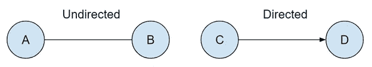
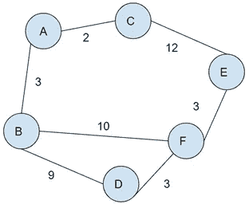
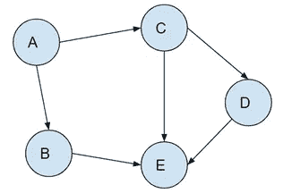

# 图表介绍(第 1 部分)

> 原文：<https://medium.com/mlearning-ai/intro-to-graphs-part-1-af14f5901a67?source=collection_archive---------3----------------------->

Photo by [Alina Grubnyak](https://unsplash.com/@alinnnaaaa?utm_source=medium&utm_medium=referral) on [Unsplash](https://unsplash.com?utm_source=medium&utm_medium=referral)

图形数据结构是顶点(节点)的有限集合和连接一对节点的边的集合。在图中，没有规则规定节点之间的连接。无论节点的位置如何，边都可以连接节点。

Image from [https://www.geeksforgeeks.org/wp-content/uploads/undirectedgraph.png](https://www.geeksforgeeks.org/wp-content/uploads/undirectedgraph.png)

# 定向与非定向

Undirected and Directed edges

有两种类型的边:

*   **无向**边有双向连接。a 到 B 或 B 到 a。
*   **有向**边有单向连接。只有 C 到 d。

无向图的所有边都有无向边，有向图的所有边都有向边。可以使用无序对{A，B}来表示无向边。可以使用有序对(C，D)来表示有向边，其中第一个元素是起点，第二个元素是终点。

# 图表的使用

图形基本上无处不在。一个例子是社交网络。在用户和其他用户之间存在直接或间接的连接。脸书使用无向图来描绘用户之间的友谊。如果某人是你的朋友，你也是他们的朋友。Twitter 使用有向图来映射关系。你可以跟踪名人，但他们跟踪你的可能性微乎其微。流媒体服务的推荐引擎有多个电视节目或电影，就像您最近观看的节目或电影。由于电影的类型、情节、演员或导演，它们之间有着不直接的联系。

# 加权图

在图中，有时有些连接可能比其他连接更好。比如在谷歌地图上寻找最优路径。当你去某个地方时，你想找到最快的路。

Weighted Graph

如果我想从 A 城市到 F 城市，有很多方法可以到达那里。每条“路”对他们都有一定的权重。让我们假设体重越轻，你在这条“路上”花费的时间就越少。其他因素如交通量和速度限制影响“道路”的重量。从 A 城到 F 城最快的路线是 A -> B -> F。

# 循环与非循环

当顶点连接成闭环时，它们被认为是循环的。循环图在地图上的路径选择中非常常见，如上图所示。可以从 A 城经过 B 城到 F 城，不经过 B 城回到 A 城。

Acyclic Graph

无圈图是没有有向圈的有向图。顶点的每条边都指向另一条边，这样它们就永远不会形成一个闭环。不可能从顶点 E 到顶点 a。

感谢您的阅读。下一篇文章将介绍存储和实现图形。

# 资源

关于图表的更多资源，我建议看看这些有用的链接。

【https://medium.com/swlh/data-structures-graphs-50a8a032db03 

[https://www . geeks forgeeks . org/graph-data-structure-and-algorithms/](https://www.geeksforgeeks.org/graph-data-structure-and-algorithms/)

[https://medium . com/basecs/a-gentle-introduction-to-graph-theory-77969829 EAD 8](/basecs/a-gentle-introduction-to-graph-theory-77969829ead8)