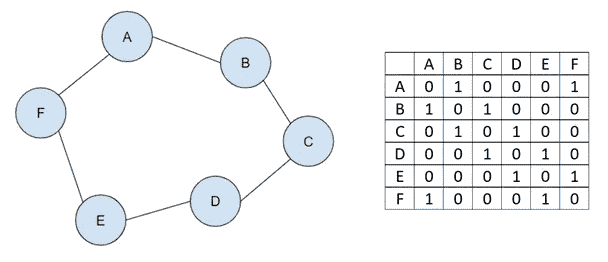
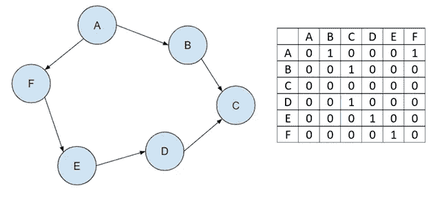
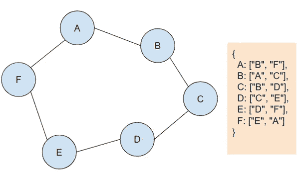
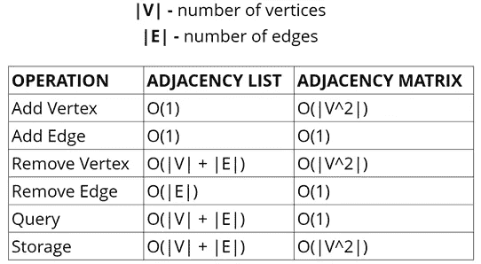

# 图表介绍(第二部分)

> 原文：<https://medium.com/mlearning-ai/intro-to-graphs-part-2-954f6f8af70f?source=collection_archive---------6----------------------->

Photo by [NASA](https://unsplash.com/@nasa?utm_source=medium&utm_medium=referral) on [Unsplash](https://unsplash.com?utm_source=medium&utm_medium=referral)

大家好！这是图表介绍系列的第 2 部分。如果您错过了第 1 部分，链接是本文底部的[这里的](/mlearning-ai/intro-to-graphs-part-1-af14f5901a67)。概括地说，图数据结构是有限的顶点(节点)集合和连接一对节点的边集合。在图中，没有规则规定节点之间的连接。无论节点的位置如何，边都可以连接节点。在这篇文章中，我们将回顾表示图。表示图的两种标准方法是邻接矩阵和邻接表。

# 邻接矩阵

Adjacency Matrix of an Undirected Graph

这个无向图的矩阵表示顶点之间的边。对于顶点 A 的列和行，其边 B 和 f 的值为 1。未连接到 A 的顶点的值为 0。每次你添加一个新的顶点，你将不得不添加一个新的行和新的列。让我们将这个邻接矩阵与有向图的邻接矩阵进行比较。

Adjacency Matrix of a Directed Graph

如果我们现在看 A，它指向 B 和 F，我们可以在 A 行清楚地看到 B 和 F 列的值都是 1。但是，查看 B 行和 F 行，a 列没有值 1。行表示起点，列表示目的地。它是一个从 A 指向 B 和 f 的有向图。一个加权有向图看起来非常相似。我们不是用 1 来表示边，而是将它的权重存储在那里。

# 邻接表

Adjacency List of an Undirected Graph

我们可以使用哈希表为每个顶点存储一个键值对，其中的值表示边。例如，键 A 具有值 B 和 f。对于有向图，顶点键将只具有它所指向的边作为其值。没有边的顶点的值为空

# 邻接表 vs 邻接矩阵

From JavaScript Algorithms and Data Structures Masterclass by Colt Steele

查看邻接表的存储，它取决于顶点和边的数量。邻接矩阵本质上会更大，因为它是一个正方形矩阵，为所有未连接的顶点存储 0 值。为了从邻接矩阵中添加或删除顶点，我们必须添加或删除整个行和列，而不是一个键和它的边。另一方面，在邻接矩阵中搜索更快。例如，我们可以通过查看顶点 1 的行和顶点 2 的列的索引来检查两个顶点之间是否有边。对于邻接表，我们必须遍历每个顶点，直到找到其中一个，然后遍历它的边来找到匹配。这可能需要很长时间。

**利弊**

邻接表与邻接矩阵的比较

**优点** —可以占用更少的空间，更快地迭代所有的边。

**缺点** —查找特定边缘可能会比较慢。

# **最终判决**

由于邻接表占用空间，所以使用得更频繁。如果我们看看现实世界的例子，数据往往非常稀疏。如果我们想象一下所有脸书资料的图表，很少有人是彼此的“朋友”。截至 2020 年，大约有 27 亿脸书用户，每个用户平均有 338 个好友。用户之间的联系相对很少。很多顶点，没有那么多边。然而，邻接矩阵在未连接的用户之间会有数十亿个 0 值。这将是一吨不必要的存储。

感谢您的阅读。下一篇文章将讨论图的遍历。

# 资源

关于图表的更多资源，我建议看看这些有用的链接。

第一部分:[https://medium . com/mlearning-ai/intro-to-graphs-part-1-af 14 f 5901 a 67](/mlearning-ai/intro-to-graphs-part-1-af14f5901a67)

[https://medium . com/base cs/from-theory-to-practice-representative-graphs-CFD 782 C5 be 38](/basecs/from-theory-to-practice-representing-graphs-cfd782c5be38)

[https://medium . com/swlh/getting-started-with-graphs-2 be FAA 509 fc5](/swlh/getting-started-with-graphs-2befaa509fc5)

[https://www . udemy . com/course/js-algorithms-and-data-structures-master class/learn/lecture/8344874 #概述](https://www.udemy.com/course/js-algorithms-and-data-structures-masterclass/learn/lecture/8344874#overview)

[https://medium.com/swlh/data-structures-graphs-50a8a032db03](/swlh/data-structures-graphs-50a8a032db03)