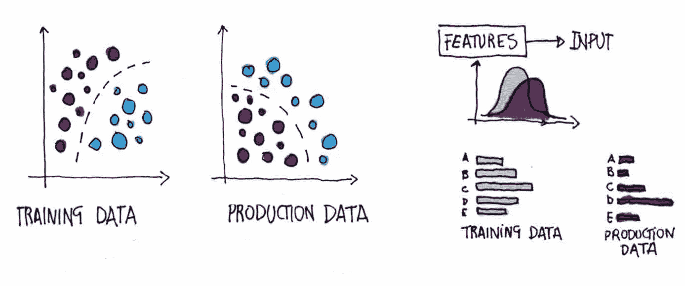
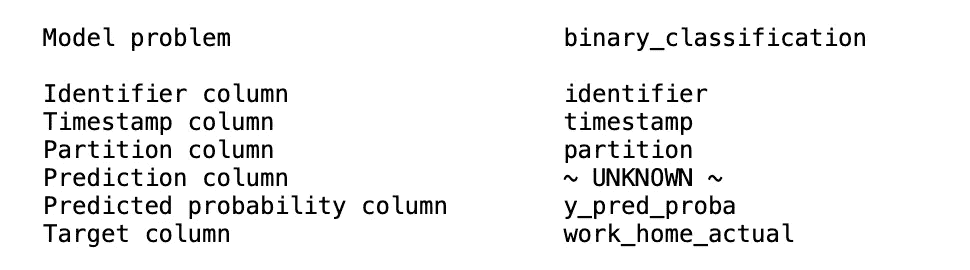
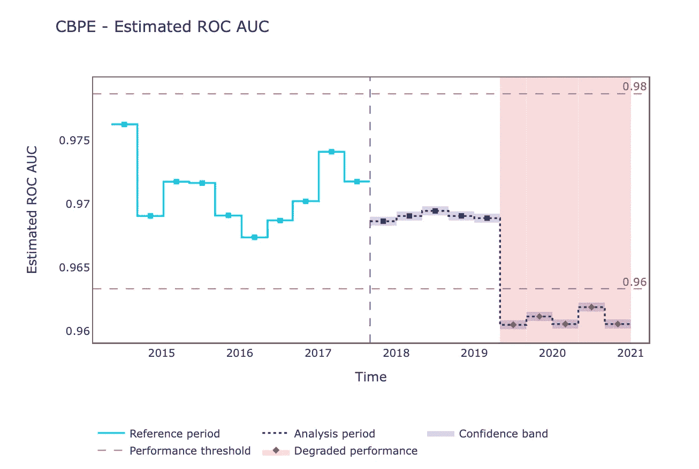
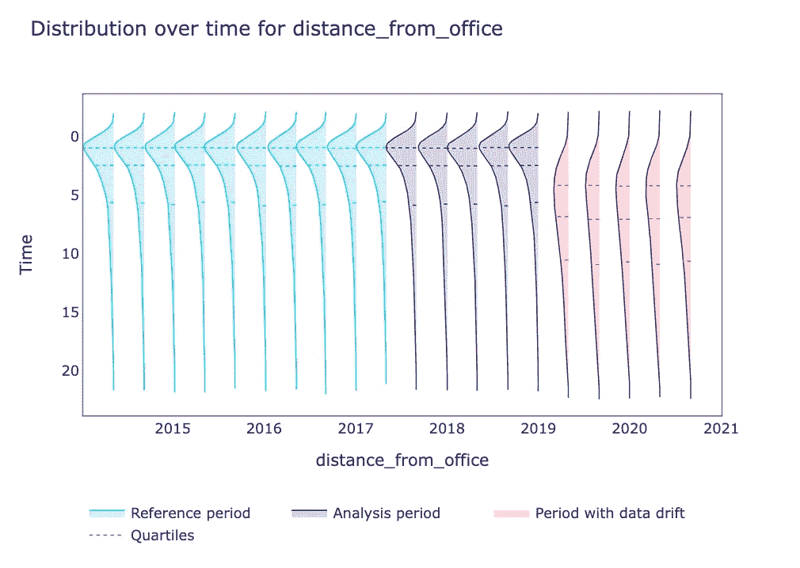
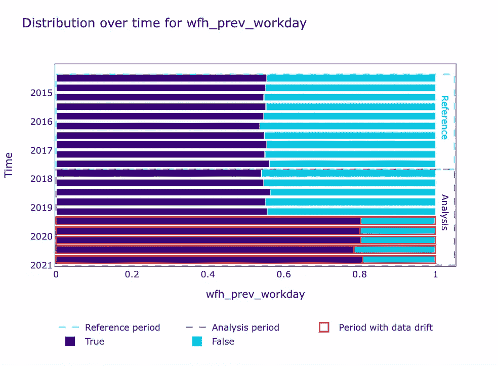
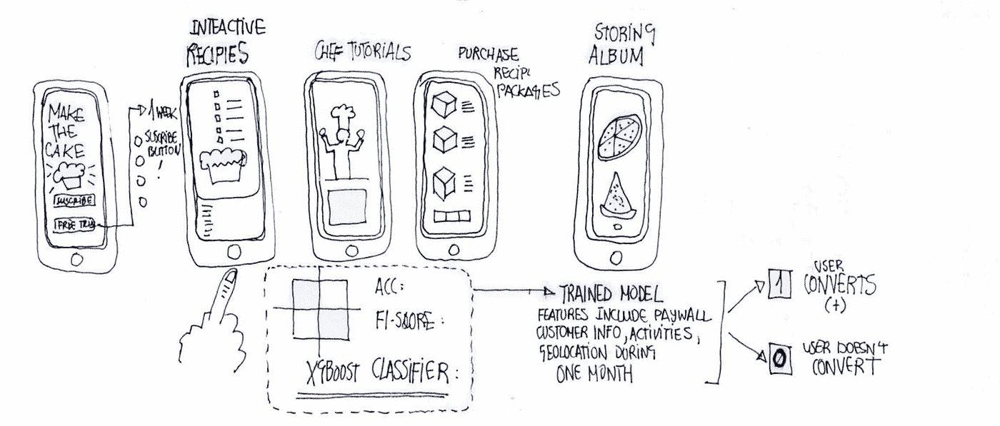

# 部署后模型性能介绍

> 原文：<https://medium.com/mlearning-ai/intro-to-post-deployment-model-performance-eeecc6930aa5?source=collection_archive---------0----------------------->

到时间机器学习模型被部署，它们面对现实**和**它随时间进化。**性能下降**是一种机器学习现象，一旦机器学习模型被部署到生产中，就会发生这种现象，并且可以定义为其**随着时间的推移而贬值或恶化**:这是一个复杂而令人兴奋的挑战，因为总体而言，它对业务问题具有重大影响，并且是**无声的。**

> *通常，当我们可以将预测值-y_hat-与真实标签-y 或实际值进行比较时，通常会检测到性能下降***……那么，我们如何在**缺少目标**的情况下测量性能评估呢？使用开源的 NannyML。**

**

*Fig 1\. The business challenge example we will be working on. We predict **if a worker will work from home in a binary classification scenario on a given day.** Each Dataset row contains a unique identified observation about a worker on a day of the week and considers several features, such as the distance from the office, transportation costs, and if the worker worked from home the previous day.*

# *机器学习模型为什么会失败？*

*机器学习模型通常基于历史或静态数据进行训练。但是，环境和关键条件会导致数据发生变化，从而导致数据的模式发生变化，导致模型的预测随着时间的推移而降低。机器学习模型失败有两个主要原因:*

*   ***数据漂移**:我们可以将其定义为模型将推断的特征中编码的数据输入分布的不可预测**变化。它可能会影响拟合函数或分类器的准确度。尽管这在小型数据集中可能很容易发现，但当我们在大规模数据集中有数百个要素时，这可能是一个挑战。***
*   ***概念漂移**:输入和目标之间的**决策边界或整体分类器模式**的变化。分类器捕捉这种关系的快照，但是随着概念的改变，这种快照变得越来越不准确。所以换句话说，分类器的行为没有改变，但潜在的模式改变了，这种模式不再是现实的良好代表。[1]*

**

*Fig 2\. Concept drift and Data drift. Factors like seasonality can cause Data Drift, and one of the ways to detect concept drift is to plot feature importance for the classifier: one example of Data drift in work from Home prediction challenge is that we recently hired some people who work far from the office or a later initiative of pizza Fridays that make workers return.*

> *数据漂移和概念漂移之间的主要**差异**在于**数据漂移**与自变量的统计特性**的变化相关，而概念漂移是因变量**的统计特性发生重大变化时，与**分类器**或相关的输入和输出之间模式的变化。**[**NannyML**](https://github.com/NannyML/nannyml)**性能评估重点检测**数据漂移**和**多元数据漂移*******

# *****在 NannyML 中是如何工作的？*****

***在现实世界的问题中，我们通常会面临这样的挑战:在事实标签和预测之间有一段时间的间隔，或者甚至没有实际的标签。因此，非常高级的想法是**基于与概率估计相关的阈值进行预测**和**比较来自分析分区和参考分区的数据，以检测数据漂移。*****

***该库提供了一个概率估计算法。然而，为了在 NannyML 中运行性能评估，我们应该考虑一些事情:***

*   *****分区**:数据集被分成参考和分析分区。**参考分区**设置期望值，需要真标签(y)，它代表一个数据周期，在这个周期内我们确信**模型表现良好；**如果模型还没有部署**，**我们可以使用这里的测试集**来测试基线模型。****分析分区**不需要真正的标签:NannyML 基于置信度的性能评估算法方法是在分析阶段完成的。***

> *****参考分区**将具有**真实预测标签**和**预测概率**，我们应该知道它是与良好模型性能相关的数据。分析分区将只有**预测概率，没有真实目标标签。**查看[数据分区](https://docs.nannyml.com/latest/guides/data_drift.html#data-drift-partitions)文档。***

*   ***需要正类的**得分/预测概率** ( *预测 _proba* 或*决策 _ 函数* Sklearn 方法，取决于分类器)作为数据集内的列，每个观察的**唯一标识符**，以及在这种情况下观察发生的**时间戳**。***

***为了适合分类器，我们需要提取元数据，并且需要声明目标列名***

```
***occurred.metadata = nml.extract_metadata(reference)
metadata.target_column_name = ‘work_home_actual’***
```

******

***Fig3\. How the metadata looks like. NannyML will automatically detect some of them, but you might want to double check them here. If you have separated reference and analysis datasets, you need an extra column with a categorical partition name.***

***现在，让我们来拟合基于置信度的性能估计器！***

```
***cbpe = nml.CBPE(model_metadata=metadata, chunk_period="D")
cbpe.fit(reference_data=reference)***
```

> *****数据块**。我们基于**时间间隔**创建块，但是需要根据业务案例来理解数据块:如果没有指定，NannyML 将自动对引用分区进行分块。请注意这一点，因为它可能会影响性能估计器。***

******

***Fig4\. [2] Call the *Confidence-based performance estimator*, and interpret model decay, including it in timing and performance threshold. The graph represents the estimated ROC AUC curve over time in between an acceptable threshold. The **blue** and **purple** plotted lines refer to the reference(access to the label ) and analysis( not access to the label ) partitions. Regarding p**erformance threshold**, and given that a good AUC is near 1, it does make sense that the optimal threshold might be in between the given range. The model shows a model decay since late 2019.***

> ***此时，我们可能知道 2019 年性能下降，但我们如何知道发生了什么？***

************

***Fig5\. [2] The framework plots the distribution of continuous and categorical features in reference and analysis partitions and can print alerts for data drift in a dataset . At this point, we can see a change with respect to the distribution of the work from home previous day feature and distance from the office. The first figure shows that there has been a change in how far workers are from the office, tending to live farther, causing model decay . In the second figure, the boolean distribution of the feature work from home previous day.***

***在 [PyData Madrid meetup](https://www.meetup.com/PyData-Madrid/events/284942321/) 中，我们分享了一个真实的商业案例，这是一个使用真实世界数据的真实世界挑战。***

******

***Fig6.Business challenge example we will be working with at PyData Madrid meetup . We predict **a subscription after a one-month trial for a mobile recipes dessert app**. **There is a one-month time-lapse between the real label (y) and the predicted label(y_hat).** Therefore, we have an absence of the ground truth for a month. **How can we know that our model is performing well without losing customers**? The app includes four main activities, with historical data from one month, with device and geolocation information about the user. The base binary classifier model ( xgboost ), in which **label 1** represents the positive class(that the user converts) and label 0 represents that the user does not convert: we deployed into production shows an ACC of 0.766 of and F1 score of and will be the model we will use for **performance estimation**.***

*****结论*****

***[1]感谢 [NannyML](https://www.nannyml.com/) 联合创始人反馈修正！***

***[2]数字来自 NannyML docs***

***[](/mlearning-ai/mlearning-ai-submission-suggestions-b51e2b130bfb) [## Mlearning.ai 提交建议

### 如何成为 Mlearning.ai 上的作家

medium.com](/mlearning-ai/mlearning-ai-submission-suggestions-b51e2b130bfb)***