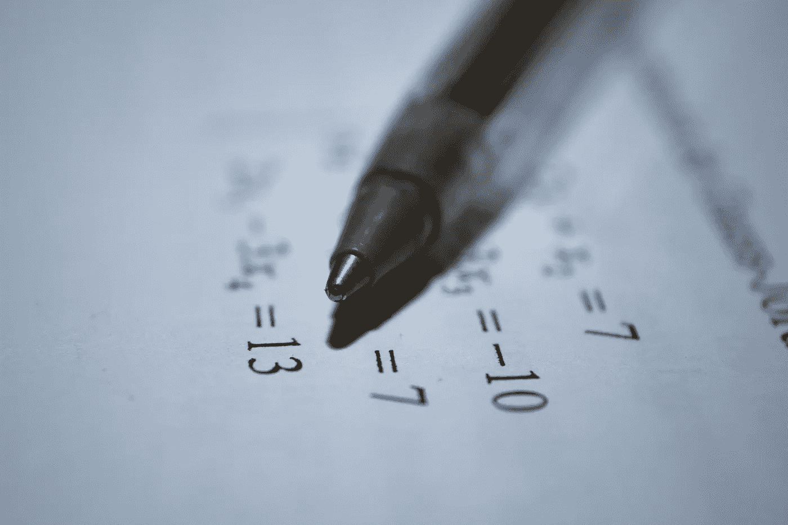

# 归纳法证明介绍(我发现它们很吸引人！)

> 原文：<https://medium.com/mlearning-ai/intro-to-proofs-by-induction-i-find-them-fascinating-37a8a0e1cae7?source=collection_archive---------6----------------------->

我通常写软件工程主题，但是我想念数学！所以，我想我应该写一个在我学习数学时让我震惊的概念:归纳法证明。

Photo by [Antoine Dautry](https://unsplash.com/es/@antoine1003?utm_source=unsplash&utm_medium=referral&utm_content=creditCopyText) on [Unsplash](https://unsplash.com/s/photos/math-professor?utm_source=unsplash&utm_medium=referral&utm_content=creditCopyText)

归纳法证明是一种证明数学陈述对任何自然数都成立的方法。