# 维特比算法简介

> 原文：<https://medium.com/mlearning-ai/intro-to-the-viterbi-algorithm-8f41c3f43cf3?source=collection_archive---------1----------------------->

Photo by [Jeffrey Brandjes](https://unsplash.com/@jeffreyfotografie?utm_source=unsplash&utm_medium=referral&utm_content=creditCopyText) on [Unsplash](https://unsplash.com/s/photos/sequence?utm_source=unsplash&utm_medium=referral&utm_content=creditCopyText)

在上一篇关于隐马尔可夫模型(HMM)的文章中，我们没有解决找到最可能使用的硬币序列的问题。如果你没有看过 HMMs 上的帖子，我强烈建议你去看看。对于那些不知道的人，我将概述这个问题。假设某个古鲁走到你面前，告诉你从一个袋子里拿一枚硬币(袋子里只有两枚硬币)，然后把硬币抛起来。你会看到一个头或者一条尾巴。然后你把硬币放回袋子里，再重复 3 次。你观察头，尾，尾，头。古鲁说如果你猜对了顺序，他会给你一百万美元。古鲁给了你一个嗯。找到最可能的序列将产生最大的获胜机会，但是我们如何找到它呢？正如你可能已经猜到的标题，我们可以使用维特比算法。

# 什么是维特比算法？

维特比算法是用于寻找最可能的隐藏状态序列的动态规划解决方案。如果我们有一组状态 Q 和一组观测值 O，我们试图找到使 P(Q|O)最大化的状态序列。通过条件概率，我们可以将 P(Q|O)转换为 P(Q，O)/P(O)，但是没有必要寻找 P(O ),因为 P(O)与状态序列的变化无关。我们可以找到使 P(Q，O)最大化的状态序列。让我们深入研究 P(Q，O)的公式。

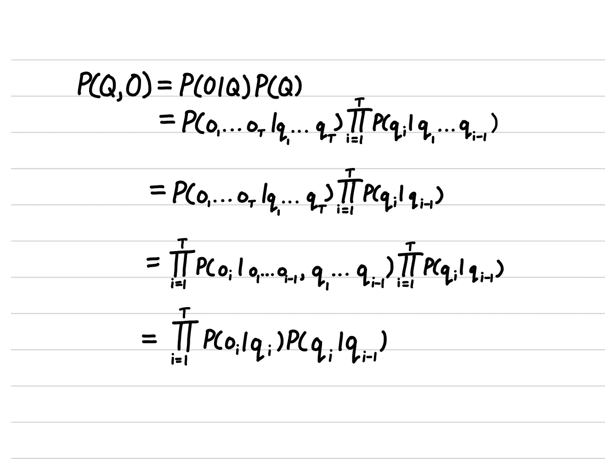

**注:** T 为序列中的观测值个数。如果您需要复习 HMM 模型中使用的符号，我建议您查看我在 HMM 上的帖子。

因此，如果我们想找到最大化 P(Q，O)的状态序列，你可以想象这将是非常昂贵的，因为我们必须最大化所有可能的状态序列的 P(Q，O)。这就是维特比算法的用武之地。维特比算法是求解最可能序列的迭代方法。我们不是为所有的观测值寻找最可能的隐藏状态序列，而是想找到下一个最可能的隐藏状态。我们反复寻找最可能的状态，直到我们完成了一系列的观察。

# 维特比算法

在我们深入研究这些步骤之前，我们应该为维特比算法指出一些符号。

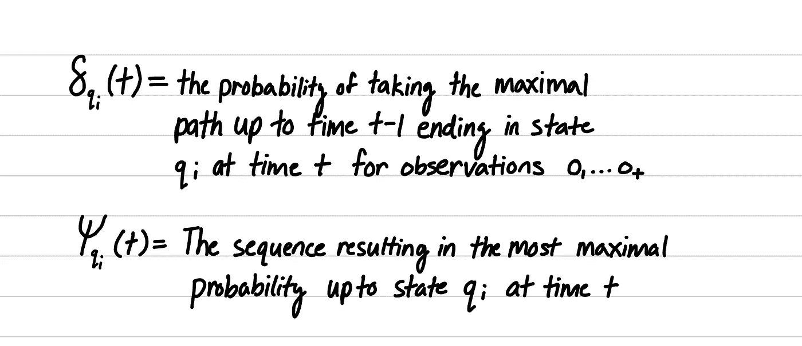

维特比算法由**三个**步骤组成。

**第一步:初始化**

我们首先创建一个起始状态 q*。然后我们找到初始状态的概率和给定初始状态的观测值。在这种情况下，P(qi|q*)是起始状态为 qi 的概率。

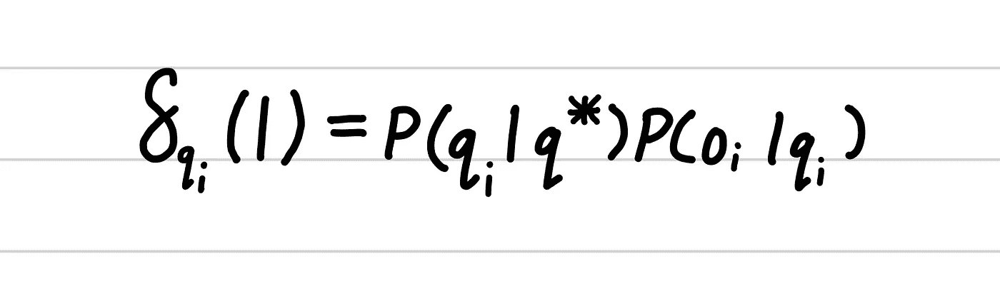

**第二步:诱导**

当 T 大于或等于 2 且小于或等于 T 时，我们执行归纳步骤，其中 T 是观察值的数量+ 1(加 1 来自添加的起始状态)。t 代表观察总数。

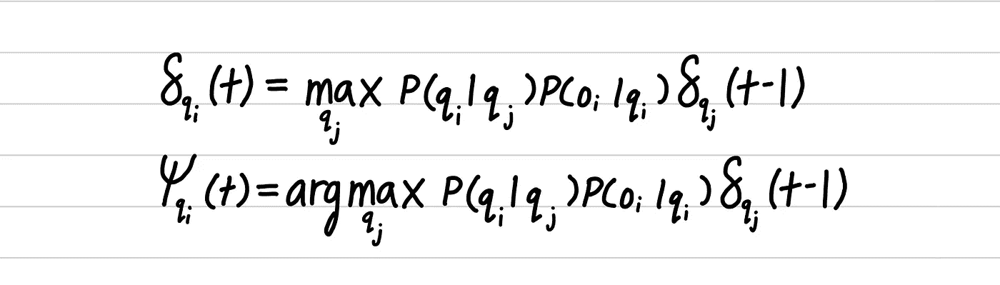

**第三步:终止**

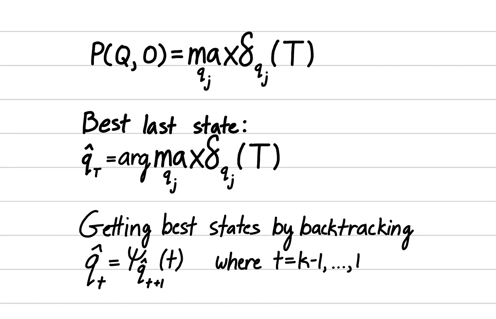

# 例子

让我们想想我们是否能得奖。如前所述，古鲁给了我们一个 HMM，让我们更有可能赢得奖金。

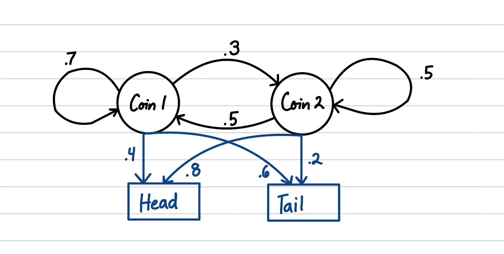

所以，让我们继续，开始寻找我们观察头，尾，尾，头时最可能的隐藏状态序列。我喜欢用格子来形象化维特比算法(下图)。

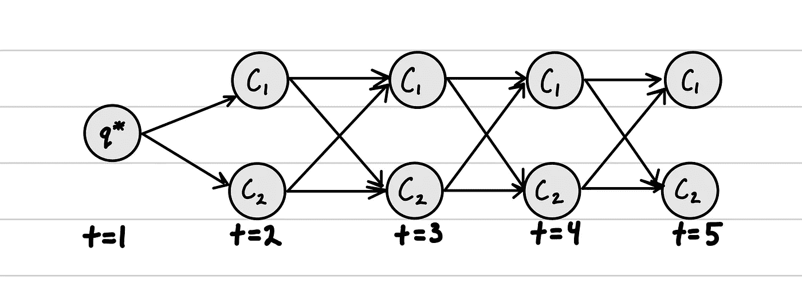

Trellis for coin flip

根据算法的定义，在执行归纳步骤之前，我们需要首先进行初始化。

**初始化步骤**

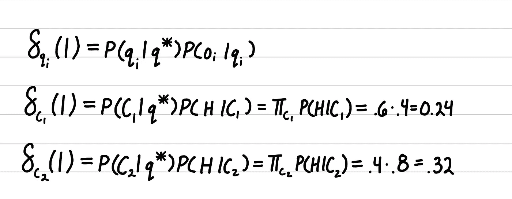

Initialization step

在这里，我们计算在时间步长 1 观察硬币 1 和硬币 2 的概率。我们用初态分布代替用户 P(qi | q*)。现在我们已经在时间步骤 1 初始化了函数，我们可以开始归纳步骤。

**t = 2 时的感应步骤**

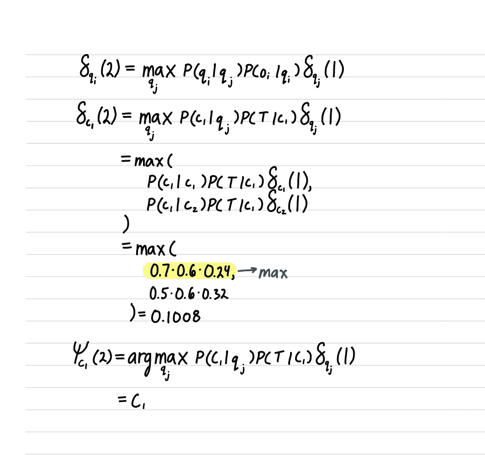

Induction step at time t=2 for coin 1

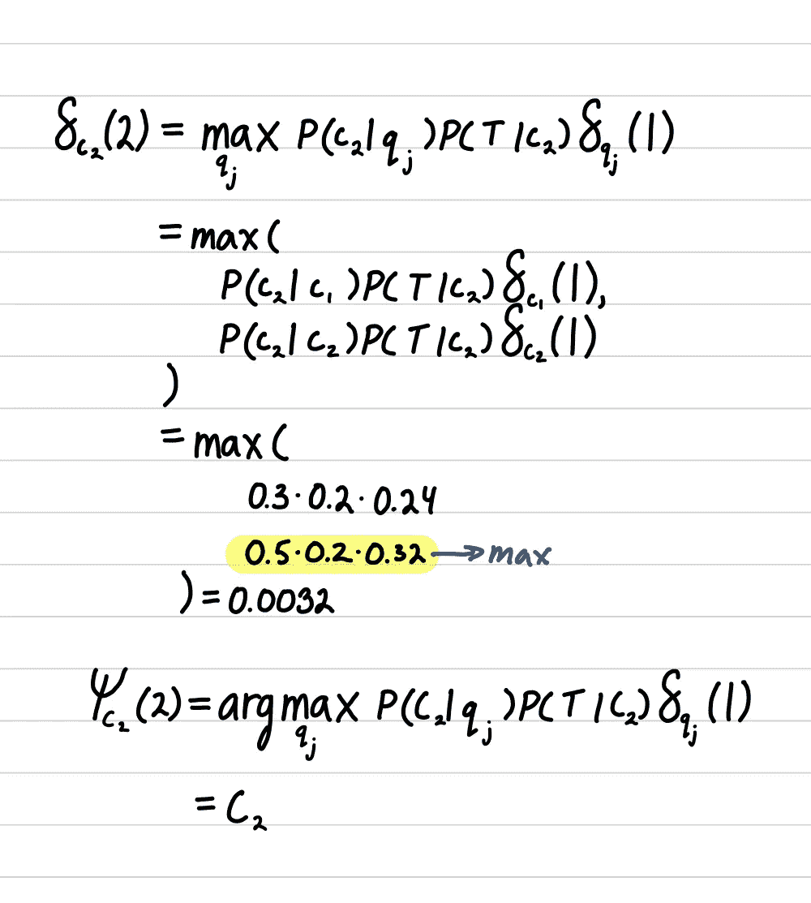

Induction step at time t=2 for coin 1

记住，在归纳步骤中，我们希望发现 t-1 时刻的状态使函数最大化。我们通过取最大化δ函数的状态来做到这一点。我们对当前时间步中的所有状态都这样做。这里我们看到，如果我们在时间步骤 2 处于状态硬币 1，则在时间步骤 2 使概率最大化的硬币是硬币 1，如果我们在时间步骤 2 处于状态硬币 2，则硬币 2 使概率最大化。

我不想让博客的主要部分陷入计算的泥沼，所以如果有人想看的话，我会把它们添加到博客的底部。在我们完成计算之后，我们发现具有最大可能性的序列具有大约 1.2%的概率。这让我们得出这样的结论:尽管我们做了这么多努力，我们很可能不会赢得这场比赛。至于最有可能的序列，硬币 1，硬币 1，硬币 1，硬币 1。如此虎头蛇尾的解决问题的方式。

# 结论

希望这是对维特比算法的有益介绍。我在考虑未来改变博客的格式，采用数据科学的方法来解决现实世界的问题，比如证明为什么你永远无法在 21 点或崩溃中成功击败庄家，以及预测比特币的价格。如果你想看到更多的内容，请在下面留言。一如既往，如果你喜欢这个帖子，请确保击碎鼓掌按钮，如果你喜欢这些风格的帖子，请确保关注我。

# 剩余维特比算法计算

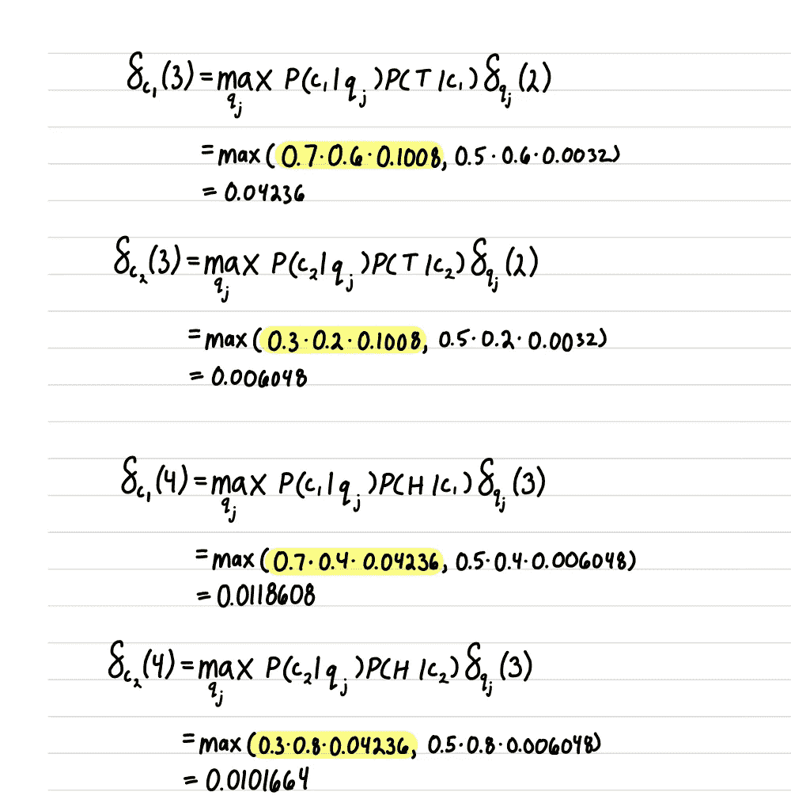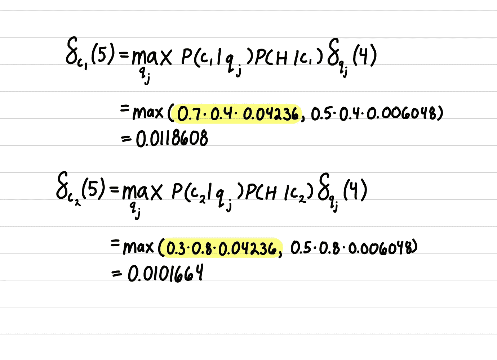