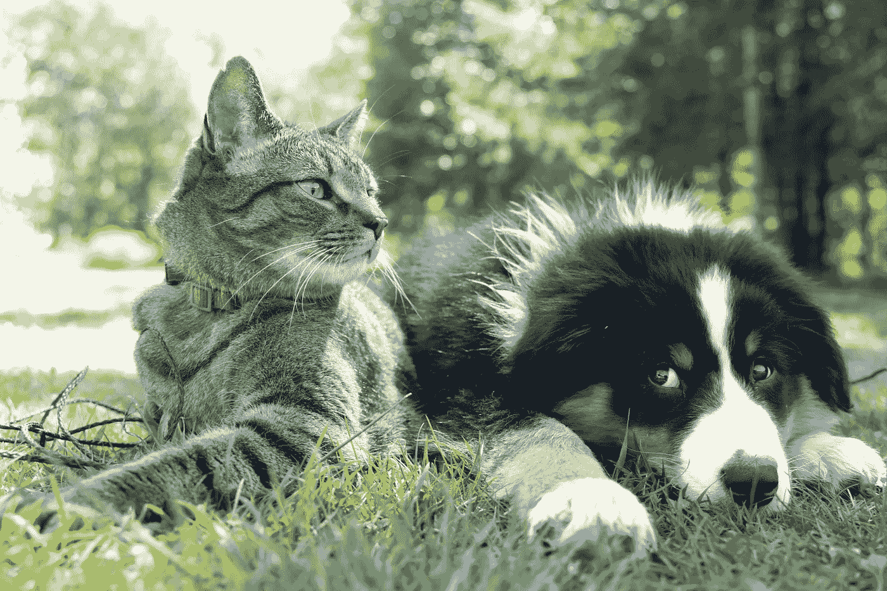
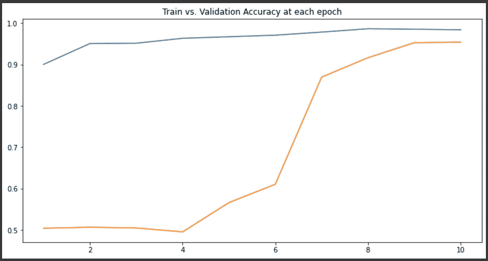
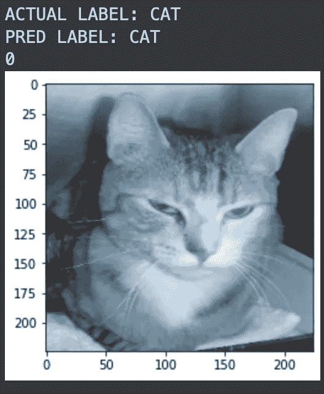
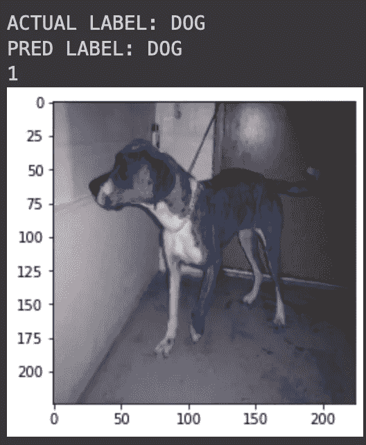
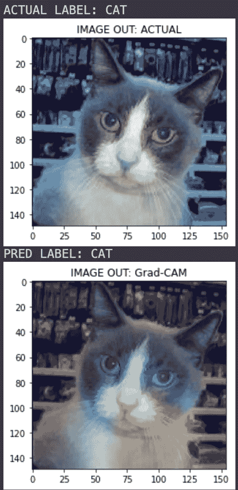
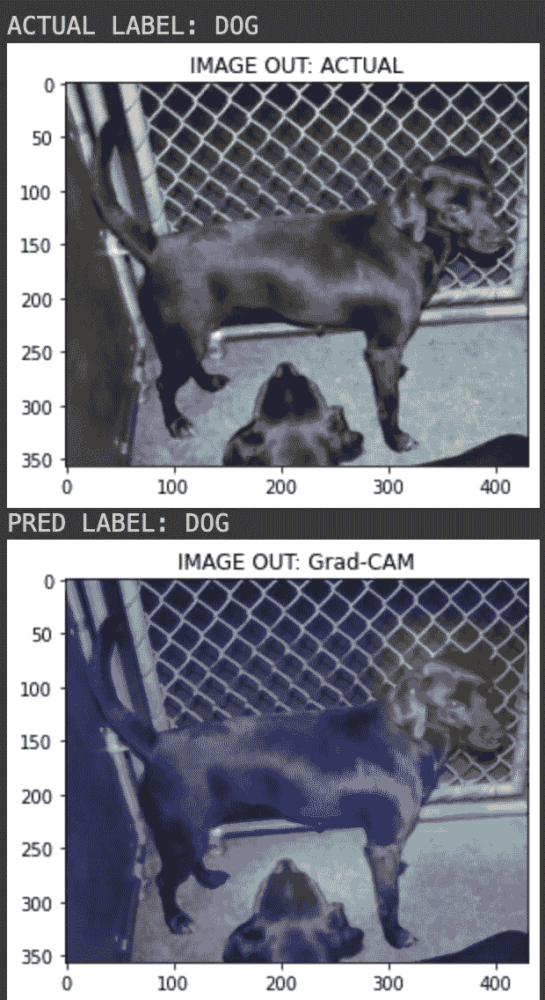

# 用 Grad-CAM 在计算机视觉模型中引入模型可解释性

> 原文：<https://medium.com/mlearning-ai/introduce-model-explainability-to-computer-vision-models-with-grad-cam-cf33b405d45b?source=collection_archive---------6----------------------->

Photo by [Andrew S](https://unsplash.com/@sita2?utm_source=unsplash&utm_medium=referral&utm_content=creditCopyText) on [Unsplash](https://unsplash.com/s/photos/cats-and-dogs?utm_source=unsplash&utm_medium=referral&utm_content=creditCopyText)

# 介绍

这是一个关于如何实现 Grad-CAM 可视化到计算机视觉模型的代码演练。我已经考虑了为这个 walktrough 分类狗和猫的图像的问题。数据集取自 [Kaggle](https://www.kaggle.com/datasets/nafisur/dogs-vs-cats) ，其中包含分别包含狗和猫图像的训练和验证文件夹。

我们将从导入数据集开始，应用预处理，训练分类器，然后进行预测。

最后，我们将介绍 Grad-CAM 的概念，并看看它的实际应用。因为训练模型以获得更好的准确性是一回事，而且更好的是知道模型是否实际上基于图像中的正确部分做出那些预测。

# 训练分类器

首先，我们执行所有必要的导入，并使用 Tensorflow ImageDataGenerator 加载图像数据集，还将训练集和验证集的重定比例因子设置为 1/255。此外，对训练集应用水平翻转。批量大小设置为 16，每个图像的大小调整为 224x224。

下一步，我们创建我们的 CNN 分类器，它将被训练来分类猫和狗。这里，我使用了迁移学习，我考虑了 ResNet-50，它是用 ImageNet 权重预先训练的。请注意，我已经从 ResNet-50 模型中移除了顶层，并附加了一个新的分类层。下面是创建和执行培训操作的代码。

训练完成后，检查模型性能的准确性，它显示高于 90%，如下图所示。

Train vs. Val accuracy

# 做预测

现在，让我们加载保存权重，并对看不见的图像进行预测。下面的代码从验证集中选取一个随机图像，模型对同一个随机图像进行预测。我们对图像进行与训练时相同的预处理步骤(重新缩放和调整大小)。

以下是模型的预测输出。

Predictions made by model

# 关于毕业生摄像头

*梯度加权类激活映射* (Grad-CAM)是一种用于构建大量基于 CNN 的模型所采取的动作的技术。它根据传递到深度学习模型的最后一个卷积层的信息生成粗略的定位图。

# 生成 Grad-CAM 可视化

最后一步是使用 Grad-CAM 技术生成热图。需要为可视化执行以下步骤。

1.  我们建立一个模型，将信号图像转换为最后一个卷积层的激活和输出预测。此外，放弃最后一层的激活功能。
2.  计算与最后 conv 层激活相关的输入图像的顶部预测类的梯度。
3.  我们将特征映射数组中的每个通道乘以最高预测类的重要性，然后将结果相加以获得热图类激活。
4.  将热图数组值标准化到 0 和 1 之间
5.  最后，我们将生成的热图叠加到输入图像上。

让我们看看代码。仅供参考:生成可视化效果的代码取自此处的。请注意，您可能需要根据模型更改第 86 行中的 last _ conv _ 图层 _ 名称变量的值。

成功运行后，输出应该如下所示。

Grad-CAM visualization (ResNet-50)

我们可以清楚地看到，该模型在理解主要特征的定位方面做得非常好，并且能够正确区分猫和狗。

# 结论

希望这篇文章给了你正确的想法，告诉你我们如何将模型可解释性引入到计算机视觉模型中。

现在，这不仅限于猫和狗，还有更多现实世界的应用，我鼓励你探索更多新的方法和途径，我们可以为黑盒模型带来更多的透明度。

这篇文章的完整笔记本可以在[这里](https://nbviewer.org/github/iamrajatroy/Data-Science-Lab/blob/main/notebook/Deeplearning_Grad_CAM.ipynb)访问。

 [## Mlearning.ai 提交建议

### 如何成为 Mlearning.ai 上的作家

medium.com](/mlearning-ai/mlearning-ai-submission-suggestions-b51e2b130bfb)