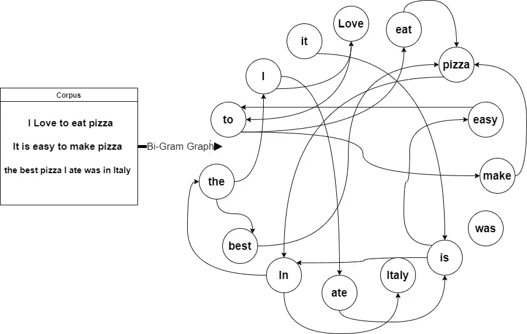
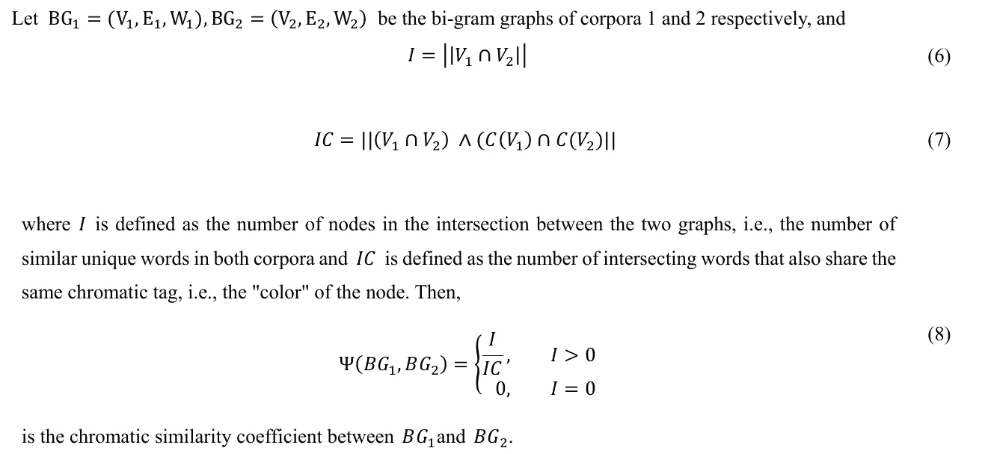

# 在自然语言处理和大型语料库中利用图论的力量

> 原文：<https://medium.com/mlearning-ai/introducing-a-new-approach-to-large-corpus-processing-in-nlp-fe5cbcbc901a?source=collection_archive---------4----------------------->

Photo by [nadi borodina](https://unsplash.com/@borodinanadi?utm_source=medium&utm_medium=referral) on [Unsplash](https://unsplash.com?utm_source=medium&utm_medium=referral)

机器学习算法在人工智能领域变得越来越强大。机器学习中令人着迷的分支之一是自然语言处理领域。

NLP 可以用来解决人类以其有限的技能和能力无法解决的问题。它可以帮助我们说出我们需要知道的东西，消除对某些群体的偏见，或者揭开隐藏在我们眼前的模式。

使用任何 NLP 相关的管道或算法的第一步是定义一个代表文本的语料库或数据集。您可以通过将数据导入数据库/数据结构，对其进行清理，然后根据手头的任务将其放入您选择的算法中。虽然在处理大型语料库的过程中有许多高端解决方案，但似乎在这个过程中错过了一些令人惊讶的替代方案，我和我的研究同事探索了将大型语料库表示为“图”的好处，并研究了不同的图论属性揭示了关于给定语料库的哪些故事，以及如何利用这些属性来解决相当复杂的问题，并为语言建模和计算语言学领域带来新的相似系数。

# **二元图属性**

本文介绍了将大型语料库表示为图的好处，其中单词表示图的节点，加权边是语料库中的语义关系。这些差异是从抽象的角度来看的——因为不同的图有不同的属性和语义关系。我们展示了定义这样的图如何允许用户利用它们的属性，通过使用传统的基于优化学习的技术来获得各种既定问题的解决方案。

# **色度相似系数**

本文提出的新的相似系数(或称之为*色相似系数*ψ),是一种新的基于色数来度量两个或多个图表示的语料库之间关系的方法。它是两个图形之间相似程度的定量度量。ψ(G1，G2)的值描述了两个图在表示节点的组件颜色和指定节点颜色之间的相交程度方面彼此有多接近。

The formula for Ψ as seen in the paper

# **随机彩色步行者**

随机色度行走是一种简单而有效的基于给定语料库的语义和出现频率生成大规模文本的方法。通过首先给图着色，我们可以画出一组随机的色数，并找到满足这种“行走”的两个初始状态之间的路径，并基于对应于这些颜色的单词生成一个句子或一个段落。

为了补偿不均匀的颜色标签分布，我们提出一个随机选择 J 的阵列，使得 1 J(BGx)和 beta 分布。根据在第一随机颜色标签阵列中生成的颜色标签，两个随机选择的单词之间的路径的连接。

根据用于计算的协议，使用这种方法可以获得许多独特的结果。我们成功测试的协议包括:

**1。**最优权重路径。

**2。**最小权重路径。

**3。**密度最高的路径。

**4。**密度最低的一个。

# **彩色句子嵌入**

当处理文本和机器学习时，通常我们的第一步是通过任何成熟的矢量化/嵌入算法和方法，如 TF-IDF、词袋、GLoVe、BERT 嵌入等，用一些向量空间来表示文本。

我们在本文中提出的新方法是*色向量化*，它使用类似于单词包方法的方法将语料库中的单词嵌入到向量空间中。唯一的主要区别在于，我们不使用每个单词的相对频率，而是在给图形着色时使用分配给该单词的色数。

使用具有用于色彩矢量化的期望上下文的语料库二元图可以为用户提供嵌入不同文本的服务，甚至在原始语料库中给出的样本之外，类似于我们通常在深度学习中所做的，我们在这里称之为*迁移学习*，而不是训练模型，我们给图着色。

**延伸阅读**

康斯坦丁诺夫斯基，t .，&米茨拉奇，M. (2021 年 7 月 29 日)。*关于二元图属性*。计算机和信息科学。检索到 2021 年 10 月 30 日。