# 协同推荐系统背后的数学:Goodreads 图书数据集述评

> 原文：<https://medium.com/mlearning-ai/introduction-cbc02aedc03d?source=collection_archive---------1----------------------->

[Github](https://github.com/SwetaPrabh/Book_Recommendation_System_R) | [Linkedin](https://www.linkedin.com/in/swetaprabha/)

Photo by [Giulia Bertelli](https://unsplash.com/@giulia_bertelli?utm_source=medium&utm_medium=referral) on [Unsplash](https://unsplash.com?utm_source=medium&utm_medium=referral)

# 介绍

在过去几年中，推荐系统在电子商务和在线媒体中获得了巨大的流行，以增加用户交互。我们的许多日常选择都是由个性化推荐系统驱动的，这些系统是使用机器学习算法实现的。一些常见的推荐系统是网飞推荐电影、Spotify 上的音乐、谷歌广告和亚马逊上的产品推荐。大多数企业使用两种主要类型的推荐系统。基于内容和协作。基于内容的推荐系统使用项目特征来推荐相似的产品。例如，如果我是阿加莎·克里斯蒂的粉丝，系统会向我推荐同一作者的其他书籍或其他作者的舒适之谜。协同推荐系统对相似类型的用户进行聚类，以将聚类中的一个用户已经推荐的项目推荐给没有尝试过该项目的其他用户。在本文中，我使用 Goodreads 的图书特征数据集探索了协作推荐系统背后的基本概念。与任何其他机器学习项目一样，我从探索性数据分析开始，并用代码包装它，以实现一个基本的基于用户的推荐系统。

# 探索性数据分析

## 资料组

数据收集自 [UCSD 图书图](https://sites.google.com/eng.ucsd.edu/ucsdbookgraph/home)。对于这个项目，我使用了来自图书和[书评](https://sites.google.com/eng.ucsd.edu/ucsdbookgraph/reviews?authuser=0)的[元数据的完整图书图。从包含 27 个特征的图书图数据集中使用了 150，000 本书的子集，这些特征包括标题、出版商、评级、image_url、语言等。评论数据集包含 10k 行的用户 id、图书 id 和用户评级，这些数据是从图书图表数据集中为 2000 年至 2017 年间出版的图书排序的。我在这个项目中使用了 RStudio。](https://sites.google.com/eng.ucsd.edu/ucsdbookgraph/books?authuser=0)

## 电子设计自动化(Electronic Design Automation)

对于探索性数据分析，调查了以下问题:

*   每年出版的书籍数量
*   页面数量如何影响人气？
*   哪些书的版本最多？
*   最受欢迎的语言是什么？
*   在过去的十年里，电子书的受欢迎程度有什么变化？
*   哪种格式最受欢迎？
*   平均评分和受欢迎程度有什么关系？
*   什么收视率更有可能？
*   10 大出版商及其受欢迎程度？

## 每年出版的书籍数量

图 1 和图 2 给出了我的数据集中 1900 年至 2017 年间的出版物数量。可以看出，数据集中的大多数书籍都是在 2000 年至 2017 年之间，包含这些年份书籍的行被过滤掉了。人们还注意到，2007 年后出版物的数量有所增加。这是 kindle 上市和电子书开始流行的时候。

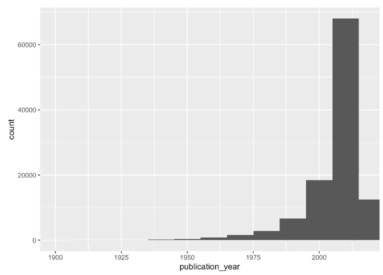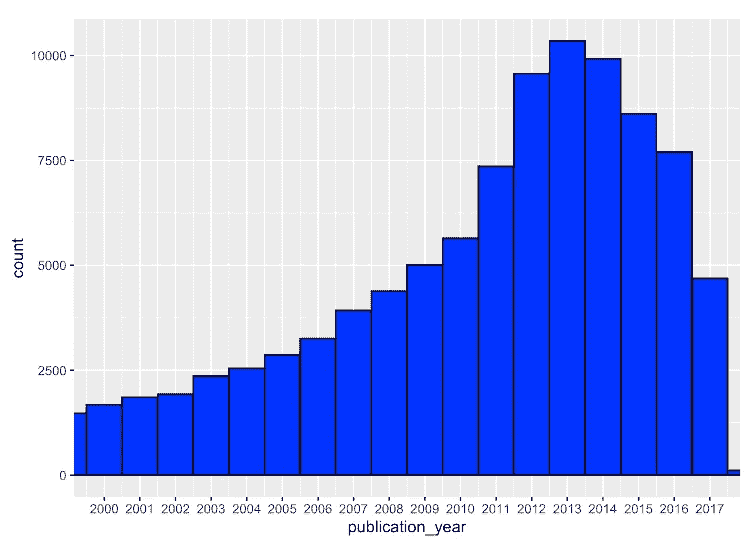

Fig 1:Books Published between 1900–2017\. Fig 2: Books published between 2000–2017

## 页数

评级的数量被认为是对有多少人阅读这本书或受欢迎程度的估计。从页数与平均评分的散点图(图 4)和页数与评分的散点图(图 5)可以看出，厚书不太受欢迎，但大多评分很高，很少有异常值。大多数受欢迎的书都有 200-400 页长。

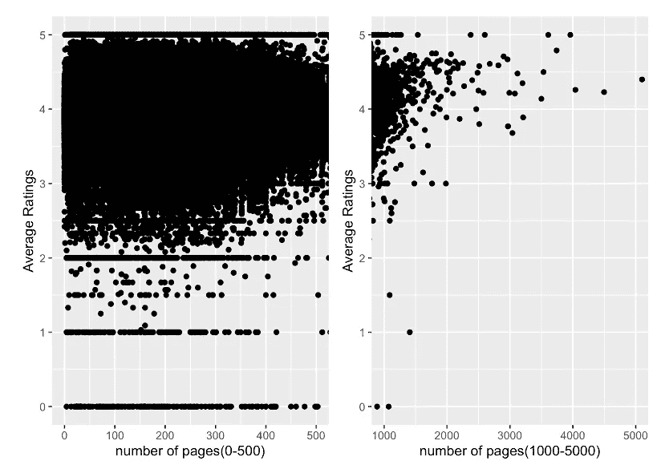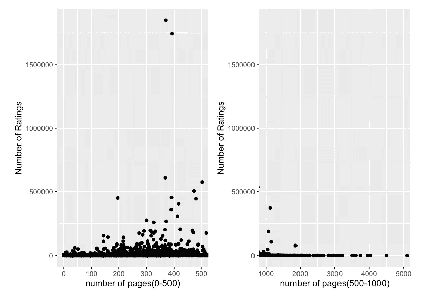

Fig 3: No. of pages vs avg rating. Fig 4: No. of Pages vs No. of ratings.

## 作者数量和版本数量

我的数据集拥有多达 51 位作者的书籍。可以看出，有超过 10 个作者的书被高度评价，尽管这种关系不是线性的，因为有许多被高度评价的单个作者的书，但是很少有超过 10 个作者的书被评价为低于 3(图 5)。很少有书有很多版本，包括语言、格式和版本。在我的数据集中，数量最多的版本是《斯托尔兹与弗鲁特伊尔》(图 6)，在德语中是《傲慢与偏见》的意思。这本简·奥斯汀 1813 年的小说有 3000 种不同语言的版本。

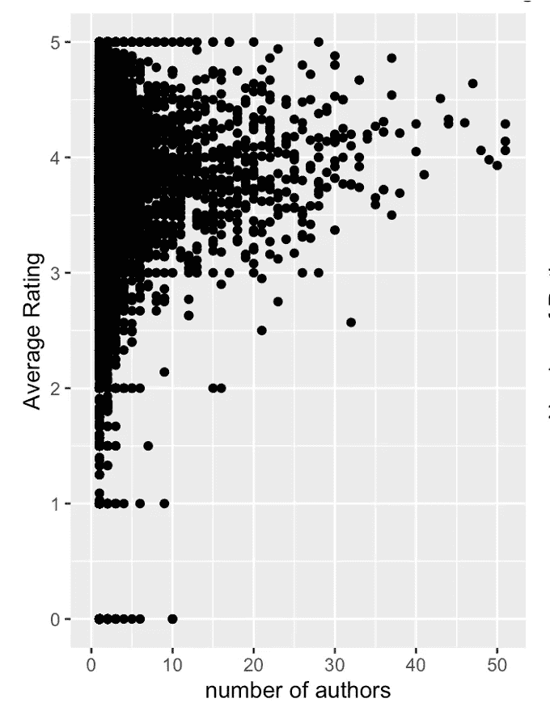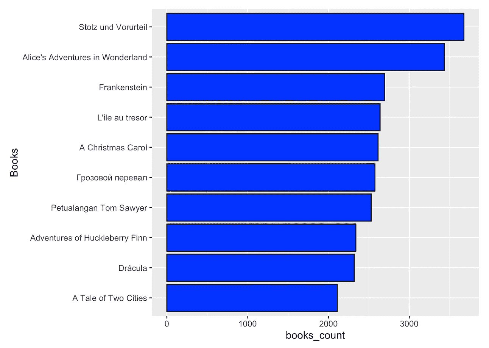

Fig 5: Average rating of different number of author. Fig 6: Top 10 books with maximum versions

## 语言和格式

如图 8 中的条形图所示，英语是最受欢迎的语言，其次是西班牙语、阿拉伯语和法语。还有，kindle 对人们的阅读行为影响很大。kindle 比其他形式的电子书更受欢迎。

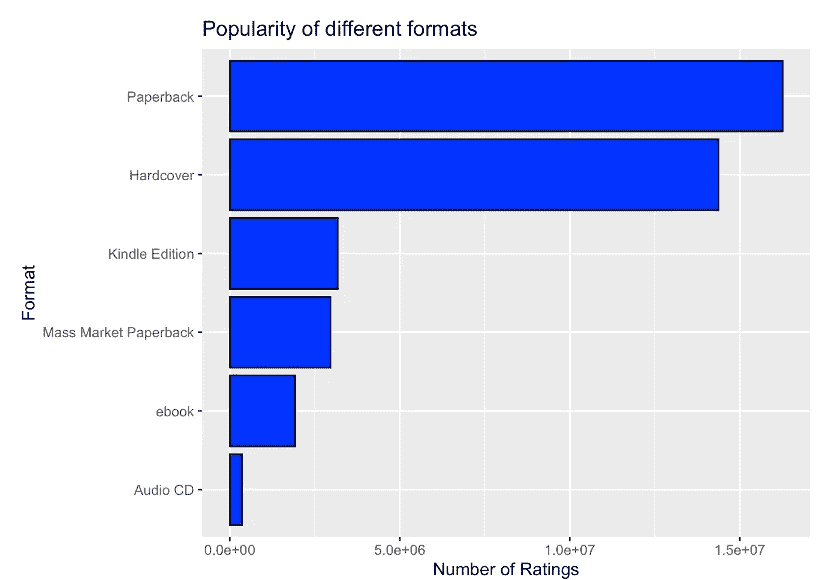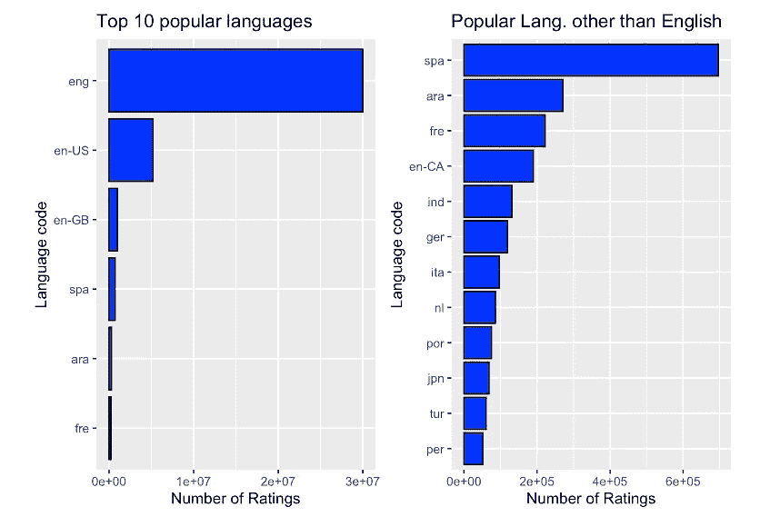

Fig 7: Most popular formats Fig 8: Popular Languages

## 平均评分和受欢迎程度

随着读者数量的增加，平均评分开始下降。如图 9 所示，没有平均评级为 5 的书籍有超过 500 条评论。就书籍而言，只要受欢迎程度达到平均 3.5 分或以上，就可以认为是安全的。即使是最好的作品也有批评家。很难让每个人都开心！

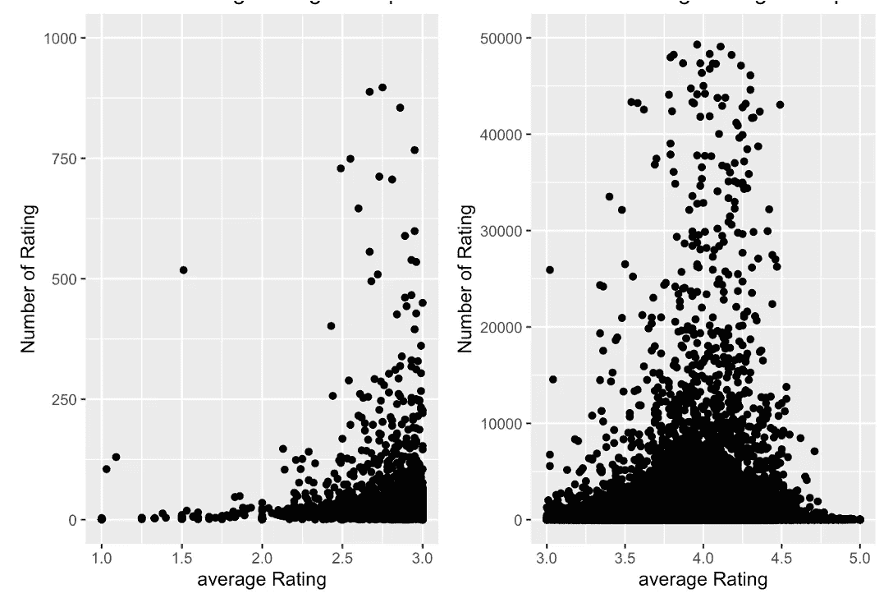

Fig 9: Average Rating and Popularity

## 出版商

亚马逊旗下的自助出版平台 CreateSpace 已经从数据集中出版了最大数量的书籍(图 10)。CreateSpace 出版的书籍被评为高等级(图 11 ),在我的数据集中排名前 10 位。这是越来越多的人适应 kindle 的又一个例子。总部位于纽约的 Vintage 出版社是最受欢迎的出版商，拥有许多高评价的书籍。

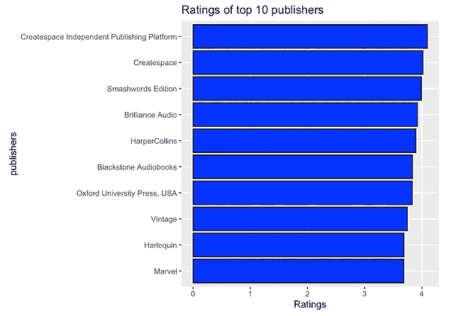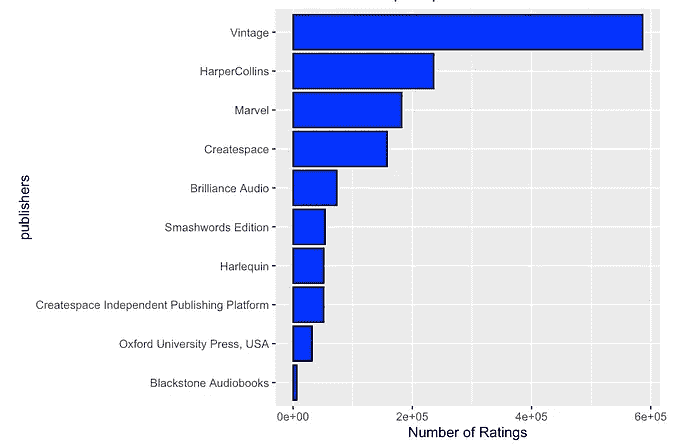

Fig 10: Top 10 publishers with highest no. of books Fig 11: Average Ratings of top 10 publishers Fig 12: Top 10 most popular publishers

## 电子书的流行程度

Kindle 在 2007 年发布后，电子书的受欢迎程度有了巨大的增长。如图 13 所示，电子书的数量在 2011 年后有所增长。这是 kindle 为自由作家和独立作家提供自助出版平台的时候。2011 年，kindle 帮助亚马逊实现了 100 亿美元的收入。

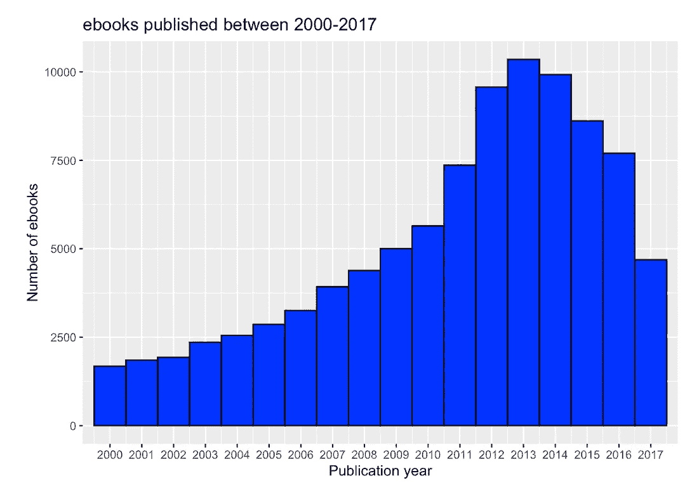

Fig 13: Number of ebooks published between 2000 and 2017

# 推荐系统

为了这个项目，我研究了协同推荐系统。有两种类型的协同推荐系统。**基于项目和基于用户。**

## 基于项目的协同推荐系统

基于项目的推荐系统模型是由亚马逊在 1998 年提出的。它考虑了商品之间的相似性和用户一起购买商品的频率。例如，如果用户正在查看阿加莎·克里斯蒂(Agatha Christie)的《罗杰·阿克罗伊德的谋杀》(the murder of roger Ackroyd)，该模型将寻找之前已经推荐过这本书的用户，然后检查这些用户推荐/购买的书籍。在图片(图 14)中，这是通过匹配购买的书籍与当前书籍的评级来实现的。

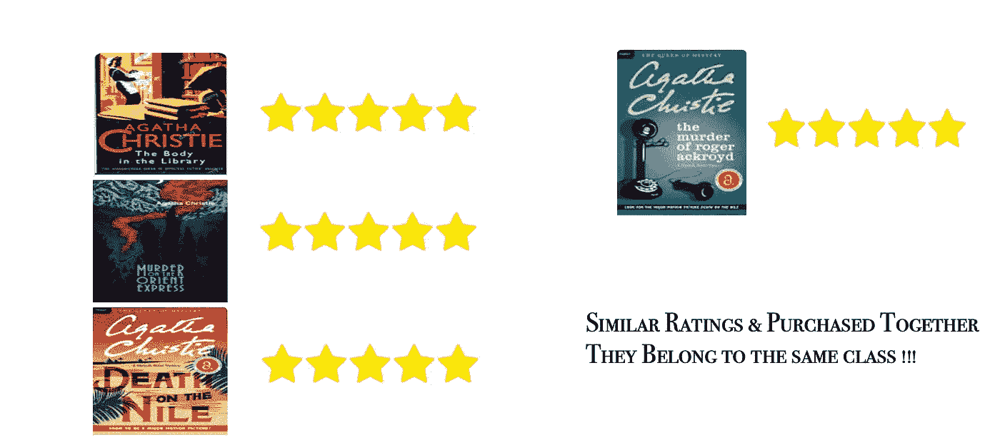

Fig 14: Item-based collaborative Recommender System

## 基于用户的协同推荐系统

在基于用户的推荐系统中，检查用户之间的相似性。如图 15 所示，用户 1 和用户 2 都是阿加莎·克里斯蒂的粉丝，并推荐了她的 3 本书(谁不爱她的神秘！！！).现在，用户 2 推荐夏洛克·福尔摩斯，这也是一个相似的类型。基于这种行为，模型也会推荐用户 1 夏洛克·福尔摩斯。这是一个基于用户的推荐模型。

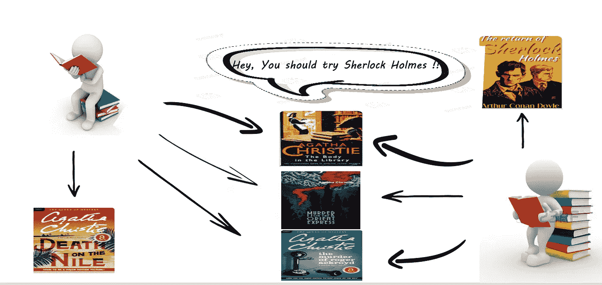

Fig 15: User-based collaborative recommender System

## 背后的基础数学

为了可视化一个协同推荐系统模型，我们必须首先理解**用户-项目矩阵**和**相似度函数**。图 16 示出了从书评数据集生成的用户项目矩阵。每行代表一个用户，每列代表一本书。这些条目是每个用户对他们读过的书的评价。矩阵中有许多 NAs，因为不是每个用户都读过每本书。为了便于计算，引入了相似度函数。有许多类型的相似性函数，如余弦相似性、皮尔逊相关系数、欧几里德距离等。对于这个项目，使用余弦相似性函数(图 17)。如矩阵所示(图 18)，余弦相似性函数可以按行(基于用户)或按列(基于项目)实现。U1 和 U5 之间的余弦相似度最大，因此 U5 读过而 U1 没有读过的书将被推荐给 U1。对于基于项目的方法，B1 和 B5 之间的余弦相似性是最大的，因此如果阅读 B1 的用户还没有阅读 B5，他们将被推荐 B5。

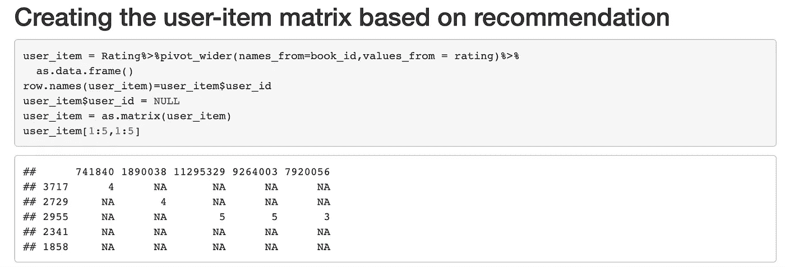

Fig 16: User-Item Matrix

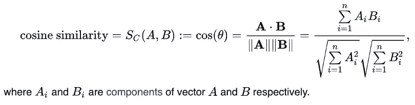

cosine similarity Function(wikipedia)

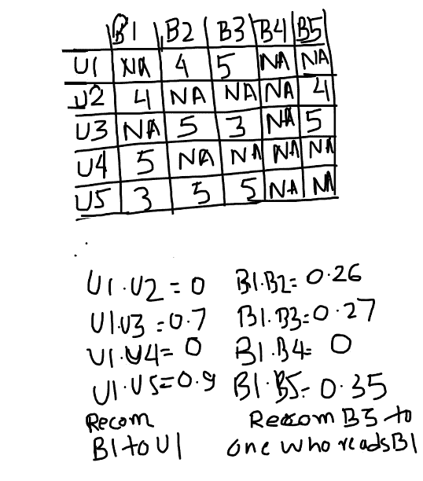

Fig 17: Cosine Similarity Calculation

# 推荐给 2955 用户的最佳书籍

使用该模型，向用户 2955 推荐了以下书籍。有图像 URL 的人检索图像。count 列表示相似用户的数量，rating 列返回这些用户对给定图书的评分。

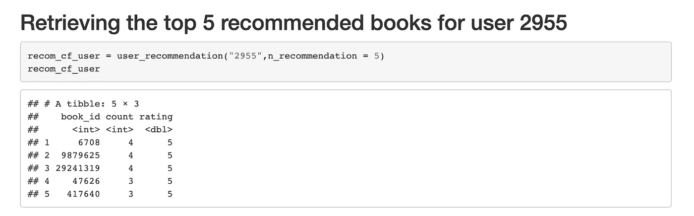

Top 5 books recommended to user 2955

## 输出:

output of user-based model

# 未来作品

对于未来的工作，我计划建立一个混合的基于内容和协作的推荐系统，并实现一些来自 EDA 的发现用于过滤(例如，厚书不太受欢迎)。可扩展的仪表板与后端的代码可以生成，可由图书电子商务平台使用。为了测试最终的模型，A/B 测试是一个必不可少的组成部分，因为如果不为真实用户实现，就无法判断推荐系统模型的有效性。

## 参考

孟婷·万，朱利安·麦考利，[单调行为链](https://www.google.com/url?q=https%3A%2F%2Fgithub.com%2FMengtingWan%2Fmengtingwan.github.io%2Fraw%2Fmaster%2Fpaper%2Frecsys18_mwan.pdf&sa=D&sntz=1&usg=AFQjCNGGcNRW1tSZKPWO0yZsr8mj7MkWuw)项目推荐， *RecSys'18* 。

孟婷·万，里沙布·米斯拉，恩达帕·纳卡肖勒，朱利安·麦考利，“[大规模评论语料库](https://www.google.com/url?q=https%3A%2F%2Fwww.aclweb.org%2Fanthology%2FP19-1248&sa=D&sntz=1&usg=AFQjCNG8xlMi09lyuzzMI8lCW58wrBEGsQ)中的细粒度剧透检测”， *ACL'19* 。