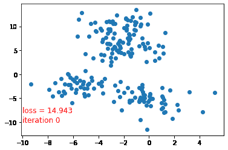

# 应用线性代数导论:K-均值聚类

> 原文：<https://medium.com/mlearning-ai/introduction-to-applied-linear-algebra-k-means-clustering-c6885cad0f7f?source=collection_archive---------5----------------------->

Image by author

**目标:**本文介绍了 k-means 聚类算法，这是数据科学中最流行的聚类算法之一。

**为什么要学习:**聚类的目标是将数据点分组，这样组内的数据就彼此接近。正是 k-means 聚类算法给我们的！