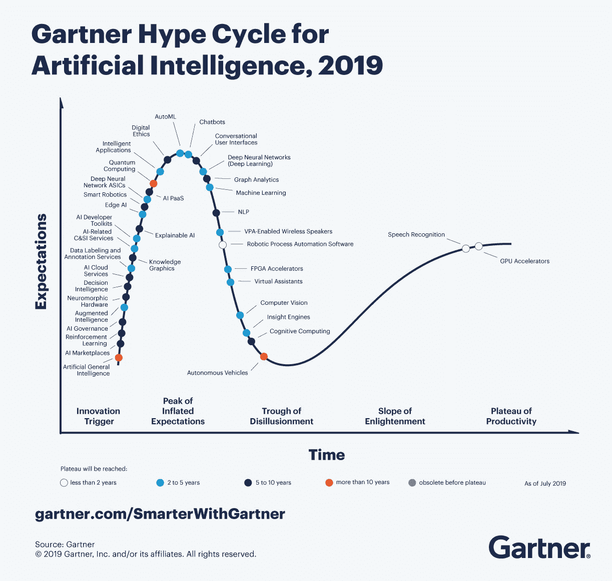
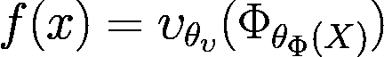
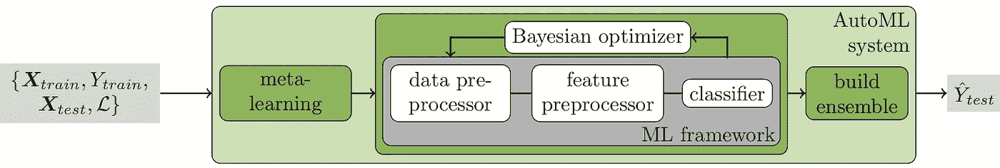

# 使用 Auto-Sklearn ⚙️介绍自动机器学习

> 原文：<https://medium.com/mlearning-ai/introduction-to-automated-machine-learning-with-auto-sklearn-%EF%B8%8F-c2ee0b8ff3c6?source=collection_archive---------1----------------------->

根据[书](https://www.oreilly.com/library/view/hands-on-automated-machine/9781788629898/)“手动自动化机器学习”(AutoML)，` *AutoML 旨在通过自动化常用步骤，如特征预处理、模型选择和超参数调整，简化构建 ML 模型的过程。*自然，AutoML 的高度自动化使非专家能够使用机器学习模型和方法，而无需事先广泛熟悉机器学习。关于趋势，AutoML 是 2019 年 ML 行业和研究社区的领先趋势。见下图；AutoML 处于膨胀预期的峰值部分，这表明早期暴露会产生许多成功故事。一些企业立即采取行动，而另一些企业则等到技术带来显著好处后再行动。尽管如此，趋势是显而易见的，社区对该技术有很高的期望。

不管人们对 AutoML 如此热情的原因是什么，在我看来，AutoML 将在未来几年内显著改变人们在数据科学研究和行业中的工作方式，这是无可辩驳的。作为 LittleBigCode 的数据科学家，我很乐意每天使用 AutoML，原因有两个:(1)让我专注于机器学习项目中更具挑战性的方面，而 AutoML 在后台工作几个小时以找到最佳组合；(2)允许我通过发现我不熟悉的新算法来克服我当前的知识，如果 AutoML 的分析得出它是最准确的算法。因此，通过证明在数据集上评估了许多组合来增强项目的可信度。

*Figure — Source: [30]*

在下面的文章中，我们将介绍带有和不带有 Auto-Sklearn 的 AutoML。它的定义，随后是一个插图和主题摘要。Auto-Sklearn 已经被许多其他人选中，如 [*MLBox*](https://mlbox.readthedocs.io/en/latest/) *，* [*TPOT*](https://epistasislab.github.io/tpot/?spm=a2c65.11461447.0.0.68b37903SuwpOp) *，*[*H2O AutoML*](https://h2o-release.s3.amazonaws.com/h2o/master/3888/docs-website/h2o-docs/downloading.html?spm=a2c65.11461447.0.0.68b37903SuwpOp)*，* [*Auto-KERAS(神经架构搜索)*](https://github.com/keras-team/autokeras?spm=a2c65.11461447.0.0.68b37903SuwpOp) *，*[*TransmogrifAI*](https://github.com/salesforce/TransmogrifAI)*，*，因为它在众多的 ML 竞赛中被公认为是社区中的一个强有力的框架。这并不意味着一个框架优于另一个框架，但是围绕 Auto-Sklearn 的社区可以与 Scikit-learn 的社区相媲美，这就是为什么向 AutoML 初学者提供与 Scikit-Learn 一样的可访问工具是有意义的。然而，上面提到的每一个工具，以及市场上剩余的工具，都值得研究，以确定它们对您的用例的适用性。Auto-Sklearn 主要用于分类和回归，不采用深度学习，有关更多信息，请参见下文。**

# 什么定义自动化机器学习？

自动化机器学习的概念在文献中有过争论；尽管如此，就其描述和长期目标而言，以下定义对于该主题的新的和有经验的研究人员来说是足够的:

AutoML 旨在将机器学习算法自动组合和参数化到机器学习管道中，目标是优化一些给定的度量。通常，基本 Auto-ML 系统的子管道连接到两个组件:第一个是预处理*(特征选择、转换和插补等)。)*和第二个——算法选择*(分类、回归等)。).*最先进的包括两个最流行的监督自动化机器学习框架，Auto-Sklearn(基于 Scikit Learn [1])和 Auto-Weka(基于 WEKA [2]) [3，4]。受监督的 AutoML 系统在数学上描述如下:

其中`f`是任务的最佳概括。`f`也等同于我们所说的**全模型**或**管道**【5，6】。流水线由 **𝜐** 制作，表示监督学习算法(如 XGBoost、随机森林等。)和 **θ𝜐** ，其表示监督学习算法的超参数。**φ**表示预处理技术(如特征重采样/插补等)。)，以及，如果适用，**θφ(X)**与所选预处理技术相关的超参数。最后，AutoML 系统将尝试识别预处理技术和学习算法的最佳组合，以及它们各自的超参数，给定一个数据集，表示为`D`。

简而言之，AutoML 搜索优化系统旨在执行(1)估计器和预测器的优化(即算法选择)[7]；(2)学习算法及其超参数的优化(即超参数优化)[8，9，6，4]；以及(3)元学习算法的优化[10，3]。*预处理技术服从相同的优化过程，但基于专门为预处理设计的技术子集。*

# AutoML 有哪些子问题？(现金/ HPO / SMAC / NAS / AO)

既然已经解释了 AutoML，让我们快速地看一下它为达到优化选择建模及其超参数的主要目标而解决的子问题:

## 组合算法和超参数选择(CASH)和超参数优化(HPO)

现金问题[11]涉及自动和同时选择学习算法及其参数，而 HPO 问题涉及从选择的算法向量中提供最佳可行的模型实例。因此，两者的结合是无可争议的。CASH 过程可以简单地解释为，它将每个算法都视为一个超参数，通过为给定数据集提供一组最佳算法来优化这些超参数。另一方面，HPO 考虑了最佳现金的输出，提供了算法及其超参数的管道，并试图将每组超参数调整到其最佳可行实例。

现金和 HPO 问题需要测试大量的假设，并选择最准确的一个作为给定训练集的最佳预测模型。例如，考虑所有基于森林的算法(决策树、随机森林、XGBoost、深层森林等。)具有至少十个超参数，每个超参数可以取十个不同的值；因此，检查单个算法的现金和 HPO 配置空间需要 1010 次排列。因此，用 j 个超参数调整 n 个算法的成本可能相当高。

## 基于顺序模型的算法配置(SMAC)

SMAC [18，19，20]是一个多功能的 HPO 工具，帮助算法创作者优化超参数。这种有希望的策略使用树/局部搜索构建有希望的配置，使用随机在线自适应竞赛(ROAR)方法[12]比较所有可能的配置，然后揭示为算法和给定数据集发现的最准确的超参数组合。

## 神经结构搜索(NAS)和结构优化(AO)

NAS 问题是通过选择和组合基本运算来设计高性能的神经架构[13，14，15，16]。分类问题旨在挑选最佳算法和超参数，而 NAS 问题评估特定数据集的最佳神经网络架构。另一方面，AO 是 NAS 的子组件，也被视为神经架构搜索优化方法。它最初是由 Barret Zoph 和 Quoc Le [27]在一个应用程序中引入的，该应用程序使用强化学习来训练一个递归神经网络，以自动搜索性能最佳的架构。AO 由强化学习、基于进化的算法、梯度下降、基于代理模型的优化和混合 AO 方法组成[17]。它通过优化给定的体系结构(即层数、学习速度等)来确定 NAS 的理想设计。).它大致可以被看作是现金问题的 HPO(即最优化方法)。因此，结合 NAS 和 AO 的一个有前途的框架是 Auto-KERAS 或 Auto-Pytorch。

*虽然我们定义了行话，但 Auto-Sklearn 是基于现金/HPO 和 SMAC 问题的，所以我们将在文章的剩余部分主要关注这些:*

# 什么是 Auto-Sklearn？

弗赖堡大学人工智能实验室在 2015 年发布了 auto-Sklearn 包，旨在通过元学习来增强贝叶斯优化。该框架采用了 15 个分类器、14 种特征处理方法和 3 种数据预处理方法，总共有 132 个超参数。这个框架有两个版本:1.0 [18]和 2.0 [19]。AutoML 第一版的主要改进是其现金和 HPO 性能，而第二版的主要改进是纳入了一个更简单和更有效的元学习方法。

## 获奖

Auto-Sklearn 在第一届全球 AutoML 挑战赛中获得了第一个奖项，它在一些子挑战中胜过了竞争对手的框架，但不是全部；然而，它仍然在 2015 年至 2016 年举行的比赛中名列第一[20，21，22，23]。他们有几个月的时间来改进他们的框架，这样他们可以在第二年回来，仍然做得很好，他们做到了。在 2017–2018 年，他们赢得了第二届国际汽车大赛[24，25，26]。

## 预先配置搜索算法

以下是 Auto-Sklearn 中可用的预配置算法列表:

`AdaBoost ; Bernoulli naive Bayes ; decision tree ; extreml. rand. trees ; Gaussian naive Bayes ; gradient boosting ; k-Nearest Neighbour ; LDA ; linear SVM ; kernel SVM ; multinomial naive Bayes ; passive aggressive ; QDA ; random forest ; Linear Classification.`

# 它的建筑

在深入研究架构之前，Auto-Sklearn 需要一些参数，包括两个不同的阈值。一个涉及阈值，当达到该阈值时，停止调整给定算法的过程(即 HPO)，另一个可以被认为是全局阈值，是寻找算法的过程(即 CASH)。说到建筑。简而言之， **(1)** 用户向管道提供原始数据，这些数据必须分成训练集和测试集。 **(2)** 然后执行元学习阶段，这是该框架在 AutoML 领域最大的进步之一，因为粗略地说，它使用了您的数据集与文献/网络中已知的一些数据集的相似性，如果有匹配，在这样的数据集上表现良好的技术列表将作为优先事项通过管道进行研究。然后，不管元学习步骤是否输出。 **(3)** 我们进入优化周期: **(a)** 我们随机选择一个数据预处理器， **(b)** 我们随机选择一个特征预处理器， **(c)** 我们随机选择一个分类器，然后我们使用贝叶斯优化器优化它们的超参数，直到达到子流水线阈值。对每个可用的分类器重复该循环，直到达到总阈值，此时流水线停止，并且 **(4)** 建立所有子流水线组合的集合，基于用户定义的度量将它们从最准确到最不准确排序。结果，为用户提供了类别的最佳模型和/或测试集预测概率。

# 使用 Auto-Sklearn 进行简单易用的乳腺癌分类

*Auto-Sklearn 目前只能通过 Python 访问，所以我们假设您已经安装了它。关于安装和操作系统兼容性，见* [*此处*](https://automl.github.io/auto-sklearn/master/installation.html#) *。此外，我们从 sklearn 数据库加载数据，因此本文不涉及基于 RGPD 的数据。*

考虑一个例子来说明使用这个框架是多么简单。这里，我们将预测乳腺癌数据集，这是一个经典且极其简单的二元分类数据集([查看更多](https://scikit-learn.org/stable/modules/generated/sklearn.datasets.load_breast_cancer.html)):

我们首先将数据加载到分区中，默认情况下，75%用于训练集，25%用于测试集。之后，我们实例化了 Auto-Sklearn 分类器(这里是 1.0 版本)并使用了三个不同的参数，但是更多的参数可以在[文档](https://automl.github.io/auto-sklearn/master/api.html)中看到:

*   **该任务的剩余时间:**整个管道搜索允许的最大秒数。通过增加该值，auto-sklearn 发现高级模型的可能性更大。此外，这是全局阈值，因此如果您输入 54，000 秒，该过程将搜索接下来 15 个小时的最佳模型。然而，你应该仔细考虑这个值，因为如果你搜索得太多，你可能会过度拟合你的数据*(见[28]关于过度拟合和 automl 的更多信息)。*
*   **每次运行时间限制:**对机器学习模型的单次调用的时间限制。如果机器学习算法运行超过时间限制，模型拟合将被终止。请将此值设置得足够高，以便典型的机器学习算法可以适用于训练数据。此外，如果此参数设置的值太高，一般管道理论上可能会尝试较少的分类器，因为前面的参数也可能被命中。作为用户，你得找到一个好的平衡点。
*   **内存限制:**机器学习算法的内存限制，单位为 MB。如果 Auto-sklearn 试图分配超过`memory_limit` MB，它将停止拟合机器学习算法。
*   *请注意，* [*文档*](https://automl.github.io/auto-sklearn/master/api.html) *包含许多其他参数，如在管道中优化什么指标等。*

最后，您已经准备好获得管道搜索的最佳输出结果；注意，出于演示的目的，我们在这里只输出冠军模型的精度。*尽管如此，该文档包含了大量您可以获得的更具体、更多样的输出:*

# 讨论和结论

AutoML 将在未来的机器学习中发挥作用，但它并非没有缺点。我观察到的关于 AutoML 的几件事包括:

*   AutoML 将取代数据科学家。许多从业者认为 AutoML 将在不久的将来取代他们，这使得这个学科有些被一些人拒绝。然而，我怀疑事实是否如此。我相信，作为人类，我们最终是决定哪些结果足够可行，可以产生和部署的人，所以我们不会被自动化机器学习取代，而是将它作为我们日常活动的工具，并在我们各自的专业领域开发新的专注方式。
*   **数据仍然是最重要的。**您可以将任何原始数据输入到管道中，但是如果没有任何预处理或额外的数据理解，就不会有好的结果。这对于像医生这样的非专业人士来说非常不方便。即使他们可能接受过数据预处理培训，也可能不像 ML 从业者那样广泛。因此，从这个角度来看，对于非专业人士来说，AutoML 有些复杂。
*   **预测指标是唯一的目标**。在数据科学专业中，预测模型并不总是唯一需要的东西。通常，如果您希望确定数据集的哪些特征是最重要的，AutoML 目前无法生成这样的列表，因此有一些技巧可用，但对于非专业人员来说不太容易。另一个最后的例子，如果你希望冠军模型的可解释性，默认情况下还无法实现，尽管它对于非专家如医疗从业者是必不可少的。尽管如此，请记住，Auto-Sklearn 的管道分析器最近刚刚研究并发布[29]。
*   替换我的旧随机森林。也许不一定。但是，作为一种良好的做法，建议始终启动一个包含 1000 棵树和其余默认参数的随机林，以便建立一个基线来比较 AutoML 管道的输出。如果你使用的 AutoML 系统不能准确预测你的事件，它可能会也可能不会取代它。

尽管有这些限制，在你的任务和项目中应用 ML 的这个分支是非常有益的。作为结束语，我希望您现在理解 AutoML 术语和 auto-sklearn 的功能，它是众多框架中的一个重要框架。我也希望你能进一步调查 AutoML。然而，我想指出的是，在 AutoML 领域仍有未来的工作要做，特别是不平衡数据，这在医学领域很常见，但在 AutoML 领域还没有，以及预测多标签学习的方法，而不是二进制，这提出了更大的挑战。因此，在 AutoML 中仍然有许多未知的子领域，而这只是机器学习的一个强大子领域的开始。

如果你有任何问题或想分享你的经验，请随时留下评论🥳

西蒙🔬

# 参考

[1] F. Pedregosa，G. Varoquaux，A. Gramfort，V. Michel，B. Thirion，O. Grisel，M. Blon- del，P. Prettenhofer，R. Weiss，V. Dubourg，J. Vanderplas，A. Passos，D. Cournapeau，M. Brucher，m .佩罗特和 E. Duch- esnay，“Scikit-learn:Python 中的机器学习”，《机器学习研究杂志》，第 12 卷，第 28-25 页

[2] M. Hall、E. Frank、G. Holmes、B. Pfahringer、P. Reutemann 和 I. H. Witten，“weka 数据挖掘软件:更新”，ACM SIGKDD 探索通讯，第 11 卷，第 1 期，第 10-18 页，2009 年。

[3] M .福雷尔、a .克莱因、k .艾根伯格、J. T .斯普林根伯格、m .布鲁姆和 f .哈特，“自动 sklearn:有效和健壮的自动机器学习”，载于《自动机器学习》。Springer，Cham，2019 年，第 113–134 页。

[4] C. Thornton，F. Hutter，H. H. Hoos 和 K. Leyton-Brown，“Auto-weka:分类算法的组合选择和超参数优化”，载于第 19 届 ACM SIGKDD 知识发现和数据挖掘国际会议论文集，2013 年，第 847-855 页。

[5] J. Escalante，“走向粒子群模型选择算法”，在多级干扰研讨会和模型 HJ Escalante。一种粒子群模型选择算法。多层次推理研讨会和模型选择游戏，NIPS，Whistler，VA，BC，Canada，2006。

[6] H. J. Escalante，M. Montes 和 L. E. Sucar，“粒子群模型选择”《机器学习研究杂志》2009 年第 10 卷第 2 期。

[7] J. R. Rice，“算法选择问题”，载于《计算机进展》。爱思唯尔，1976 年，第 15 卷，第 65-118 页。

[8] D. Gorissen、T. Dhaene 和 F. De Turck，“全球代理建模的进化模型类型选择”，中国学习研究杂志，第 10 卷，第 2039-2078 页，2009 年。

[9] Q. Sun，B. Pfahringer 和 M. Mayo，“数据挖掘运算符空间中的完整模型选择”，载于第 14 届遗传和进化计算年会论文集，2012 年，第 1503-1504 页。

[10] K. A. Smith-Miles，“算法选择元学习的跨学科观点”，《美国计算机学会计算调查》(CSUR)，第 41 卷，第 1 期，第 1–25 页，2009 年。

[11] C .桑顿、F .哈特、H.H .霍斯和 kLeyton-Brown，“Auto-weka:分类算法的组合选择和超参数优化”，载于第 19 届 ACM SIGKDD 知识发现和数据挖掘国际会议的*会议录，2013 年，第 847–855 页。*

[12] F. Hutter，H. Hoos，K. Leyton-Brown，T. Stü tzle Paramils:一个自动算法配置框架。j .阿提夫。智能。第 36 号决议(2009 年)，第 267-306 页

[13] M. F .特诺里奥和 W.-T .李，“用于识别问题的自组织神经网络”，1988 年，第 57-64 页。【在线】。可用:[https://papers.nips.cc/paper/149-self-组织识别问题的神经网络](https://papers.nips.cc/paper/1988/hash/f2217062e9a397a1dca429e7d70bc6ca-Abstract.html)

[14] H. Kitano，“利用遗传算法和图形生成系统设计神经网络”，第 4 卷第 4 期，1990 年。【在线】。可用:【http://www.complex-systems.com/】T2 摘要/v04_i04_a06/

[15] P. J. Angeline、G. M. Saunders 和 J. B. Pollack，“构造循环神经网络的进化算法”，第 5 卷，第 1 期，第 54-65 页，1994 年。【在线】。可用:【https://ieeexplore.ieee.org/document/265960/】T4

[16] S. R. Young、D. C. Rose、T. P. Karnowski、S.-H. Lim 和 R. M. Patton，“通过进化算法优化深度学习超参数”，2015 年，第 4:1–4:5 页。【在线】。可用:[https://dl.acm.org/citation.cfm?id=2834896](https://dl.acm.org/citation.cfm?id=2834896)

[17] X. He，K. Zhao，和 X. Chu，“AutoML:技术水平的调查”，*基于知识的系统*，第 212 卷，第 106622 页，2021 年 1 月。【在线】。可用:[https://linking hub . Elsevier . com/retrieve/pii/s 0950705120307516](https://linkinghub.elsevier.com/retrieve/pii/S0950705120307516)

[18] M .福雷尔、a .克莱因、k .艾根伯格、j .斯普林根伯格、m .布鲁姆和 f .赫特，“高效和健壮的自动化机器学习”，载于*神经信息处理系统的进展*，c .科尔特斯、n .劳伦斯、d .李、m .杉山和 r .加内特编辑。，第 28 卷。柯伦联合公司，2015 年。【在线】。可用:[https://proceedings . neur IPS . cc/paper/2015/file/11 d0e 6287202 fced 83 f 79975 EC 59 a 3 a 6-paper . pdf](https://proceedings.neurips.cc/paper/2015/file/11d0e6287202fced83f79975ec59a3a6-Paper.pdf)

[19] M .福雷尔、k .埃根斯伯格、s .福克纳、m .林道尔和 f .赫特，“自动 sklearn 2.0:下一代”， *arXiv 预印本 arXiv:2007.04074* ，2020 年。

[20] I. Guyon、L. Sun-Hosoya、M. Boullé、H. J. Escalante、S. Escalera、Z. Liu、D. Jajetic、B. Ray、M. Saeed、M. Sebag、A. Statnikov、W. Tu 和 E. Viegas，“2015-2018 年汽车挑战赛系列分析”，载于一份 *utoML、* ser .2019 年关于机器学习挑战的 Springer 系列。

[21] I. Guyon、K. Bennett、g .考利、H. J. Escalante、S. Escalera、T. K. Ho、N. Macià、B. Ray、M. Saeed、A. Statnikov 和 E. Viegas，“2015 年 ChaLearn AutoML 挑战赛的设计”，载于中华民国。IJCNN， 2015。【在线】。可用:h[TTP://www . causality . INF . ethz . ch/AutoML/AutoML _ ijcnn 15 . pdf](http://www.causality.inf.ethz.ch/AutoML/automl_ijcnn15.pdf)

[22]—“2015 年 AutoML 挑战:设计和初步结果”，载于 *Proc。2015 年 ICML 车展*。【在线】。可用:[https://drive . Google . com/file/d/0 bzrglkqgri-qwkpzgw 4 bfpbmuk/view](https://drive.google.com/file/d/0BzRGLkqgrI-qWkpzcGw4bFpBMUk/view)

[23] I. Guyon、I. Chaabane、H. J. Escalante、S. Escalera、D. Jajetic、J. R. Lloyd、N. Macía、B. Ray、L. Romaszko、M. Sebag、A. Statnikov、S. Treguer 和 E. Viegas，“chalearn automl 挑战的简要回顾”，中华民国。的 AutoML 2016@ICML， 2016。【在线】。

[24] Automl 2018 挑战赛::Pakdd2018，“2020 年 3 月。【在线】。可用:[https://competitions.codalab.org/competitions/17767](https://competitions.codalab.org/competitions/17767)

[25] I. Guyon、L. Sun-Hosoya、M. Boullé、H. Escalante、S. Escalera、Z. Liu、D. Jajetic、B. Ray、M. Saeed、m . Sebag e*t . al .、*2015–2018、2017 AutoML 挑战赛系列分析。【在线】。可用:h[ttps://www . automl . org/book/](https://www.automl.org/book/)

[26] W.TuandE.Viegas，“2015-2018 年汽车挑战系列分析”

[27] Zoph，b .和 Le，Q.V .，2016 年。强化学习的神经结构搜索。 *arXiv 预印本 arXiv:1611.01578* 。

[28]法布里斯，f .和弗雷塔斯，A.A .，2019 年 9 月。分析 auto-sklearn 自动机器学习工具的过度拟合。在*机器学习、优化和数据科学国际会议*(第 508-520 页)。斯普林格，查姆。

[29] Ono，J.P .，Castelo，s .，Lopez，r .，Bertini，e .，Freire，j .和 Silva，c .，2020 年。Pipelineprofiler:用于探测 automl 管道的可视化分析工具。 *IEEE 可视化与计算机图形学汇刊*， *27* (2)，第 390–400 页。

 [## Mlearning.ai 提交建议

### 如何成为 Mlearning.ai 上的作家

medium.com](/mlearning-ai/mlearning-ai-submission-suggestions-b51e2b130bfb)