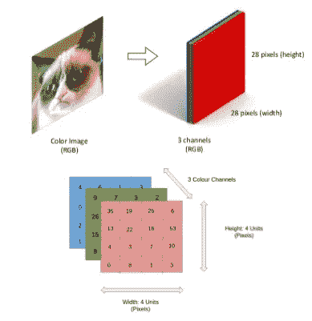
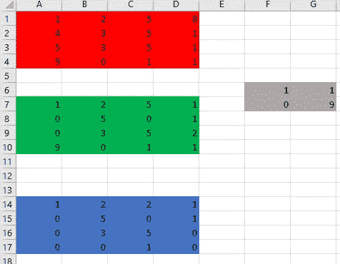
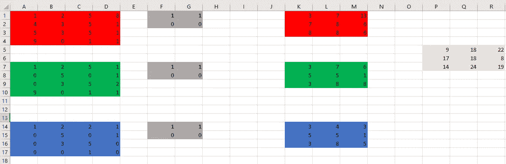
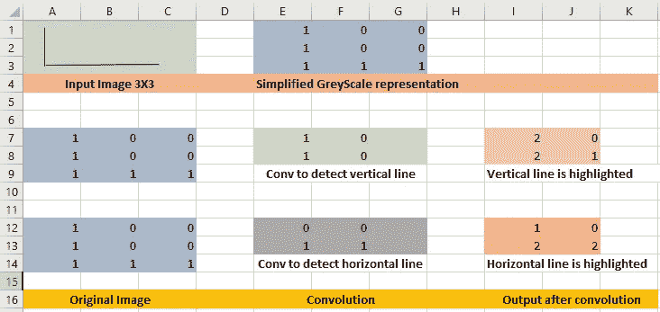
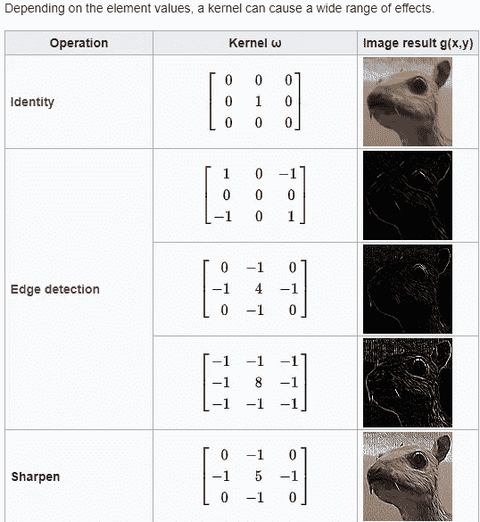
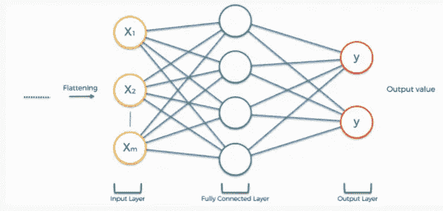

# CNN 简介

> 原文：<https://medium.com/mlearning-ai/introduction-to-cnn-c42ecc0ad8ff?source=collection_archive---------1----------------------->

# 什么是 CNN

维基百科定义的 CNN

“*‘卷积神经网络’这一名称表明网络采用了一种称为* [*卷积*](https://en.wikipedia.org/wiki/Convolution) *的数学运算。卷积网络是一种特殊类型的神经网络，它在至少一层中使用卷积来代替一般的矩阵乘法。*”

要理解 CNN，读者应该熟悉深度神经网络。以下是相同的参考资料。

 [## 神经网络和深度学习

### 在上一章中，我们了解到深度神经网络通常比浅层神经网络更难训练…

neuralnetworksanddeeplearning.com](http://neuralnetworksanddeeplearning.com/chap6.html)  [## 初学者深度学习教程

### 使用 Kaggle 笔记本探索和运行机器学习代码|使用来自手语数字数据集的数据

www.kaggle.com](https://www.kaggle.com/kanncaa1/deep-learning-tutorial-for-beginners) 

# CNN-概述

让我们以图像分类为例来理解 CNN 是如何工作的。

图像可以被分成像素。每个像素可以用一个矢量来表示。查看下面的链接，找到不同的颜色模式，如灰度，RGB，HSV，CMYK 等。

 [## 色彩模型的简短指南- SitePoint

### 如果你是平面或网页设计的新手，当你使用图像编辑器看到一些…

www.sitepoint.com](https://www.sitepoint.com/a-short-guide-to-color-models/#:~:text=A%20color%20model%20is%20simply,%28Red%2C%20Green%2C%20Blue%29) 

使用灰度模型像素可以有介于 0 和 1 之间的值。在 RGB 模型中，像素的颜色由三个数字表示。主要使用 RGB 模型。

让我们以 28X28 像素的图像为例。在使用 RGB 模型将其转换为矢量后，它将是 28X28X3 矢量

(image source: [https://www.slideshare.net/BertonEarnshaw/a-brief-survey-of-tensors](https://www.slideshare.net/BertonEarnshaw/a-brief-survey-of-tensors))

# **卷积**

为了从图像中获取有意义的信息，我们需要识别图像中的各种特征，如水平线、边缘和圆。这就是卷积的用处。

让我们以上面的图像为例，它是 4 X 4 X 3 的矢量。我们可以定义一个 2×2 的卷积向量。让我们举一个非常简单的例子，填充=0，步幅=1。在这种情况下，会发生以下情况

1.  输入图像为 4 X 4 X 3。卷积向量是 2 X 2。产量将是 3×3。

Image RGB vector and convolution vector

2.卷积滤波器(即向量)在图像上移动。所以计算将会像

*A1 X F6+B1 X G6+A2 X F7+B2 X G7 = 1X1+2 x1+4x 0+3 x9 = 30*

现在，由于步幅为 1，将卷积滤波器移动 1，即 B1 将是起始单元

*B1 X F6+C1 X G6+B2 X F7+C2 X G7 = 2 x1+5 x1+3 x0+5x 9 = 52*

现在将卷积滤波器移动 1，即 C1 将是起始单元

*C1 X F6+D1 X G6+C2 X F7+D2 X G7 = 5x 1+1X1+5x 0+1x 9 = 15*

它不能再向右移动了。所以移到左边，下一排。

*A2 X F6+B2 X G6+A3 X F7+B3 X G7 = 4x 1+3x 1+5x 0+3x 9 = 34*

因此，在查看红色矢量后，输出将是 3 X 3 矢量。类似这样的向量将由绿色和蓝色向量创建。

这三个矢量将被相加以创建组合的 3×3 矢量。

P5=K1+K7+K14，P6=K2+K8+K15 等等

上图描述了:*初始图像 4X4X3 ( 3 表示为 RGB 比例)、2X2 卷积、卷积对每个通道的影响(R、G、B)以及卷积后的最终结果(3X3 矢量)。*

**使用卷积的特征检测**

使用卷积的变换用于检测图像中的特征。大多数情况下，使用多重卷积来处理图像。每个卷积识别图像中的特定特征，然后合并结果。

在上面的例子中，4×4×3 图像使用一个卷积滤波器产生 3×3 矢量。

假设将这种卷积滤波器应用于输入图像。这些操作中每一个都将产生 3×3 的矢量。所以最终矢量将是 3X3X5。

**特征检测的例子**

以下是特征检测的简化示例。

一些常见的卷积滤波器

Image Source: [https://en.wikipedia.org/wiki/Kernel_(image_processing)](https://en.wikipedia.org/wiki/Kernel_(image_processing))

# **联营**

池化图层负责减小卷积要素的空间大小。

在图像的卷积层变换之后，我们得到 4X4 矢量。假设在卷积中使用 2 个这样的滤波器，输出向量将是 4X4X2 向量。

对此应用池化(使用 2X2 最大池化过滤器)

Pooling Layer

如上图所示，每层使用 2X2 最大过滤器。

max(A1，A2，B1，B2) = F1

马克斯(C1、D1、C2、D2)=G1

最大值(A3，A4，B3，B4) = F2

最大值(C3，D3，C4，D4)=G2

因此，最大池减少了卷积输出的维度(通过对图像应用卷积滤波器产生)。它**不**组合多个卷积滤波器的输出。

**最大池**和**平均池**是最常见的池功能。

## 汇集层的功能

1.  减小卷积特征的空间大小，从而降低所需的处理能力。
2.  降低噪音。
3.  放大卷积滤波器提取的特征。

# 卷积和合并后维度的变化

例如:我们有一个 16X16 的 RGB 图像。

1.所以输入向量是 16X16X3

2.我们对它应用 3×3 的卷积。它将导致 14X14 矢量

3.如果我们有 5 个这样卷积滤波器，输出向量将是 14×14×5

4.如果应用最大池化 2X2，它会将其减少到 7X7X5

# 全连接层(FC 层)

这一层就像任何其他深层神经网络。

合并图层后，矢量被展平。在上例中，它将是 7X7X5=245。因此，全连接层在输入层中将有 245 个节点。

这一步已经

*   输入层
*   全连接层
*   输出层

Image source:[https://www.superdatascience.com/blogs/convolutional-neural-networks-cnn-step-4-full-connection](https://www.superdatascience.com/blogs/convolutional-neural-networks-cnn-step-4-full-connection)

完全连接的层可以有多个隐藏层。SoftMax 函数用于最终对图像进行分类。

请参考下面的备忘单进行快速总结

 [## CS 230 -卷积神经网络说明书

### 你想看看你母语的备忘单吗？可以在 GitHub 上帮我们翻译一下！卷积…

stanford.edu](https://stanford.edu/~shervine/teaching/cs-230/cheatsheet-convolutional-neural-networks)