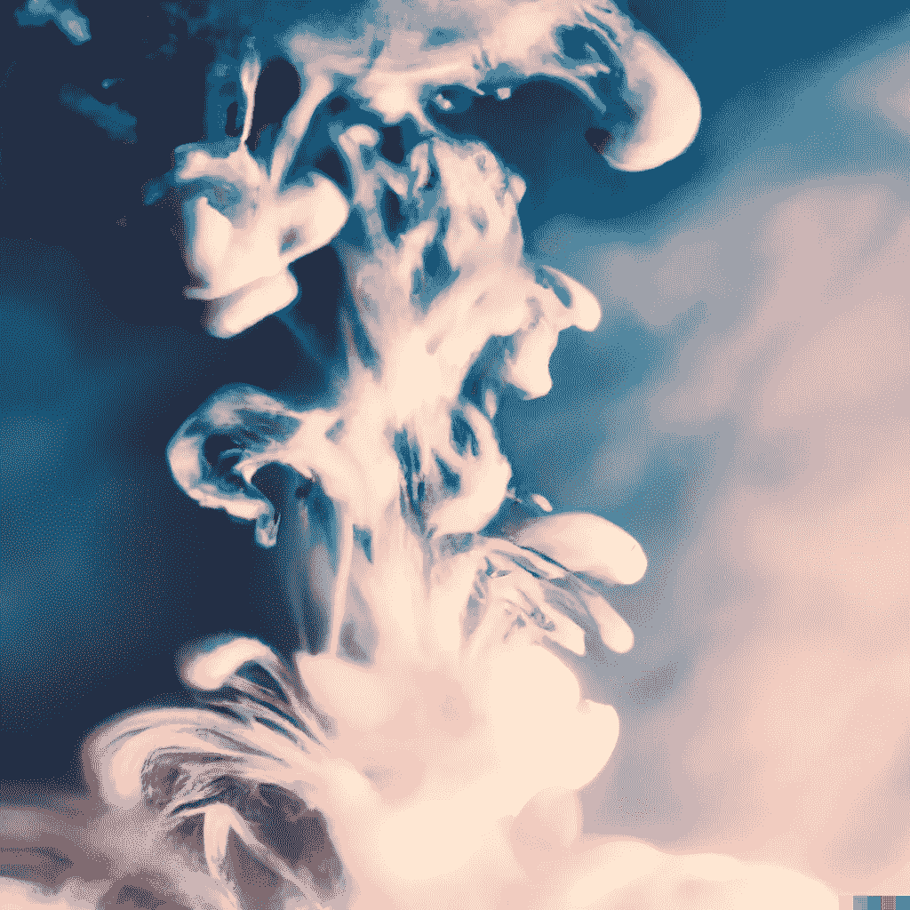

# 人工智能艺术的扩散模型介绍

> 原文：<https://medium.com/mlearning-ai/introduction-to-diffusion-models-for-ai-art-b84d54f5c326?source=collection_archive---------0----------------------->

## [机器学习艺术](https://mlearning.substack.com/p/how-does-a-diffusion-model-work?r=z7zu8&s=w&utm_campaign=post&utm_medium=webhttps://mlearning.substack.com/p/how-does-a-diffusion-model-work?r=z7zu8&s=w&utm_campaign=post&utm_medium=web)

## [演示+代码](https://mlearning.substack.com/p/how-does-a-diffusion-model-work?r=z7zu8&s=w&utm_campaign=post&utm_medium=web)

[Edit & Train and Run Your own DALL-E. CODE + DEMOS](https://mlearning.substack.com/p/how-does-a-diffusion-model-work?r=z7zu8&s=w&utm_campaign=post&utm_medium=web)

**人工智能艺术**在[扩散模型](#f86b)方面取得了最大的成功

*   【2022 年 7 月— AI 美工工具更新可以在这里找到➡️****⬅️****