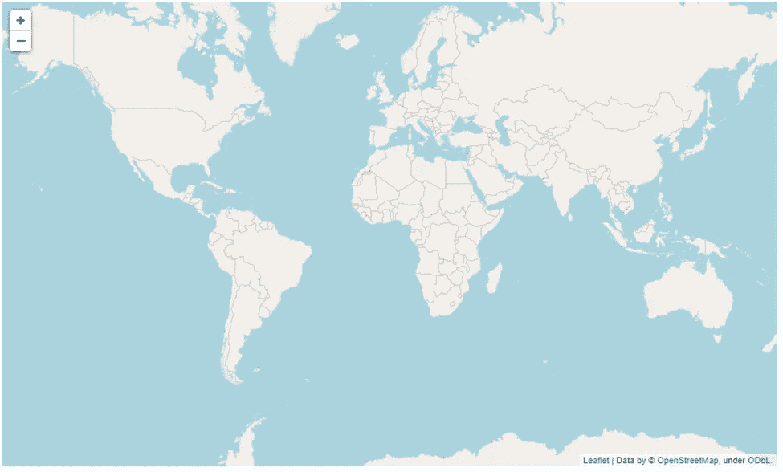
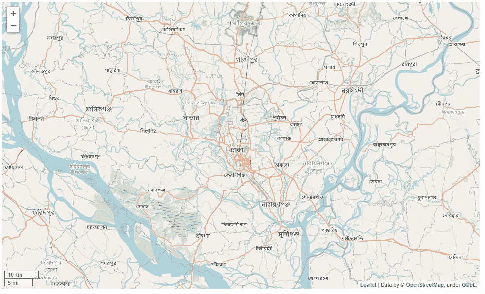
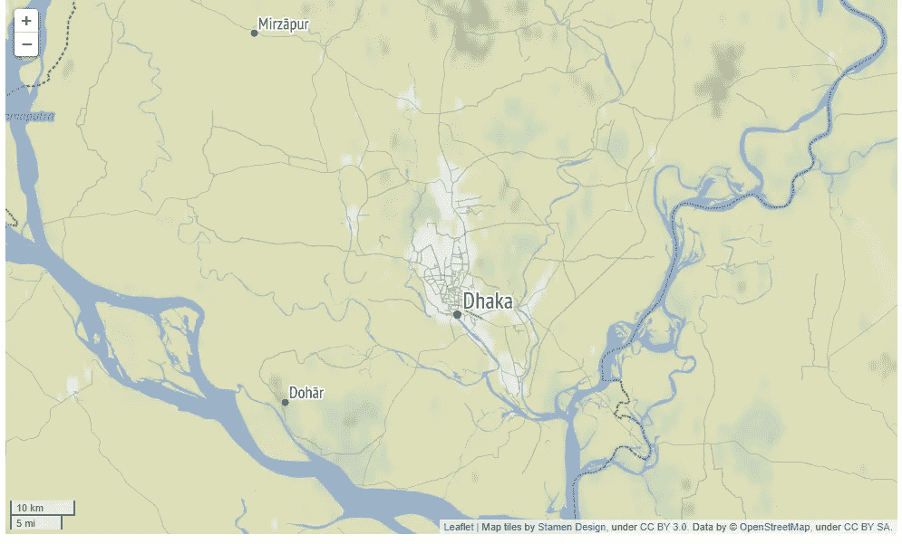
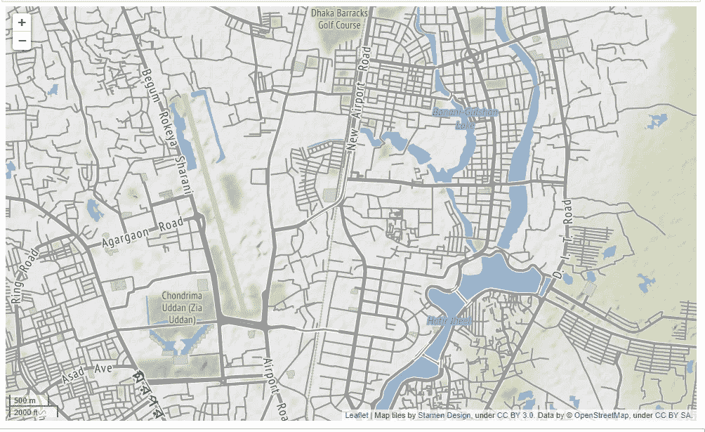
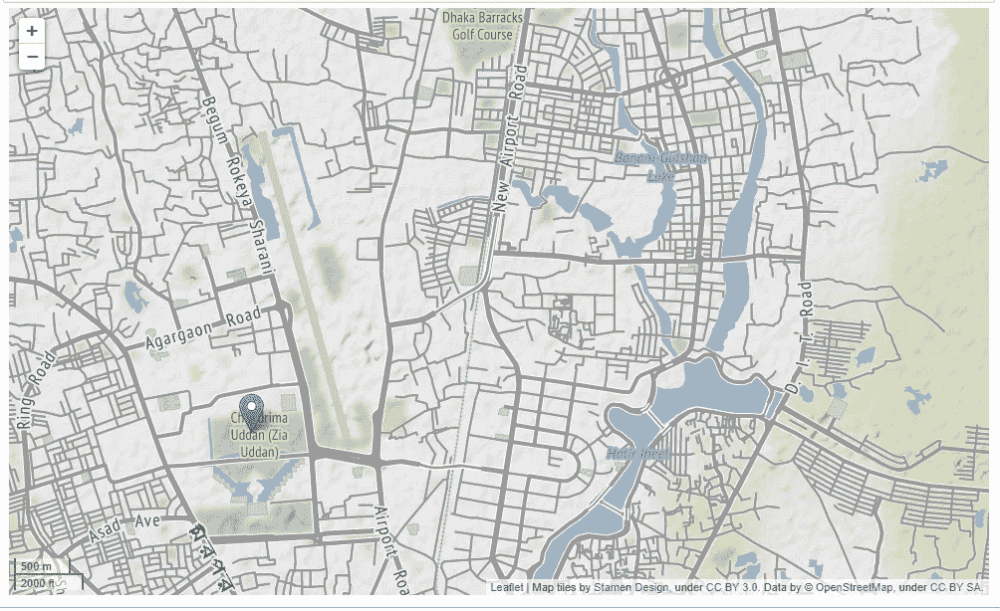
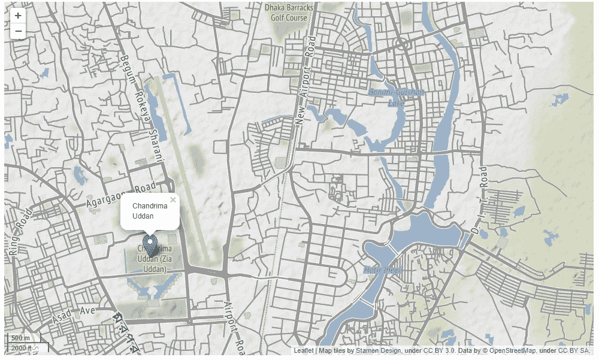
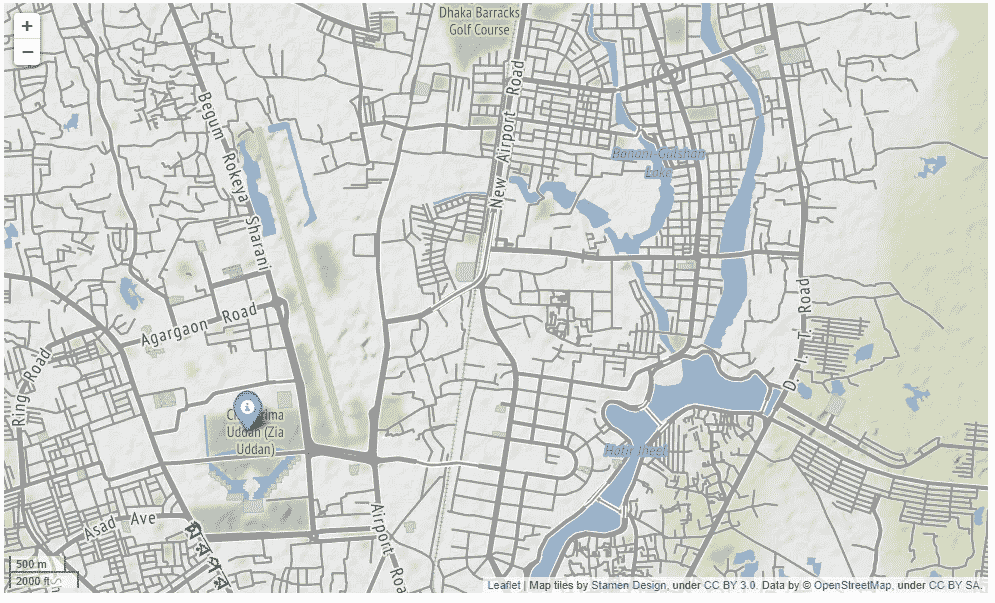

# Python 中的叶子介绍

> 原文：<https://medium.com/mlearning-ai/introduction-to-folium-in-python-515fc795800f?source=collection_archive---------1----------------------->

## Python 中最好最简单的地理可视化库之一

Folium 是 Python 中的一个库，它可以让我们快速创建地图，并根据需要对它们进行调整。它使用简单快捷，只需最少的代码行，就能在实例中为我们提供令人惊叹的图形图像。为了跟进下面提供的例子，请从我的 Gitlab 库【https://gitlab.com/rifayat-showrav/introduction-to-folium[或 GitHub 库【https://github.com/rshowrav/Introduction-to-Folium](https://gitlab.com/rifayat-showrav/introduction-to-folium)[收集信息](https://github.com/rshowrav/Introduction-to-Folium)。这个例子将为您提供这个非常棒的 Python 库的快速概览。

**获得一张互动地图有多简单**

用下面两行代码，我们可以很容易地得到如下所示的世界地图。

```
world_map = folium.Map()
world_map
```

从代码中我们可以得到下面的世界地图。



此外，请注意，这是一个交互式地图。如果你看看上图的左上方，你会发现你可以很容易地放大和缩小，并根据需要移动地图。

**精确定位感兴趣的位置**

现在假设你在地图上有一个你想观察的特定位置。这可以很容易地在叶与我们想要的位置的纬度和经度。对于这个例子，我们将使用孟加拉国的达卡。正如您在下面的代码中看到的，位置包括纬度和经度(23.777176，90.399452)，control_scale 为 true 允许我们在右下角为地图提供可缩放的公里和英里。

```
bangladesh = folium.Map(location=[23.777176, 90.399452], control_scale=True)
bangladesh
```

下面是我们从代码中收集的图像。



我们可以看到的明显问题是，地图上没有英文的位置。虽然此地图对于母语为孟加拉语的人非常有用，但其他人可能无法观察到。一般来说，leav 会用当地的母语来绘制地图。

**叶子中的瓷砖**

解决不同语言的叶子显示问题的方法是使用磁贴。有各种免费的，和 API 要求的瓷砖使用在叶。对于这个例子，将使用雄蕊地形。如下图所示，在代码中插入图块很容易使视觉效果也如下图所示。

```
bangladesh = folium.Map(location=[23.777176, 90.399452], control_scale=True, tiles='stamenterrain')
bangladesh
```



**放大呢？**

到目前为止，视觉效果看起来不错。然而，假设我们想要从某人打开视觉的开始放大一个部分。添加如下所示的 zoom_start 将允许我们这样做。此选项从视觉效果的开始处放大。

```
bangladesh = folium.Map(location=[23.777176, 90.399452], zoom_start = 14, control_scale=True, tiles='stamenterrain')
bangladesh
```



**给地图添加标记**

标记有助于识别地图上的重要点。假设我们的示例中的地图需要在地理位置 Chondrima Uddan 上做一个标记。这可以很容易地用下面的代码和我们的位置的经度和纬度来完成:

```
folium.Marker([23.7667,90.3781]).add_to(bangladesh)
bangladesh
```



然而，这里出现了一个明显的问题。标记使得用户很难实际看到标记处有什么。当用户单击带有以下代码的标记时，follow 让我们可以轻松地添加一个弹出窗口:

```
folium.Marker([23.7667,90.3781], popup = "Chandrima Uddan").add_to(bangladesh)
bangladesh
```



最后，如果标记不是首选，follow 有各种颜色和图标类型的选项。使用以下内容轻松修改:

```
folium.Marker([23.7667,90.3781], popup = "Chandrima Uddan", icon=folium.Icon(color="blue", icon="info-sign")).add_to(bangladesh)
bangladesh
```



**结论**

希望这个例子显示了这个地理可视化工具是多么强大。这是一个提供基础知识的简单示例。leav 本身在地理可视化领域提供了更多。我希望这能激发你的好奇心去发现更多。

[](/mlearning-ai/mlearning-ai-submission-suggestions-b51e2b130bfb) [## Mlearning.ai 提交建议

### 如何成为 Mlearning.ai 上的作家

medium.com](/mlearning-ai/mlearning-ai-submission-suggestions-b51e2b130bfb)