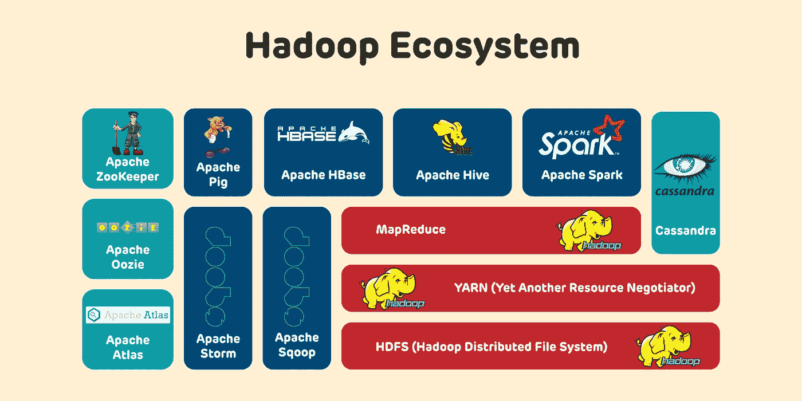

# Hadoop 简介第 2 部分

> 原文：<https://medium.com/mlearning-ai/introduction-to-hadoop-part-2-7d4e5b59d492?source=collection_archive---------6----------------------->

**(Hadoop echo 系统的核心栈组件)**

嘿伙计们，

在上一篇文章(Hadoop 第 1 部分介绍)中，我已经为 Hadoop 及其 echo 系统的介绍定下了基调。Hadoop echo 系统分为三类，即核心栈、数据操作栈和协调栈。在本文中，我将深入探讨 Hadoop echo 系统的核心堆栈组件。我相信这将丰富您对核心堆栈组件的了解。

因此，让我们深入了解 Hadoop echo 系统的核心堆栈组件。

以下是 Hadoop echo 系统的**核心栈组件**:

**1。** **HDFS (Hadoop 分布式文件系统)**

**2。** **纱(又一个资源谈判者)**

**3。** **MapReduce**

让我们详细探讨一下每个核心组件。

# ***1。HDFS (Hadoop 分布式文件系统)*** *:*

*HDFS 是 Hadoop echo 系统的核心组件。它也被称为 HDFC 回声系统的心脏。HDFS 允许我们在商用计算机上的分布式环境中存储数据，但从外部看，用户认为数据存储在单台计算机上。HDFS 管理不同集群上多个数据副本，使系统高度容错。如果任何群集计算机出现故障，HDSF 可以从环境中另一个群集的第二个拷贝中获取数据。默认情况下，HDFS 在三个地方维护副本。但是，HDFS 管理员可以根据他们的要求对副本集进行分级。HDFS 是建立在主/从架构上的。这意味着每个集群包含一个主节点(也称为名称节点)和多个从节点(也称为数据节点/从节点)。**名称节点处理 hoop 文件系统名称空间、客户端对文件和元数据的访问。数据节点存储真实的文件块。更多信息，可以参考 Apache Hadoop 的官方网页。*

# **2*2。纱(又一个资源谈判者):***

YARN 代表另一种资源谈判者。YARN 是在 Hadoop 2.0 中提出的，用于克服 Hadoop 1.0 中的作业跟踪器的瓶颈，作业跟踪器的职责是作为资源管理器和应用程序管理器。YARN 被称为大规模分布式操作系统，它协调所有集群资源。它也基于主/从架构。YARN 主要是将资源管理层和处理层分开。YARN 有权决定由谁来执行任务。它管理何时以及哪些节点可用于分配工作负载。YARN 管理元数据，记录在不同节点上运行的作业，并控制内存和 CPU 的使用。纱线包括以下主要模块。

**客户端:**提交地图缩小作业请求。

**资源管理器:**它是 YARN 架构中的主守护进程。*它拥有集群中总 CPU 和内存(RAM)利用率的完整视图。它为系统中的应用程序分配资源。它负责所有应用程序之间的资源分配和管理。每当资源管理器接收到任何请求时，它就将该请求发送到相应的节点管理器，并为该请求执行资源分配。资源管理器有两个主要组件:*

*   **调度器:**根据分配给应用的可用资源执行调度。它不完成任何其他任务，如任务监控或任务跟踪。在失败的情况下，它不保证重新开始该过程。
*   **应用管理器:**负责接受应用，协商来自资源管理器的第一个容器。如果任务失败，它还会重新启动应用程序主容器。

**节点管理器:**它负责 Hadoop 集群上各个节点，并管理应用程序和工作流以及特定的节点。它的主要工作是与资源管理器保持同步。它向资源管理器注册，并发送带有节点健康状态的心跳。它监视资源使用情况，执行日志管理，并根据资源管理器的指示终止容器。它还负责创建容器流程，并根据应用程序主的请求启动它。

**应用程序主机:**应用程序是提交给框架的单个作业。应用程序管理员负责与资源管理器协商资源，监控应用程序的进度，并跟踪状态。应用程序主机通过发布容器启动上下文(CLC)经由节点管理器调用容器。它管理健康报告卡，并定期与资源管理器通信。

**容器:**它是一组物理资源，即单个节点上的 CPU、RAM(内存)、内核和磁盘空间，以及由容器启动上下文(CLC)调用的容器。CLC 是由信息组成的记录，即安全令牌、环境变量、依赖性等。

*更多关于 YARN 的细节，可以参考 Apache YARN 官方网页:*[*https://Hadoop . Apache . org/docs/current/Hadoop-YARN/Hadoop-YARN-site/YARN . html*](https://hadoop.apache.org/docs/current/hadoop-yarn/hadoop-yarn-site/YARN.html)

**纱线特性:**

纱线因以下特性而获得认可:

**可伸缩性:** YARN 架构允许 Hadoop 扩展和管理成百上千的节点和集群。

**兼容性:** YARN (Hadoop 2.0)支持向后兼容。它支持现有的 map-reduce 应用程序，没有任何中断，并使其与 Hadoop 1.0 兼容。

**集群利用** : YARN 支持 Hadoop 中集群的动态部署，有利于优化集群利用。

# **3。** **MapReduce** :

这是一种编程范式，允许用户跨 Hadoop 集群处理数据。MapReduce 由映射器和缩减器组成。映射器和缩减器是我们可以编写的脚本。写 MapReduce 程序的时候。MapReduce 建立在这两个函数之上。

**Map()** :主要工作是组织数据或者对数据进行分组。它还对数据进行排序和过滤。Map 产生一个基于键值对的输出(result ),该输出被传递给 Reduce()进行进一步处理。

**Reduce()** :将 Map()生成的结果(output)作为输入，组合这些元组，产生输出元组。

更多关于 Hadoop MapReduce 的详细信息，可以访问 Apache Hadoop 官方网页:[https://hadoop.apache.org/docs/r1.2.1/mapred_tutorial.html](https://hadoop.apache.org/docs/r1.2.1/mapred_tutorial.html)

# **结论:**

在本文中，我深入挖掘了 Hadoop echo 系统的核心堆栈组件。核心堆栈组件是 HDF，纱和 MapReduce。我相信这将丰富您对核心堆栈组件的了解。在下周的文章中，我将详细讨论 Hadoop echo 系统的数据操作栈。

在总结笔记时，请随时分享您的意见。您的喜欢和评论将有助于我以更好的方式展示内容。下周见。

 [## Mlearning.ai 提交建议

### 如何成为 Mlearning.ai 上的作家

medium.com](/mlearning-ai/mlearning-ai-submission-suggestions-b51e2b130bfb)