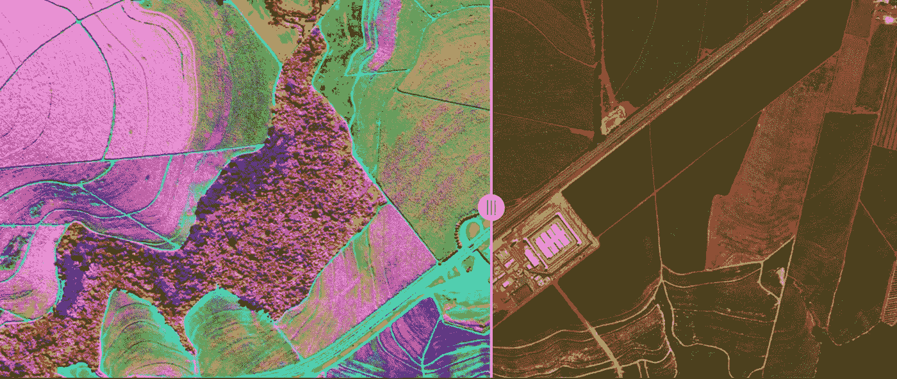
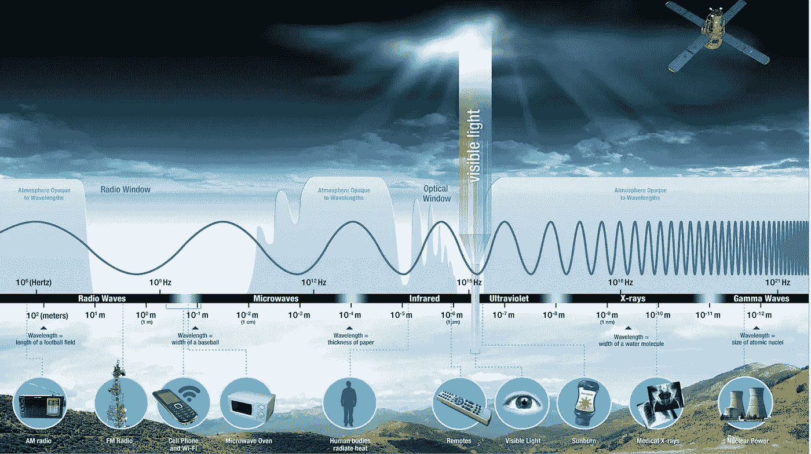
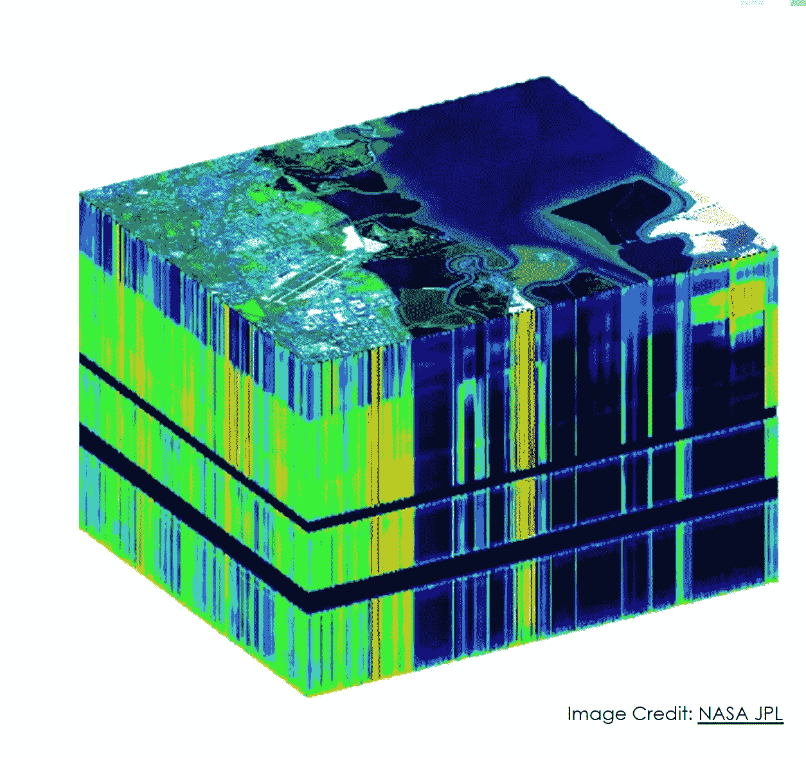

# 超光谱遥感导论(一)

> 原文：<https://medium.com/mlearning-ai/introduction-to-hyperspectral-remote-sensing-part-i-69d9e05a63f8?source=collection_archive---------2----------------------->

Image Caption:The Growing Impact of Hyperspectral Imagery in AgriFood Tech [Emma Cosgrove](https://agfundernews.com/author/emma-cosgrove)

高光谱遥感，也称为图像光谱，在过去的二十年里有了很大的发展。它基于不同的元素或材料有其自己的光谱特征的想法。为了识别不同的材料，我们需要识别它们的反射和吸收特性。

图像光谱背后的主要思想是研究从材料/化合物表面反射回来的光量。

在这篇文章中，我们将了解高光谱图像，它的术语和应用。此外，我们将学习如何处理超光谱图像，并了解处理数据的不同算法。

# **高光谱数据**

Image credit: NASA Applied Remote Sensing Program

我们眼睛看到的只是 400nm(紫罗兰色)- 700 nm(深红色)范围内的可见光谱，这只是庞大电磁光谱的一小部分。在 700 纳米之后，红外区域开始，而在光谱的另一端，在 400 纳米以下，我们有紫外区域。近红外区(NIR)的范围从 700 纳米到 1400 纳米。之后，我们有短波红外区(SWIR)，范围从 1400 纳米到 3000 纳米。

图像光谱仪考虑了所有不同的光谱带，并研究这些带中不同材料的行为。

与由红、蓝、绿三个通道组成的 RGB 图像不同，高光谱数据由 N 个不同的通道组成。

Hyperspectral Image of dimension R X C X N; R is the number of rows; C is the number of Columns and N are the different channels in the Hyperspectral Image

# **术语**

在我们继续之前，让我介绍一些高光谱图像中使用的术语及其定义。

**辐照度**——它是太阳到达地球的辐射功率的量度。它是单位面积的辐射功率，单位是瓦特/平方米。卫星直接在其轨道高度测量辐照度。辐照度可以定义为太阳辐射落在地球表面的速率。

**辐射率**——是单位面积辐射的能量。辐射率是表示表面发射、透射或反射的辐射通量的单位。基本上，它是传感器*看到的来自物体*的光量。

**反射率**——它是离开目标的光量与击中目标的光量之比。它没有单位。反射率是可以观察到的材料属性。

**空间分辨率** -空间分辨率是卫星图像中像素所覆盖的地理区域。空间分辨率越高，像素覆盖的面积越小。

**时间分辨率**——是卫星第二次以同一视角对同一区域成像所用的时间。

**辐射分辨率** -这是传感器辨别能量差异的能力。

# **对不同地形特征的光谱响应**

**清水-** 清水在可见光谱的蓝色区域反射率很高。而水吸收 NIR(近红外区)和 SWIR(短波红外区)。因此，在高光谱图像中，水在近红外和 SWIR 波长下呈现黑色。SWIR 乐队对湿气非常敏感。

**浊水-** 浊度是衡量液体相对澄清度的指标。导致水浑浊的物质包括粘土、淤泥、非常微小的无机物和有机物、藻类、溶解的有色有机化合物、浮游生物和其他微生物。浮游生物由称为叶绿素的绿色色素组成，它反射绿色和近红外区域。因此，在水中含有过量浮游生物的情况下，反射率从蓝色波长转移到绿色波长。

**植被-** 植物在绿色和 NIR 区域反射率很高。这些植物含有叶绿素，一种在阳光中发现的负责光合作用的绿色色素。叶绿素在蓝色和红色区域吸收很强。健康植物比受胁迫植物在近红外区反射更多。

**雪和冰-** 雪和冰由于其白色，在整个可见光范围内具有高反射率。尽管由于水分子的存在，它的反射率在 NIR 区域降低，并且在 SWIR 区域非常低。

# **应用**

这是超光谱图像的一些应用。

**农业** -作物类型分类可以通过高光谱成像完成。美国宇航局一直在使用 Hyperion 图像研究五种主要农作物，包括玉米、大豆、冬小麦、水稻和棉花。

**森林**——通过高光谱成像可以对森林进行监测，并对主要树种进行分类。超光谱成像可用于跟踪毁林活动和野火。

**干旱**——NASA 一直在使用 Hyperion 来估计干旱信号。

**火山活动**——火山活动可以通过高光谱成像进行测绘和探测。美国国家航空航天局一直在使用 Hyperion 和 AVIRIS 来绘制易于坍塌的岩石和结构的地图。

# **局限性**

当传感器接收到来自陆地或海洋的数据时，会有很多来自大气的影响，如大气中气体的吸收或空气分子的散射。因此，需要从总信号中去除这种大气影响，这被称为“**大气校正**过程。

超光谱数据非常难以处理，因为*存在如此多的波段*。这一大组数据导致处理时间和复杂性增加。因此，需要减少数据或仅选择相关波段。这可以通过 **PCA** (主成分分析)来完成。应该记住，减少的波段对分类质量没有影响。

**未来工作**

在这个超光谱系列的下一部分，我们将学习大气校正算法，学习对超光谱数据进行主成分分析，并学习超光谱混合和解混合。

# 参考

 [## 用 Admesy 测量辐射率和辐照度

### 辐射率和辐照度是辐射测量领域中使用的测量单位。这篇博客文章将概述…

www.admesy.com](https://www.admesy.com/radiance-measurement-irradiance-measurement-admesy/)  [## 浊度和水

### 浊度是液体相对透明度的量度。它是水的光学特性，是一种测量…

www.usgs.gov](https://www.usgs.gov/special-topic/water-science-school/science/turbidity-and-water?qt-science_center_objects=0#qt-science_center_objects) 

[http://GSP . Humboldt . edu/OLM/Courses/GSP _ 216 _ Online/lesson 2-1/vegetation . html](http://gsp.humboldt.edu/OLM/Courses/GSP_216_Online/lesson2-1/vegetation.html)

[https://applied sciences . NASA . gov/join-mission/training/English/arset-hyperspectral-data-land-and-coastal-systems](https://appliedsciences.nasa.gov/join-mission/training/english/arset-hyperspectral-data-land-and-coastal-systems)