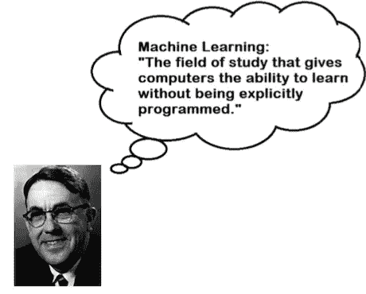
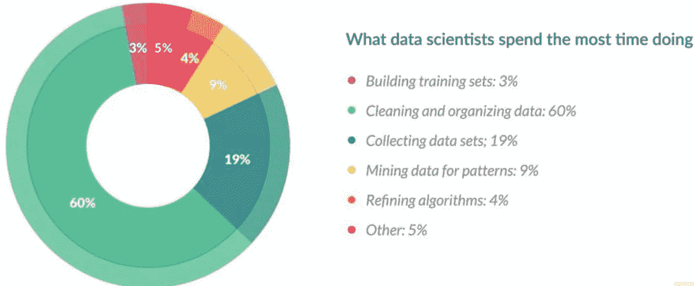
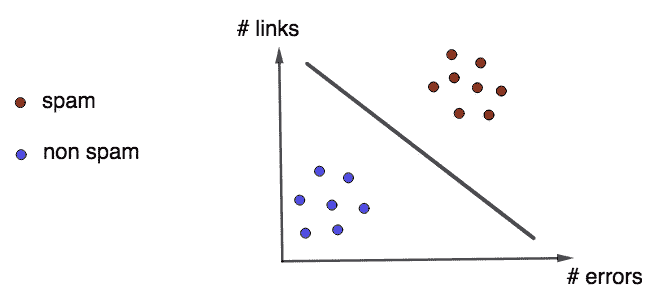
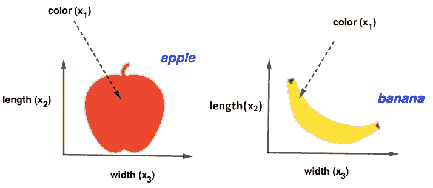
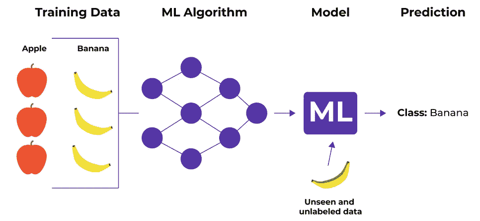
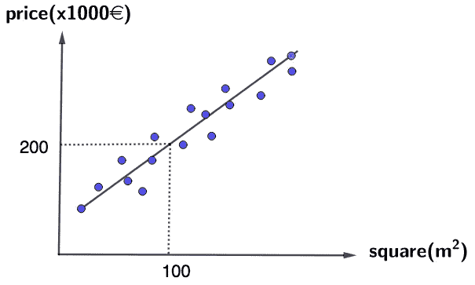
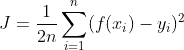
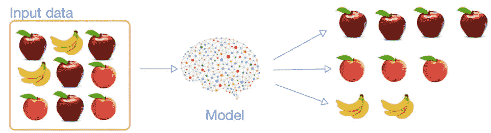
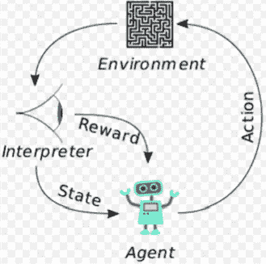

# 机器学习导论

> 原文：<https://medium.com/mlearning-ai/introduction-to-machine-learning-78e8c5d708e6?source=collection_archive---------0----------------------->

Photo by [Alex Knight](https://unsplash.com/@agk42?utm_source=medium&utm_medium=referral) on [Unsplash](https://unsplash.com?utm_source=medium&utm_medium=referral)

如你所知，机器学习的应用在我们的生活中无处不在。比如，当你在谷歌搜索某样东西时，基于机器学习算法，它会向你推荐与你的关键词最相关的性能结果。脸书、Youtube、亚马逊也使用推荐系统向用户推荐他们的产品。苹果开发了用于面部和指纹识别的机器学习算法，可以在不使用密码的情况下激活你的设备，……多亏了机器学习，我们的生活变得方便多了。

在本文中，我们将研究各种类型的机器学习算法及其用例。本文的内容分为 3 个部分:

*   什么是机器学习？
*   为什么要用机器学习？
*   机器学习算法的类型。

*我们开始吧！*

# **一、什么是机器学习？**

1959 年，亚瑟·萨缪尔(Arthur Samuel)定义:*“机器学习(Machine Learning)是在没有明确编程的情况下，赋予计算机学习能力的研究领域”*。

**Definition of Machine learning by Arthur Samuel**

1997 年，Tome Michel 给出了机器学习的另一个更具技术性的定义:“*如果一个计算机程序在 T 中的任务上的性能(由 P 测量)随着经验 E 而提高，则称该程序在某类任务 T 和性能测量 P 方面从经验 E 中学习”。*

# 二。为什么要用机器学习？

为了看到机器学习的重要性，让我们考虑垃圾邮件识别的例子。对于这个问题，你首先要看看垃圾邮件是什么样子的。你注意到它可能包含许多错误和链接，或者一些像“银行卡”、“免费”、“祝贺你”……在分析了所有可能的特征后，你必须编写一个程序来重复检测所有电子邮件。因此，您的代码将会很长，维护起来也很复杂。相比之下，机器学习技术会自动研究垃圾邮件中包含的特征，代码变得更短，维护起来也更简单。此外，与传统算法相比，机器学习算法给了我们更好的结果。

总之，我们应该使用机器学习算法而不是传统方法有一些原因:

*   与传统算法相比，机器学习算法速度更快，需要更少的计算能力，并且给出更好的结果。
*   机器学习技术可以解决一些传统方法无法解决的复杂问题。
*   波动的环境:机器学习系统可以适应新数据。
*   机器学习算法有利于探索大型数据集的复杂问题。

请注意，为了建立机器学习模型，训练集中的数据数量必须足够大，以便模型能够正确学习。有时，我们必须向模型提供成千上万的数据，以获得高精度。数据越多样化，模型的精确度越高。这就是数据对于机器学习和数据科学领域如此重要的原因。

**吴恩达**::*赢的不是谁的算法最好。而是谁的数据最好”*。

据《福布斯》报道，数据科学家花费大约 80%的时间准备和管理用于分析的数据。

[Image source: Forbes]

# **三世。机器学习算法的类型:**

机器学习算法分为 3 种主要类型:

## **1。监督学习**

监督学习是执行机器学习操作的最流行的算法。在这种情况下，数据被标记。监督学习算法明确地识别特征，并相应地执行预测或分类。

**a .分类**

监督学习算法适用于变量离散时的分类问题。

让我们考虑这个问题的一些简单例子:

**示例 1:垃圾邮件检测**

我们的目标是建立一个机器学习模型，根据电子邮件中的错误数量和链接数量，将电子邮件分类为垃圾邮件或非垃圾邮件。这个方法由下图算出。如果一封邮件的链接和错误数量很大，那么这封邮件将被归类为垃圾邮件。否则，该电子邮件将被归类到非垃圾邮件组。我们可以简单假设，分离这些群体的机器学习模型是一条直线。

一旦模型被确定，它可以被应用于预测任何新的电子邮件。如果一封邮件的错误数和链接数属于直线的较低区域，那么它将被归类为非垃圾邮件，反之亦然。

让我们考虑另一个例子，建立一个机器学习模型来检测一些图像对象，如水果。

**例 2:水果检测**

给出两种水果:苹果和香蕉及其注释。为了建立一个机器学习模型来对这些水果进行分类，机器将首先提取每个对象对应的一些特征，如颜色、长度、宽度。然后，在训练集上训练模型。它会学习每个标签的相关特征。

在对该模型进行训练之后，我们可以应用该模型来预测没有标签的测试集上的新样本。

(image source: neuro space)

**b .回归**

在变量连续且目标值不有限的情况下，机器学习算法可以应用于回归问题。

**举例:房价预测**

给定图卢兹某栋房子的价格数据集，如下图所示。

假设房价和平方成线性关系。我们的目标是建立一个最符合数据的线性模型 f(x) = ax+ b。估计参数 a 和 b，使得下面的成本函数最小化:

其中 n 表示观测值，y_i 和 f(x_i)分别表示对应于特征 x_i 的真实值和预测值。一旦建立了模型，就可以应用它来预测未出现在给定训练数据中的新房子的价格。

一些常用的监督学习算法有线性回归、逻辑回归、支持向量机、随机森林、梯度推进、人工神经网络等。这些算法被应用于解决各种问题，如图像分类，欺诈检测，分数预测等

## **2。无监督学习**

无监督学习算法应用于数据未被标记的情况。这种类型的算法旨在根据数据的结构、密度、相似段、特征等来识别数据。

**举例:**给定几组没有标注的水果。我们的目标是建立一个机器学习模型，可以根据颜色和形状对这些水果进行分类。所有颜色和形状相似的水果将被归为一类。这种类型的算法被称为聚类(或聚类分析)，它也是无监督学习中的一种流行技术。

**The unsupervised algorithm in classifying the data without annotations**. (image source: ResearchGate)

还有一些其他的无监督学习算法，如主成分分析、异常检测、自动编码器等

无监督学习算法被广泛用于解决一些问题，例如:

*   客户细分用于了解不同群体的客户，以建立营销策略。
*   推荐系统，旨在将所有具有相似模式的用户分组，以推荐相似的内容。
*   异常检测，用于欺诈检测。
*   …

## 3.强化学习

强化学习是一种机器学习算法，允许机器通过与环境的交互以及使用来自自身行为和经验的反馈来学习。

强化学习的一些要素:

*   **环境**是代理操作的物理世界。
*   **状态**描述了代理的当前情况。
*   奖励是来自环境的反馈。
*   **策略**是将代理的状态映射到动作的方法。

下图简要描述了强化学习算法的工作原理。一个主体在一个环境中采取行动，这些行动被解释为奖励和状态，然后反馈给主体。重复这个过程，直到代理的累积报酬最大化。

**The typical framing of the Reinforcement learning technique** (Image source: Wikipedia)

强化学习不同于监督学习。监督学习是从训练集学习，其决策是从初始输入数据做出的，而强化学习的决策是根据当前状态的输入顺序做出的。

强化学习也不同于无监督学习。无监督学习旨在发现输入数据之间的相似性或差异，强化学习的目标是找到一个合适的行为模型，在该模型下，主体的累积报酬最大化。

强化学习广泛应用于机器人操作、自然语言处理、自动驾驶汽车、工业自动化、游戏、新闻推荐等领域

总之，本文简要介绍了机器学习算法及其用例。我希望这能帮助你对这个领域有一个快速的了解。如果你有任何问题，请在评论中告诉我。欢迎所有对改善这个职位的贡献。

感谢您的阅读！