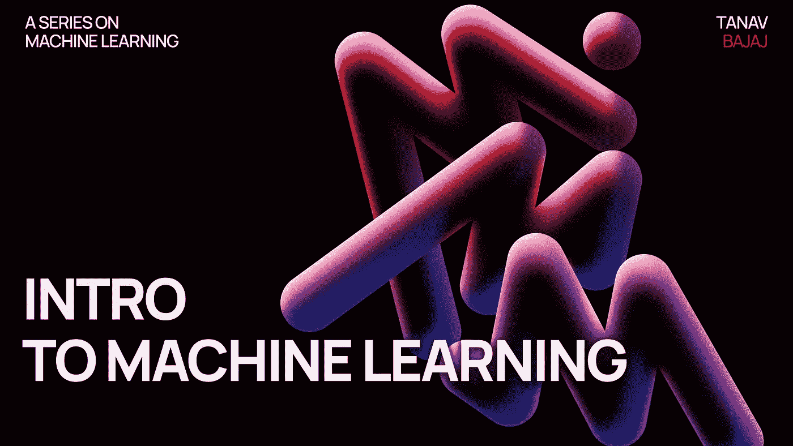
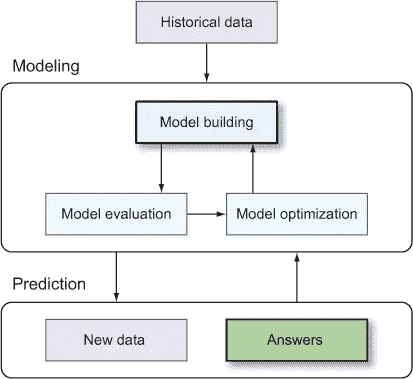
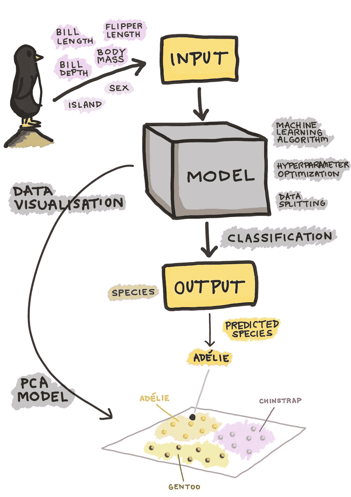

# 机器学习管道介绍

> 原文：<https://medium.com/mlearning-ai/introduction-to-machine-learning-d5115dd059be?source=collection_archive---------7----------------------->



image- [Umang Bhalla](https://twitter.com/umgbhalla)

先决条件:ML 是什么的基本知识。

在这篇文章中，我将给出一个关于 ML 管道的想法。

维基百科对机器学习的定义是，研究可以通过经验和使用数据自动改进的计算机算法。

但这到底意味着什么呢？机器学习是使用数据进行预测，或者只是以任何方式使用数据来提取知识。

现在，当我们处理数据时，我们使用以下步骤

1.  输入数据
2.  干净的数据
3.  将数据分成训练/测试集
4.  创建模型
5.  训练模型
6.  做预测
7.  评估和改进

我现在将简要介绍这些步骤，并在接下来的文章中详细介绍。



ML Workflow

## 步骤 1 导入数据

有 4 种主要类型的数据可供使用，即 CSV、JSON、SQLite 和 BigQuery。

对于初学者，CSV 文件是首选，因为它们包含更有组织形式的数据。这些是逗号分隔的文件，其中每个记录都由数据及其属性组成。Pandas ( Python 库)用于读取数据集的。csv 文件。

```
import pandas as pd

df = pd.read_csv (r'Path where the CSV file is stored\File name.csv')
```

如果您希望阅读更多内容，请查看这篇关于如何在 python 中使用 JSON 的文章-[https://towardsdatascience . com/working-with-JSON-in-python-a 53 C3 b 88 cc 0](https://towardsdatascience.com/working-with-json-in-python-a53c3b88cc0)

## 清理数据

这因数据集而异。一些简单的数据集可能需要最少的清理，如向缺失的条目添加空值，但一些数据集可能需要大量的工作。

例如，我在 COVID 数据集上工作，我需要做的就是删除不必要的列，用 NULL 填充空条目，并对数据进行一些排序。

但是，在尝试处理更大的数据集时，添加适当的索引，过滤掉关键字等内容，删除重复数据，修复语法错误(如更改日期格式，以便可以很容易地可视化)，过滤掉不需要的异常值，有时还会修复打字错误。

为了在这一步取得成功，需要对数据有很好的理解。为了更好地理解数据，我们可以绘制图形和图表，看看我们的眼睛能发现什么趋势。为此，可以使用像 **Matplotlib、Plotly 或 seaborn** 这样的 python 库。

## 步骤 3 将数据分成训练/测试集

训练测试分割是一种用于评估机器学习算法性能的技术。该过程包括获取一个数据集并将其分成两个子集。

我们将使用 Scikit-Learn 库来完成这项工作。

`from sklearn.model_selection import train_test_split`

`X_train, X_test, y_train, y_test = train_test_split(df, y, test_size=0.2)`

使用我们在上面导入并清理的数据集`df`上的代码。这里它被分成 80/20 的比例(如代码末尾的 0.2 所示)。这里 X 是自变量，y 是因变量。这种分离在回归分析中很常见(我将在以后的文章中讨论)。

这种方法并不完美，因为随机分割会导致过拟合或欠拟合。为了避免这种情况，使用了**交叉验证**方法。有很多交叉验证的方法，最常用的是 K-Folds 交叉验证，并省去一个交叉验证。

`from sklearn.model_selection import KFold`

`from sklearn.model_selection import LeaveOneOut`

Sklearn 库也用于同样的目的，更多细节可以在它的[文档](http://scikit-learn.org/stable/modules/classes.html#module-sklearn.model_selection)中找到。

## 步骤 4 创建模型

现在可以使用 ML 模型来处理数据了。

机器学习算法可以大致分为三种类型:

1.  *监督学习* —是一个机器学习任务，它在输入 **X** 和输出 **Y** 变量之间建立数学关系。这样的 **X** ， **Y** 对构成了用于建模的标记数据，以学习如何从输入预测输出。
2.  *无监督学习* —是一种机器学习任务，它只利用输入的 **X** 变量。这种 **X** 变量是学习算法在建模数据的固有结构时使用的未标记数据。
3.  *强化学习* —是一种机器学习任务，它决定下一步的行动，通过试错学习来实现这一点，以努力实现回报的最大化。

我们在这里的工作是找到最适合我们数据的模型。就像在监督学习的情况下，我们需要检查它是分类问题还是回归问题，然后深入选择使用哪种回归/分类算法。

一旦我们准备好了，我们就进入下一步。

## 训练模特

在这一步中，我们使用我们的训练数据(在监督学习的情况下)并试图得到我们想要的结果。我们看到我们得到的结果，然后改变权重和偏差以最小化损失(对不良预测的惩罚，即理想模型将没有损失)。因此，训练模型的目标是找到一组在所有示例中平均损失较低的权重和偏差。

这个过程叫做**经验风险最小化。**

## 进行预测

在常规编程中，我们得到一个输出，在机器学习中，我们得到一个预测。这实际上是一回事。预测这个词很容易让人误解。在时间序列分析的情况下，我们试图“预测未来”,这是正确的，但在大多数其他情况下，这是期望的输出。例如，在一个公司的营销模型中显示什么是最佳行动方案，或者在一个银行的模型中显示交易是否是骗局。

## 评估和改进

一旦我们得到了预测，我们就可以使用**准确度、精确度和召回率**(在监督学习中)等参数来判断这是否是我们想要的结果。

**准确度**定义为测试数据的正确预测百分比。

**精度**被定义为所有被预测属于某一类的例子中相关例子(真阳性)的分数。

**召回**被定义为预测属于一个类的实例相对于真正属于该类的所有实例的比例。

否则，根据情况，也可以使用统计和可视化方法检查各种其他参数，如**混淆矩阵、接收器工作特性(ROC)曲线、集群失真和均方误差(MSE)。**

一旦我们得到了所有这些信息，我们就重复上面的步骤，使我们的模型更接近预期的结果。

***注意——没有一个机器学习模型会提供 100%的准确率，如果有，那可能是过度拟合的情况。***

以下是使用企鹅数据集的示意图。在这里，像喙长度、喙深度、鳍长度和体重这样的定量输入与性别和岛屿这样的定性输入一起被用来预测企鹅属于哪个物种。( [*详文*](https://towardsdatascience.com/how-to-build-a-machine-learning-model-439ab8fb3fb1) *)*



Credit [Data Professor](https://www.youtube.com/dataprofessor)

对于处理需要机器学习的情况，这是一个非常非常广泛的概述。请继续关注本系列的更多文章。

[](/mlearning-ai/mlearning-ai-submission-suggestions-b51e2b130bfb) [## Mlearning.ai 提交建议

### 如何成为 Mlearning.ai 上的作家

medium.com](/mlearning-ai/mlearning-ai-submission-suggestions-b51e2b130bfb) 

[成为作家](/mlearning-ai/mlearning-ai-submission-suggestions-b51e2b130bfb)